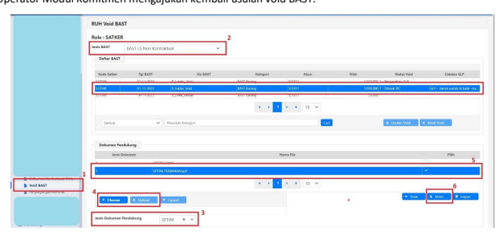

→
→
→
→
Petunjuk Teknis Aplikasi SAKTI
.

→
×FITUR VOID BAST

## 1. Deskripsi Singkat

a. Terdapat transaksi BAST yang belum digunakan pada SPP/SPBy namun sudah ada transaksi lanjutan berupa pendetilan pada Modul Aset Tetap/Persediaan; b. Satuan Kerja hendak melakukan perubahan dan/atau penghapusan atas BAST tersebut namun tidak dapat dilakukan karena sudah ada transaksi lanjutan berupa pendetilan Aset Tetap/Persediaan; c. Pendetilan Aset Tetap/Persediaan tidak dapat dilakukan karena sudah ada transaksi pemakaian atau telah dilakukan tutup buku permanen pada periode BAST tersebut; d. Diperlukan pemulihan FA atas BAST tersebut untuk digunakan pada transaksi BAST yang baru. e. Pemulihan FA tersebut menggunakan fitur Void BAST.

| Modul                  | Komitmen, GL dan Pelaporan                                                    |                                                                                                                                              |
|------------------------|-------------------------------------------------------------------------------|----------------------------------------------------------------------------------------------------------------------------------------------|
| Role User              | Opr Modul Komitmen, Opr Modul GL dan Pelaporan, Tim  SAKTI PUSAT              |                                                                                                                                              |
| Modul Lain Terkait     | Aset tetap, Persediaan                                                        |                                                                                                                                              |
| Transaksi yang terkait | KOM - RUH - BAST/BAKP/BAPP/DYD                                                |                                                                                                                                              |
| Dokumen Input          | Seluruh data BAST pada Modul Komitmen                                         |                                                                                                                                              |
| Output                 | Jurnal Void BAST, Void BAST                                                   |                                                                                                                                              |
| Validasi               | -                                                                             | Data BAST yang dapat diajukan void adalah BAST yang belum  digunakan pada SPP/SPBy namun sudah didetilkan pada  Modul Aset Tetap/Persediaan; |
| -                      | Data BAST yang sudah divoid tidak dapat digunakan pada  transaksi pembayaran; |                                                                                                                                              |
| -                      | Data BAST yang telah dilakukan void tidak dapat dimintakan  pembatalan void.  |                                                                                                                                              |

## 2. Alur Proses 3. Penjelasan Alur Proses User Operator Modul Komitmen

a. User Operator Modul Komitmen mengajukan data BAST yang diusulkan void.

1. Masuk pada menu Void BAST; 2. Pilih jenis BAST yang akan diusulkan void. Pada petunjuk teknis ini, akan dicontohkan menggunakan jenis BAST LS Non Kontraktual; 3. Pada grid Daftar BAST, silahkan pilih data BAST yang akan diusulkan void; 4. Klik tombol "Usulan Void", keterangan pada kolom status void akan berubah menjadi 0 - Siap Diusulkan. Apabila terdapat kesalahan pemilihan data BAST yang akan diusulkan, dapat dibatalkan dengan melakukan klik Batal Void , keterangan pada kolom status void akan berubah menjadi 9 -Batal Void.

b. User Operator Modul Komitmen mengupload SPTJM Void BAST.

1. Pada grid Daftar BAST, pilih data BAST dengan status void 0 - Siap Diusulkan; 2. Kemudian, pilih Jenis Dokumen Pendukung - SPTJM; 3. Silahkan klik tombol "Choose" untuk memilih dokumen SPTJM, dan tombol "Upload" untuk mengupload dokumen SPTJM yang telah dipilih; 4. Pada grid Dokumen Pendukung, pilih dokumen SPTJM yang sudah diupload; 5. Klik tombol "Kirim", status data BAST akan berubah menjadi 1 - Pengecekan GLP; 6. Informasi mengenai format dokumen SPTJM terdapat pada bagian akhir pentujuk teknis ini.

c. Operator Modul Komitmen telah selesai meneruskan usulan Void BAST kepada Operator Modul GL dan Pelaporan.

## User Operator Modul Gl Dan Pelaporan

d. Operator Modul GL dan Pelaporan menerima usulan void yang telah diajukan.

e. Sebelum melakukan Operator Modul GL dan Pelaporan memastikan kondisi BMN pada data BAST yang diusulkan telah dilakukan Koreksi atau Habis Pakai (khusus data BAST yang menghasilkan barang Persediaan);
1. Masuk pada menu Jurnal BAST Void; 2. Kemudian, pilih informasi Jenis BAST. Pada petunjuk teknis ini, akan dicontohkan menggunakan jenis BAST Non Kontraktual; 3. Pada informasi Status Void, pilih Non Final untuk usulan data BAST yang baru diteruskan oleh operator Modul Komitmen; 4. Pada grid Daftar BAST Siap di Void, pilih data BAST dengan status 1 - Pengecekan GLP; 5. Klik tombol "Proses" untuk melakukan perekaman jurnal manual atas data BAST yang diusulkan void; 6. Klik tombol "Tolak" jika data BAST yang diusulkan masih belum dapat dilakukan perekaman jurnal manual, misalnya dikarenakan kesalahan data BAST yang dipilih atau belum dilakukan koreksi, status void akan berubah menjadi 2 - Ditolak GLP.

f. Operator Modul GL dan Pelaporan melakukan perekaman jurnal atas data BAST yang diusulkan void. 

1. Periode yang dipilih minimal sama dengan periode BAST dan di periode yang masih terbuka;

2. Klik tombol "Rekam" untuk merekam jurnal; 3. Tanggal dokumen isikan sesuai tanggal BAST, sedangkan tanggal jurnal isikan minimal sama dengan periode BAST dan di periode yang masih terbuka; 4. Isikan "Deskripsi" ; 5. Pilih "Subkelompok Jurnal" sesuai jenis satker **BLU/Non BLU** dan jenis aset yang divoid 
(**Persediaan/Aset Tetap/Aset Lainnya**), kemudian klik "Lihat" untuk memilih kode akun belum diregister; 6. Isikan nilai jurnal BAST Void; 7. Isikan "Akun Pasangan" sesuai kasus dan jurnal bentukan koreksi yang sudah dilakukan di modul aset dan/atau persediaan. Misal di modul persediaan sudah melakukan koreksi jumlah, maka yang dipilih adalah akun 593311; 8. Klik tombol "Simpan Akun"; 9. Klik tombol "Simpan". Status void akan berubah menjadi 3 - Usulan Terkirim g. Operator Modul GL dan Pelaporan meneruskan usulan void BAST ke tim SAKTI Pusat. Pastikan Satuan Kerja juga telah mengajukan permintaan void BAST melalui tiket HAI (https://hai.kemenkeu.go.id/). Tim SAKTI Pusat akan memproses usulan void BAST berdasarkan tiket yang telah diajukan oleh Satuan Kerja.

## Tim Sakti Pusat

h. Tim SAKTI Pusat menerima usulan void BAST yang telah diajukan oleh satuan kerja.

i. Tim SAKTI Pusat melakukan pengecekan kelengkapan atas usulan void BAST yang telah diajukan. 

1. Masuk pada menu Void BAST;
2. Pilih jenis BAST yang akan diusulkan void. Pada petunjuk teknis ini, akan dicontohkan menggunakan jenis BAST LS Non Kontraktual; 3. Pada grid Daftar BAST, silahkan pilih data BAST dengan status void 3 - Usulan Terkirim (untuk usulan void baru) dan status void 8 - Perbaikan SPTJM (untuk perbaikan usulan void);
4. Apabila kelengkapan usulan void (berupa Tiket HAI dan SPTJM) sudah sesuai, tim SAKTI Pusat akan melengkapi Informasi Persetujuan dengan status 'Disetujui';
5. Kemudian klik tombol 'Simpan', status void berubah menjadi 5 - Siap Diproses; 6. Setelahnya, klik tombol "Proses" ,status void menjadi 10 - Void Berhasil. Pemulihan FA telah dilakukan atas data BAST tersebut dan data BAST tersebut juga tidak dapat digunakan untuk proses pembayaran.

7. Apabila kelengkapan usulan void belum sesuai (perlu perbaikan SPTJM), tim SAKTI Pusat akan melengkapi informasi Persetujuan dengan status 'Ditolak'. Status void akan berubah menjadi 4 - Void Ditolak. Usulan Void BAST kembali ke Operator Modul GL dan Pelaporan.

## User Operator Modul Gl Dan Pelaporan

j. Operator Modul GL dan Pelaporan menerima tolakan usulan void BAST.

2. Kemudian, pilih informasi Jenis BAST. Pada petunjuk teknis ini, akan dicontohkan menggunakan jenis BAST Non Kontraktual; 3. Pada informasi Status Void, pilih Non Final untuk usulan data BAST yang baru diteruskan oleh operator Modul Komitmen; 4. Pada grid Daftar BAST Siap di Void, pilih data BAST dengan status 4 - Void Ditolak; 5. Klik tombol "Proses" untuk menerukan tolakan usulan void ke Operator Modul Komitmen untuk dilakukan perbaikan SPTJM. Status void berubah menjadi 7 - Ditolak PIC.

## User Operator Modul Komitmen

k. Operator Modul Komitmen melakukan perbaikan SPTJM atas tolakan usulan void BAST sebelumnya.

l. Operator Modul Komitmen mengajukan kembali usulan void BAST.

1. Masuk pada menu Void BAST;
2. Pilih jenis BAST yang akan diusulkan void. Pada petunjuk teknis ini, akan dicontohkan menggunakan jenis BAST LS Non Kontraktual; 3. Kemudian, pilih Jenis Dokumen Pendukung - SPTJM;
4. Silahkan klik tombol "Choose" untuk memilih dokumen SPTJM Perbaikan, dan tombol "Upload" untuk mengupload dokumen SPTJM Perbaikan yang telah dipilih; 5. Pada grid Dokumen Pendukung, pilih dokumen SPTJM Perbaikan yang sudah diupload; 6. Klik tombol "Kirim", status data BAST akan berubah menjadi 6 - Perbaikan SPTJM dari Satker; User Operator GL dan Pelaporan m. Operator Modul GL dan Pelaporan menerima perbaikan usulan void BAST dari Operator Modul Komitmen; n. Operator Modul GL dan Pelpoaran meneruskan perbaikan usulan void BAST ke tim SAKTI Pusat.

1. Masuk pada menu Jurnal BAST Void;

 2. Kemudian, pilih informasi Jenis BAST. Pada petunjuk teknis ini, akan dicontohkan menggunakan jenis BAST Non Kontraktual; 3. Pada informasi Status Void, pilih Non Final untuk usulan data BAST yang baru diteruskan oleh operator Modul Komitmen; 4. Pada grid Daftar BAST Siap di Void, pilih data BAST dengan status 6 - Perbaikan SPTJM dari Satker; 5. Klik tombol "Proses" untuk menerukan tolakan usulan void ke Operator Modul Komitmen untuk dilakukan perbaikan SPTJM. Status void berubah menjadi 8 - Perbaikan SPTJM.

## Tim Sakti Pusat

o. Tim SAKTI Pusat menerima perbaikan usulan void BAST yang telah diajukan oleh satuan kerja.

i. Tim SAKTI Pusat melakukan pengecekan kembali atas kelengkapan atas perbaikan usulan void BAST yang telah diajukan. 

## 3. Hal-Hal Lain Yang Perlu Diperthatikan

1. Void BAST dilakukan untuk melakukan pemulihan FA atas data BAST yang sudah didetilkan pada Modul Aset Tetap/Persediaan namun tidak jadi digunakan. Data BAST yang sudah dilakukan void tetap tidak dapat dilakukan perubahan dan/atau penghapusan; 2. Void BAST hanya dapat dilakukan atas data BAST yang belum digunakan pada SPP/SPBy; 3. Data BAST yang sudah dilakukan void tidak dapat digunakan pada proses transaksi pembayaran sehingga user perlu melakukan perekaman data BAST baru jika akan melakukan proses transaksi pembayaran; 4. Data BAST yang sudah dilakukan void tidak dapat dilakukan pembatalan void; 5. Tim SAKTI Pusat hanya akan memproses usulan void BAST jika satker sudah mengajukan tiket melalui HAI (https://hai.kemenkeu.go.id/) dengan melampirkan screenshot tampilan pada aplikasi SAKTI atas usulan void BAST dengan status void 3 - Usulan Terkirim; 6. Dokumen SPTJM yang diajukan minimal harus memuat informasi :
- Nomor SPTJM;
- Tertandatangan secara sah oleh Pejabar Satuan Kerja (PPK/KPA ) yang berwenang; - Informasi Kode Satker;
- Informasi Nomor BAST dan tanggal BAST sesuai yang direkam pada SAKTI; - Informasi Kode COA yang digunakan pada BAST; - Penyataan bertanggung jawab sepenuhnya secara hukum atas permintaan pemulihan FA BAST yang diajukan.