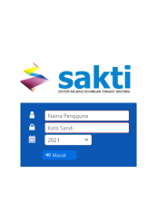
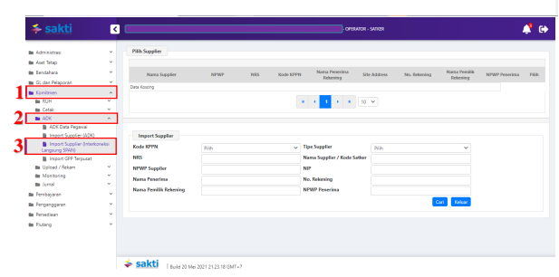
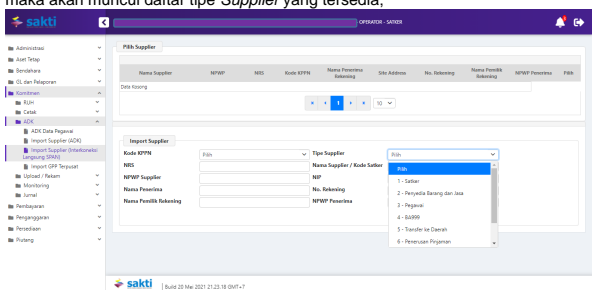
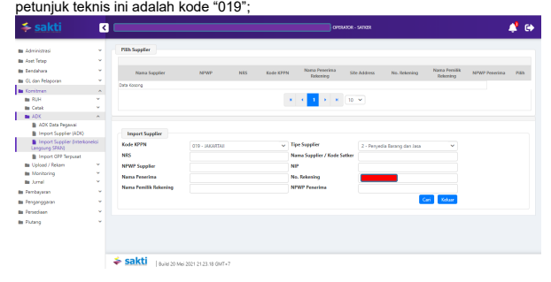
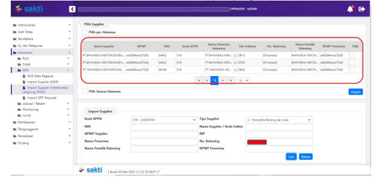
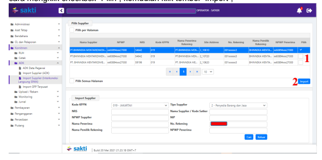
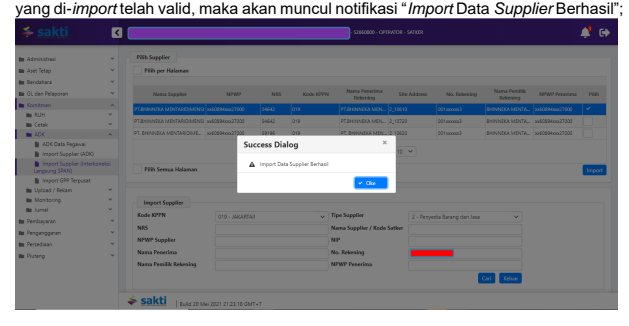
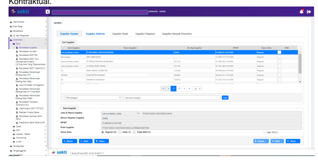

Petunjuk Teknis Aplikasi SAKTI
→
×MPORT SUPPLIER
INTERKONEKSI LANGSUNG SPAN

## Kementerian Keuangan Ri Ditjen Perbendaharaan

→
→
→
DESKRIPSI SINGKAT
Import Supplier Interkoneksi Langsung SPAN Menu ini digunakan untuk melakukan Import Supplier dengan data sumber Terinterkoneksi Langsung dengan SPAN

| Terinterkoneksi Langsung dengan SPAN No. Uraian 1 Modul KOM 2 Role User OPR 3 Modul Lain yang Terkait - 4 Transaksi yang Terkait KOM - RUH   | Kontrak,                                                                               | Pencatatan                                                                                                                        | BAST      | Non        |           |       |         |        |
|----------------------------------------------------------------------------------------------------------------------------------------------|----------------------------------------------------------------------------------------|-----------------------------------------------------------------------------------------------------------------------------------|-----------|--------|-----------|-------|---------|--------|
| Kontraktual PEM - Catat/Ubah SPP                                                                                                             |                                                                                        |                                                                                                                                   |           |        |           |       |         |        |
| 5                                                                                                                                            | Dokumen Input                                                                          | Data Supplier                                                                                                                     |           |        |           |       |         |        |
| 6                                                                                                                                            | Output                                                                                 | Resume Supplier, Data Supplier dapat digunakan untuk  pembuatan SPP, perekaman Data Kontrak, dan  pencatatan BAST Non-Kontraktual |           |        |           |       |         |        |
| 7                                                                                                                                            | Validasi                                                                               | -                                                                                                                                 | Pencarian | data   | Supplier  | harus | diawali | dengan |
| pemilihan                                                                                                                                    | tipe                                                                                   | Supplier                                                                                                                          | yang      | hendak | di-import |       |         |        |
| datanya;                                                                                                                                     |                                                                                        |                                                                                                                                   |           |        |           |       |         |        |
| -                                                                                                                                            | Pencarian data Supplier dengan tipe Supplier 1, 3,  dan 8 tidak diizinkan;             |                                                                                                                                   |           |        |           |       |         |        |
| -                                                                                                                                            | Input Nomor Rekening diwajibkan untuk pencarian  data Supplier dengan tipe Supplier 2; |                                                                                                                                   |           |        |           |       |         |        |
| -                                                                                                                                            | Input NPWP Supplier                                                                    | diwajibkan untuk pencarian                                                                                                        |           |        |           |       |         |        |
| data Supplier dengan tipe Supplier 4 dan 5;                                                                                                  |                                                                                        |                                                                                                                                   |           |        |           |       |         |        |
| -                                                                                                                                            | Input NIP tidak diperbolehkan untuk pencarian data  Supplier dengan tipe Supplier 6.   |                                                                                                                                   |           |        |           |       |         |        |

## Petunjuk Teknis Import Supplier Interkoneksi Langsung Span

Untuk proses *Import Supplier*, data *Supplier* yang dapat di-*import* adalah data *Supplier* yang sudah pernah didaftarkan pada SPAN dan telah memiliki NRS. Langkah-langkah untuk melakukan *Import Supplier* yaitu sebagai berikut:
1. Login ke dalam aplikasi SAKTI-WEB melalui alamat https://sakti.kemenkeu.go.id/

dengan menggunakan user operator yang memiliki kewenangan modul komitmen, lalu masuk ke Modul Komitmen → ADK → Import Supplier (Interkoneksi Langsung SPAN);

2. Pilih tipe *Supplier* yang ingin dilakukan pencarian data *Supplier*-nya untuk kemudian 

di-*import* ke dalam aplikasi SAKTI, dengan cara klik *dropdown list* "Tipe *Supplier*", 
maka akan muncul daftar tipe *Supplier* yang tersedia; 3. Contoh yang digunakan pada petunjuk teknis ini adalah supplier tipe 2 (Penyedia Barang dan Jasa), maka klik pada pilihan "2 - Penyedia Barang dan Jasa", serta inputkan nomor rekening pada kolom teks "No. Rekening". Untuk penginputan "Kode KPPN", sifatnya opsional. Apabila parameter "Kode KPPN" akan diisi, agar diisi menggunakan kode KPPN mitra kerja masing-masing. Contoh yang digunakan pada 

4. Jika parameter yang diperlukan sudah diinputkan seluruhnya, maka silahkan klik tombol "Cari", lalu akan muncul daftar data Supplier yang siap untuk di-import,

5. Silahkan pilih data Supplier dari daftar data tersebut yang hendak di- import dengan cara mengklik checkbox "Pilih", kemudian klik tombol "Import";

6. Tunggu hingga proses *Import Supplier* selesai. Jika sudah selesai dan data *Supplier*

7. Cek Status data *Supplier* tersebut pada menu Komitmen → RUH → Pencatatan 

Supplier. Jika sudah masuk, maka data *Supplier* tersebut dapat langsung digunakan untuk Pencatatan SPP, perekaman data kontrak, ataupun perekaman BAST NonKontraktual.

## Hal Yang Perlu Diperhatikan :

Dalam hal satker melakukan *Import* Data *Supplier* tanpa menggunakan parameter KPPN Mitra Kerja dan pada daftar data tidak ditemukan Data *Supplier* yang menggunakan kode KPPN Mitra Kerja, maka setelah berhasil melakukan *import* data wajib melakukan perubahan KPPN pada tab "Supplier Address" menjadi kode KPPN mitra kerja, kemudian mendaftarkan data *supplier* tersebut ke KPPN Mitra Kerja. Contoh kasus : Satker A memiliki mitra kerja dengan kode 018. Saat akan melakukan import supplier D, tidak ditemukan data *supplier* yang menggunakan kode KPPN 018. Data tersebut tetap dapat dilakukan *import*, namun setelah di*import* satker harus melakukan perubahan data KPPN pada tab "Supplier Address" menjadi KPPN 018. Setelah melakukan perubahan, dilanjutkan dengan mendaftarkan data *Supplier* tersebut ke KPPN Mitra Kerja (dalam kasus ini KPPN 018).