Petunjuk Teknis Aplikasi SAKTI
INTERKONEKSI APLIKASI SAKTI DENGAN
APLIKASI GPP TERPUSAT (KPPN)
KEMENTERIAN KEUANGAN RI DITJEN PERBENDAHARAAN
→
♦

| No.   | Uraian                                                                                                                                                                                                                                                                        |                                                                                    |                                                                                                                                                |
|-------|-------------------------------------------------------------------------------------------------------------------------------------------------------------------------------------------------------------------------------------------------------------------------------|------------------------------------------------------------------------------------|------------------------------------------------------------------------------------------------------------------------------------------------|
| 1     | Modul                                                                                                                                                                                                                                                                         | KOM                                                                                |                                                                                                                                                |
| 2     | Role User                                                                                                                                                                                                                                                                     | OPR                                                                                |                                                                                                                                                |
| 3     | Modul Lain yang Terkait                                                                                                                                                                                                                                                       | ADM, PEM                                                                           |                                                                                                                                                |
| 4     | Transaksi yang Terkait                                                                                                                                                                                                                                                        | ADM - Perekaman Anak Satker PEM - Perekaman SPP                                    |                                                                                                                                                |
| 5     | Dokumen Input                                                                                                                                                                                                                                                                 | Data pegawai dan gaji dari aplikasi GPP satker                                     |                                                                                                                                                |
| 6     | Output                                                                                                                                                                                                                                                                        | Data pegawai dan gaji dari aplikasi GPP terpusat  (KPPN) yang telah direkonsiliasi |                                                                                                                                                |
| 7     | Validasi                                                                                                                                                                                                                                                                      | -                                                                                  | Apabila ada update jumlah pegawai, mohon supplier  tipe 3 dilakukan update terlebih dahulu, baik di  aplikasi GPP, SAKTI, maupun data di SPAN. |
| -     | Menu upload ADK data pegawai yang berasal dari  aplikasi GPP satker (ADK GPP dan KOM) hanya bisa  digunakan untuk mengupload ADK uang makan dan  uang lembur.                                                                                                                 |                                                                                    |                                                                                                                                                |
| -     | Data pegawai dan gaji dari aplikasi GPP terpusat  (KPPN) yang telah direkonsiliasi apabila telah  menjadi SPP maka tidak bisa dilakukan ubah/hapus.  SPP harus dihapus terlebih dahulu apabisa satker  ingin melakukan proses import ulang dari aplikasi  GPP terpusat (KPPN) |                                                                                    |                                                                                                                                                |

Ada beberapa hal yang perlu diperhatikan oleh satker:
1. Tidak terdapat update apllikasi GPP satker atas fitur baru yaitu interkoneksi aplikasi SAKTI dengan aplikasi GPP Terpusat (KPPN) dan fitur "Tansfer ke aplikasi SAKTI" pada aplikasi GPP Satker tidak dipergunakan lagi.

2. Fitur interkoneksi aplikasi SAKTI dengan apliasi GPP Terpusat ini menggantikan proses manual yang selama ini dilakukan oleh satker, yaitu upload ADK data pegawai dan gaji dari aplikasi GPP satker (ADK KOM dan GPP) ke aplikasi SAKTI pada menu "ADK Data Pegawai" modul komitmen, digantikan dengan Fitur Interkoneksi SAKTI dan GPP Terpusat aplikasi SAKTI pada menu "Import GPP Terpusat" yang terdapat pada modul komitmen (kecuali untuk pembayaran uang makan dan uang lembur, masih menggunakan menu "ADK Data Pegawai").

3. Satker "wajib" melakukan rekonsiliasi Gaji dengan KPPN terkait dengan Fitur interkoneksi aplikasi SAKTI dengan aplikasi GPP Terpusat (KPPN). Selain ADK GPP uang makan dan uang lembur, satker tidak bisa lagi mengupload secara "manual" ADK GPP ke aplikasi SAKTI.

4. Fitur interkoneksi aplikasi SAKTI dengan aplikasi GPP Terpusat (KPPN) ini meliputi proses:
a. Perekaman Refetensi Anak Satker b. Pembuatan SPM Gaji :
i. Gaji Induk ii. Gaji 13 iii. Gaji THR
iv. Kekurangan Gaji v. Gaji Susulan vi. Uang Muka Gaji vii. Gaji Terusan Sedangkan untuk pembuatan SPM uang makan dan uang lembur masih melakukan upload manual ADK GPP dari aplikasi satker, seperti proses yang telah dilakukan selama ini.

5. Apabila ada perubahan data pegawai di satker, baik penambahan, perubahan, penghapusan yang terkait supplier tipe 3, maka satker juga diwajibkan melakukan rekonsiliasi terlebih dahulu dengan KPPN. Setelah proses rekonsiliasi berhassil dilakukan, maka satker bisa mengambil data pegawai yang merupakan hasil rekonsiliasi di menu import GPP Terpusat melalui aplikasi SAKTI (tanpa melakukan import ADK KOM manual).

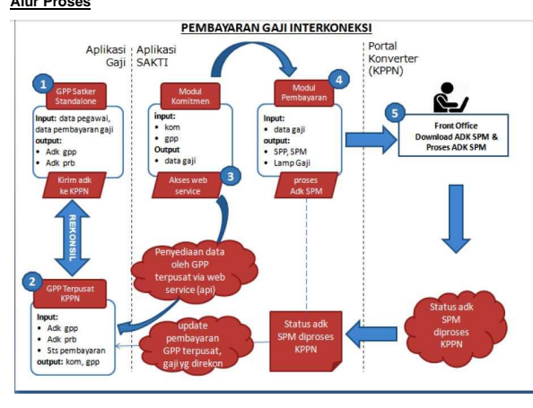

## Keterangan:

1. Satker merekam Data perhitungan Gaji pada aplikasi GPP Satker 2. Pengiriman ADK GPP satker ke KPPN untuk dilakukan rekonsiliasi (ekstensi file .gpp)
3. Data gaji dan pegawai pada GPP Terpusat dapat diakses melalui aplikasi SAKTI modl Komitmen pada menu "Import GPP Terpusat" 4. Perekaman SPP/SPM Gaji pada menu "Catat/Ubah SPP" pada modul pembayaran dapat dilakukan setelah dilakukan import data gaji 5. Pengiriman ADK SPM pada aplikasi SAKTI ke FO KPPN untuk diproses menjadi SP2D

## Pembuatan Gaji Pada Aplikasi Gpp Satker

A. Proses perhitungan gaji pada aplikasi GPP Satker

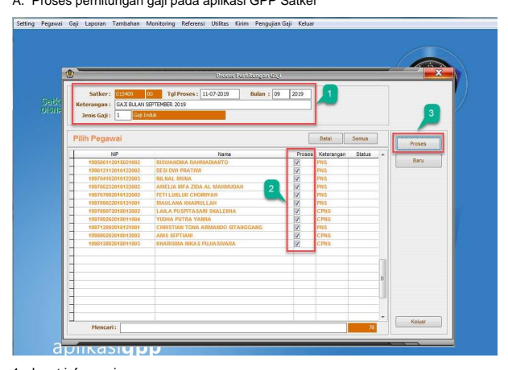 1. Input informasi : 2. Pilih pegawai yanf akan dibayarkan gajinya dengan mengisi checklist pada nama pegawai yang bersangkutan 3. Klik proses. B. Kirim gaji sementara ke PPSPM

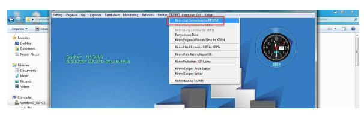

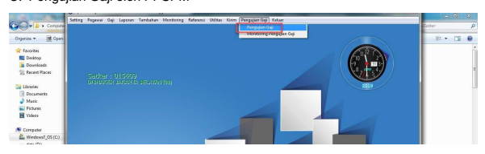

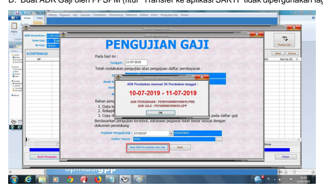

E. Kirim ADK (ekstensi *.GPP) dari satker ke KPPN untuk dilakukan rekonsiliasi (pada 

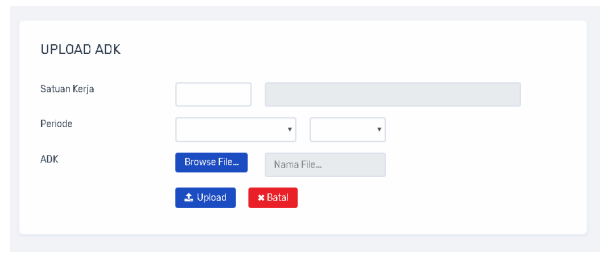

aplikasi GPP Terpusat KPPN)
Pembuatan gaji pada aplikasi SAKTI PEREKAMAN ANAK SATKER Pada aplikasi SAKTI, login sebagai Admin Satker (Lokal)

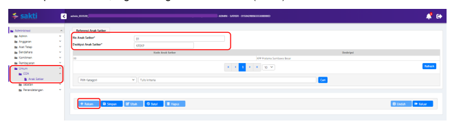 1. Masuk ke Modul Administrasi → Umum → COA → Anak Satker 2. Pilih rekam, kemudian input kode anak satker "00", untuk Satker yang memiliki lebih dari satu anak satker dapat diinput sesuai anak satker pada aplikasi GPP Satker.

## Import Data Gaji

Pada aplikasi SAKTI login sebagai user operator komitmen, pilih menu Komitmen → ADK → Import GPP Terpusat

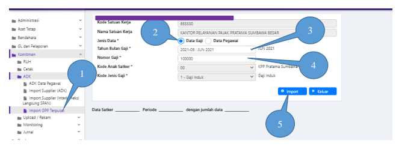

1. Masuk ke Modul Komitmen → ADK → Import GPP Terpusat; 2. Pilih opsi Data gaji; 3. Pilih Tahun Bulan Gaji menggunakan menu dropdown; 4. Pilih Nomor gaji, nomor gaji yang ditampilkan disini adalah nomor gaji yang telah berhasil dilakukan rekonsiliasi oleh KPPN;
5. Klik import.

## Perekaman Spp

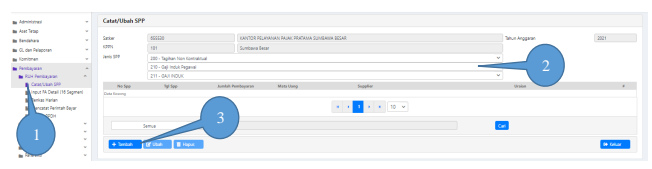

1. Masuk ke Modul Pembayaran → Catat/Ubah SPP

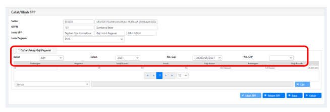

2. Pilih Jenis SPP yang akan digunakan (misalkan untuk gaji induk menggunakan jenis SPP 211)
3. Klik Tambah 1. Pada form ini silahkan input informasi Bulan, Tahun, dan No. Gaji. 2. Klik Rekam SPP dan lanjutkan proses pembuatan SPP/SPM seperti yang selama ini dilakukan.

## Perubahan Data Gaji

A. ADK GPP yang telah direkam SPP di aplikasi SAKTI akan terisi Flag Nomor Nomor SPP/SPM dan Nomor Invoice pada Aplikasi GPP Terpusat KPPN
B. Data Gaji pada GPP Terpusat KPPN yang telah direkam SPP pada aplikasi SAKTI 
tidak dapat dilakukan proses ubah/hapus sebelum dilakukan penghapusan SPP pada aplikasi SAKTI
C. Data Gaji pada aplikasi SAKTI yang telah digunakan untuk pembuatan SPP tidak dapat dilakukan proses ubah/hapus sebelum dilakukan penghapusan SPP pada aplikasi SAKTI
D. Harus dilakukan proses Hapus SPP jika akan melakukan proses import ulang ADK 
GPP
E. Data Gaji yang telah menjadi SP2D tidak dapat dilakukan batal/ubah/hapus F. Untuk monitoring atau hapus data nomor gaji yang telah diimport dari aplikasi GPP 
Terpusat KPPN dapat mengikuti langkah berikut :

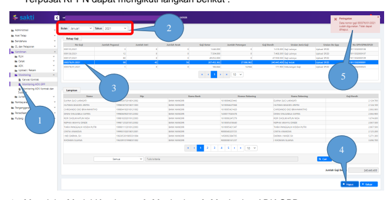

1. Masuk ke Modul Komitmen → Monitoring → Monitoring ADK GPP
2. Pilih Bulan dan Tahun 3. Pilih No. Gaji 4. Klik Hapus 5. Muncul notifikasi bahwa Data nomor gaji sudah digunakan, Tidak dapat dihapus 
(silahkan hapus SPP terlebih dahulu)
Setelah SPP dihapus, silahkan satker membuat perubahan data gaji dan melakukan proses rekonsiliasi ulang dengan KPPN pada aplikasi GPP. Setelah berhasil melakukan proses rekonsiliasi ulang, silahkan lakukan proses import ulang dari aplikasi GPP terpusat ke aplikasi SAKTI seperti langkah-langkah di atas. Monitoring No SPP/SPM/SP2D dapat dilihat pada tabel rekap gaji di kolom paling kanan. Pastikan jumlah gaji bersih pada Rekap Gaji sama dengan jumlah gaji bersih pada Lampiran.

## Data Pegawai

A. Pada Aplikasi SAKTI login menggunakan user operator komitmen, Pilih Komitmen →
ADK → Import GPP Terpusat

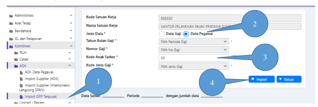

1. Masuk ke Modul Komitmen → ADK → Import GPP Terpusat 2. Pilih jenis data : Data Pegawai 3. Input informasi : Kode Anak Satker (dipilih melalui menu *dropdown*) 4. Klik Import B. Setelah berhasil melakukan import Data Pegawai, masuk ke menu "Pencatatan Supplier" melalui menu Komitmen → RUH → Pencatatan *Supplier*. Pada tab *Supplier* Header, pilih *Supplier* Satuan Kerja yang sudah mendapatkan NRS sehingga tab Supplier Address menjadi aktif.

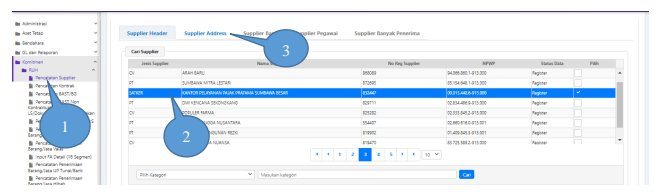

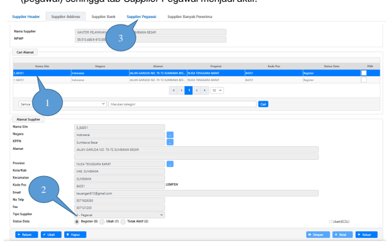

D. Klik pada tab *Supplier* Pegawai dan form akan berpindah. Kemudian tekan tombol 
"Rekam", yang akan mengaktifkan tombol […] pada menu isian NIP dalam kolom data pegawai.

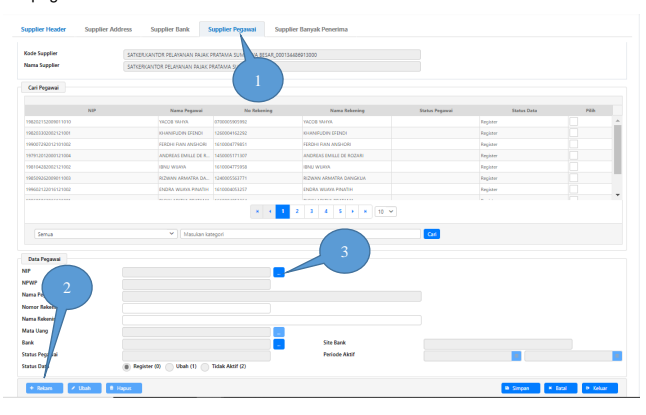

C. Klik tab *Supplier Address* dan form akan berpindah. Kemudian pilih *supplier* tipe 3 
(pegawai) sehingga tab *Supplier* Pegawai menjadi aktif.

E. Klik pada tombol […] tersebut, yang akan mengaktifkan pop-up form dan menampilkan 

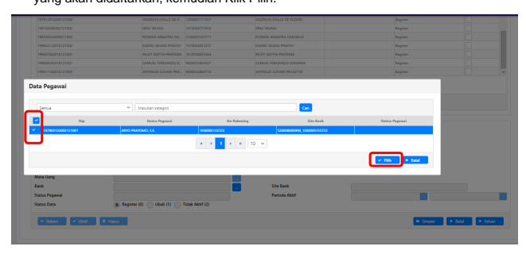

nama data *Supplier* pegawai baru hasil dari pengunggahan ADK KOM yang bersumber dari aplikasi GPP. Kemudian pilih dengan mengisi checklist atas pegawai mana saja yang akan didaftarkan, kemudian Klik Pilih.

F. Setelah klik tombol "Pilih", data Supplier pegawai tersebut sudah masuk ke dalam 

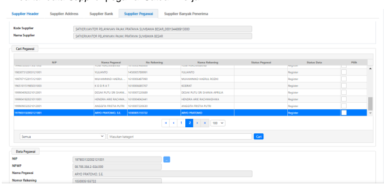

daftar data *Supplier* pegawai Satuan Kerja.

G. Setelah Operator Komitmen selesai melakukan perekaman data, proses dilanjutkan ke 

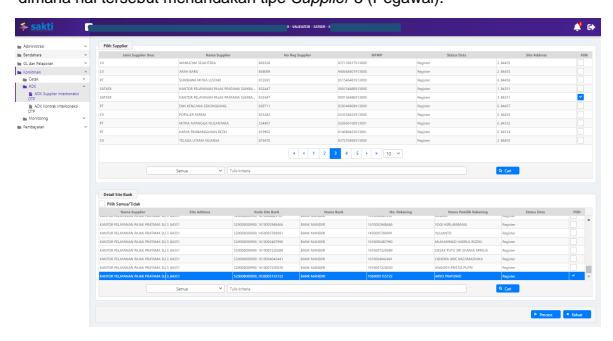

persetujuan dan pembuatan ADK atas *Supplier* pegawai tersebut melalui user PPK.

Setelah login menggunakan user PPK, masuk ke menu "ADK *Supplier* Interkoneksi OTP" melalui menu Komitmen → ADK → ADK *Supplier* Interkoneksi OTP. Setelah muncul form ADK *Supplier* FTP, pilih dengan mengisi checklist atas data *supplier* dengan deskripsi jenis *supplier* "SATKER" dan Site Address dengan digit awal "3", 
dimana hal tersebut menandakan tipe *Supplier* 3 (Pegawai).

H. Setelah itu klik tombol "Proses", muncul *pop-up form* OTP. Silahkan klik req.OTP via 

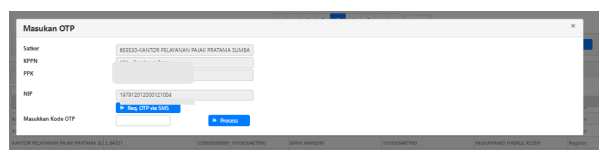

SMS untuk melakukan request kode OTP yang akan dikirimkan ke nomor HP pejabat (PPK). Setelah menerima kode OTP, silahkan masukkan kode dimaksud dan klik proses. Tunggu hingga proses pembuatan ADK berhasil.

I. Setelah proses pembuatan ADK *Supplier* selesai, PPK maupun operator komitmen dapat memantau progress atas ADK tersebut melalui menu "Monitoring ADK Kontrak dan *Supplier*" yang dapat diakses melalui menu Komitmen → Monitoring → Monitoring ADK Kontrak dan *Supplier*. ADK *Supplier* tersebut akan diproses di Aplikasi SPAN mulai dari petugas *Validator* KPPN hingga mendapat persetujuan oleh *Approver* KPPN. Setelah selesai proses pendaftaran dan/atau penambahan data *Supplier* pegawai di SPAN, Operator Pembayaran dapat langsung membuat SPP hingga SPM atas *Supplier* pegawai tersebut.

## Catatan :

Untuk pendaftaran pegawai baru atau pindahan, file ADK yang dihasilkan untuk diunggah pada aplikasi SPAN adalah File BCSR, **Bukan BCSU**.