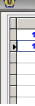
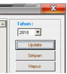
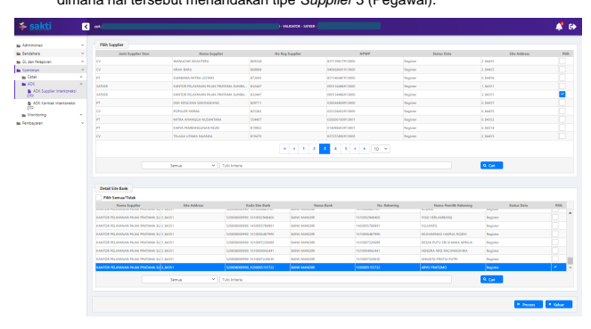

Petunjuk Teknis Aplikasi SAKTI
` PEMINDAHAN PENGELOLAAN DAN 
PEREKAMAN SUPPLIER TIPE 3 KEMENTERIAN KEUANGAN RI DITJEN PERBENDAHARAAN
→
♦
→
Pemindahan Pengelolaan dan Perekaman Supplier Tipe 3 Menu ini digunakan untuk Pemindahan Data Supplier Tipe 3 dari GPP dan merekam Supplier Tipe 3 Pegawai pada SAKTI

| No.   | Uraian                  |                                                                                               |                                                                                     |
|-------|-------------------------|-----------------------------------------------------------------------------------------------|-------------------------------------------------------------------------------------|
| 1     | Modul                   | KOM                                                                                           |                                                                                     |
| 2     | Role User               | OPR, VAL                                                                                      |                                                                                     |
| 3     | Modul Lain yang Terkait | PEM                                                                                           |                                                                                     |
| 4     | Transaksi yang Terkait  | PEM - SPP LS (Supplier tipe 3)                                                                |                                                                                     |
| 5     | Dokumen Input           | Data Supplier, ADK Pegawai                                                                    |                                                                                     |
| 6     | Output                  | Resume Supplier, Data Supplier dapat digunakan untuk  pembuatan SPP Gaji Induk / Gaji Lainnya |                                                                                     |
| 7     | Validasi                | -                                                                                             | Data Supplier yang belum memiliki NRS tidak dapat  digunakan untuk Data Pembayaran. |

PETUNJUK TEKNIS PEMINDAHAN PENGELOLAAN DATA *SUPPLIER* TIPE 3 DAN PEREKAMAN *SUPPLIER* **TIPE 3** Petunjuk Teknis ini membahas tentang bagaimana proses pemindahan data supplier tipe 3 dengan diawali dari Aplikasi GPP untuk kemudian dilanjutkan dengan proses perekaman Supplier tipe 3 pada Aplikasi SAKTI. PEMINDAHAN DATA PEGAWAI SATKER ASAL KE SATKER BARU PADA GPP
A. **SATKER ASAL**

 1. Pembuatan ADK Pegawai Pindah dari Satker Asal dilakukan melalui menu Pegawai →
Kirim Pegawai Pindah. Pilih semua pegawai pada satker tersebut yang akan dipindah.

2. Maka akan terbentuk ADK pindah untuk masing-masing pegawai (ekstensi .pnd). 3. ADK Pegawai pindah selanjutnya dikirimkan ke satker baru.

## B. Satker Baru

Untuk pembagian daftar gaji di satker KPP (Kantor Pelayanan Pajak) apakah akan dibuat anak satker per masing-masing satker KPP (Kantor Pelayanan Pajak) dan KP2KP (Kantor Pelayanan Penyuluhan dan Konsultasi Perpajakan), ataukan akan digabungkan ke dalam anak satker KPP (Kantor Pelayanan Pajak) sendiri tergantung keinginan PPABP / kebijakan yang berlaku pada satker KPP. Pembagian anak satker per satker ini bukan suatu keharusan, namun misalkan masing-masing satker KP2KP akan dibuatkan anak satker tersendiri, ikuti langkah-langkah berikut : 1. Pembuatan anak satker baru per sakter, lakukan perekaman pada menu setting →

setting referensi anak satker. Buat anak satker baru untuk KP2KP.

2. Lakukan setting anak satker → pilih anak satker tujuan pegawai, misalkan kita hendak 

me-restore data pegawai untuk anak satker : 01 KP2KP Abc…
3. Restore ADK pegawai pindah melalui menu Pegawai → Terima Data Pegawai Pindah.

Cari folder dimana ADK pegawai pindah, maka kode anak satker yang terpilih adalah kode anak satker yang erdefault, yaitu anak satker 01. Ketika di klik tombol proses, maka data pegawai akan masuk ke dalam anak satker 01 semuanya. Lakukan hal ini untuk anak-anak satker yang lain dengan jalan mendefault anak satker terlebih dahulu.

4. Isikan status kawin awal tahun untuk Tahun Anggaran berkenaan, melalui menu 

Pegawai → Status Kawin Awal Tahun 5. Isikan Nomor Urut Pegawai melalui menu Pegawai → Nomor Urut Pegawai

6. Setelah semua anak satker diisikan status kawin awal tahun dan nomor urut pegawai, maka proses gaji siap dijalankan.

Prasyarat agar dapat melakukan pendaftaran dan/atau penambahan data *supplier* tipe 3 (pegawai) adalah :
- *Supplier Header* Satuan Kerja sudah mendapatkan Nomor *Register Supplier* (NRS) 
yang diperoleh dari Aplikasi SPAN;
- ADK KOM yang bersumber dari aplikasi GPP.

Berikut langkah-langkah yang harus dilakukan oleh satuan kerja pada saat melakukan pendaftaran dan/atau penambahan data Supplier pegawai pada Aplikasi SAKTI:

1. Login ke dalam aplikasi SAKTI menggunakan user operator komitmen; 2. Masuk ke menu Komitmen → ADK → ADK Data Pegawai; 3. Klik Cari, kemudian arahkan ke ADK KOM yang telah dibuat;

 4. Setelah memilih ADK, klik Upload dan tunggu hingga muncul notifikasi BERHASIL 
DI UPLOAD;
5. Setelah berhasil melakukan unggah ADK KOM, masuk ke menu "Pencatatan 

Supplier" melalui menu Komitmen → RUH → Pencatatan *Supplier*.

6. Pada tab *Supplier Header*, pilih *Supplier* Satuan Kerja yang sudah mendapatkan NRS sehingga tab *Supplier Address* menjadi aktif.

7. Klik tab *Supplier Address* dan form akan berpindah. Kemudian pilih *supplier* tipe 3 
(pegawai) sehingga tab *Supplier* Pegawai menjadi aktif.

8. Klik pada tab *Supplier* Pegawai dan form akan berpindah. Kemudian tekan tombol 
"Rekam", yang akan mengaktifkan tombol […] pada menu isian NIP dalam kolom data pegawai.

9. Klik pada tombol […] tersebut, yang akan mengaktifkan pop-up form dan 

menampilkan nama data *Supplier* pegawai baru hasil dari pengunggahan ADK KOM 
yang bersumber dari aplikasi GPP. Kemudian pilih dengan mengisi checklist atas pegawai mana saja yang akan didaftarkan, kemudian Klik Pilih.

10.Setelah klik tombol "Pilih", data Supplier pegawai tersebut sudah masuk ke dalam 

daftar data *Supplier* pegawai Satuan Kerja.

11.Setelah Operator Komitmen selesai melakukan perekaman data, proses dilanjutkan 

ke persetujuan dan pembuatan ADK atas *Supplier* pegawai tersebut melalui user PPK. Setelah login menggunakan user PPK, masuk ke menu "ADK *Supplier* Interkoneksi OTP" melalui menu Komitmen → ADK → ADK *Supplier* Interkoneksi OTP. Setelah muncul form ADK *Supplier* FTP, pilih dengan mengisi checklist atas data *supplier* dengan deskripsi jenis *supplier* "SATKER" dan Site Address dengan digit awal "3", dimana hal tersebut menandakan tipe *Supplier* 3 (Pegawai).

Setelah itu klik tombol "Proses", muncul *pop-up form* OTP. Silahkan klik req.OTP via 

SMS untuk melakukan request kode OTP yang akan dikirimkan ke nomor HP pejabat (PPK). Setelah menerima kode OTP, silahkan masukkan kode dimaksud dan klik proses. Tunggu hingga proses pembuatan ADK berhasil.

12.Setelah proses pembuatan ADK *Supplier* selesai, PPK maupun operator komitmen dapat memantau progress atas ADK tersebut melalui menu "Monitoring ADK Kontrak dan *Supplier*" yang dapat diakses melalui menu Komitmen → Monitoring → Monitoring ADK Kontrak dan *Supplier*. ADK *Supplier* tersebut akan diproses di Aplikasi SPAN mulai dari petugas *Validator* KPPN hingga mendapat persetujuan oleh *Approver* KPPN. Setelah selesai proses pendaftaran dan/atau penambahan data *Supplier* pegawai di SPAN, Operator Pembayaran dapat langsung membuat SPP hingga SPM atas *Supplier* pegawai tersebut.

Catatan : Untuk pendaftaran pegawai baru atau pindahan, file ADK yang dihasilkan untuk diunggah pada aplikasi SPAN adalah File BCSR, **Bukan BCSU**.