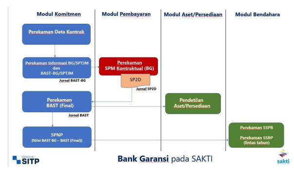
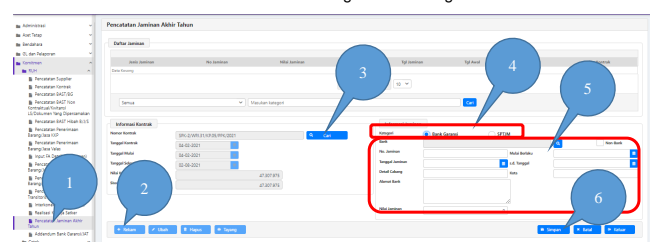
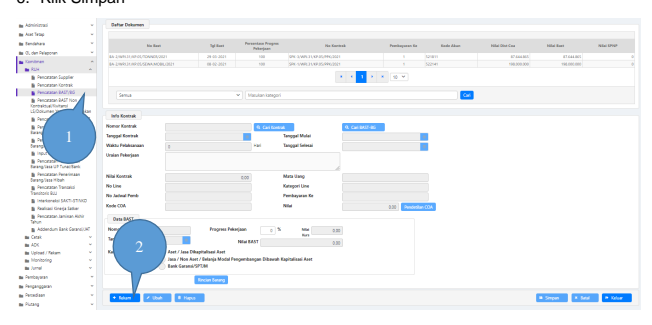
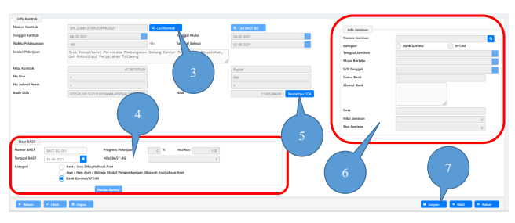
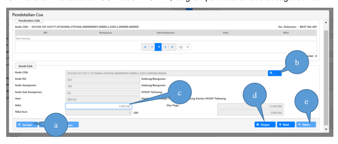
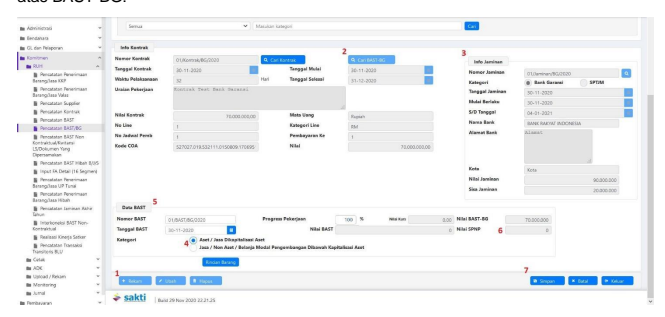

''
.

Petunjuk Teknis Aplikasi SAKTI
→
PEREKAMAN BAST DENGAN 
BANK GARANSI / SPTJM
KEMENTERIAN KEUANGAN RI

## Ditjen Perbendaharaan

→
→
→
Perekaman **BAST Dengan** Bank Garansi / SPTJM Petunjuk Teknis ini digunakan sebagai panduan untuk merekam BAST dengan Bank Garansi / SPTJM

| No.   | Uraian                  |                                                  |
|-------|-------------------------|--------------------------------------------------|
| 1     | Modul                   | KOM                                              |
| 2     | Role User               | OPR, VAL                                         |
| 3     | Modul Lain yang Terkait | KOM, PEM GLP                                     |
| 4     | Transaksi yang Terkait  | KOM - Perekaman Data Kontrak PEM - Perekaman SPM |
| 5     | Dokumen Input           | Data Kontrak                                     |
| 6     | Output                  | BAST dengan Bank Garansi / SPTJM                 |

## Pendahuluan

Petunjuk teknis ini digunakan untuk perekaman BAST dengan menggunakan Bank Garansi. Selain itu, petunjuk teknis ini juga digunakan untuk transaksi kontraktual dengan nominal nilai kontrak 50 juta atau kurang dari 50 juta dengan mekanisme SPTJM. Pada mekanisme perekaman BAST dengan Bank Garansi, tahapannya adalah sebagai berikut:
1. Merekam BAST dengan Bank Garansi/SPTJM yang selanjutnya disebut dengan BAST-BG
2. Merekam SPP Kontraktual s.d. Catat SP2D 3. Merekam BAST Final sebagai pendetailan atas transaksi dengan BAST-BG Adapun alur perekaman BAST dengan Bank Garansi pada Aplikasi SAKTI sebagai 

berikut:

## Perekaman Bast Dengan Bank Garansi / Sptjm

Untuk merekam BAST-BG/SPTJM, langkah pertama yang harus dilakukan adalah dengan merekam informasi Bank Garansi/SPTJM dengan cara sebagai berikut:

1. Login menggunakan user operator Komitmen, kemudian masuk ke menu Komitmen →
Pencatatan Jaminan Akhir Tahun; 2. Klik Rekam; 3. Klik tombol Cari di sebelah kanan kolom Nomor Kontrak untuk mencari data kontrak yang akan dibuatkan BAST menggunakan Bank Garansi/SPTJM;
4. Pilih jenis Jaminan Akhir Tahun yang akan direkam (Bank Garansi untuk kontrak dengan nilai > Rp 50.000.000,00 dan SPTJM untuk kontrak dengan nilai <= Rp 50.000.000,00);
5. Isikan detail Bank Garansi / SPTJM yang akan direkam (tanggal Mulai Berlaku diisi tanggal Bank Garansi/SPTJM, s.d. Tanggal diisi tanggal 31 Desember Tahun Anggaran berkenaan);
6. Klik Simpan

1. Setelah berhasil melakukan perekaman data Bank Garansi/SPTJM, maka dilanjutkan dengan perekaman BAST kontrak melalui menu Komitmen → RUH → Pencatatan BAST/BG;
2. Klik Rekam untuk mengaktifkan form perekaman;

3. Klik Cari Kontrak, dan pilih data kontrak yang akan dibayarkan menggunakan Bank Garansi/SPTJM;
4. Isikan detail Nomor dan tanggal BAST, serta untuk Kategori silahkan pilih Bank Garansi/SPTJM untuk memunculkan form Info Jaminan; 5. Lakukan Pendetailan COA atas BAST ini, langkah pendetailan coa sebagai berikut:

a. Klik Rekam; b. Klik tombol […] di sebelah kanan kolom Kode COA, pilih detail coa yang akan digunakan; c. Masukkan nilai yang akan dibebankan pada COA yang telah dipilih; d. Klik simpan e. Setelah selesai, klik tombol keluar untuk kembali ke Form perekaman BAST
6. Isikan informasi Bank Garansi/BAST dengan mengklik tombol kaca pembesar di sebelah kanan kolom Nomor Jaminan. Silahkan pilih data Bank Garansi/SPTJM yang telah direkam akan muncul pada form pop-up; 7. Klik Simpan Setelah Data BAST-BG berhasil direkam, maka dapat dilanjutkan dengan pembuatan SPP-LS kontraktual. Petunjuk perekaman SPP Kontraktual mengacu pada Petunjuk Teknis Perekaman SPP Kontraktual.

## Perekaman Bast Final (Pendetailan Kategori Aset / Jasa)

Setelah proses catat SP2D atas SPM yang menggunakan BAST-BG, langkah selanjutnya 

 yang harus dilakukan adalah dengan merekam BAST Final atas BAST-BG yang pernah direkam sebelumya. BAST Final ini hanya dapat direkam setelah transaksi atas BAST-BG 
telah dilakukan proses pencatatan SP2D. Berikut dalah petunjuk perekaman BAST Final atas BAST-BG:
1. Login menggunakan user operator Komitmen, Pilih menu Komitmen → Pencatatan BAST/BG, klik Rekam; 2. Klik Cari BAST-BG, akan ditampilkan data BAST-BG yang telah digunakan sampai proses catat SP2D, pilih data BAST-BG tersebut; 3. Kolom Info Jaminan akan terisi secara otomatis; 4. Pada isian Data BAST, pilih kategori BAST yang akan didetailkan. Jika memilihi Kategori Aset/Jasa Dikapitalisasi Aset maka rekam terlebih dahulu kode barang pendetailannya; 5. Lengkapi isian Data BAST (Nomor BAST Final, Tanggal BAST Final, dan Progres Pekerjaan);
6. Jika Nilai BAST Final sama dengan nilai data kontrak (termin kontrak), maka nilai SPNP 
(Surat Penetapan Nilai Pengembalian) adalah 0. Jika Nilai BAST Final < BAST-BG, maka nilai SPNP akan terisi dan wajib melakukan pengembalian kepada negara.

7. Simpan BAST.

## Penyetoran Spnp

Jika Nilai BAST Final < BAST BG, maka akan terdapat Nilai SPNP (Surat Penetapan Nilai Pengembalian) untuk dikembalikan kepada Negara (disetorkan). Penyetoran SPNP dapat menggunakan menu:
1. Bendahara → Setoran Pengembalian Belanja (tahun anggaran berjalan); 2. Bendahara → Setoran UP/TUP/PNBP Bendahara Pengeluaran (jika disetorkan lewat tahun anggaran).