→
♦
Petunjuk Teknis Aplikasi SAKTI
PEREKAMAN SUPPLIER
TIPE 1, 2, dan 7
→
→
→
Perekaman *Supplier* Tipe 1, 2, dan 7 Menu ini digunakan untuk merekam *Supplier* Tipe 1, 2, dan 7

| No.   | Uraian                                                                                                                                    |                                                                     |                                                                                                    |
|-------|-------------------------------------------------------------------------------------------------------------------------------------------|---------------------------------------------------------------------|----------------------------------------------------------------------------------------------------|
| 1     | Modul                                                                                                                                     | KOM                                                                 |                                                                                                    |
| 2     | Role User                                                                                                                                 | OPR, VAL                                                            |                                                                                                    |
| 3     | Modul Lain yang Terkait                                                                                                                   | ADM, PEM, POR                                                       |                                                                                                    |
| 4     | Transaksi yang Terkait                                                                                                                    | PEM - SPP LS (Supplier tipe 1, 2, dan 7)                            |                                                                                                    |
| 5     | Dokumen Input                                                                                                                             | Data Supplier                                                       |                                                                                                    |
| 6     | Output                                                                                                                                    | Resume Supplier, Data Supplier dapat digunakan untuk  pembuatan SPP |                                                                                                    |
| 7     | Validasi                                                                                                                                  | -                                                                   | NIP Pejabat harus didaftarkan terlebih dahulu ke  portalsakti agar dapat mengirimkan Data Supplier |
| -     | Data Supplier yang belum memiliki NRS tidak dapat  digunakan untuk pembayaran, perekaman data  kontrak, da perekaman BAST Non-Kontrakual. |                                                                     |                                                                                                    |

## Petunjuk Teknis Perekaman Supplier Tipe 2 Penyedia Barang/Jasa

Untuk melakukan perekaman data Supplier tipe 2 dapat dilakukan dengan cara Impor Supplier atau dengan perekaman manual.

## Import Supplier

Untuk proses Import Supplier, Data Supplier yang dapat di-import adalah data Supplier yang sudah pernah didaftarkan pada aplikasi SPAN dan telah memiliki NRS. Langkah Import Supplier berpedoman pada Petunjuk Teknis terkait Import Supplier Interkoneksi Langsung SPAN.

## Rekam Data Supplier Manual

Proses perekaman data Supplier secara manual dilakukan apabila data Supplier belum pernah didaftarkan sebelumnya pada aplikasi SPAN. Proses perekaman data Supplier secara manual pada Petunjuk Teknis ini dapat digunakan untuk pendaftaran Supplier Tipe 1, 2, dan 7. Pada Petunjuk Teknis ini, contoh yang ditampilkan adalah perekaman Supplier Tipe 2 - Penyedia Barang dan Jasa.

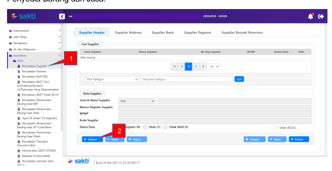

1. Untuk melakukan perekaman Supplier Tipe 2 secara manual, silahkan Login menggunakan user Operator Komitmen; 2. Masuk ke menu Komitmen → RUH → Pencatatan Supplier; 3. Klik tombol Rekam;

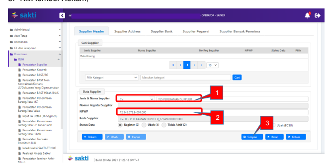

1. Isi Jenis dan Nama Supplier sesuai data yang tersedia. Pada contoh di atas, Jenis Supplier yang digunakan adalah CV;
2. Isi data NPWP Supplier; 3. Klik Simpan, lalu Tab Supplier Address akan aktif sehingga dapat dilanjutkan ke proses selanjutnya.

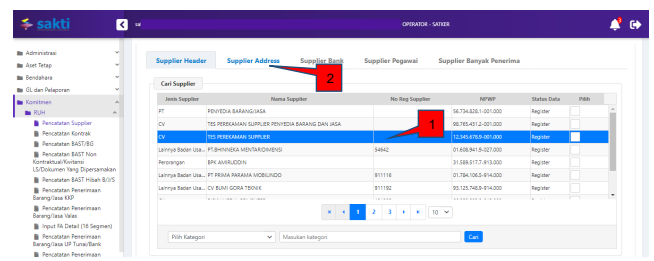

1. Klik pada nama Supplier yang sudah tersimpan (akan muncul pada kolom Cari Supplier);
2. Klik Tab Supplier Address.

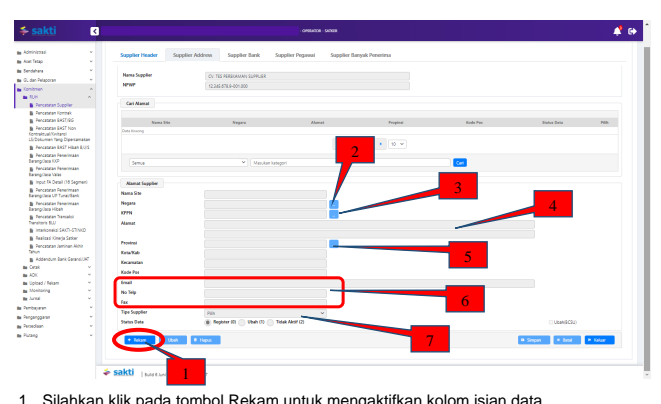

1. Silahkan klik pada tombol Rekam untuk mengaktifkan kolom isian data. 2. Lakukan pengisian kolom Negara, KPPN, dan Provinsi (Provinsi - Kota/Kab –
Kecamatan - Kode Pos) dengan memilih dari daftar yang muncul saat menekan tombol […] di samping kolom.

3. Untuk pengisian informasi Alamat dan Kontak supplier (Email - No. Telp - Fax) 
dilakukan dengan pengisian manual oleh pengguna.

4. Pengisian tipe supplier dilakukan dengan memilih dari daftar *dropdown* yang telah disediakan.

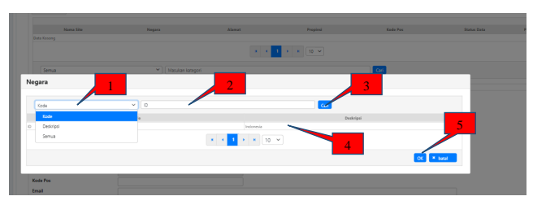

Setelah menekan tombol […] di samping kolom Negara, akan ditampilkan form di atas.

1. Silahkan pilih kriteria yang akan digunakan sebagai filter pencarian, dapat menggunakan Kode ataupun Deskripsi Negara; 2. Masukkan kata kunci pencarian, ilustrasi ini menggunakan kode negara Indonesia sebagai filter pencarian sehingga filter yang dipilih adalah Kode dan kata kunci "ID";
3. Klik Cari, maka akan ditampilkan hasil pencarian sesuai kriteria yang dimasukkan; 4. Pilih data negara yang ditampilkan, dalam ilustrasi ini Indonesia; 5. Klik OK untuk menyimpan.

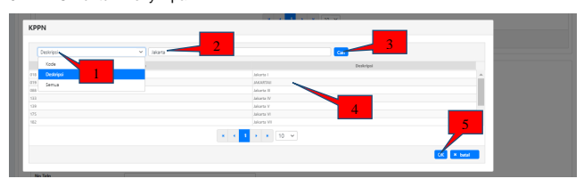

Setelah melakukan pengisian Negara, dilanjutkan dengan pengisian KPPN. Form di atas akan tampil setelah pengguna menekan tombol […] di samping kolom KPPN.

1. Silahkan pilih kriteria yang akan digunakan sebagai filter pencarian, dapat menggunakan Kode ataupun Deskripsi KPPN mitra kerja; 2. Isikan kriteria pencarian, pada contoh diatas kolom pencarian diisi "Jakarta" karena akan menggunakan KPPN Jakarta II;
3. Klik cari, maka data yang sesuai dengan kriteria akan ditampilkan; 4. Silahkan pilih data yang akan digunakan dari hasil pencarian; 5. Klik OK untuk menyimpan.

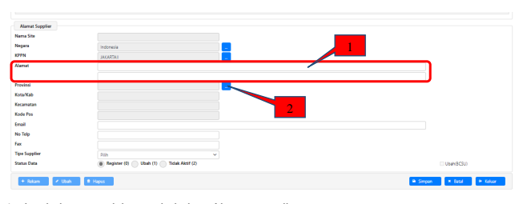

1. Lanjutkan pengisian pada kolom Alamat supplier; 2. Kemudian tekan tombol […] di samping kolom Provinsi untuk melakukan pengisian data Provinsi - Kota/Kab - Kecamatan - Kode Pos.

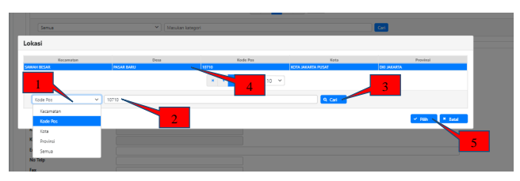

1. Pilih filter pencarian yang akan digunakan, dapat menggunakan Kecamatan, Kode Pos, Kota, ataupun Provinsi; 2. Isikan kata kunci pencarian, dalam contoh di atas menggunakan filter Kode Pos dengan kata kunci "10710";
3. Klik Cari, maka akan ditampilkan data yang sesuai dengan kata kunci pencarian; 4. Pilih data yang akan digunakan; 5. Klik Pilih, maka kolom Provinsi - Kota/Kab - Kecamatan - Kode Pos akan terisi.

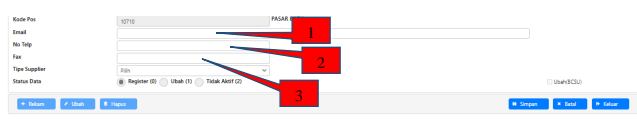

1. Lakukan pengisian email supplier; 2. Dilanjutkan dengan pengisian nomor telepon supplier; 3. Kemudian melakukan pengisian Fax supplier. 1. Klik pada kolom Tipe Supplier;

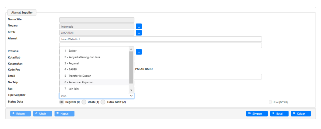 2. Akan muncul pilihan tipe supplier; 3. Pilih "2 - Penyedia Barang dan Jasa" (Jika ingin merekam tipe 1, pilih "1 - Satker", jika ingin merekam tipe 7, pilih "7 - lain-lain);
4. Klik simpan, selanjutnya tab *Supplier bank* akan aktif sehingga dapat dilanjutkan ke tahap selanjutnya.

1. Kllik pada kotak kecil disamping data *Supplier* yang telah tersimpan (pada menu Cari Alamat);
2. Tab *Supplier Bank* di bagian atas kolom akan aktif. Klik pada tab tersebut.

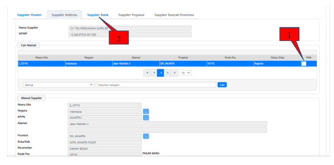

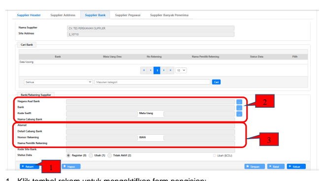

1. Klik tombol rekam untuk mengaktifkan form pengisian; 2. Pengisian data pada Kolom Negara Asal Bank, Bank, Mata Uang, dan Nama Cabang Bank dilakukan dengan memilih data pada form pop up setelah menekan tombol […];
3. Pengisian pada kolom Alamat, Detail Cabang Bank, Nomor Rekening, dan Nama Pemilik Rekening diisi secara manual; 4. Kolom Kode Swift dan IBAN akan aktif dan dapat diisi apabila Negara Asal Bank yang dipilih selain Indonesia.

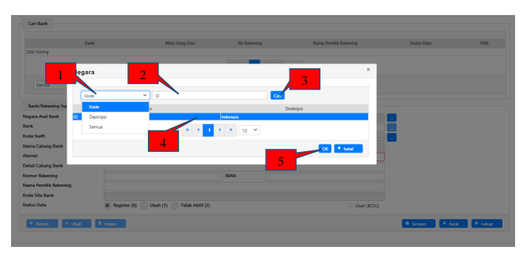

Untuk perekaman Negara Asal Bank, klik tombol […] di sebelah kanan kolom Negara Asal Bank 1. Pilih filter yang akan digunakan, dapat menggunakan Kode ataupun Deskripsi Negara Asal Bank; 2. Masukkan kata kunci untuk melakukan pencarian, pada contoh ini menggunakan filter Kode dan kata kunci "ID";
3. Klik tombol cari, untuk menampilkan hasil pencarian; 4. Pilih data yang akan digunakan; 5. Klik OK untuk menyimpan.

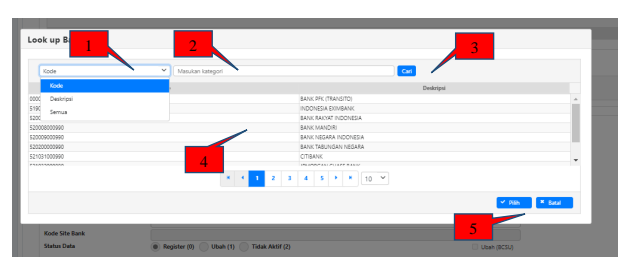

Dilanjutkan dengan perekaman Bank, klik tombol […] pada sebelah kanan kolom Bank 1. Pilih filter yang akan digunakan untuk pencarian, dapa menggunakan Kode ataupun Deskripsi Bank; 2. Isikan kata kunci untuk melakukan pencarian; 3. Klik cari, untuk menampilkan hasil pencarian; 4. Silahkan pilih data yang akan digunakan dari hasil pencarian; 5. Klik pilih untuk menyimpan.

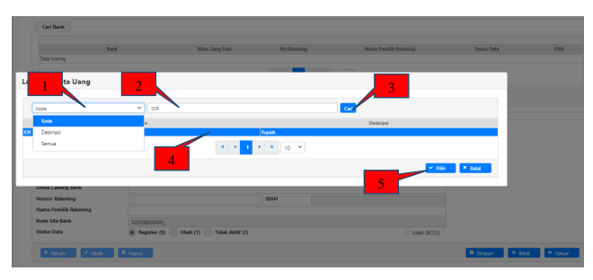

Setelah melakukan perekaman Bank, dilanjutkan dengan perekaman Mata Uang. Silahkan klik tombol […] di sebelah kanan kolom Mata Uang untuk menampilkan form di atas.

1. Pilih filter yang akan digunakan untuk pencarian, dapa menggunakan Kode ataupun Deskripsi Mata Uang; 2. Masukkan kata kunci pencarian, dalam contoh ini menggunakan filter Kode dan kata kunci IDR;
3. Klik Cari, untuk menampilkan hasil pencarian; 4. Pilih data yang akan digunakan; 5. Klik Pilih untuk menyimpan.

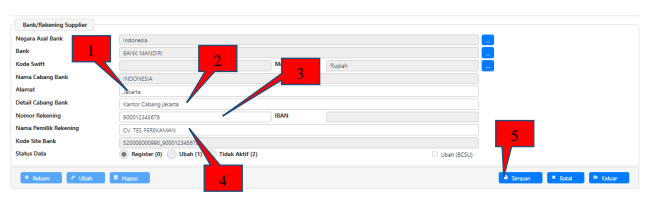

Kemudian dilanjutkan dengan perekaman informasi rekening supplier 1. Rekam data Alamat Cabang Bank; 2. Rekam Detail cabang Bank; 3. Rekam Nomor Rekening supplier; 4. Rekam Nama Pemilik Rekening supplier sesuai dengan data riil supplier; 5. Klik Simpan.

1. Pilih menu Komitmen → Cetak → Cetak Resume Supplier;

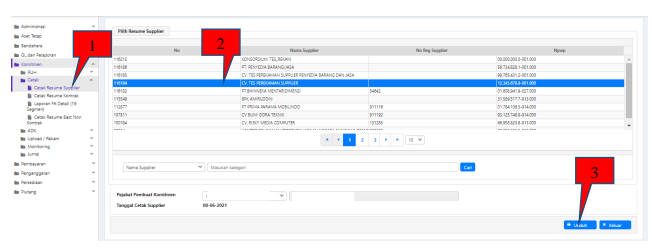

2. Klik pada data Supplier Penyedia Barang/Jasa yang telah direkam sebelumnya; 3.  Klik Unduh, buka file hasil unduhan dan teliti kembali data-data pada hasil cetakan.

Pastikan semua data telah sesuai sebelum melakukan langkah selanjutnya, yaitu proses pembuatan ADK Supplier, 4.  Berikut contoh Cetakan Resume Supplier.

INFORMASI SUPPLIER
DATA SUPPLIER

| 019   |
|-------|

| SUPPLIER HEADER       |                                            |
|-----------------------|--------------------------------------------|
| Nomor Supplier        | 116184                                     |
| No. Register Supplier |                                            |
| SPAN Nama Supplier    | CV. TES PEREKAMAN SUPPLIER_123456789001000 |
| Nama Supplier         | CV. TES PEREK/                             |
| NPWP                  | 123456789001000                            |
| SUPPLIER SITE         |                                            |
| 2 10710               |                                            |
| Malan Wahidi          |                                            |
| KOTA JAKARTA PUSAT    |                                            |

abat Pembuat Komitmen

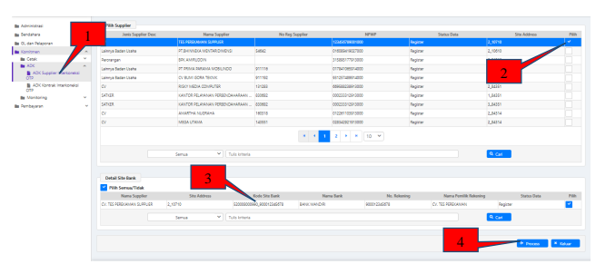

Setelah operator berhasil merekam data *Supplier*, langkah selanjutnya adalah proses pembentukan ADK Supplier (ADK BCSR) oleh user dengan role *Validator*, yaitu PPK 
dengan langkah sebagai berikut:
1. Login menggunakan user PPK; 2. Masuk ke modul Komitmen → ADK → ADK *Supplier interkoneksi* OTP; 3. Pilih dan *Checklist* pada *Supplier* yang ingin dibuatkan ADKnya; 4. Pastikan detail *site bank* yang akan dibuat ADKnya sudah dicentang; 5. Klik Proses untuk melanjutkan ke form OTP;

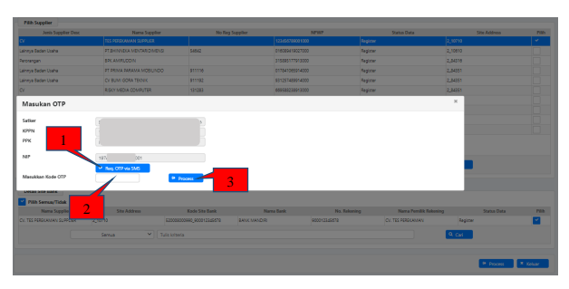

1. Klik "Req. OTP via SMS", setelah tombol ini diklik maka aplikasi akan mengirimkan kode OTP via SMS ke nomor HP pejabat (dalam hal ini PPK) yang didaftarkan; 2. Masukkan kode OTP yang diterima melalui SMS pada kolom "Masukkan Kode OTP"; 3. Klik Proses untuk melanjutkan proses pembuatan ADK Supplier;
*Catatan : 
- Apabila OTP diinput salah sebanyak 3x, maka OTP Pejabat akan terblokir;
- Dalam hal OTP sudah direquest sebanyak 3x, maka request ke-4 akan dialihkan melalui email pejabat (PPK) yang terdaftar.

Setelah ADK *Supplier* berhasil dibuat, Data *Supplier* tersebut akan secara otomatis terkirim 

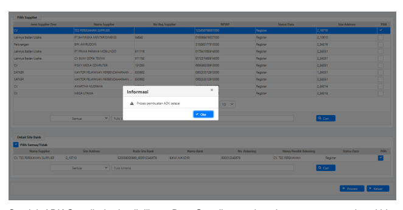

ke portalsakti pada KPPN mitra kerja untuk selanjutnya diproses pada SPAN. Jika pendaftaran telah sukses dilakukan oleh KPPN, Informasi Nomor *Register Supplier* (NRS) akan terisi otomatis pada SAKTI ataupun dapat direkam secara manual dengan langkah berikut:

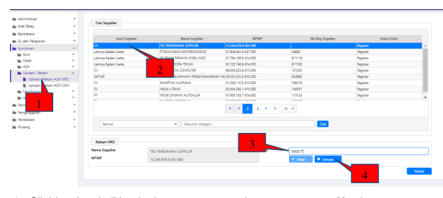

1. Silahkan kembali Login dengan menggunakan user operator Komitmen; 2. Pilih menu Komitmen → Upload/Rekam → Upload/Rekam ADK NRS (pada menu ini dapat dilihat bahwa data *Supplier* tersebut telah terisi NRS secara otomatis);
3. Jika Data NRS belum terisi dan ingin direkam secara manual, Klik pada data *Supplier* yang akan dilakukan pencatatan NRS;
4. Isikan NRS sesuai dengan data yang diberikan oleh KPPN pada kolom NRS; 5. Klik Simpan. *Supplier* tipe 2 sudah dapat digunakan untuk transaksi pembayaran SPM, 
perekaman data kontrak, atau perekaman BAST Non-Kontraktual.

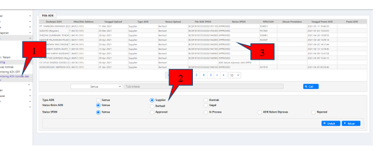

1. Login menggunakan user operator komitmen / user PPK; 2. Masuk ke Modul Komitmen → Monitoring → Monitoring ADK Kontrak dan *Supplier* 3. Silahkan pilih ADK yang akan ditampilkan (Semua / Supplier / Kontrak) 4. Pada tabel file ADK akan ditampilkan informasi ADK yang sudah dibuat 5. Informasi yang ditampilkan antara lain :
a. Deskripsi ADK - Berisikan informasi nama *Supplier*/nomor kontrak b. Nilai / *Site Address* - Berisikan informasi Nilai kontrak / *Site Address Supplier* c. Tanggal Upload - Tanggal ADK diupload d. Type ADK - Jenis ADK (Supplier / Kontrak) e. Status Upload - Status upload ke portalsakti f. File ADK SPAN - Nama file ADK untuk diproses ke aplikasi SPAN g. Status SPAN - Status pemrosesan ADK pada aplikasi SPAN h. NRS/CAN - Menampilkan NRS/CAN setelah ADK berhasil diproses SPAN i. Alasan penolakan - menampilkan alasan penolakan pada SPAN