Petunjuk Teknis Aplikasi SAKTI
PEREKAMAN DATA SUPPLIER
TIPE 6 - PPNPN
→
→
→
→
→
KEMENTERIAN KEUANGAN RI 
DITJEN PERBENDAHARAAN
Perekaman *Supplier* Tipe 6 - **PPNPN** Menu ini digunakan untuk merekam *Supplier* Tipe 6 - PPNPN

| No.                           | Uraian                  |                                                |                                                                                     |      |          |      |    |       |
|-------------------------------|-------------------------|------------------------------------------------|-------------------------------------------------------------------------------------|------|----------|------|----|-------|
| 1                             | Modul                   | KOM                                            |                                                                                     |      |          |      |    |       |
| 2                             | Role User               | OPR, VAL                                       |                                                                                     |      |          |      |    |       |
| 3                             | Modul Lain yang Terkait | ADM, PEM, POR                                  |                                                                                     |      |          |      |    |       |
| 4                             | Transaksi yang Terkait  | PEM - SPP LS Non Kontraktual (Supplier tipe 6) |                                                                                     |      |          |      |    |       |
| 5                             | Dokumen Input           | Data Supplier                                  |                                                                                     |      |          |      |    |       |
| 6                             | Output                  | Resume                                         | Supplier,                                                                           | Data | Supplier | Tipe | 6  | dapat |
| digunakan untuk pembuatan SPP |                         |                                                |                                                                                     |      |          |      |    |       |
| 7                             | Validasi                | -                                              | Data Supplier yang belum memiliki NRS tidak dapat  digunakan untuk Data Pembayaran. |      |          |      |    |       |

## Petunjuk Teknis Perekaman Supplier Tipe 6 - Ppnpn

Perekaman *Supplier* Tipe 6 dapat dilakukan dengan cara Import data *Supplier* yang telah terdaftar pada SPAN maupun Perekaman Manual dengan menggunakan data sumber berupa ADK excel dari Aplikasi SAS dengan langkah sebagai berikut : Import *Supplier*

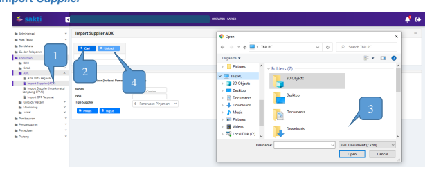

Untuk proses *Import Supplier*, Data *Supplier* yang dapat di-*import* adalah data *Supplier* yang sudah pernah didaftarkan pada SPAN dan telah memiliki NRS. Langkah import supplier berpedoman pada Petunjuk Teknis Import Supplier Interkoneksi Langsung SPAN.

## Rekam Data Supplier Manual

Untuk membuat ADK PPNPN dari Aplikasi SAS, login menggunakan user PPK.

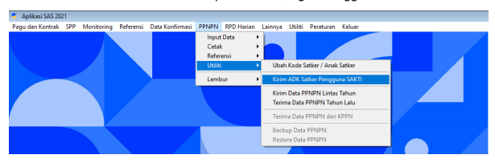

Masuk ke menu PPNPN → Utiliti → Kirim ADK Satker Pengg

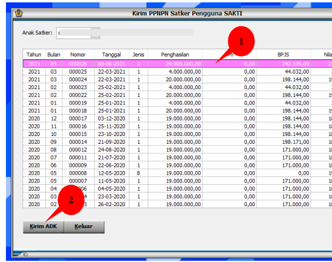

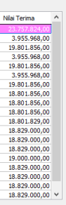

1. Pilih daftar pembayaran PPNPN yang berisikan data PPNPN dan akan diinput sebagai Supplier; 2.  Klik kirim ADK.

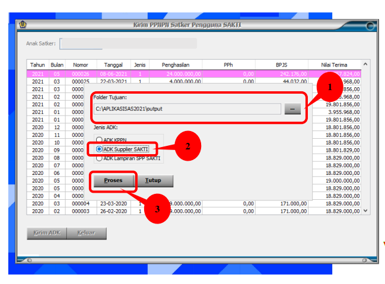

1
1. Klik tombol "…" dan pilih folder tujuan untuk menyimpan ADK; 2.   Pilih opsi ADK Supplier SAKTI;
3. Klik Proses.

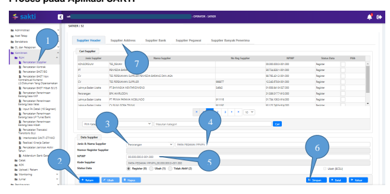

1. Login Aplikasi SAKTI dengan menggunakan user operator komitmen, kemudian masuk ke menu Komitmen → RUH → Pencatatan Supplier; 2.  Klik Rekam; 3. Pilih jenis Supplier perorangan; 4. Tuliskan nama Header Supplier PPNPN yang akan direkam; 5. Isi nomor NPWP Supplier; 6. Klik Simpan 7. Pilih data Supplier yang baru direkam, kemudian klik tab Supplier Address. *Catatan : Buat Header Supplier Baru, JANGAN MENGGABUNGKAN KE HEADER SUPPLIER TIPE 3 dan/atau 1

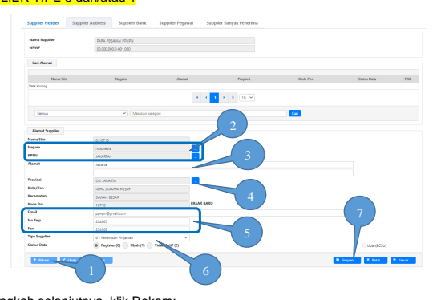

1. Langkah selanjutnya, klik Rekam; 2. Klik tombol […] pada sebelah kanan kolom Negara, dan isikan kata kunci pencarian 
"ID" dengan filter Kode pada pop up box yang muncul. Klik juga […] pada sebelah kanan kolom KPPN dan isikan dengan kode KPPN yang menjadi tempat bayar satker Anda; 3. Isi menggunakan alamat satker; 4. Klik tombol […] pada sebelah kanan kolom Provinsi dan isikan Kode Pos satker Anda, pastikan filter pencarian yang digunakan adalah Kode Pos; 5. Isi data email, nomor telepon, dan fax satker Anda; 6. Pilih tipe *Supplier* 6 - Penerusan Pinjaman; 7. Klik Simpan.

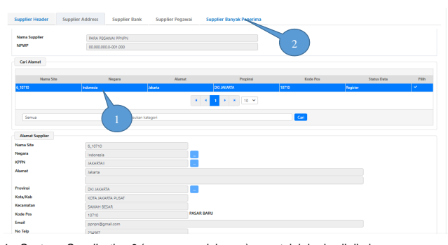

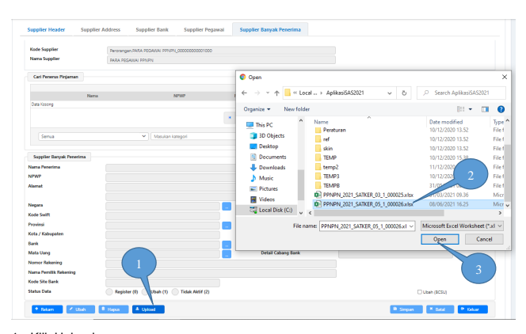

1. Klik Upload; 2. Pilih ADK Supplier PPNPN yang telah di-create dari Aplikasi SAS; 3. Klik Open;

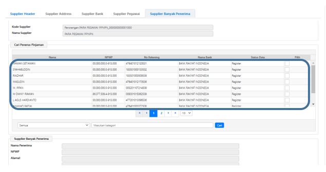

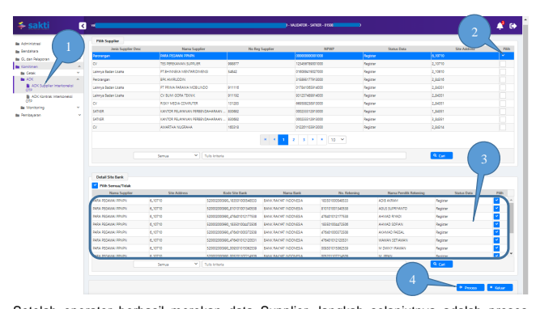

Setelah operator berhasil merekan data Supplier, langkah selanjutnya adalah proses pembentukan ADK Supplier (ADK BCSR) oleh user dengan role validator, yaitu PPK. Proses dimaksud dapat dilakukan dengan langkah sebagai berikut:
1. Login menggunakan user PPK kemudian masuk ke menu Komitmen → ADK → ADK 
Supplier Interkoneksi OTP;
2. Pilih dan Checklist pada Supplier yang ingin dibuat ADK; 3. Cek kembali data pada daftar Detail Site Bank untuk memastikan apakah data yang akan didaftarkan sudah sesuai; 4. Klik Proses untuk mengaktifkan form OTP.

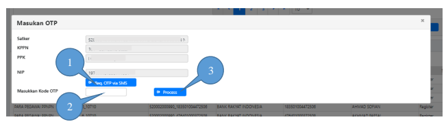

1. Klik Req.OTP via SMS, untuk melakukan request kode OTP yang dikirimkan ke nomor 

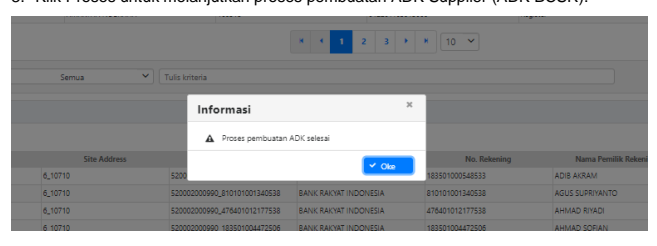

HP Pejabat (PPK);
2. Masukkan kode OTP yang diterima; 3. Klik Proses untuk melanjutkan proses pembuatan ADK Supplier (ADK BCSR). 1. Setelah ADK Supplier berhasil, ADK dimaksud akan langsung terkirim ke portalsakti KPPN;
2. Setelah ADK dimaksud berhasil diproses pada Aplikasi SPAN, maka akan mendapatkan Nomor Register Supplier (NRS);
3. Aplikasi SAKTI akan melakukan update NRS secara otomatis; 4. Dalam hal NRS tidak terupdate secara otomatis, maka user dapat melakukan update NRS secara manual melalui user operator, Menu Komitmen → Upload / Rekam →
Upload / Rekam ADK NRS;

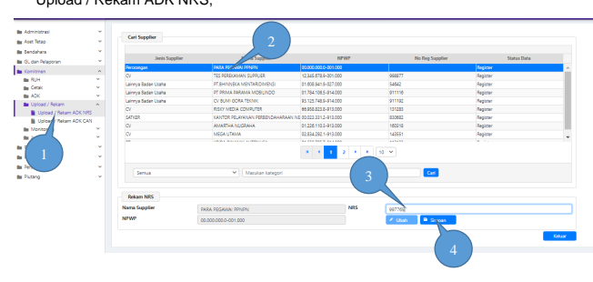

