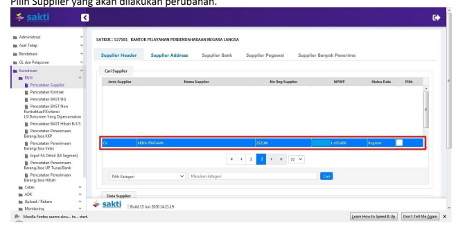

Petunjuk Teknis Aplikasi SAKTI
→
MEKANISME PEMBUATAN FILE BCSU
(UBAH DATA SUPPLIER)
→
→
KEMENTERIAN KEUANGAN RI DITJEN PERBENDAHARAAN

## I. Informasi Umum A. Deskripsi Transaksi

Menurut Peraturan Menteri Keuangan Nomor 154/PMK.05/2014 tentang Pelaksanaan Sistem Perbendaharaan dan Anggaran Negara pengertian Supplier adalah pihak yang berhak menerima pembayaran atas beban APBN, dan Data Supplier adalah informasi terkait dengan pihak yang berhak menerima pembayaran atas beban APBN yang memuat paling kurang informasi pokok, informasi lokasi, dan informasi rekening.

Data Supplier yang telah terdaftar di SPAN merupakan hasil dari pendaftaran Supplier yang bersumber dari input manual untuk satker yang mempunyai koneksi langsung ke SPAN, dari Aplikasi SAS, maupun dari Aplikasi SAKTI. Data tersebut terdistribusi secara nasional serta data yang pertama kali masuk dijadikan data referensi pada Aplikasi SPAN.

Dalam hal data yang terdaftar di Aplikasi SPAN tidak sesuai dengan data yang sebenarnya, maka satker pengguna SAKTI dapat melakukan perubahan supplier dimaksud dengan melakukan pembuatan file BCSU (*Budget Commitment Supplier Update*), yang didaftarkan ke KPPN dengan disertakan dokumen/bukti pendukung yang kuat.

| Modul                            | KOM                                                                                                                                                                                                                                                               |                                                                |
|----------------------------------|-------------------------------------------------------------------------------------------------------------------------------------------------------------------------------------------------------------------------------------------------------------------|----------------------------------------------------------------|
| Role User                        | OPR, PPK                                                                                                                                                                                                                                                          |                                                                |
| Modul Lain terkait               | PEM                                                                                                                                                                                                                                                               |                                                                |
| Transaksi yang Tekait            | KOM -                                                                                                                                                                                                                                                             | RUH Supplier, RUH Kontrak, Pencatatan BAST Non                                                                |
| Kontraktual PEM - Catat/Ubah SPP |                                                                                                                                                                                                                                                                   |                                                                |
| Dokumen Input                    | Data Supplier                                                                                                                                                                                                                                                     |                                                                |
| Output                           | Resume Supplier, Data Supplier dapat digunakan untuk pembuatan SPP,  perekaman Data Kontrak, dan pencatatan BAST Non-Kontraktual                                                                                                                                  |                                                                |
| Validasi                         | -                                                                                                                                                                                                                                                                 | Data supplier sudah mendapatkan NRS (Nomor Register Supplier); |
| -                                | Sudah terdaftar pada site (kantor bayar) KPPN yang dituju;                                                                                                                                                                                                        |                                                                |
| -                                | Informasi Data Supplier yang dapat dilakukan perubahan adalah  informasi Data Supplier selain data primary key;                                                                                                                                                   |                                                                |
| -                                | Data primary key pada supplier address : Kode tipe Supplier, kode  POS;                                                                                                                                                                                           |                                                                |
| -                                | Data primary key pada supplier Bank/ Supplier pegawai / Supplier  Banyak penerima : Negara Asal Bank, Nama Bank, Kode Bank, dan  Nomor rekening (untuk Bank dalam negeri). Negara Asal Bank,  Nama Bank, Kode swift, dan Nomor rekening (untuk Bank Luar  negeri) |                                                                |
| Petunjuk Teknis Terkait          | KOM - Perekaman Supplier Tipe 6                                                                                                                                                                                                                                   |                                                                |

## B. Informasi Penting Lainnya

1. Informasi Data Supplier yang dapat dilakukan perubahan untuk level Satker / KPPN terbatas informasi pada Supplier Address dan informasi pada Supplier Bank/Supplier Pegawai/ Supplier Banyak penerima; 2. Informasi Data Supplier pada Supplier Header tidak dapat dilakukan perubahan, kecuali jika Satker mengajukan penggabungan (*merge)* Supplier, dan yang berwenang melakukan perubahan adalah Tim Pengelola Data Referensi SPAN Direktorat Jenderal Perbendaharaan.

## Ii. Alur Proses

A. **DIAGRAM ALUR PROSES**

## B. Penjelasan Diagram Alur Proses 1. Ubah Supplier

1.1 Perubahan Data Supplier Pada Site Supplier Address a. Login Aplikasi SAKTI

 Login menggunakan *user* Operator Komitmen, pilih Modul Komitmen - RUH - Pencatatan Supplier. Pilih Supplier yang akan dilakukan perubahan.

## B. Site Supplier Address

Pindah ke tab Supplier Address, kemudian pilih Supplier Address yang akan dilakukan perubahan (apabila terdapat Supplier Address lebih dari satu). Tekan tombol 'Ubah', lakukan perubahan informasi Data Supplier pada kolom-kolom informasi yang tersedia. Setelah selesai melakukan perubahan, beri centang pada kotak 'Ubah (BCSU)', selanjutnya lakukan penyimpanan.

## 1.2 Perubahan Data Supplier Pada Site Bank/Pegawai/Banyak Penerima

a. Login Aplikasi SAKTI

 Login menggunakan *user* Operator Komitmen, pilih Modul Komitmen - RUH - Pencatatan Supplier. Pilih Supplier yang akan dilakukan perubahan. b. Site Supplier Address

 Pindah ke tab Supplier Address, kemudian pilih Supplier Address dimana site Supplier Bank / Supplier Pegawai / Supplier Banyak Penerima yang akan dilakukan perubahan tersimpan. c. Site Supplier Bank / Supplier Pegawai / Supplier Banyak Penerima

 Pindah ke tab Supplier Bank / Supplier Pegawai / Supplier Banyak Penerima, pilih Supplier Address yang akan dilakukan perubahan. Tekan tombol 'Ubah', lakukan perubahan informasi Data Supplier pada kolom-kolom informasi yang tersedia. Setelah selesai melakukan perubahan, beri centang pada kotak 'Ubah (BCSU)', selanjutnya lakukan penyimpanan.

## 2. Adk Bcsu

Setelah perubahan informasi Data Supplier telah dilakukan perubahan dan penyimpanan, bentuk 

 ADK menggunakan *user* PPK. Pilih Supplier yang berstatus 'Ubah', kemudian lakukan pembuatan ADK. File ADK yang dihasilkan adalah ADK BCSU.

## 3. Proses Kppn

Atas ADK BCSU yang dibentuk menggunakan *user* PPK, akan diproses oleh KPPN pada aplikasi SPAN dengan mengacu pada SOP yang berlaku.

## Informasi Tambahan

1. Khusus untuk perubahan informasi KPPN pada tab Supplier Address, tidak diperlukan melakukan 

 pengisian cek box 'Ubah (BCSU)', agar file ADK yang dihasilkan adalah ADK BCSR. Hal tersebut dikarenakan supplier dimaksud belum terdaftar di KPPN Mitra Kerja, dan untuk pendaftaran supplier awal harus menggunakan file ADK BCSR. 2. Terkait perubahan informasi Data Supplier yang tidak dapat dilakukan perubahan, maka dilakukan perekaman baris Data Supplier baru sesuai kebutuhan. Data-data yang dimaksud antara lain : Perubahan Nama dan NPWP pada tab Supplier Header, Tipe Supplier dan Kode POS pada tab Supplier Address, Nomor Rekening dan Nama Bank pada tab Supplier Bank / Supplier Pegawai / Supplier Banyak Penerima.