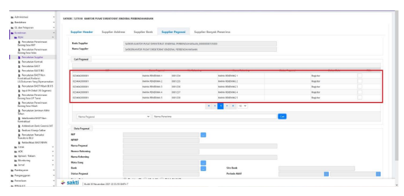
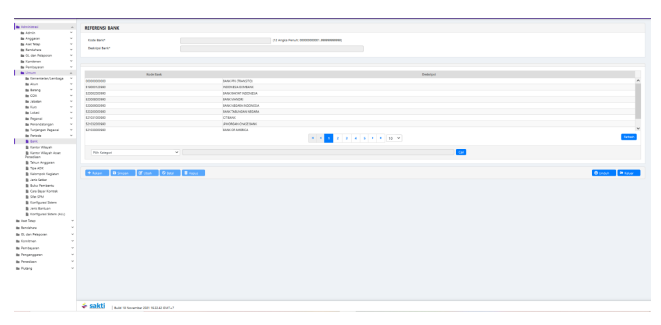

♦
Petunjuk Teknis Aplikasi SAKTI
→
→
MEKANISME PEMBUATAN
FILE ADK SUPPLIER TIPE 3 MANUAL v.2,
→
→

## I. Informasi Umum A. Deskripsi Transaksi

Menurut Peraturan Menteri Keuangan Nomor 154/PMK.05/2014 tentang Pelaksanaan Sistem Perbendaharaan dan Anggaran Negara pengertian Supplier adalah pihak yang berhak menerima pembayaran atas beban APBN, dan Data Supplier adalah informasi terkait dengan pihak yang berhak menerima pembayaran atas beban APBN yang memuat paling kurang informasi pokok, informasi lokasi, dan informasi rekening.

| Modul                   | KOM                                                                           |                                                                                               |
|-------------------------|-------------------------------------------------------------------------------|-----------------------------------------------------------------------------------------------|
| Role User               | OPR, PPK                                                                      |                                                                                               |
| Modul Lain terkait      | PEM                                                                           |                                                                                               |
| Transaksi yang Tekait   | KOM - RUH Pencatatan Supplier PEM - Catat/Ubah SPP                            |                                                                                               |
| Dokumen Input           | ADK Supplier, Data Supplier                                                   |                                                                                               |
| Output                  | Resume Supplier, Data Supplier                                                |                                                                                               |
| Validasi                | -                                                                             | Format dan inputan kolom pada file .csv yang dibentuk manual  harus sesuai dengan kamus data; |
| -                       | Penamaan file .csv harus sesuai dengan ketentuan;                             |                                                                                               |
| -                       | Penamaan file ADK .zip harus sesuai dengan ketentuan.                         |                                                                                               |
| Petunjuk Teknis Terkait | KOM - Perekaman Supplier Tipe 1,2, dan 7 PEM - Perekaman SPM 211 - Gaji Induk |                                                                                               |

## B. Informasi Penting Lainnya

1. Perekaman Supplier Pegawai dapat dilakukan melalui Upload ADK (yang berasal dari aplikasi gaji maupun yang dibentuk secara manual) dan/atau Import Data Pegawai; 2. Untuk ADK yang dibuat secara manual (bukan melalui aplikasi gaji), format dan inputan kolom pada file .csv harus sesuai dengan kamus data yang telah disediakan; 3. Untuk penamaan file .csv memiliki format KOM<6digitkodesatker><YYYYMMDD>; 4. Untuk penamaan file ADK .zip memiliki format SUPPR<6digitkodesatker><YYYYMMDD>
dan/atau SUPPU<6digitkodesatker><YYYYMMDD>;
5. Supplier yang dapat digunakan dalam perekaman transaksi adalah Supplier yang telah tercatat NRS;
6. Penggunaan penambahan/perubahan data supplier pegawai menggunakan ADK Manual hanya digunakan apabila rekening pegawai yang tidak dimungkinkan melalui mekanisme import data aplikasi gaji; 7. Dalam hal satker sudah menggunakan mekanisme pembayaran gaji terpusat, perubahan/update data supplier pegawai agar dikoordinasikan dengan unit pengelola gaji eselon I terlebih dahulu, mengingat perubahan yang dilakukan akan mempengaruhi data pembayaran gaji pada eselon I.

## Ii. Alur Proses

A. **DIAGRAM ALUR PROSES**

## B. Penjelasan Diagram Alur Proses 1. Supplier Header

Pastikan telah terdapat Supplier Header Satker. Petunjuk perekaman Supplier Header dapat mengacu pada Petunjuk Teknis Supplier Tipe 1, 2, dan 7.

## 2. Supplier Address

Pastikan telah terdapat Supplier Address Tipe 3 (Pegawai). Petunjuk perekaman Supplier Address dapat mengacu pada Petunjuk Teknis Supplier Tipe 1, 2, dan 7

## 3.0 Bentuk Adk .Zip Manual

Untuk perekaman ADK .zip manual dapat mengikuti Langkah-langkah pada lampiran I Petunjuk Teknis ini.

## 3.1 Upload Adk Data Pegawai

1. Klik tombol '+ Cari';

 2. Pilih ADK .zip yang telah dibentuk; 3. Klik tombol 'Open' 4. Klik tombol 'Upload' Masuk pada Modul Komitmen - ADK - ADK Data Pegawai.

## 5. Pastikan Proses Upload Telah Berhasil.

 3.2 Supplier Pegawai

1. Masuk pada Modul Komitmen - RUH - Pencatatan Supplier;

 2. Pilih Supplier Header Satker yang digunakan; 3. Pindah ke tab Supplier Address. 4. Pilih Supplier Address Tipe 3;

 5. Pindah ke tab Supplier Pegawai. 6. Klik tombol 'Rekam';

 7. Klik tombol (…) disebelah kolom NIP; 8. Pilih Supplier Pegawai pada form Data Pegawai 9. Klik tombol 'Pilih' 10. Pastikan terdapat notifikasi proses telah berhasil. Atas Supplier Pegawai yang telah dipilih 

 tersebut telah terekam pada aplikasi SAKTI. 4 Create ADK Supplier Untuk petunjuk pembentukan ADK Supplier, dapat mengacu pada Petunjuk Teknis Perekaman Supplier Tipe 1, 2, dan 7

## 5. Upload Adk Supplier

Atas ADK BCSR yang telah dibentuk, maka pihak KPPN akan melakukan proses pendaftaran Supplier pada SPAN mengacu pada SOP yang berlaku. 6 Perekaman SPP Gaji Induk Petunjuk perekaman SPP Gaji Induk dapat mengacu pada Petunjuk Teknis Perekaman SPM 211 - Gaji Induk. Lampiran I I - **Contoh Mekanisme Pembuatan File ADK menggunakan Aplikasi ADK CSV Tipe 3 Generator** 1. Download Aplikasi ADK CSV Tipe 3 Generator pada link https://bit.ly/CSVGeneratorTipe3 ; 2. Pastikan telah mengaktifkan settingan Macro Excel pada menu File--> Option --> Trust Center -- > Trust Center Setting --> Macro Setting --> Enable Macro; 3. Buat Folder KOM_ADK di C:/ ; 4. Klik Rekam untuk perekaman data supplier tipe 3, lalu simpan data (ctrl+s); 5. Klik Proses untuk membentuk adk csv; 6. ADK CSV terbentuk pada folder C:/KOM_ADK/ , lalu edit nomor dokumen dengan ketentuan berikut KOM[KODE_SATKER]YYYYMMDD.csv. Contoh: KOM52701020220105.csv; 7. Bentuk ADK.ZIP atas file csv yang telah terbentuk pada folder C:/KOM_ADK/ dengan format 

 nama file SUPP[KODE_SATKER]YYYYMMDD.ZIP sebagai contoh: SUPP52701020220105.ZIP Atas ADK yang telah terbentuk menggunakan Aplikasi ADK CSV Tipe **3 Generator, silahkan** lakukan rename file dengan ketentuan : a. Jika akan menambahkan supplier pegawai dengan status supplier adalah 'Register', maka lakukan rename file menjadi SUPPR<6digitkodesatker><YYYYMMDD>. b. Jika akan melakukan update **informasi supplier pegawai dengan status supplier adalah 'Ubah',** maka lakukan rename file menjadi SUPPU <6digitkodesatker><YYYYMMDD>.

## Ii - Contoh Mekanisme Pembuatan File Adk Supplier Secara Manual

(Ketika akan melakukan pembuatan file .csv, pastikan separator pada perangkat yang digunakan adalah pipeline (|). Untuk mengubah separator pada Windows dapat dilakukan pada Control Panel - Clock and Region - Region - Additional Settings… - pada Kolom List Separator diinput menjadi pipeline (|) - Apply - Ok, kemudian restart perangkat yang digunakan. Untuk mengembalikan separator yang digunakan menjadi semula dapat dilakukan pada Control Panel - Clock and Region - Region - Additional Settings… - Reset). 1. Buat file pada excel dengan format sesuai kamus data (Lampiran II); 2. Simpan sebagai file .csv dengan format nama KOM<6digitkodesatker><YYYYMMDD>, misalnya KOM52701020221130; 3. Bentuk ADK dengan format .zip atas file .csv tersebut (disarankan tidak menggunakan aplikasi winrar, dapat menggunakan aplikasi 7zip - dapat diunduh pada https://www.7zip.org/download.html). Simpan dengan format nama SUPP<6digitkodesatker><YYYYMMDD>.

| Lampiran II - Kamus Data ADK Supplier Tipe 3                |                     |           |                               |                                                      |                    |
|-------------------------------------------------------------|---------------------|-----------|-------------------------------|------------------------------------------------------|--------------------|
| No                                                          | Nama Kolom          | Tipe Data | Keterangan                    | Nilai Default SAKTI                                  | Mandatory/Optional |
| 1                                                           | no                  | Number    | Nomor Urut                    | Diisi nomor urut sequensial                          | Mandatory          |
| 2                                                           | kdsatker            | Char(6)   | 6 digit Kode  Satker          | Mandatory                                            |                    |
| 3                                                           | kdanak              | Char(2)   | 2 digit Kode  Anak Satker     | Mandatory                                            |                    |
| 1-PNS Pusat, 2-Personil TNI, 3- Personil POLRI, 4-HAKIM, 5- | Mandatory           |           |                               |                                                      |                    |
| PPPK, 6-PNS TNI, 7-PNS POLRI                                |                     |           |                               |                                                      |                    |
| 4                                                           | kdjns               | Char(1)   | 1 digit Kode  Jenis Pegawai   |                                                      |                    |
| 5                                                           | nip                 | Char(18)  | NIP/NRP                       | Mandatory                                            |                    |
| Nama Pegawai                                                |                     |           |                               |                                                      |                    |
| 6                                                           | nmpeg               | Char(100) | (maksimal 100                 | Mandatory                                            |                    |
| karakter)                                                   |                     |           |                               |                                                      |                    |
| 7                                                           | npwp                | Char(15)  | NPWP Pegawai                  | Mandatory                                            |                    |
| Nama Rekening                                               |                     |           |                               |                                                      |                    |
| 8                                                           | nmrek               | Char(100) | (maksimal 100                 | Mandatory                                            |                    |
| karakter)                                                   |                     |           |                               |                                                      |                    |
| 9                                                           | kdbank              | Char(12)  | Kode Bank                     | Disesuaikan dengan kode bank  yang dipakai SPAN      | Mandatory          |
| 10                                                          | nm_bank             | Char(100) | Nama Bank                     | Disesuaikan dengan deskripsi  bank yang dipakai SPAN | Mandatory          |
| Nomor  Rekening  (maksimal 100  karakter)                   |                     |           |                               |                                                      |                    |
| 11                                                          | rekening            | Char(100) | Mandatory                     |                                                      |                    |
| 12                                                          | sitebank            | Char(255) | Kode Site Bank                | Disesuaikan dengan kombinasi  kdbank_rekening        | Mandatory          |
| 13                                                          | sumberdata          | Char      | Sumber Data                   | Dikosongkan                                          | Optional           |
| 14                                                          | statuspegawai       | Char      | Status Pegawai                | Dikosongkan                                          | Optional           |
| 15                                                          | periodeawal         | Char      | Periode Awal                  | Dikosongkan                                          | Optional           |
| 16                                                          | periodeakhir        | Char      | Periode Akhir                 | Dikosongkan                                          | Optional           |
| 17                                                          | kd_mata_uang        | Char(3)   | 3 digit Kode                  | Disesuaikan dengan kode mata  uang yang digunakan    | Mandatory          |
| Mata Uang 2 digit Kode                                      |                     |           |                               |                                                      |                    |
| 18                                                          | kd_negara_asal_bank | Char(2)   | Negara Asal  Bank             | Disesuaikan dengan kode negara  yang digunakan       | Mandatory          |
| Nama Cabang                                                 |                     |           |                               |                                                      |                    |
| 19                                                          | nama_cabang_bank    | Char(100) | Bank (maksimal  100 karakter) | Disesuaikan dengan deskripsi  negara yang digunakan  | Mandatory          |

Lampiran III III.A - Melihat Referensi Kode dan Nama Bank **pada SAKTI** Untuk melihat referensi Kode dan Nama Bank, dapat dilakukan pada Modul Administrasi - Admin 

 - Umum - Bank. Untuk melihat referensi Kode Mata Uang, dapat dilakukan pada Modul Administrasi - Admin –

 Umum - Kurs - Mata Uang.

## Lampiran V - Referensi Kode Negara Asal Bank

Untuk melihat referensi Kode Negara Asal Bank, dapat dilakukan pada Modul Komitmen - RUH - Pencatatan Supplier - Supplier Header - Supplier Address - Negara

