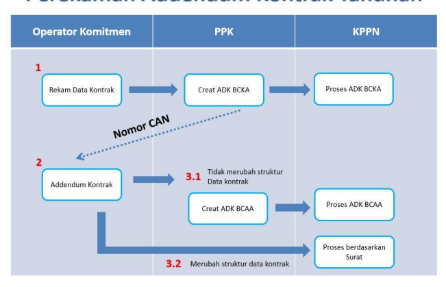
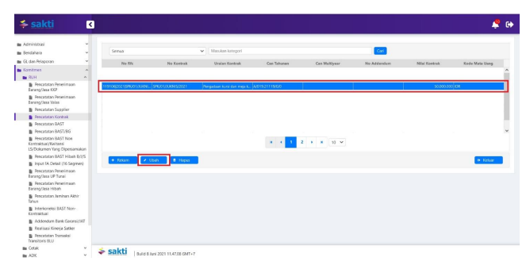
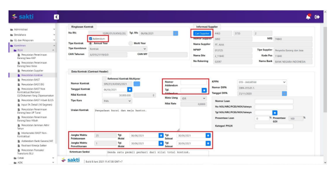
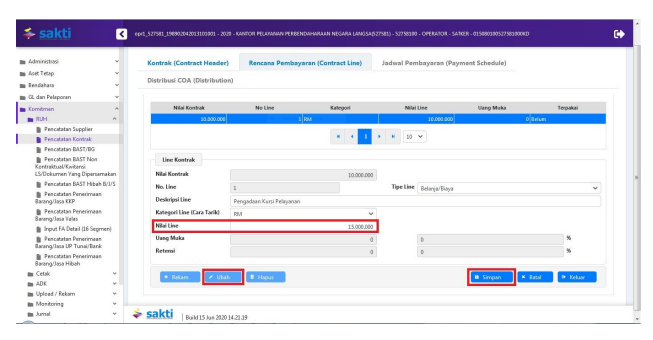
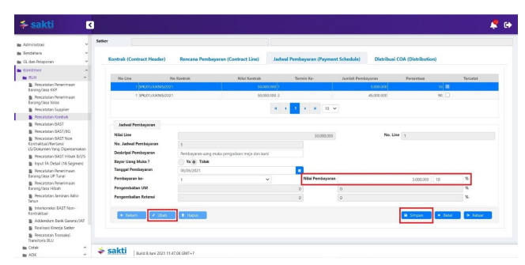
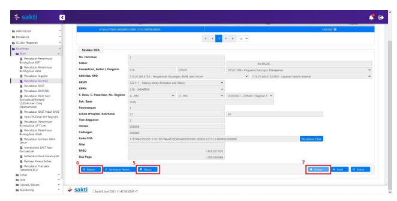
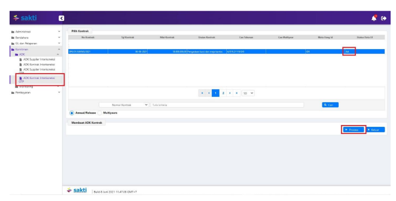
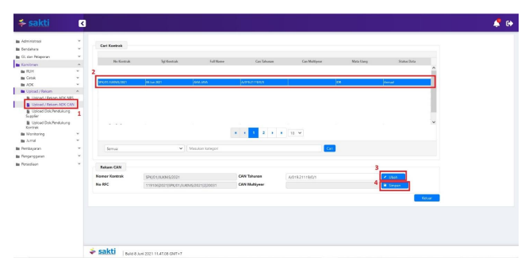

Petunjuk Teknis Aplikasi SAKTI
→
→
PEREKAMAN ADDENDUM KONTRAK
TAHUNAN
→

## I. Informasi Umum A. Deskripsi Transaksi

Menurut Peraturan Menteri Keuangan Nomor 154/PMK.05/2014 tentang Pelaksanaan Sistem Perbendaharaan dan Anggaran Negara, pengertian Kontrak adalah perjajian tertulis antara PPK dengan penyedia barang/jasa atau pelaksana swakelola, dan Data Kontrak adalah informasi terkait dengan perjanjian tertulis antara PPK dengan penyedia barang/jasa atau pelaksana swakelola.

Data Kontrak yang telah terdaftar di SPAN merupakan hasil dari pendaftaran kontrak yang bersumber dari input manual untuk satker yang mempunyai koneksi langsung ke SPAN. Dalam hal Kontrak yang telah terdaftar pada Aplikasi SPAN mengalami perubahan, maka satker dapat melakukan perubahan pada Data Kontrak yang didaftarkan ke KPPN disertai dengan bukti yang kuat.

| Modul                                                                          | KOM                                                                                                                         |                       |          |         |           |           |           |         |
|--------------------------------------------------------------------------------|-----------------------------------------------------------------------------------------------------------------------------|-----------------------|----------|---------|-----------|-----------|-----------|---------|
| Role User                                                                      | OPR, PPK                                                                                                                    |                       |          |         |           |           |           |         |
| Modul Lain terkait                                                             | PEM                                                                                                                         |                       |          |         |           |           |           |         |
| Transaksi yang Tekait                                                          | KOM - RUH Supplier, RUH Kontrak, Perekaman BAST Kontraktual PEM - Catat/Ubah SPP                                            |                       |          |         |           |           |           |         |
| Dokumen Input                                                                  | Data Kontrak                                                                                                                |                       |          |         |           |           |           |         |
| Output                                                                         | Resume                                                                                                                      | Kontrak,              | Data     | Kontrak | dapat     | digunakan | untuk     |         |
| pembuatan SPP Kontraktual                                                      |                                                                                                                             |                       |          |         |           |           |           |         |
| Validasi                                                                       | -                                                                                                                           | Data                  | supplier | yang    | digunakan | dalam     | perekaman | kontrak |
| merupakan data supplier yang sudah mendapatkan NRS (Nomor  Register Supplier); |                                                                                                                             |                       |          |         |           |           |           |         |
| -                                                                              | Data Kontrak awal sudah direkam dan didaftarkan dalam SPAN;                                                                 |                       |          |         |           |           |           |         |
| -                                                                              | Data Kontrak sudah mendapatkan CAN (Commitment Application  Number) atau NRK (Nomor Registrasi Kontrak);                    |                       |          |         |           |           |           |         |
| -                                                                              | Nomor Kontrak tidak dapat dilakukan perubahan;                                                                              |                       |          |         |           |           |           |         |
| -                                                                              | Termin kontrak yang sudah dibayarkan                                                                                        | tidak dapat dilakukan |          |         |           |           |           |         |
| penghapusan.                                                                   |                                                                                                                             |                       |          |         |           |           |           |         |
| Petunjuk Teknis Terkait                                                        | KOM - Petunjuk Perekaman Supplier Tipe 1, 2, dan 7 KOM - Petunjuk Perekaman Kontrak Tahunan PEM - Perekaman SPM Kontraktual |                       |          |         |           |           |           |         |

## B. Informasi Penting Lainnya

1. Perubahan kontrak sebelum didaftarkan dalam aplikasi SPAN akan dianggap sebagai kontrak baru; 2. Perubahan pada 15/16 segmen COA tidak perlu melakukan addendum kontrak; 3. Perubahan supplier dapat dilakukan jika supplier yang akan dipilih telah direkam pada Supplier Address dan Supplier Header yang sama dengan supplier sebelumnya; 4. Nomor Kontrak tidak dapat dilakukan perubahan; 5. Dalam kondisi khusus Addendum Kontrak yang merubah struktur data kontrak, misalnya dari satu termin menjadi dua termin atau sebaliknya, dalam aplikasi SAKTI tetap direkam, namun saat dalam aplikasi SPAN tidak bisa langsung diubah dengan ADK, namun harus menggunakan user Khusus SPAN dalam KPPN (biasanya dengan User Kepala KPPN).

## Ii. Alur Proses

A. **DIAGRAM ALUR PROSES**

## B. Penjelasan Diagram Alur Proses 1. Perekaman Data Kontrak

Untuk proses perekaman data kontrak sampai dengan mendapatkan Nomor CAN mengacu pada Petunjuk Teknis Komitmen tentang Perekaman Data Kontrak.

## 2. Addendum Data Kontrak

1. Login dengan menggunakan *user* operator komitmen. Pilih Modul Komitmen - RUH - Pencatatan 

 Kontrak. Pilih data kontrak yang akan dilakukan addendum, klik tombol 'Ubah' untuk melakukan perubahan atas data kontrak. Beberapa hal yang dapat dilakukan perubahan dengan addendum data kontrak adalah: 
- Jangka waktu kontrak; - Nilai kontrak; - Kompisisi nilai termin pembayaran.

2. Pada tab Kontrak (Contract Header), beberapa informasi yang wajib diisi saat akan melakukan 

 addendum data kontrak adalah: 
- Tanda cek pada *checkbox* Addendum harus terisi; - Informasi pada Nomor Addendum dan Tgl. Addendum harus terisi; - Lakukan pemilihan supplier dengan klik tombol Cari Supplier jika terdapat perubahan supplier yang digunakan (Perubahan supplier dapat dilakukan jika supplier yang akan dipilih telah direkam pada Supplier Address dan Supplier Header yang sama dengan supplier sebelumnya);
- Lakukan perubahan pada Nilai Kontrak jika terdapat perubahan pada nilai kontrak; - Lakukan perubahan pada Jangka Waktu Pelaksanaan dan Jangka Waktu Pemeliharaan jika terdapat perubahan pada waktu pelaksanaan dan pemeliharaan kontrak.

Setelah melakukan perubahan yang diperlukan, klik tombol 'Simpan' untuk melakukan penyimpanan dan kemudian dilanjutkan pada tab Rencana Pembayaran (Contract Line). 3. Pilih baris Contract Line yang akan dilakukan perubahan, kemudian klik tombol 'Ubah'. 

 Perubahan pada tab Rencana Pembayaran (Contract Line) dilakukan dengan berdasarkan:
- Lakukan perubahan pada Nilai Line apabila total jumlah seluruh nilai baris Contract Line belum sama dengan nilai kontrak;
- Lakukan penambahan baris Contract Line baru apabila terdapat perubahan/penambahan kombinasi 12 segmen COA yang digunakan.

Setelah melakukan perubahan yang diperlukan, klik tombol 'Simpan' untuk melakukan penyimpanan dan kemudian dilanjutkan pada tab Jadwal Pembayaran (Payment Schedule). Apabila tidak terdapat perubahan, dapat langsung dilanjutkan pada tab Jadwal Pembayaran (Payment Schedule). 4. Pilih baris termin yang akan dilakukan perubahan, kemudian klik tombol 'Ubah'. Nilai total 

 seluruh termin harus sama dengan nilai baris Contract Line yang menjadi induknya. Selain untuk menyesuaikan nilai nominal termin, dalam tab jadwal pembayaran juga bisa dilakukan, antara lain:
- Perekaman termin baru apabila ada penambahan jumlah termin (dengan klik tombol 
'Rekam' untuk melakukan perekaman termin baru);
- Penghapusan termin apabila terdapat pengurangan termin (dengan klik tombol hapus untuk melakukan penghapusan termin);
- Perubahan tanggal jadwal pembayaran (untuk perubahan tanggal jadwal pembayaran dapat dilakukan dengan melakukan addendum data kontrak, dan dapat dilakukan tanpa melakukan addendum data kontrak - dengan hanya melakukan ubah-simpan pada tab Jadwal Pembayaran (Payment Schedule).

Setelah melakukan perubahan yang diperlukan, klik tombol 'Simpan' untuk melakukan penyimpanan dan kemudian dilanjutkan pada tab Distribusi COA (Distribution). 5. Pilih distribusi COA yang akan dilakukan perubahan, kemudian klik tombol 'Hapus' untuk 

 melakukan perekaman distribusi COA yang baru untuk melakukan penyesuaian nilai sesuai dengan terminya. 6. Klik tombol 'Rekam' untuk melakukan perekaman distribusi COA yang baru; 7. Klik tombol 'Simpan' untuk melakukan penyimpanan.

## 3.1 Addendum Yang Tidak Merubah Struktur Data Kontrak

Addendum yang tidak merubah struktur data kontrak misalnya addendum data kontrak yang tidak 

 merubah jumlah Contract ataupun jumlah termin kontrak. Atas addendum ini, pihak KPPN Mitra Kerja akan memproses addendum kontrak berdasarkan ADK BCAA yang dibentuk dari aplikasi SAKTI. Langkah-langkah untuk membentuk ADK BCAA adalah : 1. Login dengan menggunakan *user* PPK;
2. Masuk pada modul Komitmen - ADK - ADK Kontrak Interkoneksi OTP. Pilih data kontrak dengan status data AA (addendum) kemudian tekan tombol 'Process'.

## 3.2 Addendum Yangmerubah Struktur Data Kontrak

Addendum yang merubah struktur data kontrak misalnya adalah addendum data kontrak yang merubah jumlah Contract Line (misalnya dari satu Contract Line menjadi dua Contract Line ataupun sebaliknya) ataupun jumlah termin kontrak (misalnya dari satu termin menjadi dua termin ataupun sebaliknya). Atas addendum ini, pihak KPPN Mitra Kerja akan memproses addendum kontrak berdasarkan Surat Permintaan Perubahan Data Kontrak yang diajukan secara langsung pada SPAN menggunakan *user* SPAN pada KPPN. Atas addendum ini, pengguna SAKTI perlu melakukan *update* Nomor CAN secara mandiri pada aplikasi SAKTI sesuai dengan Nomor CAN pada SPAN. *Update* Nomor CAN dilakukan menggunakan user operator komitmen. 1. Login dengan menggunakan *user* operator komitmen. Pilih Modul Komitmen - Upload/Rekam–

 Upload/Rekam ADK CAN; 2. Pilih data kontrak yang akan dilakukan *update* Nomor CAN; 3. Klik tombol 'Ubah', lakukan perubahan Nomor CAN sesuai Nomor CAN pada SPAN; 4. Klik tombol 'Simpan' untuk melakukan penyimpanan.