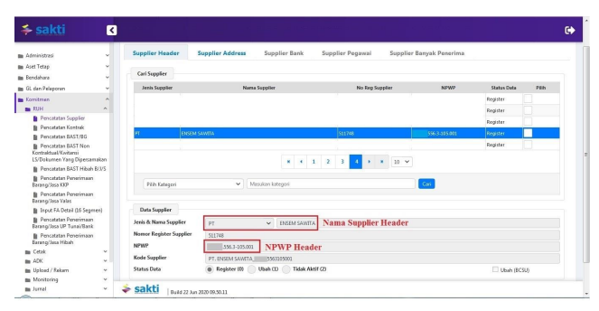
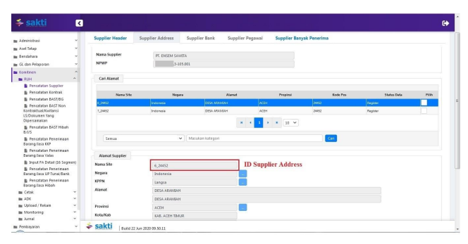
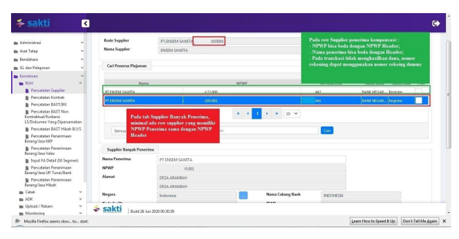
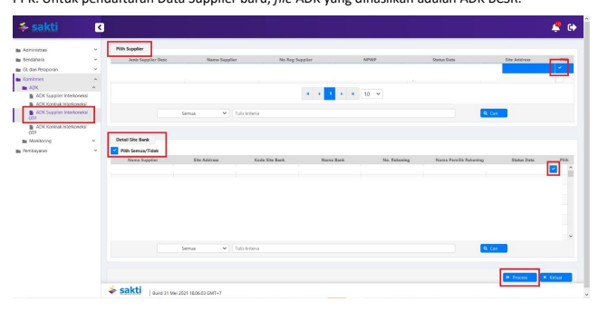

Petunjuk Teknis Aplikasi SAKTI)
→
→
PEREKAMAN DATA SUPPLIER UNTUK
SPMKP KOMPENSASI
DITJEN PERBENDAHARAAN
→
♦

## I. Informasi Umum A. Deskripsi Transaksi

Menurut Peraturan Menteri Keuangan Nomor tentang 154/PMK.05/2014 Pelaksanaan Sistem Perbendaharaan dan Anggaran Negara pengertian Supplier adalah pihak yang berhak menerima pembayaran atas beban APBN, dan Data Supplier adalah informasi terkait dengan pihak yang berhak menerima pembayaran atas beban APBN yang memuat paling kurang informasi pokok, informasi lokasi, dan informasi rekening.

Prinsip dasar interkoneksi SIDJP - SAKTI, adalah memberikan data utama berupa NPWP, nomor rekening WP dan perhitungan SPM KP dari SIDJP ke SAKTI.

| Modul                                                                                                                  | KOM                                                                                                                                                          |                        |                              |          |       |           |       |
|------------------------------------------------------------------------------------------------------------------------|--------------------------------------------------------------------------------------------------------------------------------------------------------------|------------------------|------------------------------|----------|-------|-----------|-------|
| Role User                                                                                                              | OPR, PPK                                                                                                                                                     |                        |                              |          |       |           |       |
| Modul Lain terkait                                                                                                     | PEM                                                                                                                                                          |                        |                              |          |       |           |       |
| Transaksi yang Tekait                                                                                                  | PEM - Catat/Ubah SPP                                                                                                                                         |                        |                              |          |       |           |       |
| Dokumen Input                                                                                                          | Data Supplier                                                                                                                                                |                        |                              |          |       |           |       |
| Output                                                                                                                 | Resume                                                                                                                                                       | Supplier,              | Data                         | Supplier | dapat | digunakan | untuk |
| pembuatan SPP                                                                                                          |                                                                                                                                                              |                        |                              |          |       |           |       |
| Validasi                                                                                                               | -                                                                                                                                                            | Pada SMPKP Kompensasi, | data supplier yang digunakan |          |       |           |       |
| adalah Supplier tipe 6. Sedangkan untuk SPMKP tanpa  Kompensasi, data supplier yang digunakan adalah Supplier  tipe 7. |                                                                                                                                                              |                        |                              |          |       |           |       |
| -                                                                                                                      | Atas satu informasi nomor rekening dari bank yang sama  hanya dapat direkam menjadi satu baris Supplier Bank /  Supplier Pegawai / Supplier Banyak Penerima. |                        |                              |          |       |           |       |
| Petunjuk Teknis Terkait                                                                                                | KOM - Import Supplier (Interkoneksi Langsung SPAN) PEM - Perekaman SPMKP                                                                                     |                        |                              |          |       |           |       |

## B. Informasi Penting Lainnya

1. Nomor rekening *dummy* hanya digunakan untuk transaksi yang tidak menghasilkan transfer dana secara riil; 2. SPM hanya dapat membawa satu informasi Supplier Header dan satu informasi Supplier Address, sehingga seluruh data supplier yang digunakan dalam perekaman SPMKP Kompensasi harus direkam pada satu Supplier Header serta satu Supplier Address.

II.

## Alur Proses

A.   DIAGRAM ALUR PROSES

# Perekaman Data Supplier

Untuk SPM-KP Kompensasi

| Operator Komitmen SAKTI   | Pejabat Pembuat   | KPPN (SPAN)   |
|---------------------------|-------------------|---------------|
| Komitmen                  |                   |               |
| 1                         | 2                 | 3             |
| Rekam Supplier            | Create ADK BCSR   | Proses KPPN   |

## B. Penjelasan Diagram Alur Proses 1. Rekam Supplier

1.1. SUPPLIER HEADER Pada tab Supplier Header terdapat *primary key* : Nama Supplier Header dan NPWP Supplier Header. Kedua data tersebut yang akan membentuk NRS. Jadi apabila terdapat penulisan nama Supplier yang berbeda atau NPWP yang berbeda akan menghasilkan NRS baru. Kedua data dimaksud juga tidak bisa dilakukan perubahan, baik di aplikasi SAKTI maupun aplikasi SPAN. Pertama lakukan perekaman Supplier Header sesuai dengan kebutuhan, dimana nama dan NPWP supplier adalah yang mengajukan permintaan SPMKP. Supplier Header dapat berisikan data perusahaan induk maupun perusahaan cabang, tergantung 

 supplier mana yang mengajukan SPMKP.

## 1.2. Supplier Address

Pada tab Supplier Address terdapat *primary key* : Tipe Supplier, Kode Pos, dan Kode KPPN. Jadi apabila terdapat perbedaan pada salah satu data tersebut, akan membentuk Site Address yang baru. Misalkan satu Header Supplier bisa terdiri dari 2 Site Address, yaitu untuk Supplier tipe 6 dan Supplier tipe 7. Untuk Supplier SPMKP tanpa kompensasi menggunakan Supplier tipe 7, sedangkan untuk SPMKP 

 dengan kompensasi harus menggunakan Supplier tipe 6.

## 1.3. Supplier Banyak Penerima

Pada tab Supplier Banyak Penerima terdapat *primary key* : Negara Asal Bank, Kode Bank, Nama Bank dan Nomor Rekening. Apabila terdapat perbedaan dari empat data dimaksud, maka akan membentuk site bank baru. Data yang mengikuti 4 data *primary key* dimaksud harus konsisten dan tidak boleh berbeda, hal tersebut berlaku untuk aplikasi SAKTI maupun SPAN. Data yang mengikuti 4 data dimaksud antara lain : NPWP Penerima, Nama Penerima, Nama Pemilik Rekening, dll. Khusus untuk supplier SPMKP Kompensasi, dalam tab Supplier Banyak Penerima mempunyai ketentuan : - Dalam tab Supplier Banyak Penerima, harus terdapat satu data penerima yang mempunyai Nama 

 Penerima dan NPWP Penerima sama dengan Supplier Header; - Penerima kompensasi dapat memiliki Nama Penerima dan NPWP Penerima yang berbeda dengan informasi pada Supplier Header; - Untuk supplier penerima kompensasi yang tidak menerima transaksi pembayaran secara riil, dapat menggunakan nomor rekening *dummy* (terkait perekaman nomor rekening dummy, sebaiknya menggunakan nomor yang unik, untuk menghindari nomor yang sama telah digunakan oleh Satker lain; - Jumlah supplier penerima kompensasi dapat direkam lebih dari satu (disesuaikan dengan kebutuhan pembayaran SPMKP). 1.4 INFORMASI TAMBAHAN Sebagai ilustrasi hasil perekaman data supplier untuk SPMKP Kompensasi : Supplier Header PT. ABC_NPWP : 000000000105000 Supplier Address 6_24416 Supplier Banyak Penerima Nama Penerima : PT. ABC_Nomor Rekening 123, NPWP Penerima : 000000000105000 (Data tersebut diatas adalah data minimal yang wajib terisi di tab Supplier Banyak Penerima) Nama Penerima : PT. ABC_Nomor Rekening 456, NPWP Penerima : 000000000105001 (Data Supplier sama dengan NPWP Cabang) Nama Penerima : PT. DEF_Nomor Rekening 789, NPWP Penerima : 000000000105000 Data yang tidak bisa direkam pada tab Supplier Banyak Penerima Nama Penerima : PT. ABC_Nomor Rekening 123, NPWP Penerima : 000000000105000 Nama Penerima : PT. ABC_Nomor Rekening 123, NPWP Penerima : 000000000105001 Data *tersebut tidak bisa direkam di tab supplier banyak penerima, dikarenakan mempunyai* informasi nomor rekening yang sama namun NPWP Penerima yang berbeda, oleh karena itu dimungkinkan untuk menggunakan rekening dummy, apabila hanya untuk keperluan SPM-KP dan tidak digunakan transfer dana secara riil.

## 2. Create Adk Bcsr

Setelah selesai melakukan perekaman informasi Data Supplier, bentuk ADK menggunakan *user* PPK. Untuk pendaftaran Data Supplier baru, *file* ADK yang dihasilkan adalah ADK BCSR.

## 3. Proses Kppn

ADK BCSR yang telah dibuat menggunakan *user* PPK tersebut akan diproses oleh KPPN pada SPAN dengan mengacu pada SOP yang berlaku.