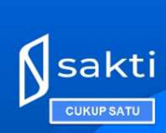
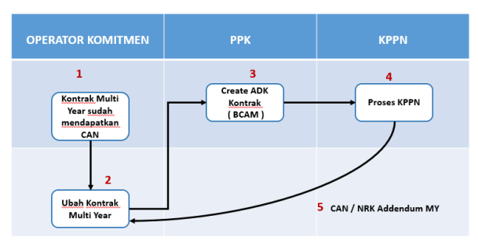
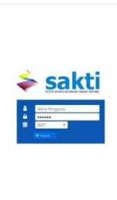
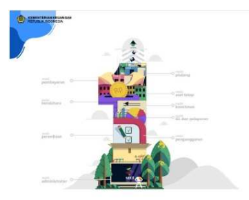
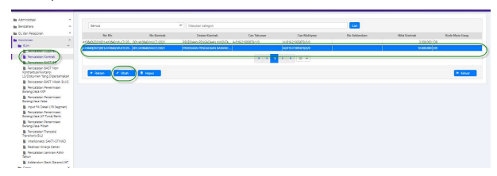
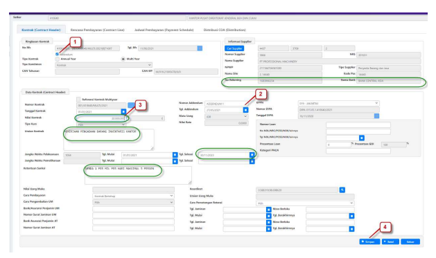
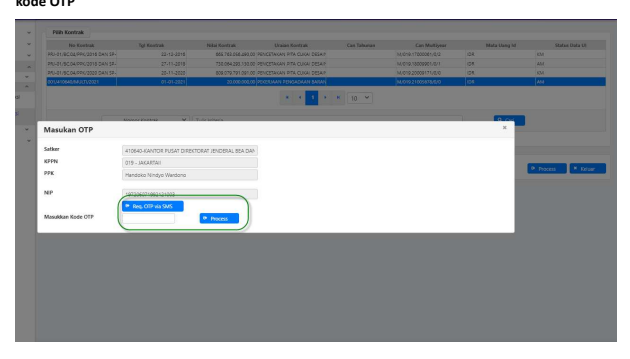
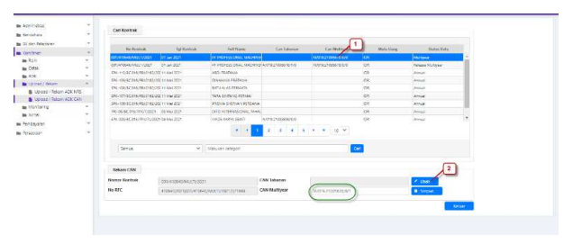

Petunjuk Teknis Aplikasi SAKTI
PËREKAMAN ADDENDUM 
DATA KONTRAK MULTI YEAR 
/ TAHUN JAMAK
→
KEMENTERIAN KEUANGAN RI
ditjen perbendaharaan

## I. Informasi **Umum** A. Deskripsi **Transaksi**

Menurut Peraturan Menteri Keuangan Nomor 154/PMK.05/2014 tentang Pelaksanaan Sistem Perbendaharaan dan Anggaran Negara, pengertian Kontrak adalah perjajian tertulis antara PPK 
dengan penyedia barang/jasa atau pelaksana swakelola, dan Data Kontrak adalah informasi terkait dengan perjanjian tertulis antara PPK dengan penyedia barang/jasa atau pelaksana swakelola.

Addendum / Perubahan Data Kontrak yang dimaksud, adalah perubahan atas data kontrak yang telah terdaftar di SPAN dan sudah mendapatkan CAN (Commitment Aplication Number ) / NRK (Nomor Register Kontrak).

| Modul                   | KOM                                                                                                      |                                                                                                                                                                 |
|-------------------------|----------------------------------------------------------------------------------------------------------|-----------------------------------------------------------------------------------------------------------------------------------------------------------------|
| Role User               | OPR, PPK                                                                                                 |                                                                                                                                                                 |
| Modul Lain terkait      | -                                                                                                        |                                                                                                                                                                 |
| Transaksi yang Tekait   | KOM - RUH Supplier, Perekaman BAST Kontraktual                                                           |                                                                                                                                                                 |
| Dokumen Input           | Data Kontrak                                                                                             |                                                                                                                                                                 |
| Output                  | Resume Kontrak, Karwas Kontrak                                                                           |                                                                                                                                                                 |
| Validasi                | -                                                                                                        | Data supplier yang digunakan dalam perekaman kontrak  merupakan data supplier supplier tipe 2 dan tipe 6  yang sudah mendapatkan NRS (Nomor  Register Supplier) |
| -                       | Data Kontrak awal sudah direkam dan didaftarkan dalam SPAN                                               |                                                                                                                                                                 |
| -                       | Data Kontrak sudah mendapatkan CAN (Commitment Application  Number) atau NRK (Nomor Registrasi Kontrak); |                                                                                                                                                                 |
| -                       | Nomor Kontrak tidak dapat dilakukan perubahan;                                                           |                                                                                                                                                                 |
| -                       | Termin kontrak yang sudah dibayarkan tidak dapat dilakukan  penghapusan.                                 |                                                                                                                                                                 |
| Petunjuk Teknis Terkait | KOM - Petunjuk Perekaman Supplier Tipe 1, 2, dan 7                                                       |                                                                                                                                                                 |

KOM - Petunjuk perekaman Kontrak Multi Year / Tahun Jamak 

## B. Informasi Penting **Lainnya**

1. Perubahan kontrak sebelum didaftarkan dalam aplikasi SPAN akan dianggap sebagai kontrak baru; 2. Perubahan pada 15/16 segmen COA tidak perlu melakukan addendum kontrak; 3. Nomor Kontrak tidak dapat dilakukan perubahan; 4. Dalam kondisi khusus Addendum Kontrak yang merubah struktur data kontrak, misalnya dari satu termin menjadi dua termin atau sebaliknya, dalam aplikasi SAKTI tetap direkam, namun saat dalam aplikasi SPAN tidak bisa langsung diubah dengan ADK, namun harus menggunakan user Khusus SPAN dalam KPPN (biasanya dengan User Kepala KPPN). 

## I.Alur Proses

A.   DIAGRAM ALUR PROSES B.   PENJELASAN DIAGRAM ALUR PROSES

# Perekaman Addendum Data Kontrak Multi Year

## 1. Rekam Kontrak

1. Login dengan menggunakan user operator komitmen.

2. Pilih modul Komitmen - RUH - Pencatatan Kontrak. Untuk melakukan perekaman data kontrak 

baru, klik tombol 'Ubah'. 

3. Perekaman pada tab Kontrak (Contract Header).

Lengkapi isian pada tab Kontrak (Contract Header). Untuk data kontrak tahunan, informasi yang perlu dilengkapi adalah: 
1. Isi *Checkbox* "Addendum" 2. Kolom tanggal dan nomor addendum akan aktif, dan lakukan entri data ;
3. Lakukan perubahan data kontrak Multi Year sesuai kebutuhan; 4. Lakukan penyimpanan apabila sudah selesai melkukan perubahan data ;
Sebagai informasi Tambahan : 
- Data pinjaman atau hibah luar negeri (apabila sumber dana dari Loan/Hibah Luar negeri), 
sifatnya opsional, bisa diisikan apabila diperlukan;
- Kolom Nilai Uang Muka, Cara pengembalian UM, Bank/ AsuransiPenjamin UM, Cara pemotongan retensi dan lain - lain yang masih disable, untuk saat ini masih belum perlu dilakukan pengisian.

- Perekaman data kontrak untuk Kontrak Multi year hanya sebatas sampai Header Kontrak saja.

- Data Kontrak Multi Year belum membebani atau mengurangi pagu Fund Available (FA) dari pagu DIPA yang tersedia, sehingga belum bisa dijadikan dasar pembuatan transaksi tagihan seperti BAST maupun SPP Kontraktual
- Nilai Kontrak Multi years harus lebih besar atau sama dengan nilai kontrak release yang sudah dilakukan perekaman 

## 4. Cetak Resume / Karwas Kontrak Kontrak 

Untuk mencetak Resume kontrak terdapat pada Modul Komitmen > Cetak > Cetak Resume Kontrak. Untuk mencetak Karwas kontrak terdapat pada Modul Komitmen > Monitoring > Karwas Kontrak. 

## 2. Pembuatan Adk Addendum Kontrak Multi Year Oleh Ppk 

Login dengan menggunakan user PPK , pilih pada modul Komitmen - ADK - ADK Kontrak Interkoneksi OTP. 

1. Pilih jenis Kontrak yang Multi Years 2. Pilih Addendum Kontrak Multi years (AM) yang akan dibuatkan ADK 3. Tekan tombol proses untuk pembuatan ADK 
kode OTP 

1. Pilih request OTP via SMS / email (Data OTP kan terkirim ke Handphone pejabat yang sudah didaftarkan) 
2. Masukkan kode OTP yang didapat, kemudian lakukan proses. 

Informasi Tambahan : 
- Untuk Addendum Kontrak Multi Year, file ADK yang dihasilkan adalah file BCAM (Budget Commitment Addendum Multi Year). 

- ADK akan terkirim otomatis langsung ke Portal SPAN yang ada di KPPN mitra kerja 
- Petugas KPPN akan melakukan download ADK dimaksud untuk di Proses di KPPN / SPAN.

## 3. **Proses Di Kppn**

Atas ADK yang telah dibentuk, maka pihak KPPN akan melakukan proses Data Kontrak pada SPAN mengacu pada SOP yang berlaku. 

Apabila pendaftaran data kontrak telah di lakukan approved oleh KPPN, maka akan mengupdate data CAN / NRK pada aplikasi SAKTI atau Operator bisa melakukan perubahan manual, sehingga data kontrak sudah bisa digunakan untuk transaksi berikutnya. Dalam Kondisi Normal, nomor CAN pada aplikasi SAKTI akan terupdate secara otomatis, dengan mengambil data dari OMSPAN secara Scheduler, namun hal Nomor CAN tidak mengupdate otomatis pada aplikasi SAKTI, user juga bisa melakukan perubahan CAN manual. 

Perubahan CAN manual dapat dilakukan pada Aplikasi SAKTI di menu Komitmen > Upload / Rekam > 

Upload Rekam ADK CAN 
Keterangan : 
1. Pilih kontrak Multi year yang sudah dilakukan perubahan dan didaftarkan ke SPAN 
2. Lakukan ubah dan simpan atas nomor CAN sesuai yang didapat dari Aplikasi SPAN Dengan sudah berubahnya Nomor CAN multi Year, maka data kontrak Multi year sudah bisa digunakan untuk transaksi selanjutnya. 