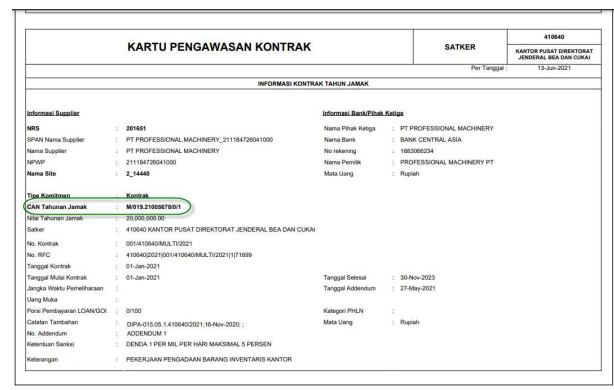

1 
PEREKAMAN **ADDENDUM** 

DATA KONTRAK **RELEASE** 
( KOMITMEN TAHUNAN KONTRAK TAHUN JAMAK )

## I. Informasi **Umum** A. Deskripsi **Transaksi**

Menurut Peraturan Menteri Keuangan Nomor 154/PMK.05/2014 tentang Pelaksanaan Sistem Perbendaharaan dan Anggaran Negara, pengertian Kontrak adalah perjajian tertulis antara PPK 
dengan penyedia barang/jasa atau pelaksana swakelola, dan Data Kontrak adalah informasi terkait dengan perjanjian tertulis antara PPK dengan penyedia barang/jasa atau pelaksana swakelola. 

Addendum / Perubahan Data Kontrak yang dimaksud, adalah perubahan atas data kontrak yang telah terdaftar di SPAN dan sudah mendapatkan CAN (Commitment Aplication Number ) / NRK (Nomor Register Kontrak).

| Modul                   | KOM                                                                                                                           |                                                                                                                                                                 |
|-------------------------|-------------------------------------------------------------------------------------------------------------------------------|-----------------------------------------------------------------------------------------------------------------------------------------------------------------|
| Role User               | OPR, PPK                                                                                                                      |                                                                                                                                                                 |
| Modul Lain terkait      | PEM                                                                                                                           |                                                                                                                                                                 |
| Transaksi yang Tekait   | KOM - RUH Supplier, Perekaman BAST Kontraktual  PEM- Catat / Ubah SPP                                                         |                                                                                                                                                                 |
| Dokumen Input           | Data Kontrak                                                                                                                  |                                                                                                                                                                 |
| Output                  | Resume Kontrak, Karwas Kontrak, Data kontrak bisa digunakan  untuk pembuatan SPP Kontraktual                                  |                                                                                                                                                                 |
| Validasi                | -                                                                                                                             | Data supplier yang digunakan dalam perekaman kontrak  merupakan data supplier supplier tipe 2 dan tipe 6  yang sudah mendapatkan NRS (Nomor  Register Supplier) |
| -                       | Data Kontrak awal sudah direkam dan didaftarkan dalam SPAN                                                                    |                                                                                                                                                                 |
| -                       | Data Kontrak sudah mendapatkan CAN (Commitment Application  Number) atau NRK (Nomor Registrasi Kontrak);                      |                                                                                                                                                                 |
| -                       | Nomor Kontrak tidak dapat dilakukan perubahan;                                                                                |                                                                                                                                                                 |
| -                       | Termin kontrak yang sudah dibayarkan tidak dapat dilakukan  penghapusan.                                                      |                                                                                                                                                                 |
| Petunjuk Teknis Terkait | KOM - Petunjuk Perekaman Supplier Tipe 1, 2, dan 7  KOM - Petunjuk Perekaman kontrak Release  PEM - Perekaman SPM Kontraktual |                                                                                                                                                                 |

## B. Informasi Penting **Lainnya**

1. Perubahan kontrak sebelum didaftarkan dalam aplikasi SPAN akan dianggap sebagai kontrak baru; 2. Perubahan pada 15/16 segmen COA tidak perlu melakukan addendum kontrak; 3. Perubahan supplier dapat dilakukan jika supplier yang akan dipilih telah direkam pada Supplier Address dan Supplier Header yang sama dengan supplier sebelumnya; 4. Nomor Kontrak tidak dapat dilakukan perubahan; 5. Dalam kondisi khusus Addendum Kontrak yang merubah struktur data kontrak, misalnya dari satu termin menjadi dua termin atau sebaliknya, dalam aplikasi SAKTI tetap direkam, namun saat dalam aplikasi SPAN tidak bisa langsung diubah dengan ADK, namun harus menggunakan user Khusus SPAN dalam KPPN (biasanya dengan User Kepala KPPN).

6. Perubahan data kontrak yang perlu dilakukan dan didaftarkan , yaitu apabila terdapat perubahan informasi data kontrak yang tercantum pada data aplikasi. Untuk perubahan dokumen kontrak yang tidak tercantum pada data kontrak di aplikasi, tidak perlu dilakukan perubahan / pendaftaran addendum. Misalkan : perubahan PPK, dimana pada dokumen kontark dilakukan perubahan, namun secara data kontrak pada aplikasi tidak berubah, karena data PPK tidak tercantum pada data kontrak di aplikasi SAKTI 
7. Khusus untuk Kontrak release tahunan, apabila di akhir tahun dari periode tahunan kontrak release masih terdapat sisa kontrak yang belum terealisasi, wajib untuk dilakukan penyesuaian nilai kontark menjadi sebesar realisasi. Hal tersebut dilakukan karena sisa nilai kontrak relaese akan digunakan pada release tahun berikutnya, dan nilai realisasi akan sama dengan nilai dari kontrak Multi year nya. 

## Ii.Alur **Proses**

A. DIAGRAM ALUR **PROSES**

## 1. Rekam **Kontrak**

2. Pilih modul Komitmen - RUH - Pencatatan Kontrak. Untuk melakukan perekaman data kontrak 

baru, klik tombol 'Ubah'. 

Keterangan : 
1. Tanda cek pada checkbox Addendum harus terisi; 2. Kolom tanggal dan nomor addendum akan aktif, dan lakukan pengisan kolom tersebut 3. Lakukan perubahan data header kontrak apabila addendum kontrak merubah informasi yang tercantum pada header kontrak; 4. Lakukan penyimpanan atas perubahan data kontrak release; Sebagai informasi Tambahan : 
- Nilai kontrak Relase harus lebih kecil atau sama dengan sisa kontrak Multi year - Nilai Kontrak release harus lebih besar atau sama dengan total nilai Contract Line nya - Untuk perubahan / Addendum Kontrak dengan nilai kontrak bertambah, maka perubahan dimulai dari Header kontrak hingga distribusi COA
- Untuk perubahan / Addendum Kontrak dengan nilai kontrak berkurang, maka perubahan dimulai dari distribusi COA, hingga perubahan header kontrak

Keterangan : 
1. Lakukan perubahan data Rencana pembayaran / Contract line apabila addendum kontrak merubah informasi yang tercantum pada rencana pembayaran / contract line 2. Lakukan penyimpanan atas perubahan data kontrak release . 

Sebagai informasi Tambahan : 
- Untuk satu baris Contract Line hanya dapat membebani satu kombinasi 12 segmen COA. 

Apabila dalam satu kontrak menggunakan lebih dari satu kombinasi 12 segmen COA, maka baris Contract Line yang direkam lebih dari satu (namun satu Contract Line dapat membebani kombinasi 15/16 segmen COA yang berbeda selagi masih dalam satu 12 segmen COA yang sama); 
- Total jumlah nilai seluruh Contract Line yang ada harus lebih kecil atau sama dengan nilai kontrak - Nilai Contract line harus lebih besar atau sama dengan total jadwal pembayaran ( termin ) yang membebani
- Contract line bisa dilakukan penghapusan beserta keturunannya ( jadwal pembayaran / termin dan distribusi COA yang membebani ) apabila Distribusi COA belum dilakukan pembuatan BAST / belum terdapat realisasi

Keterangan : 
1. Pilih jadwal pembayaran yang akan dilakukan perubahan / penghapusan 2. Pilih "ubah" apabila akan melakukan perubahan data jadwal pembayaran / termin, dengan catatan bahwa distribusi COA yang membebani sudah dilakukan penghapusan terlebih dahulu Pilih "hapus" apabila akan melakukan penghapusan jadwal pembayaran / termin beserta keturunannya (distribusi COA yang membebani) apabila belum terdapat realisasi / belum dilakukan pembuatan BASTatas COA dimaksud. 

3. Lakukan penyimpanan apabila sudah selesai melakukan perubahan jadwal pembayaran / 
termin Sebagai informasi Tambahan : 
- Dalam satu contract line bisa terdapat lebih dari satu jadwal pembayaran / termin dimana Total jumlah nilai seluruh termin yang ada harus lebih kecil atau sama dengan nilai Contract line yang menjadi induknya
- Satu jadwal pembayaran / termin hanya dibebani oleh satu distribusi COA

## 4. Perekaman Distribusi Coa (Distribution)

Distribusi COA tidak bisa dilakukan perubahan, melainkan dilakukan penghapusan apabila 

terdapat perubahan data distribusi COA, dengan catatan belum terdapat realisasi seluruh dari distribusi COA dimaksud Untuk distribusi COA yang sudah terdapat realisasi sebagian, penyesuaian data atas realisasi tersebut dilakukan dengan mekanisme Terminate Termin ( dijelaskan pada Juknis tersendiri ) 
Data Distribusi COA yang telah terhapus dikarenakan adanya penghapusan Contract line ataupun penghapusan jadwal pembayaran, harus dilakukan perekaman kembali Klik tombol 'Rekam' untuk melakukan perekaman distribusi COA. Lengkapi isian struktur 12 segmen COA dengan memilih kombinasi : Satker, Kementerian, Eselon I, Program, Aktivitas, KRO, Akun, KPPN, Sumber Dana, Cara Penarikan, dan Nomor Register. 

Kemudian klik tombol Pendetilan COA untuk melakukan pendetilan 15/16 segmen COA yang digunakan 

Keterangan : 
1. Klik tombol 'Tambah' untuk melakukan perekaman pendetilan 15/16 segmen COA. Klik tombol ikon 'Pencarian' untuk memilih detil RO, Komponen, Sub Komponen (untuk 15 segmen) dan Item (untuk 16 segmen). 

2. Pada menu pop up yang muncul pilih detil detil RO, Komponen, Sub Komponen (untuk 15 segmen) dan Item (untuk 16 segmen). Kemudian klik tombol 'Ok'. 

3. Input nilai sejumlah nilai pada termin. Klik tombol 'Simpan' untuk melakukan penyimpanan. 

4. Lakukan penyimpanan apabila sudah melakukan pendetailan COA 

Untuk mencetak Resume   kontrak terdapat pada Modul Komitmen > Monitoring   > Karwas Kontrak

Login dengan menggunakan user PPK , pilih pada modul Komitmen - ADK - ADK Kontrak Interkoneksi OTP. 

1. Pilih jenis Kontrak yang Kontrak Annual / Release 2. Pilih Addendum Release ( AR ) yang akan dibuatkan ADK 
3. Tekan tombol proses untuk pembuatan ADK 

Keterangan : 
1. Pilih request OTP via SMS / email (Data OTP kan terkirim ke Handphone pejabat yang sudah didaftarkan) 
2. Maukkan kode OTP yang didapat, kemudian lakukan proses. 

Informasi Tambahan : 
- Untuk Addendum Kontrak Release file ADK yang dihasilkan adalah file BCAR (Budget Commitment Addendum Release). 

- ADK akan terkirim otomatis langsung ke Portal SPAN yang ada di KPPN mitra kerja 
- Petugas KPPN akan melakukan download ADK dimaksud untuk di Proses di KPPN / SPAN.

## 3. **Proses Di Kppn**

Atas ADK yang telah dibentuk, maka pihak KPPN akan melakukan proses Data Kontrak pada SPAN
mengacu pada SOP yang berlaku. 

Apabila pendaftaran data kontrak telah di lakukan approved oleh KPPN, maka akan mengupdate data CAN / NRK pada aplikasi SAKTI atau Operator bisa melakukan pencatatan manual, sehingga data kontrak sudah bisa digunakan untuk transaksi berikutnya. Dalam Kondisi Normal, nomor CAN pada aplikasi SAKTI akan terupdate secara otomatis, dengan mengambil data dari OMSPAN secara Scheduler, namun hal Nomor CAN tidak mengupdate otomatis pada aplikasi SAKTI, user juga bisa melakukan pencatatan CAN manual. Pencatatan CAN manual dapat dilakukan pada Aplikasi SAKTI di menu Komitmen > Upload / Rekam > 

Upload Rekam ADK CAN Keterangan : 1. Lakukan perubahan nomor CAN pada kolom CAN Tahunan untuk kontrak Release, sesuai dengan 

nomor CAN yang di dapat dari KPPN / SPAN, dan penulisan nomor CAN merupakan Case sensitive , 
dimana harus sama persis dengan data SPAN 
2. Tekan Tombol simpan, sehingga perubahan nomor CAN Release akan terisi dan tersimpan Dengan sudah tercatatnya Nomor CAN Release, maka data kontrak Release sudah bisa digunakan untuk transaksi selanjutnya ( Pembuatan BAST dan pembuatan SPP kontraktual) 