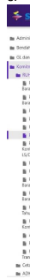
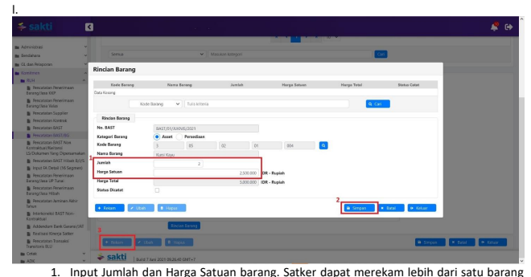

.

Petunjuk Teknis Aplikasi SAKTI
♦
→
PEREKAMAN BAST KONTRAKTUAL 
♦
→

## I. Informasi Umum A. Deskripsi Transaksi

Perekaman BAST Kontraktual merupakan *trigger* dalam perekaman SPP Kontraktual.

| Modul                   | KOM                                                                                             |                                |
|-------------------------|-------------------------------------------------------------------------------------------------|--------------------------------|
| Role User               | OPR                                                                                             |                                |
| Modul Lain terkait      | PEM                                                                                             |                                |
| Transaksi yang Tekait   | PEM - Catat/Ubah SPP                                                                            |                                |
| Dokumen Input           | BAST Kontraktual                                                                                |                                |
| Output                  | BAST Kontraktual digunakan menjadi dasar pembuatan SPP  Kontraktual                             |                                |
| Validasi                | -                                                                                               | Data Pagu DIPA sudah tersedia; |
| -                       | Data kontrak yang dapat digunakan adalah data kontrak yang telah  tercatat Nomor CAN;           |                                |
| -                       | Input nilai desimal tidak dapat dilakukan untuk nilai harga yang  menggunakan mata uang Rupiah; |                                |
| -                       | BAST yang telah dilakukan pendetilan barang tidak dapat dilakukan  ubah / hapus;                |                                |
| -                       | BAST yang pembayaranya telah menjadi SP2D tidak dapat dilakukan  ubah / hapus.                  |                                |
| Petunjuk Teknis Terkait | KOM - Petunjuk Perekaman Supplier Tipe 1, 2, dan 7 PEM - Perekaman SPM Kontraktual              |                                |

## B. Informasi Penting Lainnya

1. Perekaman BAST Kontraktual mengakomodir penginputan kode barang; 2. Perekaman lebih dari satu barang dapat dilakukan dalam satu BAST; 3. Pendetilan 15 Segmen sampai dengan Sub Komponen sementara pendetilan 16 Segmen sampai dengan Item dilakukan pada saat perekaman data; 4. kontrak Perekaman RSPP dilakukan dengan melakukan Pendetilan COA yang terbawa dari Pendetilan COA pada data kontrak; 5. Diperlukan koordinasi antar modul untuk menghindari kesalahan pencatatan barang. Atas BAST yang telah dilakukan pendetilan barang tidak dapat dilakukan perubahan dan/atau penghapusan.

II.

## Alur Proses

A.   DIAGRAM ALUR PROSES

# Perekaman Bast Kontraktual

## B.   Penjelasan Diagram Alur Proses 1. Perekaman Data Kontrak

Untuk proses perekaman data kontrak sampai dengan mendapatkan Nomor CAN mengacu pada Petunjuk Teknis Komitmen tentang Perekaman Data Kontrak.

## 2. Perekaman Bast Kontraktual

Pencatatan BAST/BG;
2. Klik tombol 'Tambah' untuk melakuan perekaman BAST Kontraktual yang baru.

2. Pada menu pop up yang muncul, kembali klik tombol ikon pencarian untuk mencari data kontrak yang akan digunakan.

c. 

1. Satker dapat melakukan pencarian data kontrak yang akan digunakan menggunakan filter 

pencarian berdasarkan No Kontrak; 2. Pilih data kontrak yang akan digunakan; 3. Klik tombol 'Pilih' d.

1. Pilih termin yang akan digunakan dalam perekaman BAST Kontraktual. Termin yang akan muncul pada menu *pop up* ini apabila data kontrak telah mendapatkan Nomor CAN;
2. Klik tombol 'Pilih'.

e. 

1. Lakukan perekaman Nomor BAST, Tanggal BAST dan Progress Pekerjaan atas termin yang akan dibayarkan; 2. Untuk melakukan pendetilan COA 15/16 segmen, klik tombol 'Pendetilan COA'.

 2. Klik tombol ikon 'Pencarian' untuk memilih detil RO, Komponen, Sub Komponen (untuk 15 segmen) dan Item (untuk 16 segmen) yang digunakan. Simulasi pada Juknis ini menggunakan satker sampai pendetilan 15 segmen.

g.

1. Pada menu *pop up* yang muncul, pilih detil RO, Komponen, Sub Komponen yang akan digunakan; 2. Kemudian klik tombol 'Ok'.

 i.

 2. Apabila BAST akan menghasilkan Aset/Jasa Dikapitalisasi Aset, satker wajib melakukan pendetilan atas Rincian Barang.

2. Klik tombol ikon 'Pencarian' untuk memilih Kode Barang yang diperoleh.

k. 

barang, baik menggunakan Nama Barang atau Kode Barang; 2. Pilih kode barang yang sesuai dengan kebutuhan; 3. Klik tombol 'Pilih'.

dalam satu BAST;
2. Apabila perekaman telah selesai dilakukan, lakukan penyimpanan. Kemudian satker dapat keluar dari menu tersebut dengan klik tombol 'Keluar';
3. Klik tombol 'Simpan' untuk melakukan penyimpanan BAST Kontraktual.

## 3. Perekaman Spp Kontraktual

Petunjuk perekam SPP Kontraktual mengacu pada Petunjuk Teknis Pembayaran tentang Perekaman Perekaman SPM Kontraktual.