.

Petunjuk Teknis Aplikasi SAKTI
♦
→
PEREKAMAN BAST NON KONTRAKTUAL
♦
→

## I. Informasi Umum A. Deskripsi Transaksi

Perekaman BAST Non Kontraktual merupakan *trigger* dalam perekaman SPP LS Non Kontraktual.

| Modul                   | KOM                                                                                             |                                |
|-------------------------|-------------------------------------------------------------------------------------------------|--------------------------------|
| Role User               | OPR                                                                                             |                                |
| Modul Lain terkait      | PEM                                                                                             |                                |
| Transaksi yang Tekait   | PEM - Catat/Ubah SPP                                                                            |                                |
| Dokumen Input           | BAST Non Kontraktual                                                                            |                                |
| Output                  | BAST Non Kontraktual digunakan menjadi dasar pembuatan SPP  LS Non Kontraktual                  |                                |
| Validasi                | -                                                                                               | Data Pagu DIPA sudah tersedia; |
| -                       | Supplier yang dapat digunakan adalah supplier yang sudah  mendapatkan NRS;                      |                                |
| -                       | Input nilai desimal tidak dapat dilakukan untuk nilai harga yang  menggunakan mata uang Rupiah; |                                |
| -                       | BAST yang telah dilakukan pendetilan barang tidak dapat dilakukan  ubah / hapus;                |                                |
| -                       | BAST yang pembayaranya telah menjadi SP2D tidak dapat dilakukan  ubah / hapus.                  |                                |
| Petunjuk Teknis Terkait | KOM - Petunjuk Perekaman Supplier Tipe 1, 2, dan 7 PEM - Perekaman SPM Non Gaji dengan BAST     |                                |

## B. Informasi Penting Lainnya

1. Perekaman BAST Non Kontraktual mengakomodir penginputan kode barang; 2. Perekaman satu BAST untuk satu kombinasi 12 Segmen COA; 3. Perekaman lebih dari satu barang dapat dilakukan dalam satu BAST; 4. Perekaman RSPP dilakukan dengan melakukan Pendetilan COA; 5. Pendetilan 15 Segmen sampai dengan Sub Komponen sementara pendetilan 16 Segmen sampai dengan Item; 6. Diperlukan koordinasi antar modul untuk menghindari kesalahan pencatatan barang.

I.

## Alur Proses

A.   DIAGRAM ALUR PROSES

# Perekaman Bast Non Kontraktual

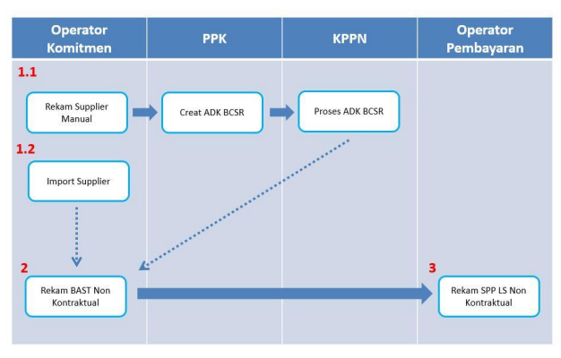

## B.   Penjelasan Diagram Alur Proses 1.1. Proses Perekaman Supplier Secara Manual

Untuk proses perekaman supplier baru yang akan digunakan dalam BAST Non Kontraktual secara manual mengacu pada Petunjuk Rekam Kontrak mengacu pada Petunjuk Teknis Komitmen tentang Perekaman Supplier.

## 1.2. Proses Import Supplier

Untuk proses import supplier yang akan digunakan dalam BAST Non Kontraktual mengacu pada Petunjuk Teknis Import Supplier Interkoneksi Langsung SPAN.

## 2. Perekaman Bast Non Kontraktual

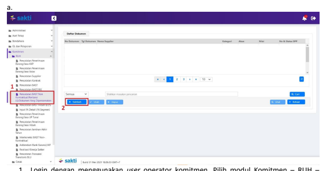

1. Login dengan menggunakan *user* operator komitmen. Pilih modul Komitmen - RUH –
Pencatatan BAST Non Kontraktual/Kwitansi LS/Dokumen Yang Dipersamakan; 2. Klik tombol 'Tambah' untuk melakuan perekaman BAST Non Kontraktual yang baru.

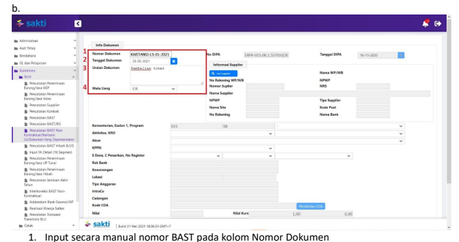

2. Pada kolom Tanggal Dokumen, pilih tanggal dokumen; 3. Input secara manual uraian pada kolom Uraian Dokumen; 4. Pada kolom mata uang, satker dapat memilih IDR untuk mata uang Rupiah.

c. 

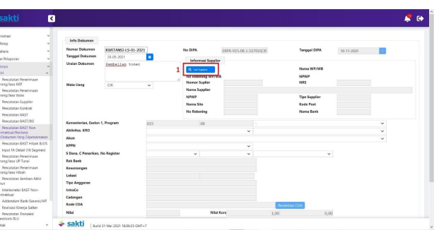

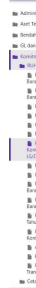

1. Klik tombol 'Cari Supplier' untuk memilih supplier yang akan digunakan. Supplier yang dapat digunakan adalah supplier yang sudah mendapatkan NRS.

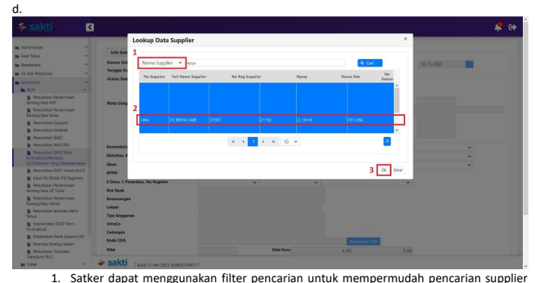

yang akan digunakan (opsional);
2. Pilih supplier yang akan digunakan; 3. Klik tombol 'Ok'.

e. 

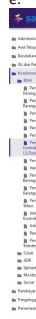

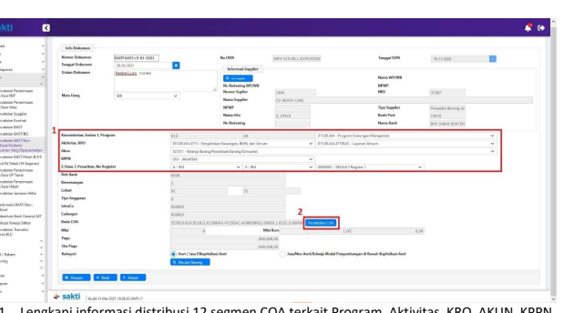

1. Lengkapi informasi distribusi 12 segmen COA terkait Program, Aktivitas, KRO, AKUN, KPPN, 
Sumber Dana, Cara Penarikan, dan Nomor Register; 2. Untuk melakukan pendetilan COA 15/16 segmen, klik tombol 'Pendetilan COA'.

f.

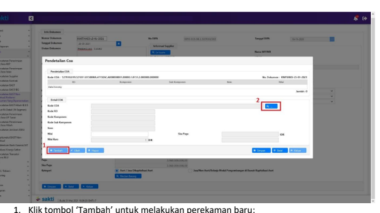 2. Klik tombol ikon 'Pencarian' untuk memilih detil RO, Komponen, Sub Komponen (untuk 15 segmen) dan Item (untuk 16 segmen) yang digunakan. Simulasi pada Juknis ini menggunakan satker sampai pendetilan 15 segmen.

g.

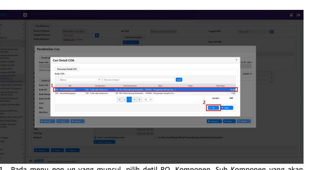

1. Pada menu *pop up* yang muncul, pilih detil RO, Komponen, Sub Komponen yang akan digunakan; 2. Kemudian klik tombol 'Ok'.

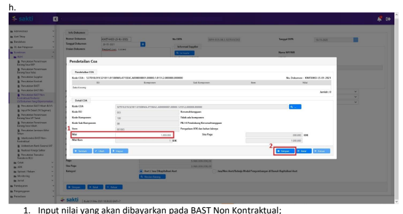

2. Klik tombol 'Simpan'. Apabila perekaman detil telah selesai klik tombol 'Keluar'.

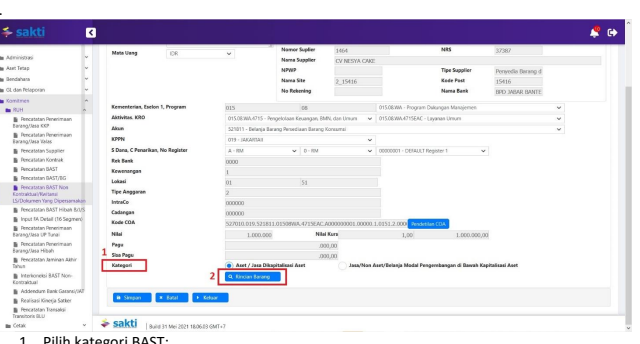

1.   Pilih kategori BAST;
2.  Apabila BAST akan menghasilkan Aset/Jasa Dikapitalisasi Aset, satker wajib melakukan pendetilan atas Rincian Barang.

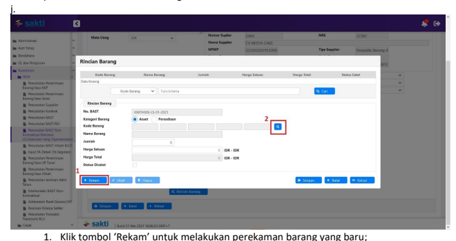

2. Klik tombol ikon 'Pencarian' untuk memilih Kode Barang yang diperoleh.

k. 

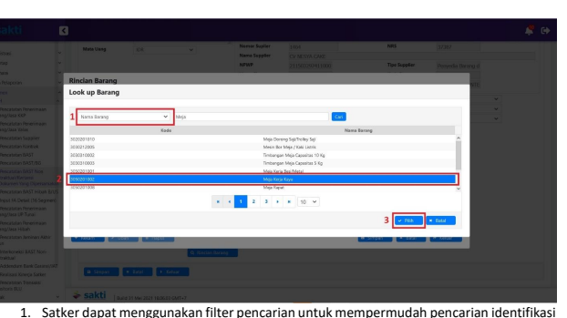

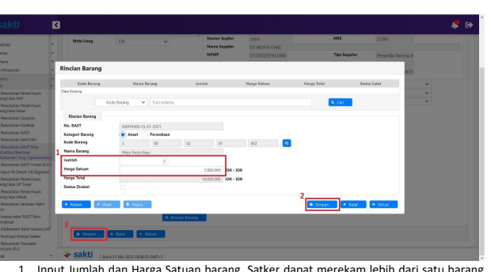

barang, baik menggunakan Nama Barang atau Kode Barang; 2. Pilih kode barang yang sesuai dengan kebutuhan; 3. Klik tombol 'Pilih'.

l. 

1. Input Jumlah dan Harga Satuan barang. Satker dapat merekam lebih dari satu barang dalam satu BAST;
2. Apabila perekaman telah selesai dilakukan, lakukan penyimpanan. Kemudian satker dapat keluar dari menu tersebut dengan klik tombol 'Keluar';
3. Klik tombol 'Simpan' untuk melakukan penyimpanan BAST Non Kontraktual.

l. Untuk lampiran pendetilan COA 15/16 segmen pada BAST Non Kontraktual pada menu Komitmen - Cetak - Cetak Resume BAST Non Kontrak.

## 3. Perekaman Spp Ls Non Kontraktual

Petunjuk perekam SPP LS Non Kontraktual mengacu pada Petunjuk Teknis Perekaman Perekaman SPM Non Gaji dengan BAST.