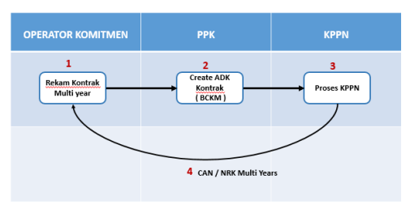
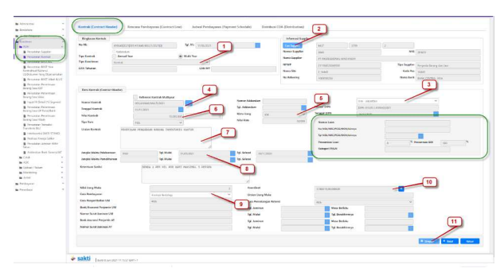

Petunjuk Teknis Aplikasi SAKTI
→
PEREKAMAN DATA KONTRAK MULTI
YEAR / TAHUN JAMAK
kementerian keuangan ri

## Ditjen Perbendaharaan

→

## I. Informasi **Umum** A. Deskripsi **Transaksi**

Menurut Peraturan Menteri Keuangan Nomor 154/PMK.05/2014 tentang Pelaksanaan Sistem Perbendaharaan dan Anggaran Negara, pengertian **Kontrak adalah perjajian tertulis antara PPK** dengan penyedia barang/jasa atau pelaksana swakelola, dan Data Kontrak adalah informasi terkait dengan perjanjian tertulis antara PPK dengan penyedia barang/jasa atau pelaksana swakelola.

Kontrak Tahun Jamak adalah Kontrak yang pelaksanaan pekerjaannya untuk masa lebih dari 1 (satu) 
tahun anggaran atas beban anggaran.

| Modul                   | KOM                                                                                                                                                            |
|-------------------------|----------------------------------------------------------------------------------------------------------------------------------------------------------------|
| Role User               | OPR, PPK                                                                                                                                                       |
| Modul Lain terkait      | -                                                                                                                                                              |
| Transaksi yang Tekait   | KOM - RUH Supplier, Perekaman BAST Kontraktual                                                                                                                 |
| Dokumen Input           | Data Kontrak                                                                                                                                                   |
| Output                  | Resume Kontrak,                                                                                                                                                |
| Validasi                | Data supplier yang digunakan dalam perekaman kontrak  merupakan data supplier supplier tipe 2 dan tipe 6 yang sudah  mendapatkan NRS (Nomor Register Supplier) |
| Petunjuk Teknis Terkait | KOM - Petunjuk Perekaman Supplier Tipe 1, 2, dan 7                                                                                                             |

## B. Informasi Penting **Lainnya**

1. Kontrak Tahun Jamak / Multi Year adalah Kontrak yang pelaksanaan **pekerjaanya Lebih** 
dari 1 (satu) tahun masa anggaran ; 
2. **Data kontrak yang dapat digunakan pada perekaman transaksi lanjutan adalah data kontrak** 
yang telah memiliki Nomor CAN (Commitment Aplication Number) / NRK (Nomor Register Kontrak). 

## Alur Proses Ii.

A.   DIAGRAM ALUR PROSES

# Perekaman Data Kontrak Multi Year

B.   PENJELASAN DIAGRAM ALUR PROSES

## 1. Rekam Kontrak

1. Login dengan menggunakan user operator komitmen.

2. **Pilih modul Komitmen - RUH - Pencatatan Kontrak. Untuk melakukan perekaman data kontrak** 

baru, klik tombol 'Rekam'. 

Lengkapi isian pada tab Kontrak (Contract Header). **Untuk data kontrak tahunan, informasi yang**
perlu dilengkapi adalah: 
1. **Tipe kontrak (pilih Multi Year untuk perekaman data kontrak tahun Jamak / Multi Year);** 
Tipe komitmen (pilih Kontrak untuk perekaman data kontrak tahun Jamak / Multi Year); 
2. **Supplier ( supplier yang dapat digunakan adalah supplier tipe 2 dan tipe 6 yang telah** 
mendapatkan NRS );
3. Kode KPPN sebagai kantor bayar, berkaitan juga dengan kode KPPN pada supplier yang dipilih; 4. **Nomor Kontrak (free text) ;** 5. Mata uang ( untuk kontrak dengan lebih dari satu mata uang yang **digunakan, direkam** 
sebagai data kontrak terpisah );
6. **Nilai Kontrak ( Nilai kontrak merupakan Nilai Kontrak total Multi year untuk beberapa tahun, dan** 
tidak terikat dengan ketersediaan FA dari DIPA tahun anggaran berjalan)
7. **Uraian pekerjaan (free text) ;** 
8. **Jangka Waktu Pelaksanaan (tanggal antara mulai kontrak dan selesai kontrak harus lebih dari satu** 
tahun anggaran) ;
9. **Cara pembayaran ( pilih cara pembayaran dari kontrak bertahap / sekaligus )** 
10. **Koordinat ( diisi koordinat dimana kontrak tersebut dilaksanakan )** 
11. **Simpan (apabila sudah dilakukan pengisian semua kolom isian yang dibutuhkan, silahkan** 
lakukan penyimpanan Sebagai informasi Tambahan : 
- **Data pinjaman atau hibah luar negeri (apabila sumber dana dari Loan/Hibah Luar negeri),** 
sifatnya opsional, bisa diisikan apabila diperlukan;
- **Kolom Nilai Uang Muka, Cara pengembalian UM, Bank/ AsuransiPenjamin UM, Cara pemotongan** 
retensi dan lain - lain yang masih disable, untuk saat ini masih belum perlu dilakukan pengisian.

- **Perekaman data kontrak untuk Kontrak Multi year hanya sebatas sampai Header Kontrak saja.** - **Data Kontrak Multi Year belum membebani atau mengurangi pagu Fund Available (FA) dari pagu** 
DIPA yang tersedia, sehingga belum bisa dijadikan dasar pembuatan transaksi tagihan seperti BAST maupun SPP Kontraktual

## 4. Cetak Resume Kontrak 

Untuk mencetak Resume kontrak terdapat pada Modul Komitmen > Cetak > Cetak Resume Kontrak.

2. PEMBUATAN ADK KONTRAK MULTI YEAR OLEH PPK 

Login dengan menggunakan user PPK , pilih pada modul Komitmen - ADK - ADK Kontrak Interkoneksi OTP. 

1. **Pilih jenis Kontrak yang Multi Years** 
2. **Pilih Kontrak Multi years (KM) yang akan dibuatkan ADK** 
3. Tekan tombol proses untuk pembuatan ADK 

Keterangan : 1. **Pilih request OTP via SMS / email (Data OTP kan terkirim ke Handphone pejabat yang sudah** 
didaftarkan) 
2. **Maukkan kode OTP yang didapat, kemudian lakukan proses.** 
Informasi Tambahan : 
- **Untuk Kontrak Multi Year, file ADK yang dihasilkan adalah file BCKM (Budget Commitment Kontrak** 
Multi Year). 

- **ADK akan terkirim otomatis langsung ke Portal SPAN yang ada di KPPN mitra kerja** 
- **Petugas KPPN akan melakukan download ADK dimaksud untuk di Proses di KPPN / SPAN.**

## 3. **Proses Di Kppn**

Atas ADK yang telah dibentuk, maka pihak KPPN akan melakukan proses Data Kontrak pada SPAN mengacu pada SOP yang berlaku. 

Apabila pendaftaran data kontrak telah di lakukan approved oleh KPPN, maka akan mengupdate data CAN / NRK pada aplikasi SAKTI atau Operator bisa melakukan pencatatan manual, sehingga data kontrak sudah bisa digunakan untuk transaksi berikutnya. Dalam Kondisi Normal, nomor CAN pada aplikasi SAKTI akan terupdate secara otomatis, dengan mengambil data dari OMSPAN secara Scheduler, namun hal Nomor CAN tidak mengupdate otomatis pada aplikasi SAKTI, user juga bisa melakukan pencatatan CAN manual. 

Pencatatan CAN manual dapat dilakukan pada Aplikasi SAKTI di menu Komitmen > Upload / Rekam > Upload Rekam ADK CAN 
Keterangan : 

1. **Isikan nomor CAN pada kolom CAN Multi Year untuk kontrak Multi year, sesuai dengan nomor CAN** 

yang di dapat dari KPPN / SPAN, dan penulisan nomor CAN merupakan Case sensitive , dimana harus sama persis dengan data SPAN 
2. **Tekan Tombol simpan, sehingga nomor CAN Multi year akan terisi dan tersimpan** 
Dengan sudah tercatatnya Nomor CAN multi Year, maka data kontrak Multi year sudah bisa digunakan untuk transaksi selanjutnya (Pembuatan Kontrak Released Tahunan/ Komitmen Tahunan Kontrak Tahun Jamak ) 