Petunjuk Teknis Aplikasi SAKTI
•
PEREKAMAN DATA KONTRAK RELEASE
( KOMITMEN TAHUNAN KONTRAK TAHUN JAMAK )
→
kementerian keuangan ri ditjen perbendaharaan

## I. Informasi **Umum** A. Deskripsi **Transaksi**

Menurut Peraturan Menteri Keuangan Nomor 154/PMK.05/2014 tentang Pelaksanaan Sistem Perbendaharaan dan Anggaran Negara, pengertian **Kontrak adalah perjajian tertulis antara PPK** dengan penyedia barang/jasa atau pelaksana swakelola, dan Data Kontrak adalah informasi terkait dengan perjanjian tertulis antara PPK dengan penyedia barang/jasa atau pelaksana swakelola. 

Komitmen Tahunan Kontrak Tahun Jamak adalah komitmen tahun tunggal sebagai bagian dari Kontrak Tahun Jamak.

| Modul                   | KOM                                                                                          |                                                                                                                                                                 |
|-------------------------|----------------------------------------------------------------------------------------------|-----------------------------------------------------------------------------------------------------------------------------------------------------------------|
| Role User               | OPR, PPK                                                                                     |                                                                                                                                                                 |
| Modul Lain terkait      | PEM                                                                                          |                                                                                                                                                                 |
| Transaksi yang Tekait   | KOM - RUH Supplier, Perekaman BAST Kontraktual  PEM- Catat / Ubah SPP                        |                                                                                                                                                                 |
| Dokumen Input           | Data Kontrak                                                                                 |                                                                                                                                                                 |
| Output                  | Resume Kontrak, Karwas Kontrak, Data kontrak bisa digunakan  untuk pembuatan SPP Kontraktual |                                                                                                                                                                 |
| Validasi                | -                                                                                            | Data supplier yang digunakan dalam perekaman kontrak  merupakan data supplier supplier tipe 2 dan tipe 6  yang sudah mendapatkan NRS (Nomor  Register Supplier) |
| -                       | Data pagu DIPA terkait dengan kontrak tersebut sudah  tersedia                               |                                                                                                                                                                 |
| Petunjuk Teknis Terkait | KOM - Petunjuk Perekaman Supplier Tipe 1, 2, dan 7                                           |                                                                                                                                                                 |

PEM - Perekaman SPM Kontraktual

## B. Informasi Penting **Lainnya**

1. **Kontrak Release/Komitmen Tahunan Kontrak Tahun amak adalah Kontrak yang pelaksanaan** 
pekerjaanya Lebih dari 1 (satu) tahun masa anggaran ; 
2. **Data kontrak yang dapat digunakan pada perekaman transaksi lanjutan adalah data kontrak** 
yang telah memiliki Nomor CAN (Commitment Aplication Number) / NRK (Nomor Register Kontrak). 

## I.Alur Proses

A.   DIAGRAM ALUR PROSES

# Perekaman Data Kontrak Release Tahunan

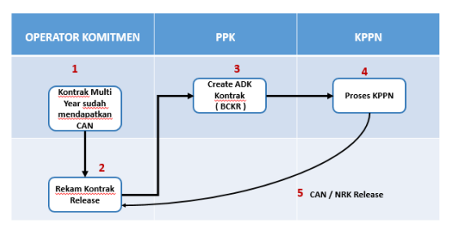

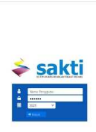

B.   PENJELASAN DIAGRAM ALUR PROSES
1. REKAM KONTRAK
1. Login dengan menggunakan user operator komitmen.

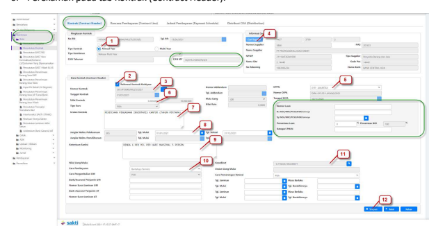

Lengkapi isian pada tab Kontrak (Contract Header). **Untuk data kontrak tahunan, informasi yang** perlu dilengkapi adalah: 
1. **Tipe kontrak (pilih Annual Year untuk perekaman data kontrak Release);** 
Tipe komitmen (pilih Release Multi Year untuk perekaman data kontrak Release); 
2. **Isi Cek list "Referensi Kontrak Multi Year", kemudian pilih Kontrak / CAN multi year yang akan** 
menjadi induk dari kontrak release tersebut; 3. **Nomor Kontrak (Informasi Nomor kontrak akan terisi otomatis mengambil data Kontrak multi year,** 
saat setelah pilih kontrak Multi year pada saat mengisi cek list "referensi kontrak multi year");
4. Cari Supplier (Informasi Supplier akan terisi otomatis mengambil data Kontrak multi year, saat 2. **Pilih modul Komitmen - RUH - Pencatatan Kontrak. Untuk melakukan perekaman data kontrak** 

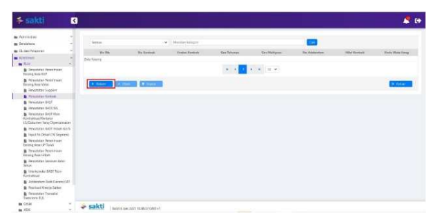

baru, klik tombol 'Rekam'. 

setelah pilih kontrak Multi year pada saat mengisi cek list "referensi kontrak multi year") ;
5. KPPN **(Informasi KPPN akan terisi otomatis mengambil data Kontrak multi year, saat setelah pilih** 
kontrak Multi year pada saat mengisi cek list "referensi kontrak multi year");
6. **Nilai Kontrak ( Nilai kontrak merupakan Nilai Kontrak Tahunan yang akan membebani ketersediaan** 
FA dari DIPA tahun anggaran berjalan, Total dari nilai kontrak relaese harus lebih kecil atau sama dengan kontrak Multi year nya)
7. **Uraian pekerjaan (free text) ;** 8. **Jangka Waktu Pelaksanaan (tanggal antara mulai kontrak akan disesuaikan sama dengan tanggal** 
mulai kontrak multi year, dan tanggal selesai kontrak pada relaese pertama / release pada tahun sebelum berakhirnya kontrak akan otomatis terisi tanggal akhir dari Tahun anggaran. Dan pada tahun berakhirnya kontrak, tanggal selesai akan terisi tanggal berakhirnya kontrak) ;
9. **Ketentuan Sanksi ( diisi Sanksi yang tertuang dalam dokumen kontrak, dan hindari penggunaan** 
kode ASCII seperti ‰, ⅓, dan lain lain, serta hindari copy paste dari dokumen lain.

10. **Cara pembayaran ( pilih cara pembayaran dari kontrak bertahap / sekaligus )** 
11. **Koordinat ( diisi koordinat dimana kontrak tersebut dilaksanakan )** 
12. **Simpan (apabila sudah dilakukan pengisian semua kolom isian yang dibutuhkan, silahkan** 
lakukan penyimpanan Sebagai informasi Tambahan : 
- **Data pinjaman atau hibah luar negeri (apabila sumber dana dari Loan/Hibah Luar negeri),** 
sifatnya opsional, bisa diisikan apabila diperlukan;
- **Kolom Nilai Uang Muka, Cara pengembalian UM, Bank/ AsuransiPenjamin UM, Cara pemotongan** 
retensi dan lain - lain yang masih disable, untuk saat ini masih belum perlu dilakukan pengisian.

- **Data Kontrak Multi Year belum membebani atau mengurangi pagu Fund Available (FA) dari pagu** 
DIPA yang tersedia, namun untuk Kontrak Relaese sudah membebani FA dari pagu DIPA dan akan dijadikan dasar pembuatan transaskis tagihan, seperti BAST, ataupun SPP Kontraktual 

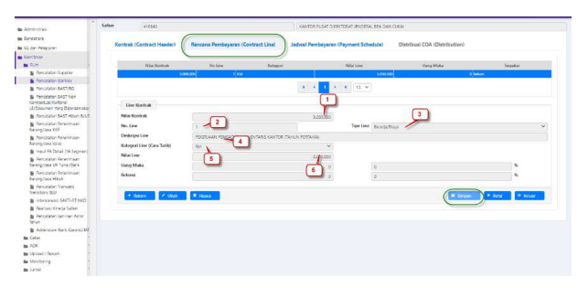

## Keterangan :

1. **Nilai Kontrak (akan terisi otomatis sebesar nilai kontrak release)** 
2. **No Line (berisikan nomor urut line kontrak. Apabila satu Kontrak membebani lebih dari satu** 
distribusi COA / terdapat salah satu yang berbeda dari 12 segmen COA (Chart of Accounts) , maka Nomor line bisa lebih dari satu, namun apabila hanya membebani satu distribusi COA, 
maka nomor line hanya cukup 1 baris) 
3. **Tipe Line (default memeilih belanja / Biaya)** 
4. **Deskripsi Line (free text)** 
5. **Kategori Line / Cara Tarik ( disesuaikan dengan cara Tarik terkait dengan COA yang akan** 
dipilih dan tercantum pada DIPA) misalkan RM(Rupiah Murni), RMP (Rupiah Murni Pendamping), PL (Pembayaran Langsung), RK (Rekening Khusus) dan lain lain. 

6. **Nilai Line (apabila satu kontrak hanya membebani satu distribusi COA maka nilai line bearnya** 
sama dengan nilai Kontrak, namun apabila satu kontrak membebani lebih dari satu COA 
maka nilai line disesuaikan dengan berapa nilai yang akan membebani COA tersebut) 
Sebagai informasi Tambahan : 
- **Untuk satu baris Contract Line hanya dapat membebani satu kombinasi 12 segmen COA.** 
Apabila dalam satu kontrak menggunakan lebih dari satu kombinasi 12 segmen COA, maka baris Contract Line yang direkam lebih dari satu (namun satu Contract Line **dapat** membebani kombinasi 15/16 segmen COA yang berbeda selagi masih dalam **satu** 12 segmen COA yang sama); 
- **Total jumlah nilai seluruh Contract Line yang ada harus lebih kecil atau sama dengan nilai kontrak**
5. **Jadwal Pembayaran (Payment Schedule)** 

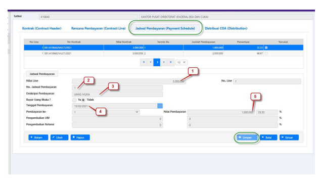

Keterangan : 
1. **Nilai Line Kontrak ( terisi otomatis atas nilai Line kontrak yang menjadi induknya)** 
2. **No Jadwal Pembayaran ( berisikan nomor urut jadwal pembayaran apabila dalam satu** 
kontrak line berisikan lebih dari satu jadwal pembayaran) 
3. **Deskripsi Pembayaran (Free text)** 4. **Tanggal Pembayaran (tanggal rencana jadwal pembayaran tersebut akan dilakukan** 
penagihan) 
5. **Nilai Pembayaran ( Nilai nominal yang akan di tagihkan pada jadwal pembayaran / termin** 
berkenaan) 
Sebagai informasi Tambahan : 
- **Dalam satu contract line bisa terdapat lebih dari satu jadwal pembayaran / termin dimana** 
Total jumlah nilai seluruh termin yang ada harus lebih kecil atau sama dengan nilai Contract line yang menjadi induknya 6. **Perekaman Distribusi COA (Distribution)** 

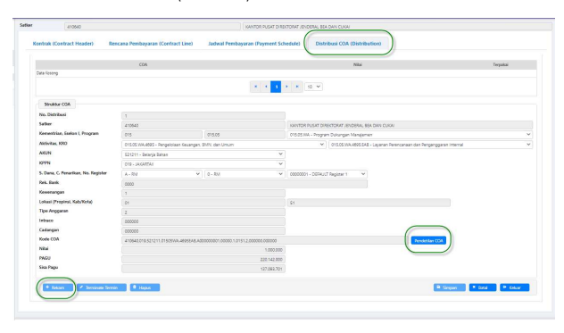

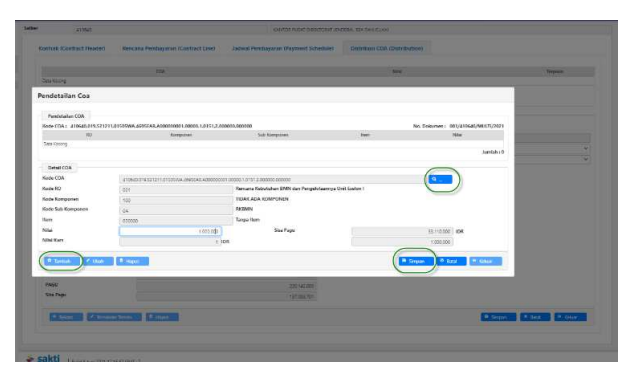

Keterangan : 
1. **Klik tombol 'Rekam' untuk melakukan perekaman distribusi COA. Lengkapi isian struktur 12** 
segmen COA dengan memilih kombinasi : Satker, Kementerian, Eselon I, Program, Aktivitas, KRO, Akun, KPPN, Sumber Dana, Cara Penarikan, dan Nomor Register. 

2. **Kemudian klik tombol Pendetilan COA untuk melakukan pendetilan 15/16 segmen COA yang** 
digunakan. 

3. **Klik tombol 'Tambah' untuk melakukan perekaman pendetilan 15/16 segmen COA. Klik tombol** 
ikon 'Pencarian' untuk memilih detil RO, Komponen, Sub Komponen (untuk 15 segmen) dan Item (untuk 16 segmen). 

4. **Pada menu pop up yang muncul pilih detil detil RO, Komponen, Sub Komponen (untuk 15** 
segmen) dan Item (untuk 16 segmen). Kemudian klik tombol 'Ok'. 

5. **Input nilai sejumlah nilai pada termin. Klik tombol 'Simpan' untuk melakukan penyimpanan.** 
7. **Cetak Karwas (Kartu Pengawasan Kontrak) Kontrak** 

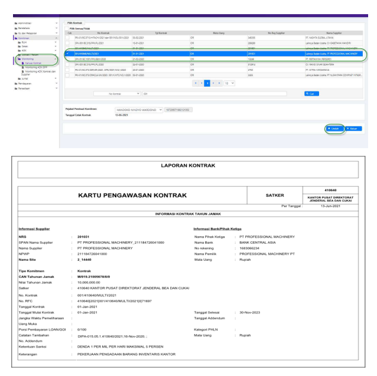

Untuk mencetak Resume kontrak terdapat pada Modul Komitmen > Monitoring > Karwas Kontrak 

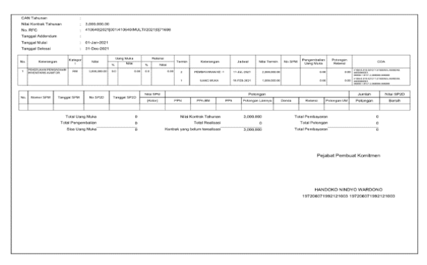

2. PEMBUATAN ADK KONTRAK RELEASE OLEH PPK 

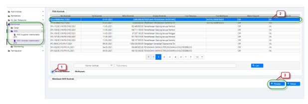

Login dengan menggunakan user PPK , pilih pada modul Komitmen - ADK - ADK Kontrak Interkoneksi OTP. 

1. **Pilih jenis Kontrak yang Kontrak Annual / Release** 
2. **Pilih Kontrak Release (KR) yang akan dibuatkan ADK** 3. Tekan tombol proses untuk pembuatan ADK 

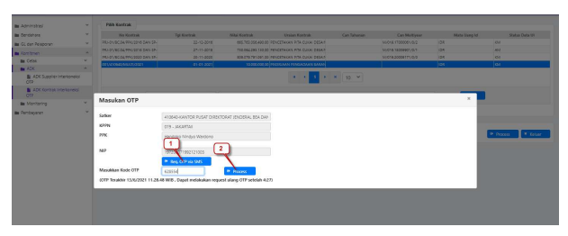

Keterangan : 1. **Pilih request OTP via SMS / email (Data OTP kan terkirim ke Handphone pejabat yang sudah** 
didaftarkan) 
2. **Maukkan kode OTP yang didapat, kemudian lakukan proses.** 
Informasi Tambahan : 
- **Untuk Kontrak Release file ADK yang dihasilkan adalah file BCKR (Budget Commitment Kontrak** 
Release). 

- **ADK akan terkirim otomatis langsung ke Portal SPAN yang ada di KPPN mitra kerja** 
- **Petugas KPPN akan melakukan download ADK dimaksud untuk di Proses di KPPN / SPAN.**

## 3. **Proses Di Kppn**

Atas ADK yang telah dibentuk, maka pihak KPPN akan melakukan proses Data Kontrak pada SPAN mengacu pada SOP yang berlaku. 

Apabila pendaftaran data kontrak telah di lakukan approved oleh KPPN, maka akan mengupdate data CAN / NRK pada aplikasi SAKTI atau Operator bisa melakukan pencatatan manual, sehingga data kontrak sudah bisa digunakan untuk transaksi berikutnya. Dalam Kondisi Normal, nomor CAN pada aplikasi SAKTI akan terupdate secara otomatis, dengan mengambil data dari OMSPAN secara Scheduler, namun hal Nomor CAN tidak mengupdate otomatis pada aplikasi SAKTI, user juga bisa melakukan pencatatan CAN manual. Pencatatan CAN manual dapat dilakukan pada Aplikasi SAKTI di menu Komitmen > Upload / Rekam > 
Upload Rekam ADK CAN 
Keterangan : 

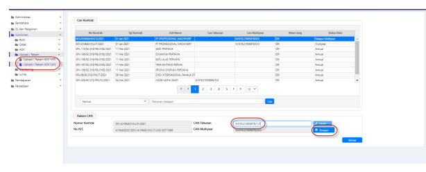

1. **Isikan nomor CAN pada kolom CAN Tahunan untuk kontrak Release, sesuai dengan nomor CAN** 

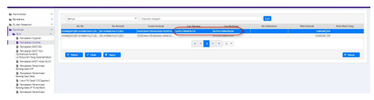

yang di dapat dari KPPN / SPAN, dan penulisan nomor CAN merupakan Case sensitive , dimana harus sama persis dengan data SPAN 
2. **Tekan Tombol simpan, sehingga nomor CAN Release akan terisi dan tersimpan** 
Dengan sudah tercatatnya Nomor CAN Release, maka data kontrak Release sudah bisa digunakan untuk transaksi selanjutnya ( Pembuatan BAST dan pembuatan SPP kontraktual) 