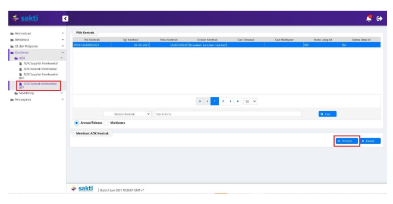

♦
Petunjuk Teknis Aplikasi SAKTI
→
→
PEREKAMAN DATA KONTRAK TAHUNAN
MENGGUNAKAN IDR
KEMENTERIAN KEUANGAN RI 
→
→

## I. Informasi Umum A. Deskripsi Transaksi

Menurut Peraturan Menteri Keuangan Nomor 154/PMK.05/2014 tentang Pelaksanaan Sistem Perbendaharaan dan Anggaran Negara, pengertian Kontrak adalah perjajian tertulis antara PPK dengan penyedia barang/jasa atau pelaksana swakelola, dan Data Kontrak adalah informasi terkait dengan perjanjian tertulis antara PPK dengan penyedia barang/jasa atau pelaksana swakelola. 

Kontrak Tahun Tunggal adalah kontrak yang pelaksanaan pekerjaanya mengikat dana anggaran selama masa 1 (satu) tahun anggaran.

| Modul                                                                        | KOM                                                                                |          |          |         |           |           |           |         |
|------------------------------------------------------------------------------|------------------------------------------------------------------------------------|----------|----------|---------|-----------|-----------|-----------|---------|
| Role User                                                                    | OPR, PPK                                                                           |          |          |         |           |           |           |         |
| Modul Lain terkait                                                           | PEM                                                                                |          |          |         |           |           |           |         |
| Transaksi yang Tekait                                                        | KOM - RUH Supplier, Perekaman BAST Kontraktual PEM - Catat/Ubah SPP                |          |          |         |           |           |           |         |
| Dokumen Input                                                                | Data Kontrak                                                                       |          |          |         |           |           |           |         |
| Output                                                                       | Resume                                                                             | Kontrak, | Data     | Kontrak | dapat     | digunakan | untuk     |         |
| pembuatan SPP Kontraktual                                                    |                                                                                    |          |          |         |           |           |           |         |
| Validasi                                                                     | -                                                                                  | Data     | supplier | yang    | digunakan | dalam     | perekaman | kontrak |
| merupakan data supplier yang sudah mendapatkan NRS (Nomor Register Supplier) |                                                                                    |          |          |         |           |           |           |         |
| -                                                                            | Data Pagu DIPA terkait dengan kontrak dimaksud sudah tersedia                      |          |          |         |           |           |           |         |
| Petunjuk Teknis Terkait                                                      | KOM - Petunjuk Perekaman Supplier Tipe 1, 2, dan 7 PEM - Perekaman SPM Kontraktual |          |          |         |           |           |           |         |

## B. Informasi Penting Lainnya

1. Kontrak Tahun Tunggal adalah Kontrak yang pelaksanaan pekerjaanya mengikat dana anggaran selama 1 (satu) tahun masa anggaran; 2. Data kontrak yang dapat digunakan pada perekaman transaksi lanjutan adalah data kontrak yang telah memiliki Nomor CAN.

II.

## Alur Proses

A.   DIAGRAM ALUR PROSES

# Perekaman Data Kontrak

Menggunakan IDR

| Operator Komitmen SAKTI   | Pejabat Pembuat   | KPPN (SPAN)   |
|---------------------------|-------------------|---------------|
| Komitmen                  |                   |               |
| 1                         | 2                 | 3             |
| Rekam Kontrak             | Create ADK BCKA   | Proses KPPN   |

B.   PENJELASAN DIAGRAM ALUR PROSES
1. REKAM KONTRAK
1. Login dengan menggunakan user operator komitmen.

2. Pilih modul Komitmen - RUH - Pencatatan Kontrak. Untuk melakukan perekaman data kontrak 

 baru, klik tombol 'Rekam'. 3. Perekaman pada tab Kontrak (Contract Header). Lengkapi isian pada tab Kontrak (Contract Header). Untuk data kontrak tahunan, informasi yang perlu dilengkapi adalah:
- Tipe kontrak (pilih Annual Year untuk perekaman data kontrak tahunan); - Tipe komitmen (pilih Kontrak untuk perekaman data kontrak tahunan); - Supplier (supplier yang dapat digunakan adalah supplier yang telah mendapatkan NRS); - Nomor Kontrak; - Kode KPPN sebagai kantor bayar; - Mata uang (untuk kontrak dengan lebih dari satu mata uang yang digunakan, direkam sebagai data kontrak terpisah);
- Tipe kurs apabila mata uang selain IDR; - Uraian pekerjaan; - Data pinjaman atau hibah luar negeri (apabila sumber dana dari Loan/Hibah); - Jangka waktu pelaksanaan (tanggal mulai dan berakhirnya kontrak dalam satu tahun anggaran yang sama);
- Jangka waktu pemeliharaan; - Uraian ketentuan dan sanksi (sebaiknya dihindari penggunaan symbol kode ASCII seperti %, 
‰, dan lain-lain serta melakukan *copy-paste*);
- Koordinat lokasi pekerjaan kontrak; - Cara pembayaran (Sekaligus atau Bertahap (Termin)); - Informasi Uang Muka dan Retensi (namun untuk cara pembayaran uang muka dan cara pengembalian retensi masih belum digunakan);
- Klik tombol 'Simpan' untuk melakukan penyimpanan.

4. Perekaman pada tab Rencana Pembayaran (Contract Line)

 Apabila perekaman pada tab Kontrak (Contract Header) telah tersimpan, maka tab Rencana Pembayaran (Contract Line) akan aktif. Beberapa hal terkait pengisian informasi pada tab ini:
- Untuk satu baris Contract Line hanya dapat membebani satu kombinasi 12 segmen COA. 

Apabila dalam satu kontrak menggunakan lebih dari satu kombinasi 12 segmen COA, maka baris Contract Line yang direkam lebih dari satu (namun satu Contract Line dapat membebani kombinasi 15/16 segmen COA yang berbeda selagi masih dalam satu 12 segmen COA yang sama);
- Total jumlah nilai seluruh Contract Line yang ada harus sama dengan nilai kontrak.

Klik tombol 'Rekam' untuk perekaman baris Contract Line yang baru. Informasi yang perlu 

 dilengkapi adalah:
- No.Line (terisi otomatis sesuai jumlah line yang akan direkam); - Tipe Line (pilih Belanja/Biaya); - Deskripsi Line; - Kategori Line (Cara Tarik); - Nilai Line; - Untuk kolom Uang Muka dan Retensi sementara belum digunakan; - Klik tombol 'Simpan' untuk melakukan penyimpanan.

5. Perekaman pada tab Jadwal Pembayaran (Payment Schedule) Apabila perekaman pada tab Rencana Pembayaran (Contract Line) telah tersimpan, maka tab Jadwal Pembayaran (Payment Schedule) akan aktif. Jadwal Pembayaran (Payment Schedule) berisikan rincian/termin atas baris Contract Line yang telah direkam. Beberapa hal terkait pengisian informasi pada tab ini:
- Total jumlah nilai seluruh termin harus sama dengan nilai Contract Line yang menjadi induknya;
- Apabila terdapat termin yang menggunakan kombinasi 12 segmen COA yang berbeda, maka termin tersebut direkam pada Contract Line yang berbeda (namun apabila perbedaanya terdapat pada 15/16 segmen COA, maka termin tersebut masih direkam pada Contract Line yang sama);
- Untuk perekaman pembayaran Uang Muka dan/atau Retensi masih menggunakan metode netto, dan direkam sebagai termin.

Klik tombol 'Rekam' untuk melakukan perekaman termin baru pada tab Jadwal Pembayaran 

 (Payment Schedule). Informasi yang perlu dilengkapi adalah:
- Nilai Line (terisi otomatis sesuai dengan nilai Contract Line yang menjadi induknya); - Nomor Jadwal Pembayaran (merupakan nomor termin yang akan kita rekam); - Deskripsi Pembayaran (misalnya dapat diisi sebagai pembayaran uang muka, termin1, dst.); - Uang Muka (untuk sementara tidak digunakan); - Tanggal Pembayaran (merupakan tanggal rencana pembayaran termin akan dilakukan, dengan ketentuan dimana pembayaran pertama harus sama atau lebih dari tanggal kontrak dan pembayaran terakhir dapat melebihi tanggal berakhirnya kontrak namun masih dalam tahun anggaran yang sama);
- Nilai Pembayaran (merupakan nilai nominal dari termin); - Klik tombol 'Simpan' untuk melakukan penyimpanan.

6. Perekaman pada tab Distribusi COA (Distribution) Apabila perekaman pada tab Jadwal Pembayaran (Payment Schedule) telah tersimpan, maka tab Distribusi COA (Distribution) akan aktif. Beberapa hal terkait pengisian informasi pada tab ini:
- Untuk satu termin hanya berisikan satu distribusi COA; - Nilai dalam distribusi COA harus sama dengan nilai termin nya.

Klik tombol 'Rekam' untuk melakukan perekaman distribusi COA. Lengkapi isian struktur 12 

 segmen COA dengan memilih kombinasi : Satker, Kementerian, Eselon I, Program, Aktivitas, KRO, Akun, KPPN, Sumber Dana, Cara Penarikan, dan Nomor Register. Kemudian klik tombol Pendetilan COA untuk melakukan pendetilan 15/16 segmen COA yang digunakan.

Untuk mencetak karwas kontrak terdapat pada Modul Komitmen - Cetak - Cetak Resume Kontrak.

## 2. Adk Bcka

1. Login dengan menggunakan *user* PPK. 2. Masuk pada modul Komitmen - ADK - ADK Kontrak Interkoneksi OTP. Pilih data kontrak yang 

 akan dibentuk ADK nya kemudian tekan tombol 'Process'.

## 3. Proses Kppn

Atas ADK yang telah dibentuk, maka pihak KPPN akan melakukan proses Data Kontrak pada SPAN mengacu pada SOP yang berlaku.