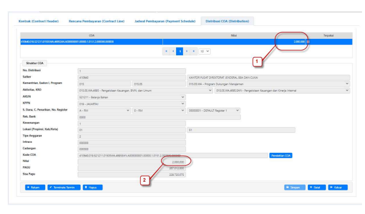
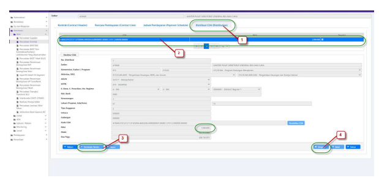

Petunjuk Teknis Aplikasi SAKTI)
CO
→
TERMINATE TERMIN KONTRAK

KEMENTERIAN KEUANGAN RI

ditjen perbendaharaan
.

•

## I. Informasi **Umum** A. Deskripsi **Transaksi**

Menurut Peraturan Menteri Keuangan Nomor 154/PMK.05/2014 tentang Pelaksanaan Sistem Perbendaharaan dan Anggaran Negara, pengertian Kontrak adalah perjajian tertulis antara PPK dengan penyedia barang/jasa atau pelaksana swakelola, dan Data Kontrak adalah informasi terkait dengan perjanjian tertulis antara PPK dengan penyedia barang/jasa atau pelaksana swakelola. 

Addendum / Perubahan Data Kontrak yang dimaksud, adalah perubahan atas data kontrak yang telah terdaftar di SPAN dan sudah mendapatkan CAN (Commitment Aplication Number ) / NRK (Nomor Register Kontrak).

| Modul                   | KOM                                                                                                                                      |                                                                                                                                                                 |
|-------------------------|------------------------------------------------------------------------------------------------------------------------------------------|-----------------------------------------------------------------------------------------------------------------------------------------------------------------|
| Role User               | OPR, PPK                                                                                                                                 |                                                                                                                                                                 |
| Modul Lain terkait      | PEM                                                                                                                                      |                                                                                                                                                                 |
| Transaksi yang Tekait   | KOM - RUH Supplier, Perekaman BAST Kontraktual  PEM- Catat / Ubah SPP                                                                    |                                                                                                                                                                 |
| Dokumen Input           | Data Kontrak                                                                                                                             |                                                                                                                                                                 |
| Output                  | Resume Kontrak, Karwas Kontrak, Data kontrak bisa digunakan  untuk pembuatan SPP Kontraktual                                             |                                                                                                                                                                 |
| Validasi                | -                                                                                                                                        | Data supplier yang digunakan dalam perekaman kontrak  merupakan data supplier supplier tipe 2 dan tipe 6  yang sudah mendapatkan NRS (Nomor  Register Supplier) |
| -                       | Data Kontrak awal sudah direkam dan didaftarkan dalam SPAN                                                                               |                                                                                                                                                                 |
| -                       | Data Kontrak sudah mendapatkan CAN (Commitment Application  Number) atau NRK (Nomor Registrasi Kontrak);                                 |                                                                                                                                                                 |
| -                       | Nomor Kontrak tidak dapat dilakukan perubahan;                                                                                           |                                                                                                                                                                 |
| -                       | Termin kontrak yang telah dibayarkan penuh tidak dapat  dilakukan penghapusan.                                                           |                                                                                                                                                                 |
| -                       | Terminate termin hanya untuk termin yang telah terdapat  realisasi sebagian ( nilai realisasi lebih kecil dari termin yang  didaftarkan) |                                                                                                                                                                 |
| Petunjuk Teknis Terkait | KOM - Petunjuk Perekaman Supplier Tipe 1, 2, dan 7  KOM - Petunjuk Perekaman kontrak Release  PEM - Perekaman SPM Kontraktual            |                                                                                                                                                                 |

## B. Informasi Penting **Lainnya**

1. Perubahan kontrak sebelum didaftarkan dalam aplikasi SPAN akan dianggap sebagai kontrak baru; 2. Perubahan pada 15/16 segmen COA tidak perlu melakukan addendum kontrak; 3. Perubahan supplier dapat dilakukan jika supplier yang akan dipilih telah direkam pada Supplier Address dan Supplier Header yang sama dengan supplier sebelumnya; 4. Nomor Kontrak tidak dapat dilakukan perubahan; 5. Dalam kondisi khusus Addendum Kontrak yang merubah struktur data kontrak, misalnya dari satu termin menjadi dua termin atau sebaliknya, dalam aplikasi SAKTI tetap direkam, namun saat dalam aplikasi SPAN tidak bisa langsung diubah dengan ADK, namun harus menggunakan user Khusus SPAN dalam KPPN (biasanya dengan User Kepala KPPN).

6. Perubahan data kontrak yang perlu dilakukan dan didaftarkan , yaitu apabila terdapat perubahan informasi data kontrak yang tercantum pada data aplikasi. Untuk perubahan dokumen kontrak yang tidak tercantum pada data kontrak di aplikasi, tidak perlu dilakukan perubahan / pendaftaran addendum. Misalkan : perubahan PPK, dimana pada dokumen kontark dilakukan perubahan, namun secara data kontrak pada aplikasi tidak berubah, karena data PPK tidak tercantum pada data kontrak di aplikasi SAKTI 
7. Terminate termin dilakukan apabila terdapat perubahan data kontrak yang mana terdapat realisasi lebih kecil dari termin yang didaftarkan, sehingga akan merubah nilai termin menjadi sebesar nilai realisasi. atau apabila sisa dari termin yang dilakukan terminate ( penyesuaian) akan digunakan pada termin berikutnya 

## Ii.Alur **Proses**

A. DIAGRAM ALUR **PROSES**

## 1. **Rekam / Ubah Data Kontrak**

1. Login dengan menggunakan *user* operator komitmen

2. Pilih modul Komitmen - RUH - Pencatatan Kontrak. Untuk melakukan perekaman data kontrak 

baru, klik tombol 'Ubah'. 

Keterangan : 
1. Tanda cek pada checkbox Addendum harus terisi; 2. Kolom tanggal dan nomor addendum akan aktif, dan lakukan pengisan kolom tersebut Sebagai informasi Tambahan : 
- Sebagai contoh terlihat dari capturean diatas terlihat kontrak awal dengan nilai kontrak 5.000.000 
- Untuk melakukan terminate termin, pada header kontrak, user cukup melakukan isi checkbox dan masukan tanggal dan nomor addendum 4. Perekaman / perubahan Rencana Pembayaran (Contract Line) 

Keterangan : 
1. Pindahkan kursor ke tab rencana pembayaran / Contract Line 2. Pilih Contract line dimana data termin / COA yang akan dilakukan terminate termin terdaftar Sebagai informasi Tambahan : 
- Sebagai contoh kontrak hanya terdiri satu contract line yang mana nilai contract line sama dengan nilai total kontrak, yaitu sebesar 5.000.000 

Keterangan : 
1. Arahkan kursor ke tab Jadwal pembayaran / Payment Schedule 2. Pilih termin mana yang akan dilakukan terminate Sebagai informasi Tambahan : 
- Sebagai contoh jadwal pembayaran terdiri dari 2, pembayaran pertama senilai 2.000.000, dan 

pembayaran kedua senilai 3.000.000
- Terminate termin bisa dilakukan apabila termin sudah terdapat realisasi ( minimal sudah dibuatkan BAST) dengan nilai lebih kecil dari nilai termin yang didaftarkan
- Misalkan pembayaran pertama senilai 2.000.000, sudah dibuatkan BAST sebesar 1.000.000 (lebih kecil dari nilai termin yang didaftarkan) 

## 3. Perekaman / Penyesuaian Distribusi Coa (Distribution)

Distribusi COA tidak bisa dilakukan perubahan, melainkan dilakukan penghapusan apabila terdapat perubahan data distribusi COA, dengan catatan belum terdapat realisasi seluruh dari distribusi COA dimaksud Untuk distribusi COA yang sudah terdapat realisasi sebagian, penyesuaian data atas realisasi tersebut dilakukan dengan mekanisme Terminate Termin Data Distribusi COA yang telah terhapus dikarenakan adanya penghapusan Contract line ataupun penghapusan jadwal pembayaran, harus dilakukan perekaman kembali 

Keterangan : 
Pada tab distribusi COA, terlihat nilai COA yang mengikat pagu Fund available sebelum dilakukan terminatr sebesar nilai jadwal pembayaran ke satu, sbesar 2.000.000 

## Terminate Termin

Untuk pembayaran pertama senilai 2.000.000 sudah dibuatkan BAST sebesar 1.000.000 (lebih kecil 

 dari nilai termin yang didaftarkan), maka data distribusi COA tersebut bisa dilakukan terminte, untuk menyesuaikan nilai distribusi COA menjadi sebesar nilai realisasi (BAST) Keterangan : 
1. Pilih tab distribusi COA 2. Pilih Distribusi COA yang akan determinate 3. Tekan tombol terminate 4. Lakukan penyimpanan Sebagai informasi Tambahan : 
- Saat dilakukan **terminate termin dan simpan**, maka nilai COA akan berubah menjadi sebesar nilai realisasi
- Sebagai contoh diatas, dikarenakan COA atas pembayaran pertama senilai 2.000.000 tersebut, telah dibuatkan BAST senilai 1.000.000, maka nilai COA otomatis akan berubah menjadi 1.000.000 (sebesar nilai realisasi)
- Nilai Sisa (2.000.000 - 1.000.000 = 1.000.000) akan kembali ke pagu Fund Available, dan sudah tidak terikat dengan data kontrak tersebut.

- Dengan dilakukannya terminate termin, maka secara otomatis akan merubah juga nilai pada jadwal pembayaran dan Rencana pembayaran 

 Rencana pembayaran / Contract Line 

Pada tab Jadwal Pembayaran / Payment Schedule dan Rencana Pembayaran / Contract Line , nilai akan berkurang sebesar nilai yang di terminate atau nilai yang kembali ke pagu Fund available. 

- Apabila terminate termin dilakukan hanya untuk penyesuain atas perubahan berkurangnya nilai kontrak, dan nilai sisa tidak digunakan lagi untuk pembayaran / termin berikutnya, maka hanya perlu disesuaikan pada nilai kontrak yang ada pada tab Header Kontrak, berkurang sebesar nilai sisa atas termin yang dilakukan terminate. 

- Namun apabila data sisa akan digunakan untuk pembayaran berikutnya / termin berikutnya maka perlu disesuaikan kembali kenilai awal mulai dari nilai kontrak, nilai contact line. 

- Untuk perubahan pada jadwal pembayaran, menggunakan mekanisme addendum kontrak tahunan / release multi years. 

# Nilai Sisa Dari Terminate Termin Yang Akan Digunakan Pada Pembayaran / Termin Berikutnya

Apabila sisa nilai dari proses terminate termin akan digunakan untuk menambahkan pembayran / termin berikutnya, perlu dilakukan sebagai berikut : 
- Melakukan perubahan atas nilai pada tab Rencana Pembayaran / Contract Line 

dengan adanya terminate termin, maka data pada Jadwal pembayaran / Contract Line akan berkurang sebesar nilai sisa dari terminate termin tersebut, oleh karena itu apabila data sisa akan di tambahkan pada pembayaran / termin selanjutnya, maka data nilai Rencana Pembayaran harus dikembalikan pada kondisi semula Keterangan : 
Keterangan : 
1.Pada tab Rencana Pembayaran / Contract Line, tekan tombol ubah le 2.Kembalikan nilai Rencana Pembayaran menjadi sebesar nilai semula sebelum dilakukan terminate termin 3.Lakukan penyimpanan 
- Menghaspus Distribusi COA 

Setelah data nilai pada tab Rencana pembayaran di kembalikan pada kondisi semula, maka masuk ke tab Jadwal Pembayaran / Payment Schedule, dan pilih pembayaran / termin yang akan dilakukan perubahan / penambahan nilai Setelah memilih data termin yang akan dilakukan perubahan, kemudian masuk ke tab Distribusi COA 

 
Keterangan : 
1.Pada tab Distribusi COA, Lakukan penghapusan atas COA yang sudah terdaftar. Maka distribusi COA akan terhapus termasuk dengan pendetailan 15/16 segmen 2.Lakukan penyimpanan atas penghapusan distribusi COA dimaksud 

## - Perubahan Jadwal Pembayaran

Kembali ke tab jadwal pembayaran, lakukan perubahan data jadwal pembayaran untuk 

memasukan nilai nominal baru 
- Perekaman Distribusi COA kembali Setelah melakukan perubahan data pada jadwal pembayaran, maka lakukan perekaman distribusi COA kembali dengan nominal yang baru Keterangan : 

1. Pada tab Distribusi COA, Lakukan perekaman distribusi COA yang membebani atas termin tersebut 2. Lakukan perekaman pendetailan 15 / 16 segmen COA 
3. Lakukan penyimpanan 