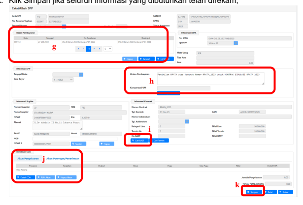

→
Petunjuk Teknis Aplikasi SAKTI)
' TRANSAKSI DENGAN MEKANISME 
REKENING PENAMPUNGAN AKHIR TAHUN
(RPATA)

## Kementerian Keuangan Ri

♦

## 1. Deskripsi Singkat

Peraturan Menteri Keuangan Nomor 109 Tahun 2023 tentang Mekanisme Pelaksanaan Anggaran Atas Pekerjaan Yang Belum Diselesaikan Pada Akhir Tahun Anggaran mengatur tentang penggunaan Rekening Penampungan Akhir Tahun Anggaran 
(RPATA) untuk menampung data atas penyelesaian pekerjaan yang direncanakan untuk diserahterimakan di antara batas akhir pengajuan tagihan kepada negara sampai dengan tanggal 31 Desember tahun anggaran berkenaan dan pekerjaan yang tidak terselesaikan sampai dengan akhir tahun anggaran yang penyelesaianya diberikan kesempatan untuk dilanjutkan pada tahun anggaran berikutnya.

Petunjuk Teknis ini menjelaskan mekanisem perekaman transaksi RPATA pada 

SAKTI.

| SAKTI. Modul           | Komitmen, Pembayaran                                                                                                         |                          |           |     |       |             |      |
|------------------------|------------------------------------------------------------------------------------------------------------------------------|--------------------------|-----------|-----|-------|-------------|------|
| Role User              | Opr                                                                                                                          | Modul                    | Komitmen, | Opr | Modul | Pembayaran, | PPK, |
| PPSPM, dan KPA         |                                                                                                                              |                          |           |     |       |             |      |
| Modul Lain Terkait     | GL dan Pelaporan, Aset tetap, dan Persediaan                                                                                 |                          |           |     |       |             |      |
| Transaksi yang terkait | KOM - RUH - Transaksi RPATA PEM - RUH Pembayaran - Catat/Ubah SPP                                                            |                          |           |     |       |             |      |
| Dokumen Input          | Pencatatan/Penerimaan Barang Jasa RPATA, SPP, dan  SPM                                                                       |                          |           |     |       |             |      |
| Output                 | ADK SPP, SPTJM, dan ADK SPM                                                                                                  |                          |           |     |       |             |      |
| Validasi               | -                                                                                                                            | Pemilihan Termin RPATA : |           |     |       |             |      |
| -                      | 1. Termin yang sudah direkam BAST Kontraktual, tidak dapat dirubah  menjadi Termin RPATA;                                    |                          |           |     |       |             |      |
| -                      | 2. Termin yang sudah dipilih menjadi Termin RPATA tidak dapat  digunakan untuk perekaman transaksi kontraktual biasa;        |                          |           |     |       |             |      |
| -                      | 3. Dalam satu line kontrak, yang menjadi Termin RPATA maksimal 2  Termin.                                                    |                          |           |     |       |             |      |
| - -                    | BAST Penampungan RPATA :                                                                                                     |                          |           |     |       |             |      |
| -                      | 1. Hanya dapat dilakukan perekaman atas Termin yang sudah dipilih  menjadi Termin RPATA;                                     |                          |           |     |       |             |      |
| -                      | 2. Nomor Dokumen, Progress Pekerjaan, Nilai Detil COA terisi  secara otomatis oleh system - tidak dapat dilakukan perubahan; |                          |           |     |       |             |      |
| -                      | 3. Kolom yang dapat diinput oleh user hanya atas informasi Tanggal  Dokumen;                                                 |                          |           |     |       |             |      |
| -                      | 4. Atas satu Termin RPATA hanya dapat direkam satu BAST                                                                      |                          |           |     |       |             |      |
| - -                    | Penampungan RPATA;                                                                                                           |                          |           |     |       |             |      |
| -                      | Validasi BAST Kontraktual pada umumnya.                                                                                      |                          |           |     |       |             |      |
| -                      | SPP 171 - Penampungan RPATA                                                                                                  |                          |           |     |       |             |      |
| -                      | 1. Hanya dapat dilakukan perekaman apabila BAST Penampungan  RPATA sudah direkam;                                            |                          |           |     |       |             |      |
| -                      | 2. Uraian SPP akan terisi secara otomatis oleh sistem;                                                                       |                          |           |     |       |             |      |
| -                      | 3. Pengisian akun pengeluaran dan akun potongan dilakukan rekamsimpan, tidak perlu dilakukan penginputan manual;                                                                                                                              |                          |           |     |       |             |      |
| -                      | Validasi SPP pada umumnya.                                                                                                   |                          |           |     |       |             |      |
| - -                    | SPTJM Penampungan RPATA                                                                                                      |                          |           |     |       |             |      |
| -                      | 1. Hanya dapat dilakukan apabila sudah dilakukan cetak SPP;                                                                  |                          |           |     |       |             |      |
| -                      | 2. Seluruh isian SPTJM, termasuk Nomor SPTJM sudah terisi secara  otomatis oleh system;                                      |                          |           |     |       |             |      |

-
- **BAST Pembayaran RPATA** - 1. Hanya dapat dilakukan perekaman apabila BAST Penampungan RPATA sudah dibayarkan (tercatat SP2D);
- 2. Untuk BAST Penampungan dengan akun yang wajib menghasilkan BMN hanya dapat direkam BAST Pembayaran Aset/Jasa Dikapitalisasi Aset ;
- 3. Atas satu Termin RPATA dapat direkam lebih satu BAST 
Pembayaran RPATA;
- 4. Hanya dapat direkam lintas tahun jika sudah direkam pemberian kesempatan perpanjangan pekerjaan kontrak (kecuali untuk kontrak dengan RO Prioritas Nasional);
- 5. Validasi BAST pada umumnya. -

## - Spp 172 - Pembayaran Rpata

- 1. Hanya dapat dilakukan perekaman apabila BAST Pembayaran RPATA sudah direkam;
- 2. Uraian SPP akan terisi secara otomatis oleh sistem; - 3.Dapat menggunakan lebih dari satu BAST Pembayaran RPATA; - 4. Atas satu Termin RPATA, hanya dapat direkam satu SPM 
Pembayaran RPATA;
- 5. Hanya dapat direkam apabila seluruh BAST Pembayaran RPATA 
dan BAST Penihilan RPATA - jika ada, sudah direkam atas Termin RPATA tersebut;
- 6. Validasi SPP pada umumnya. -
- **SPTJM Pembayaran RPATA** - 1. Hanya dapat dilakukan apabila sudah dilakukan cetak SPP;
- 2. Seluruh isian SPTJM, termasuk Nomor SPTJM sudah terisi secara otomatis oleh sistem.

- - **BAST Penihilan RPATA**
- 1. Hanya dapat dilakukan perekaman apabila BAST Penampungan RPATA sudah dibayarkan (tercatat SP2D);
- 2. Harus menjadi BAST RPATA yang terkahir direkam. Jika BAST 
Penihilan RPATA sudah direkam, tidak ada perekaman BAST RPATA yang lain pada Termin RPATA tersebut; 
- 3. Atas satu Termin RPATA hanya dapat direkam satu BAST 
Penampungan RPATA;
- 4. Hanya dapat direkam lintas tahun jika sudah direkam pemberian kesempatan pekerjaan (kecuali untuk kontrak dengan RO Prioritas Nasional);
- 5. Validasi BAST pada umumnya
- - SPP 173 - **Penihilan RPATA**
- 1. Hanya dapat dilakukan perekaman apabila BAST Penihilan RPATA sudah direkam;
- 2. Uraian SPP akan terisi secara otomatis oleh sistem;
- 3. Pengisian akun pengeluaran dan akun potongan dilakukan rekamsimpan, tidak perlu dilakukan penginputan manual;
- 4. Validasi SPP pada umumnya. - - **Perpanjangan Kontrak**
- 1. Hanya dapat dilakukan apabila transaksi penampungan RPATA 
sudah selesai (sampai SP2D);
- 2. Hanya dapat dilakukan atas data kontrak dengan tanggal kontrak maksimal 30 November;
- 3. Dapat dilakukan pemberian kesempatan perpanjangan kontrak sebanyak 2 kali;
- 4. Maksimal pemberian kesempatan perpanjangan kontrak pertama adalah 50 hari kalender;
- 5. Total maksimal pemberian kesempatan perpanjangan kontrak adalah 90 hari kalender;
- 6. Tidak dapat dilakukan pemberian kesempatan perpanjangan kontrak jika sudah ada perekaman SPP 172 - Pembayaran RPATA atau SPP 173 - Penihilan RPATA;
- 7. Untuk transaksi dengan RO Prioritas Nasional, tidak perlu melakukan perpanjangan kontrak.

-

## 2. Alur Proses

 3. Penjelasan Alur Proses

A. PEMILIHAN TERMIN YANG AKAN DIBAYARKAN DENGAN MEKANISME RPATA Modul yang digunakan : Modul Komitmen, Modul Pembayaran 1. Transaksi yang dapat dibayarkan dengan mekanisme RPATA hanyalah termin yang pada data kontraknya dipilih menjadi Termin RPATA; 2. Langkah-langkah pemilihan menjadi termin RPATA :
a. Login pada aplikasi SAKTI menggunakan user operator Modul Komitmen; b. Masuk pada Modul Komitmen - RUH - Kontrak. Pilih data kontrak yang akan dibayarkan melalui mekanismen RPATA;
c. Klik tombol Ubah;

d. Dari tab Kontrak (Contract Header), pindah ke tab Rencana Pembayaran (Contract Line), pilih line yang akan dibayarkan melalui mekanisme RPATA, dan kemudian Pindak ke tab Jadwal Pembayaran (Payment Schedule);
e. Pilih termin yang akan dipilih menjadi termin RPATA, klik Ubah;' f. Pada kolom Jenis Termin, pilih Termin RPATA; 

## B. Mekanisme Pengajuan Spm Penampungan Rpata

Modul yang digunakan : Modul Komitmen, Modul Pembayaran 1. Untuk pengajuan SPM Penampungan RPATA, didahului dengan perekaman data BAST RPATA Isi; 2. Langkah-langkah perekaman data BAST RPATA isi :
a. Login pada aplikasi SAKTI menggunakan user operator Modul Komitmen; b. Masuk pada Modul Komitmen - RUH - Transaksi RPTA - Penerimaan Barang/Jasa RPATA;

c. Klik Rekam; d. Pilih Kategori RPATA Penampungan; e. Klik tombol Cari Kontrak, kemudian klik Cari Kontrak untuk mencari daftar data kontrak yang sudah ada termin RPATA. Daftar data kontrak yang muncul hanyalah data kontrak yang sudah memiliki termin RPATA;

e
f. Setelah memilih data kontrak dan termin yang akan digunakan, silahkan rekam informasi Tanggal Dokumen/BAST. Untuk Nomor Dokumen/BAST atas RPATA Penampungan akan dibentuk secara otomatis oleh sistem dengan format RPATA171/kode_satker/nomor_urut/tahun_anggaran; g. Klik Simpan.

3. Selanjutnya data BAST RPATA Penampungan ini akan digunakan pada perekaman SPM Penampungan RPATA. 4. Langkah-langkah perekaman SPM Penampungan RPATA :
a. Login pada aplikasi SAKTI menggunakan user operator Modul Pembayaran; b. Masuk pada Modul Pembayaran - RUH SPP dan Renkas - Catat/Ubah SPP; c. Pilih jenis SPP 171 - Penampungan RPATA; d. Klik tambah;

e. Pilih termin data kontrak yang akan digunakan. Termin data kontrak yang muncul hanya yang sudah direkam BAST RPATA isi; f. Klik Pilih;

g. Lakukan perekaman seluruh informasi yang dibutuhkan ketika perekaman SPP. 

Pilih Dasar Pembayaran dan isikan Uraian Pembayaran (digenerate otomatis dan dimungkinkan untuk dilakukan penyesuaian oleh user apabila diperlukan);
h. Lanjutkan dengan memilih BAST RPATA Penampungan yang akan digunakan; 1) Pilih BAST RPATA Penampungan terkait pada form Ambil Data Kontrak BAST
2) Klik Rekam SPP

i. Setelah memilih data BAST, data Akun Pengeluaran akan otomatis terisi sesuai dengan COA pada BAST Penampungan terkait; j. Lanjutkan dengan rekam Akun Potongan/Penerimaan k. Klik RUH Akun

l. Lakukan perekaman Akun Potongan dengan klik tombol Tambah m. Kemudian klik tombol simpan tanpa mengubah data akun yang sudah ada. n. Setelah berhasil tersimpan, lanjutkan dengan klik keluar sehingga Kembali ke form sebelumnya.

o. Pada form perekaman SPP, lanjutkan proses dengan klik Simpan;

p. Setelah SPP berhasil disimpan, silahkan lakukan cetak SPP pada menu Pembayaran → Cetak → Mencetak SPP;
q. Pilih SPP terkait, kemudian pilih PPK yang menandatangani SPP terkait; r. Klik Unduh untuk mengunduh SPP; s. Lanjutkan dengan unduh SPTJM atas Pengajuan SPM Penampungan RPATA. 

Unduh SPTJM dimaksud baru dapat dilakukan setelah proses cetak SPP;

t. Selanjutnya silahkan lanjutkan proses Upload dokumen pendukung, validasi PPK 
hingga pembentukan ADK SPM seperti alur SPM pada umumnya hingga terbentuk ADK SPM.

u. **Khusus untuk satker yang sudah menerapkan TTE**, dokumen SPTJM dapat 

dibentuk melalui menu Pembayaran → Catat/Upload → Upload Dokumen Pendukung → Pilih Jenis Dok.Pendukung SPTJM RPATA (Penampungan) → Klik Bentuk & Unggah v. Atas SPTJM RPATA tersebut, agar dilanjutkan dengan proses TTE pada user KPA 
kemudian proses Validasi SPP oleh PPK. Proses Validasi SPP pada PPK tidak dapat dilanjutkan apabila SPTJM belum dilakukan TTE oleh KPA.

## C. Mekanisme Pengajuan Spm Pembayaran Rpata

Modul yang digunakan : Modul Komitmen, Modul Pembayaran 1. Untuk pengajuan SPM Pembayaran RPATA, didahului dengan perekaman data BAST RPATA; 2. Langkah-langkah perekaman data BAST RPATA Pembayaran :
a. Login pada aplikasi SAKTI menggunakan user operator Modul Komitmen; b. Masuk pada Modul Komitmen - RUH - Transaksi RPTA - Penerimaan Barang/Jasa 

c. Klik Rekam; d. Pilih Kategori RPATA Pembayaran Aset / Jasa Dikapitalisasi Aset atau RPATA 
Pembayaran Jasa / Non Aset. Contoh pada petunjuk teknis ini menggunakan perekaman BAST RPATA Pembayaran Aset / Jasa Dikapitalisasi Aset; e. Klik tombol Cari Kontrak, kemudian klik Cari Kontrak untuk mencari daftar data kontrak yang sudah ada termin RPATA. Daftar data kontrak yang muncul hanyalah data kontrak yang sudah direkam BAST RPATA Penampungan dan sudah terbit SP2Dnya;

f. Setelah memilih data kontrak dan termin yang akan digunakan, silahkan isi informasi Nomor Dokumen/BAST dan Tanggal Dokumen/BAST (menggunakan nomor dan tanggal BAST riil pada satuan kerja);
g. Lakukan perekaman nilai BAST RPATA Pembayaran pada nilai Pendetilan COA; h. Lakukan perekaman informasi Progress Pekerjaan; i. Lakukan perekaman informasi barang yang dihasilkan (sama seperti perekaman BAST Aset/Persediaan biasa);
j. Klik Simpan.

3. Selanjutnya data BAST RPATA Pembayaran ini akan digunakan pada perekaman SPM Pembayaran RPATA. 4. Langkah-langkah perekaman SPM Pembayaran RPATA :
a. Login pada aplikasi SAKTI menggunakan user operator Modul Pembayaran; b. Masuk pada Modul Pembayaran - RUH SPP dan Renkas - Catat/Ubah SPP; c. Pilih jenis SPP 172 - Pembayaran RPATA; d. Klik Tambah; e. Pilih termin data kontrak yang akan digunakan. Termin data kontrak yang muncul hanya yang sudah direkam BAST RPATA Pembayaran; f. Klik Pilih;

g. Lakukan perekaman seluruh informasi yang dibutuhkan ketika perekaman SPP. 

Lakukan pemilihan Dasar Pembayaran dan Penyesuaian Uraian (jika diperlukan, mengingat uraian SPP digenerate secara otomatis oleh sistem);
h. Pastikan telah memilih BAST RPATA Pembayaran yang akan digunakan; i. Lakukan perekaman Akun Pengeluaran dan Akun Potongan (apabila ada potongan, misalnya pajak ataupun denda keterlambatan);
j. Klik Simpan jika seluruh informasi yang dibutuhkan telah direkam;

- Form Cari BAST (Langkah poin h), centang BAST yang akan dilakukan perekaman 

- Form RUH Akun pada tab Akun Pengeluaran, Pengguna dapat melakukan klik 

tombol Rekam dan Simpan. Untuk akun dan nilai sudah didefault oleh aplikasi.

- Form RUH Akun Potongan/Penerimaan, Pengguna agar melakukan perekaman 

akun potongan sesuai kebutuhan masing-masing (pajak/denda).

k. Setelah SPP berhasil disimpan, silahkan lakukan cetak SPP pada menu 

Pembayaran → Cetak → Mencetak SPP;
l. Pilih SPP terkait dan PPK yang menandatangani, kemudian klik tombol Unduh; m. Lanjutkan dengan Unduh SPTJM atas Pembayaran Dana dari RPATA Kepada Rekening Penyedia Barang/Jasa. Proses Unduh SPTJM baru dapat dilakukan setelah dilakukan proses cetak SPP;

n. Lanjutkan dengan proses Upload Dokumen Pendukung; o. Selanjutnya silahkan lanjutkan denganproses validasi SPP oleh PPK hingga proses pembentukan ADK SPM seperti pada umumnya.

p. Khusus untuk satker yang sudah menerapkan TTE, SPTJM RPATA Pembayaran dibentuk melalui menu Pembayaran → Catat/Upload → Upload Dokumen Pendukung → Pilih Jenis Dok.Pendukung SPTJM RPATA (Pembayaran) → Klik Bentuk & Unggah;

 r. Lanjutkan dengan proses validasi SPP pada user PPK. SPP tidak dapat divalidasi oleh PPK apabila SPTJM pada poin (p) belum dilakukan TTE oleh KPA.

## D. Mekanisme Pengajuan Spm Penihilan Rpata

Modul yang digunakan : Modul Komitmen, Modul Pembayaran 1. Untuk pengajuan SPM Penihilan RPATA, didahului dengan perekaman data BAST RPATA Penihilan; 2. Langkah-langkah perekaman data BAST RPATA Penihilan:
a. Login pada aplikasi SAKTI menggunakan user operator Modul Komitmen; b. Masuk pada Modul Komitmen - RUH - Transaksi RPTA - Penerimaan Barang/Jasa RPATA;
c. Klik Rekam; d. Pilih Kategori RPATA Penihilan; e. Klik tombol Cari Kontrak, kemudian klik Cari Kontrak untuk mencari daftar data kontrak yang sudah ada termin RPATA. Daftar data kontrak yang muncul hanyalah data kontrak yang sudah direkam BAST RPATA Penampungan dan sudah terbit SP2D atas SPM Penampungan RPATA;
f. Setelah memilih data kontrak dan termin yang akan digunakan, silahkan rekam Tanggal Dokumen/BAST. Untuk Nomor Dokumen/BAST tergenerate secara otomatis oleh sistem. Pada BAST Penihilan ini, nilai yang ditarik otomatis senilai saldo sisa atas termin yang dipilih; g. Klik Simpan.

3. Selanjutnya data BAST RPATA nihil ini akan digunakan pada perekaman SPM Penihilan RPATA. 4. Langkah-langkah perekaman SPM Penihilan RPATA :
a. Login pada aplikasi SAKTI menggunakan user operator Modul Pembayaran; b. Masuk pada Modul Pembayaran - RUH SPP dan Renkas - Catat/Ubah SPP;
c. Pilih jenis SPP 173 - Penihilan RPATA; d. Klik tambah; e. Pilih termin data kontrak yang akan digunakan. Termin data kontrak yang muncul hanya yang sudah direkam BAST RPATA Penihilan;

 g. Lakukan pemilihan Dasar Pembayaran; h. Uraian akan tergenerate secara otomatis dari aplikasi, namun masih dimungkinkan untuk dilakukan penyesuaian apabila diperlukan; i. Lanjutkan dengan klik tombol Cari BAST dan memilih BAST RPATA Penihilan terkait j. Pastikan telah melakukan perekaman Akun Pengeluaran dan Akun Potongan; k. Klik Simpan jika seluruh informasi yang dibutuhkan telah direkam;

- Form Cari BAST, pengguna agar melakukan pemilihan BAST terkait kemudian klik 

- Form Perekaman Akun Pengeluaran pada SPP 173 - Penihilan RPATA, untuk akun 

pengeluaran pengguna agar melakukan Rekam kemudian simpan tanpa melakukan ubah data. Untuk data akun dan nilai sudah digenerate secara otomatis pada aplikasi sesuai dengan data pada BAST terkait.

- Form RUH Akun Potongan/Penerimaan, dalam hal SPP Penihilan RPATA direkam 

pada TA berjalan, klik tombol 5xx untuk menginput akun potongan 5xx. Apabila Penihilan RPATA direkam pada TA selanjutnya, klik tombol 4xx & 8xx untuk merekam akun potongan 4xx. 

l. Selanjutnya silahkan lanjutkan proses perekaman SPM seperti pada umumnya, proses cetak SPP, Upload Dokumen Pendukung, Validasi SPP, hingga terbentuk ADK SPM. (Pada SPM 173 tidak ada SPTJM sebagaimana pada SPM 171 dan 172)

# E. Mekanisme Pemberian Kesempatan Ke Tahun Anggaran Berikutnya

## Modul Yang Digunakan : Modul Komitmen

1. BAST RPATA Pembayaran dan BAST RPATA Penihilan hanya dapat direkam pada tahun anggaran berikutnya jika sudah direkam perpanjangan penyelesaian kontrak; 2. Langkah-langkah perekaman perpanjangan penyelesaian kontrak :
a. Login pada aplikasi SAKTI menggunakan user operator Modul Komitmen; b. Masuk pada Modul Komitmen - RUH - Perpanjangan Kontrak; c. Klik Rekam; d. Klik tombol Cari; e. Daftar data kontrak yang muncul hanyalah data kontrak dengan tanggal kontrak maksimal 30 November 2023 dan sudah diajukan SPM Penampungan RPATA serta belum ada pengajuan SPM Pembayaran/Penihilan pada TA berjalan; f. Setelah memilih data kontrak yang akan diberikan kesempatan ke tahun anggaran berikutnya silahkan input informasi jangka waktu perpanjangan (total perpanjangan Ke-1 dan Ke-2 tidak boleh melebihi 90 hari kerja dari tanggal kontrak);
g. Silahkan rekam informasi Nomor dan Tanggal Surat Perpanjangan; h. Klik Simpan.

