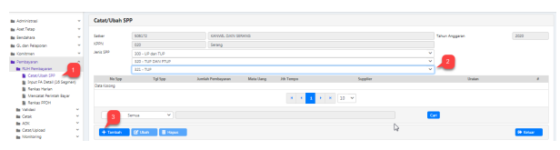

Petunjuk Teknis Aplikasi SAKTI
.

�
�

# Daftar Isi

HALAMAN JUDUL 
1

DAFTAR ISI 2

I. INFORMASI UMUM 3

II. ALUR PROSES 3

3 I. INFORMASI UMUM
A. DESKRIPSI TRANSAKSI
- Tambahan Uang Persediaan (TUP) dapat diberikan kepada satker dalam hal sisa UP pada Bendahara Pengeluaran tidak cukup tersedia untuk membiayai kegiatan yang sifatnya mendesak/tidak dapat ditunda. 

- TUP digunakan dan dipertanggungjawabkan paling lama 1 (satu) bulan sejak tanggal SP2D 
diterbitkan.

- Dana TUP dikelola oleh bendahara dan dapat dibantu oleh Bendahara Pengeluaran Pembantu 
(BPP)
II. ALUR PROSES 

A. POIN KUNCI PEREKAMAN RINCIAN PEMBIAYAAN TUP DAN SPM TUP
1. Membuat Usulan Rincian Pembiayaan TUP 2. Merekam dan Mencetak SPP TUP
3. Menyetujui SPP TUP 4. Mencetak SPM TUP 5. Menyetujui SPM TUP

## B. Penjelasan Detail Alur Proses

1. **Merekam Usulan Rincian Pembiayaan TUP**
Usulan Rincian Pembiayaan TUP dilakukan untuk merekam alokasi akun dan jumlah nominal yang akan dimintakan oleh satker kepada BUN. Berikut langkah-langkah untuk merekam Usulan Rincian Pembiayaan TUP pada aplikasi SAKTI:

1. Login menggunakan user operator Bendahara klik menu Membuat Usulan

 2. Masuk sub menu Membuat Rincian Pembiayaan TUP
3. Klik tambah untuk mengaktifkan menu isian header 4. Isikan mata uang, tanggal TUP, tanggal jatuh tempo dan Sumber dana. 5. Klik Tambah untuk mengisi detail COA
6. Masukan Akun-akun yang akan dimintakan TUP, Program, Kegiatan, Output dan Jumlah yang dimintakan lalu klik simpan Berikut contoh perekaman Usulan Rincian Pembiayaan TUP jika telah selesai disimpan.

# Rincian Rencana Penggunaan Dana Tup No : 00001/Tup/506172/2020

| Kode Satker   |
|---------------|
| Nama Satker   |
| No DIPA       |
| Sumber Dana   |

| : 506172                    |
|-----------------------------|
| : KANWIL DJKN SERANG        |
| : DIPA-015.09.2.506172/2020 |
| : RUPIAH MURNI              |

Tanggal Berakhirnya TUP
: 30 Oktober 2020 Jumlah Kebutuhan TUP
: Rp. 4.000.000,00

| No                 | PKO Akun                            | Uraian   | NIlai Uang   |
|--------------------|-------------------------------------|----------|--------------|
| 10.1715.994.524111 |                                     |          |              |
| 1                  | Belanja Perjalanan Dinas Biasa      | Rp.      | 3.000.000,00 |
| 10.1715.994.524113 | 1.000.000,00                        |          |              |
| 2                  | Belanja Perjalanan Dinas Dalam Kota | Rp.      | 4.000.000,00 |
| Jumlah Total       | Rp.                                 |          |              |

 Demikian Rincian Rencana Penggunaan Dana TUP ini dibuat dengan sebenarnya.

KOTA SERANG, 01 Oktober 2020 Pejabat Pembuat Komitmen

## 2.    Merekam Dan Mencetak Spp Tup

SPP TUP dapat direkam menggunakan operator dengan role kewenangan Operator Pembayaran.  Role Operator Pembayaran dapat digabung dengan Role Bendahara, maupun dilakukan oleh orang yang berbeda. Pastikan pada Operator Pembayaran telah dilakukan assign PPK sesuai pagu DIPA yang dikelola. Perekaman SPP UP adalah sebagai berikut:

 Login menggunakan user operator Pembayaran.

1.

Akses modul Pembayaran → klik menu <<RUH Pembayaran>> → <<Catat/Ubah SPP>>.

 Pilih Jenis SPP sebagai berikut.

2.

<300 - UP dan TUP>>
<320 - TUP dan PTUP>> <321 - TUP>>
Kemudian klik <<Tambah>>.

m.

6. Klik **<<Tambah>>** kemudian pilih dasar pembayaran yang berlaku.

 7. Pastikan uraian pembayaran telah terisi dengan benar. 

8. Klik **<<Cari Supplier>>** untuk memilih supplier tipe 1 yang akan digunakan. 9. Klik **<<Simpan>>** untuk menyimpan SPP.

11. Proses selanjutnya adalah melakukan cetak SPP. 

Akses modul Pembayaran → klik menu <<Cetak>> → **<<Mencetak SPP>>**.

12. Pilih SPP yang telah direkam sebelumnya.

13. Pilih PPK yang akan menandatangani. Jika Operator Pembayaran di *assign* ke lebih dari 1 PPK, maka pemilihan NIP juga digunakan untuk mengarahkan SPP ini akan disetujui oleh PPK mana.

14. Klik **<<Unduh>>** untuk mengunduh pdf. Pada SAKTI desktop sebelumnya fungsi ini sama dengan cetak.

3. **Menyetujui SPP** 
Persetujuan SPP dilakukan oleh Pejabat Pembuat Komitmen (PPK). Prosesnya adalah sebagai 

1. Login menggunakan user Validator Pembayaran. User dengan kewenangan ini digunakan oleh PPK. Akses modul Pembayaran → klik menu <<RUH Pembayaran>> → **<<Validasi>>** 
 **<<Validasi>>**.

2. Pilih SPP yang akan di validasi. Hanya SPP dengan status "Cetak SPP" yang dapat dilakukan validasi.

3. Klik **<<Unduh Pra Cetak>>** jika ingin memastikan sebelum melakukan validasi. 4. Klik **<<Setuju>>** untuk melakukan validasi SPP. Status SPP kini telah berubah menjadi 
"Setuju SPP".

1. Masuk ke Modul Pembayaran →ADK→ADK SPP OTP

2. Pilih SPP yang ingin dibuat ADK SPP dengan melakukan ceklis pada kolom pilih. Dapat memilih lebih dari 1 SPP sekaligus apabila diperlukan.

3. Klik tombol "Proses" 4. Klik tombol 'Req OTP via SMS' untuk meminta kode OTP.

5. Setelah menerima kode OTP, silakan input pada kolom 'Input OTP'.

6. Klik tombol "Proses"

## 4. Mencetak Spm Tup

Pencetakan SPM TUP dilakukan oleh Operator Pembayaran setelah SPP di lakukan proses kirim ADK SPP oleh PPK. Pencetakan SPM TUP adalah sebagai berikut.

1. Login menggunakan user Operator Pembayaran. Akses modul Pembayaran → klik menu 
<<Cetak>> → **<<Mencetak SPM>>**.

2. Pilih SPM yang akan dicetak. 3. Pilih NIP PPSPM yang dituju.

4. Klik **<<Unduh>>** untuk mengunduh file pdf. 

5. **Upload Dokumen Pendukung**
Login menggunakan user operator pembayaran 1. Masuk ke Modul Pembayaran →Catat/Upload →Upload Dokumen Pendukung

2. Pilih SPM yang ingin diupload dokumen pendukungnya 3. Pilih jenis dokumen pendukung 4. Klik tombol "Choose" untuk memilih file yang akan diupload 5. Klik tombol "Upload" 6. File yang akan diupload akan muncul 7. Klik tombol "View" apabila ingin melihat file yang telah diupload 8. Klik tombol "Hapus" apabila ingin menghapus file yang telah diupload sebelumnya

6. **Menyetujui SPM** 
Persetujuan SPM dilakukan oleh Pejabat Penandatangan SPM (PPSPM). Prosesnya adalah 

1. Login menggunakan user Approver Pembayaran. User dengan kewenangan ini digunakan oleh PPSPM. Akses modul Pembayaran → klik menu → Validasi→**Validasi SPM**.

2. Pilih SPM yang akan disetujui. Hanya SPM dengan status "Cetak SPM" yang dapat dilakukan validasi.

3. Klik **<<Unduh Pra Cetak>>** jika ingin memastikan sebelum melakukan persetujuan.

4. Klik **<<Setuju>>** untuk melakukan validasi SPM. Status SPM kini telah berubah menjadi 
"Setuju SPM".

## 7. Create Adk Spm

Login menggunakan user PPSPM
1. Masuk ke Modul Pembayaran →ADK→ADK SPM OTP

2. Pilih SPM yang ingin dibuat ADK SPM. Dapat memilih lebih dari 1 sekaligus apabila diperlukan.

3. Klik tombol "Proses ADK SPM"
4. Klik tombol "Req OTP via SMS" untuk untuk meminta kode OTP.

5. Setelah menerima kode OTP, silakan input pada kolom 'Input OTP'.

6. Klik tombol "Proses"

## 8. Proses Kppn

Proses di KPPN Mengacu pada Standar Operasional Prosedur Pemrosesan SPM menjadi SP2D pada KPPN.

## 9. Catat Sp2D

Login menggunakan user operator pembayaran 1. Masuk ke Modul Pembayaran →Catat/Upload →Catat/Upload SP2D
2. Pilih SPM yang ingin dicatat No. SP2D
3. Klik tombol "Catat SP2D Otomatis".