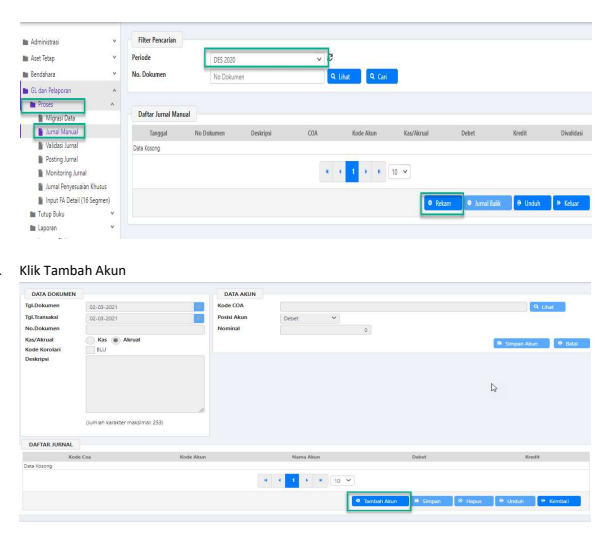
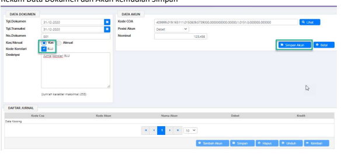
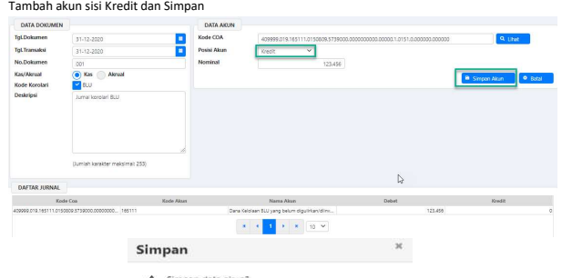
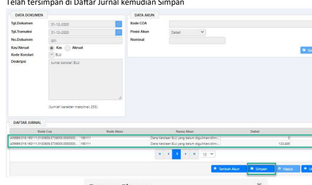

.

Petunjuk Teknis Aplikasi SAKTI)
�
GLÞ Jurnal Manual Korolari o BLU
�
�

| JURNAL MANUAL KOROLARI BLU No. Modul GLP Role User OPR (BLU) Modul Lain yang  - Terkait  Transaksi yang  Akun Neraca yang akan dimasukkan pada LAK dan LPSAL Tekait  Dokumen Input Memo Jurnal Output LAK, LPSAL (BLU) Validasi Hanya Jurnal Kas Akun LAK : 11573x,121631,122231,1213xx,121411,121911, dan  221511   |
|----------------------------------------------------------------------------------------------------------------------------------------------------------------------------------------------------------------------------------------------------------------------------------------------------------------------|

Jurnal Manual Kas Korolari BLU digunakan untuk memasukkan akun Neraca yang ingin dimasukkan pada LAK dan LPSAL Satker BLU. 

Langkah-langkah membuat jurnal manual korolari BLU: 
1. **Login Aplikasi SAKTI menggunakan user operator GLP>GL dan Pelaporan>Proses>Jurnal Manual>** 
Pilih Periode jurnal yang akan dibukukan dan Rekam 

## 3. Rekam Data Dokumen Dan Akun Kemudian Simpan

Simpan 4 Simpan data akun?

x Berhasil Simpan

OK
O Tambah Akun

Simpan data akun?

a Ya

  
Berhasil Simpan Data berhasil tersimpan

Telah tersimpan di Daftar Jurnal kemudian Simpan

d Unstr x
 9  Lan k Kredi 123.456 o 0 Youths Proses Sir Proses simpan data jumai?

Berhasil Simpan x Data jumal manual dengan kode buku besar GLP-
S
40999-12631393 berhasil disimpan OK
Lakukan validasi dan posting sebelum mencetak laporan.

4.