Petunjuk Teknis Aplikasi SAKTI)
Pencatatan Informasi Tingkat Kandungan Dalam Negeri (TKDN)
v.1.1 KEMENTERIAN KEUANGAN RI
DITJEN PERBENDAHARAAN
Pencatatan Informasi Tingkat Kandungan Dalam Negeri(TKDN)
Menu ini digunakan untuk melakukan pencatatan detil informasi terkait tingkat kandungan dalam negeri atas belanja barang/jasa yang direkam pada SAKTI 

| No.            | Uraian                                                                                                            |                                                                                                                        |                                                                                   |
|----------------|-------------------------------------------------------------------------------------------------------------------|------------------------------------------------------------------------------------------------------------------------|-----------------------------------------------------------------------------------|
| 1              | Modul                                                                                                             | KOM, PEM, BEN                                                                                                          |                                                                                   |
| 2              | Role User                                                                                                         | OPR                                                                                                                    |                                                                                   |
| 3              | Modul Lain yang Terkait                                                                                           | -                                                                                                                      |                                                                                   |
| 4              | Transaksi yang Terkait                                                                                            | KOM - Pencatatan BAST Kontraktual dan Non Kontraktual  PEM - Perekaman SPP LS Non BAST  BEN - Pencatatan SPby Non BAST |                                                                                   |
| 5              | Dokumen Input                                                                                                     | Data Kandungan TKDN pada transaksi barang/jasa                                                                         |                                                                                   |
| 6              | Output                                                                                                            | Laporan Realisasi TKDN                                                                                                 |                                                                                   |
| 7              | Validasi                                                                                                          | -                                                                                                                      | Perekaman Informasi TKDN harus memuat informasi Cluster  TKDN dan Persentase TKDN |
| -              | Transaksi Hapus BAST yang telah direkam nilai TKDNnya akan  turut menghapus data TKDN yang telah direkam          |                                                                                                                        |                                                                                   |
| -              | Transaksi Batal Validasi SPP yang telah direkam nilai TKDNnya  akan turut menghapus data TKDN yang telah direkam  |                                                                                                                        |                                                                                   |
| -              | Transaksi Batal Validasi SPBy yang telah direkam nilai  TKDNnya akan turut menghapus data TKDN yang telah direkam |                                                                                                                        |                                                                                   |
| A. PENDAHULUAN |                                                                                                                   |                                                                                                                        |                                                                                   |

Dalam rangka mendorong masyarakat agar lebih menggunakan produk dalam negeri dibandingkan produk impor, pemerintah menerapkan program Peningkatan Penggunaan Produksi Dalam Negeri atau yang lebih dikenal dengan sebutan P3DN. Program ini bertujuan untuk: 
a. meningkatkan penggunaan produk dalam negeri oleh pemerintah, badan usaha, dan masyarakat, b. memberdayakan industri dalam negeri melalui pengamanan pasar domestik, mengurangi ketergantungan kepada produk impor, dan meningkatkan nilai tambah di dalam negeri; c. dan memperkuat struktur industri dengan meningkatkan penggunaan barang modal, bahan baku, komponen, teknologi dan SDM dari dalam negeri. 

Salah satu bentuk implementasi P3DN adalah mewajibkan instansi pemerintah untuk 

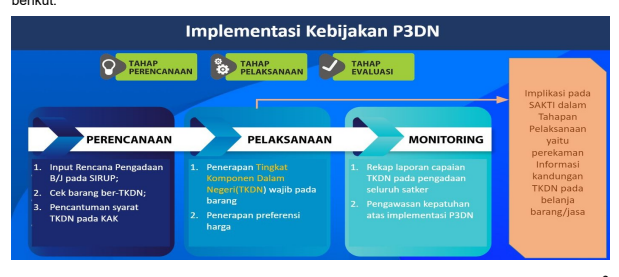

memaksimalkan penggunaan hasil produksi dalam negeri dalam kegiatan pengadaan barang/jasa yang dibiayai oleh APBN/APBD. Implementasi P3DN ini terbagi menjadi 3 tahapan yaitu, tahapan perencanaan, pelaksanaan, dan evaluasi/monitoring sebagaimana penjelasan pada gambar berikut: 
Sebagai salah satu alat ukur yang diharapkan dapat memberikan informasi yang bermanfaat dalam pengambilan keputusan, pemerintah menggunakan informasi Tingkat Kandungan Dalam Negeri (TKDN) atas suatu produk yang dihasilkan yaitu persentase komponen produksi yang dibuat di Indonesia pada suatu produk barang dan jasa atau gabungan antara barang dan jasa. Adapun informasi TKDN tersebut diperoleh melalui tahapan verifikasi sampai dengan proses sertifikasi TKDN oleh pihak berwenang melakukan penerbitan sertifikat TKDN. 

Dengan demikian, barang/jasa yang telah memiliki Sertifikat Tingkat Kandungan Dalam Negeri 
(TKDN) akan memperoleh preferensi dari panitia lelang sehingga diharapkan menjadi stimulus dalam peningkatan produksi dalam negeri. 

Terkait hal tersebut, telah dilakukan pengembangan pada Aplikasi SAKTI sehingga Rekapitulasi Informasi TKDN atas belanja Satuan Kerja dapat dihasilkan melalui perekaman pendetilan informasi TKDN atas BAST Kontraktual maupun Non Kontraktual yang direkam pada SAKTI. Adapun Informasi yang direkam terkait TKDN yaitu berupa: 
a. Informasi Persentase TKDN, 
b. Informasi Cluster TKDN (TKDN/Produk Dalam Negeri(PDN)/Impor), dan c. Klasifikasi Baku Komoditas Indonesia (KBKI) 
Berikut ini merupakan flow konsep perekaman informasi TKDN dalam rangka P3DN yang telah 

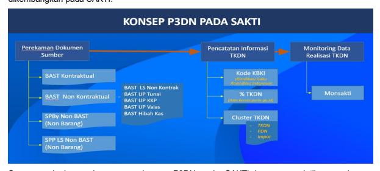 dikembangkan pada SAKTI: 
Secara garis besar, konsep perekaman P3DN pada SAKTI berupa pendetilan perekaman 

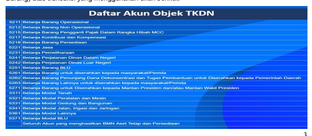

infromasi TKDN atas dokumen sumber yang telah direkam yang berasal dari BAST Kontraktual dan BAST Non Kontraktual Barang, SPBy Non BAST (Non Barang), dan SPP LS Non BAST (Non Barang) atas transaksi yang menggunakan akun berikut: 

3 

## B. Form Pencatatan Informasi Tkdn

User SAKTI yang memiliki kewenangan untuk melakukan perekaman informasi TKDN adalah 

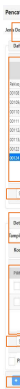

user yang memiliki role Operator Komitmen. Berikut adalah penjelasan tampilan layar form pencatatan informasi TKDN dengan penjelasan sebagai berikut: 

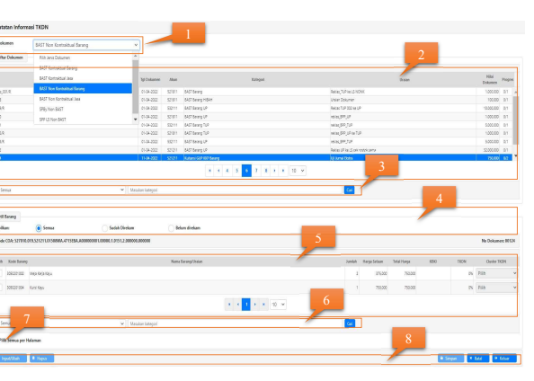

1. Filter Jenis Dokumen, merupakan fitur yang berfungsi sebagai filter untuk menampilkan daftar dokumen pada grid. Adapun filter Jenis Dokumen yang dapat dipilih untuk direkam informasi TKDNnya adalah sebagai berikut: 
a. BAST Kontraktual Barang; b. BAST Kontraktual Jasa; c. BAST Non Kontraktual Barang yang terdiri dari: 
1) Pencatatan Belanja Barang/Jasa LS Non Kontraktual, 2) Pencatatan Belanja Barang/Jasa UP Tunai/Bank, 3) Pencatatan Belanja Barang/Jasa Kas Hibah, 4) Pencatatan Belanja Barang/Jasa KKP, dan 5) Pencatatan Belanja Barang/Jasa UP Valas; d. BAST Non Kontraktual Jasa e. SPBy Non BAST (SPBy yang tidak menggunakan BAST sebagai dok sumber) 
f. SPP LS Non BAST (SPP yang tidak menggunakan BAST sebagai dok sumber) 
2. Tampilan Grid, menampilkan data dokumen sesuai dengan jenis filternya yang menampilkan field data: 
a. No. Dokumen = Nomor Dokumen Sumber b. Tgl Dokumen = Tanggal Dokumen c. Akun = 6 Digit Akun d. Kategori = Kategori/Jenis Dokumen e. Uraian = Uraian Dokumen Sumber f. Nilai Dokumen = Nilai Dokumen g. Progres = Progres pencatatan informasi TKDN sesuai dengan jumlah detil barang pada Dokumen Sumber 3. Filter Pencarian data pada Grid daftar dokumen 4. Filter Tampilan Detil Barang, berfungsi untuk menampilkan daftar detil barang atas dokumen yang dipilih. Terdiri dari 3 jenis Filter dengan penjelasan sebagai berikut: 
a. Semua = Menampilkan seluruh detil barang yang sudah/belum direkam informasi TKDN. 

Pada filter ini hanya dapat menampilkan data (view) 
b. Sudah Rekam = Menampilkan seluruh detil barang yang sudah dilakukan perekaman informasi TKDN. Pada filter ini dapat dilakukan proses ubah/hapus detil info TKDN 
c. Belum Rekam = Menampilkan seluruh detil barang yang belum direkam informasi TKDN. 

Pada filter ini hanya dapat dilakukan prose rekam informasi TKDN 
5. Detil Barang, menampilkan detil barang dari Dokumen yang dipilih, berisikan: 
a. Kode Barang = menampilkan informasi kode barang asset/persediaan yang dipilih b. Nama Barang/Uraian = Nama/Uraian barang c. Jumlah = Jumlah Barang d. Harga Satuan = harga per detil barang e. Total Harga = hasil kali jumlah barang dan harga satuan f. KBKI = 10 Digit Kode Klasifikasi Baku Komoditas Indonesia g. TKDN = Persentase TKDN 
h. Cluster TKDN = Pilihan cluster TKDN (TKDN/PDN/Impor) 
6. Filter Pencarian data pada Grid daftar detil barang per dokumen yang dipilih. 

7. Tombol pilih semua daftar detil barang untuk perekaman informasi TKDN secara sekaligus. 8. Tombol Aksi, terdiri dari: 
a. Input/Ubah = Untuk merekam/merubah informasi TKDN 
b. Hapus = Untuk menghapus data informasi TKDN yang telah direkam c. Simpan = Untuk menyimpan informasi TKDN yang telah direkam d. Batal = Batal/Reset perekaman e. Keluar = Keluar Form 

## C. Pencatatan Informasi Tkdn

Sebelum melakukan pencatatan informasi TKDN, pastikan bahwa data dokumen sumber telah memenuhi kriteria perekaman informasi TKDN yaitu sebagai berikut: 
a. untuk jenis dokumen BAST baik kontraktual maupun non kontraktual, pastikan telah melakukan perekaman BAST pada modul komitmen; b. untuk jenis dokumen SPBy Non BAST, pastikan telah dilakukan proses validasi SPBy oleh PPK; dan c. untuk jenis dokumen SPP LS Non BAST, pastikan telah dilakukan proses validasi SPP 
oleh PPK. 

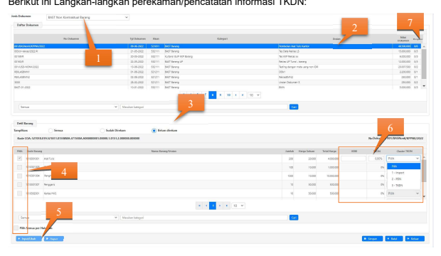

6
1. Login user operator komitmen  Komitmen  RUH  **Pencatatan Informasi TKDN lalu pilih** 
Jenis Dokumen 2. Pada Grid daftar dokumen, Pilih Dokumen yang akan direkam informasi TKDNnya 3. Cek detil Barang BAST, Pilih Filter "Belum Rekam" 4. Pilih/checkbox data yang akan didetilkan informasi TKDN 
5. Klik Tombol Input/Ubah 6. Rekam Informasi persentase TKDN, Cluster TKDN, dan kode KBKI(opsional) dengan ketentuan: 
a. TKDN  **Apabila memiliki sertifikat TKDN sebagaimana tercantum dalam laman** 
http://tkdn.kemenperin.go.id b. PDN  **Produk dan Produsen yang sesuai ditemukan dalam laman** 
http://tkdn.kemenperin.go.id/referensi_idx.php **atau berdasarkan hasil penyelidikan** 
perihal kebenaran produksi dalam negeri ke penyedia dan produsen c. Impor : Selain yang memenuhi TKDN dan PDN 
Catatan: Nilai Perekaman KBKI, Persentase TKDN, dan Cluster TKDN mengacu pada ketentuan/peraturan yang berlaku pada kemenperin.

7. Klik Tombol Simpan , lalu cek progres perekaman pada Grid Daftar Dokumen 

## D. Contoh Perekaman Infromasi Tkdn 1. Transaksi Yang Menghasilkan Barang

Transaksi yang menghasilkan Barang dalam hal ini terdiri dari BAST Kontraktual Barang dan Non Kontraktual Barang. Berikut ini merupakan contoh perekaman informasi TKDN 
atas transaksi BAST Non Kontraktual(BAST UP): 
Untuk informasi nilai TKDN dapat diakses melalui tkdn.kemenperin.go.id. Berikut contoh 

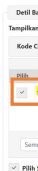

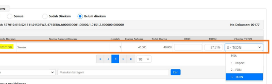

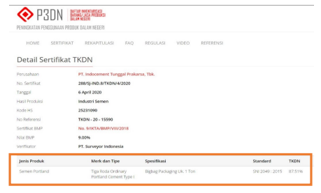

nilai informasi TKDN. 

## 2. Transaksi Yang Menghasilkan Non Barang 

Transaksi yang menghasilkan Barang dalam hal ini terdiri SPBy Non BAST dan SPP Non BAST. Berikut ini merupakan contoh perekaman informasi TKDN atas transaksi SPP Non BAST: 
Berdasarkan kedua contoh diatas, terlihat bahwa terdapat perbedaan dalam pendekatan perekaman detil informasi TKDN. Untuk Detil barang, pendekatan perekaman detil adalah pada kode barang yang digunakan. Sedangkan untuk Detil Jasa, perekaman detil informasi TKDN 
menggunakan pendekatan item pada detil SPP atau SPBy Non BAST. 

## E.   Cetak Laporan Informasi Tkdn

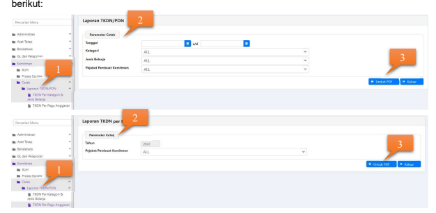

Untuk melihat rekap hasil perekaman informasi TKDN, Langkah-langkahnya adalah sebagai 1.  Login user operator komitmen → Komitmen → Cetak → Laporan TKDN → Ialu pilih jenis cetakan (TKDN per Kategori & TKDN per Pagu Anggaran)
2.   Tentukan Parameter Cetak 3.   Klik Tombol Unduh PDF
Berikut format cetakan Laporan Realisasi Tingkat Kandungan Dalam Negeri(TKDN) dan Laporan Realisasi TKDN per Pagu Anggaran Laporan Realisasi Tingkat Kandungan Dalam Negeri (TKDN)

| 015            | MENTERIAN KEUANGAN                              |                       |            |                       |                  |           |            |      |                   |
|----------------|-------------------------------------------------|-----------------------|------------|-----------------------|------------------|-----------|------------|------|-------------------|
| Unit Orpankasi | 2015.06                                         | DITJEN PERBENDAHARAAN |            |                       |                  |           |            |      |                   |
| Wavah Provinsi | .0199                                           |                       |            |                       |                  |           |            |      |                   |
| 527010         | KANTOR PUSAT DIREKTORAT JENDERAL PERBENDAHARAAN |                       |            |                       |                  |           |            |      |                   |
| Jenis Kawangan | : KP                                            | Kantor Panal          | VIKSI CAN  | : 17-05-2022 11:28:51 |                  |           |            |      |                   |
| HARI I         |                                                 |                       |            |                       |                  |           |            |      |                   |
| Juniah         | Harga Satuan                                    |                       |            |                       |                  |           |            |      |                   |
| Kalegor        | Norror BAST                                     | Tgl Dak               | Nilai BAST | Uraian Barang/Jasa    | Total            | KBKI      | PDNNon PDN | TKDN | Nilai Rupiah TKDN |
| Barang         |                                                 |                       |            |                       |                  |           |            |      |                   |
| 01 Jualas      | 12-02-2022                                      | 1.310,00              | 1.210,00   | S                     |                  |           |            |      |                   |
| AST Barang     | ian PNS                                         | s                     | 202,00     | ud                    | Non PON (Inport) | 3,00      |            |      |                   |
| 27 42-2022     | 500 000,0                                       | 18                    | 5.000      | 500.000               | 20000003         | 100:00.00 |            |      |                   |
| 2%             |                                                 |                       |            |                       |                  |           |            |      |                   |
| 1-01-2022      | 1.000,00                                        | 1.000,00              | 1.000,00   | 08/038293             | 45.98%           | 40.0      |            |      |                   |
| 101.429.0      |                                                 |                       |            |                       |                  |           |            |      |                   |
| 502.210.0      |                                                 |                       |            |                       |                  |           |            |      |                   |
| 20.01 %        |                                                 |                       |            |                       |                  |           |            |      |                   |

| Kementerian / Lembaga   |
|-------------------------|
| Uni! Organisasi         |
| Wayah/Propins           |
| Satuan Kerja            |
| Jeris Kewenangan        |
| Pejabat Persbuat Komite |

| : 015         | KEMENTERIAN KEUANGAN   |
|---------------|------------------------|
| 015.00        |                        |
| : 0199        | Instansi Press!        |
| : 527010      |                        |
| : KP          | Kantor Pusat           |
| aziz muthohar |                        |

KEMENTERIAN KEUANGAN
DITJEN PERBENDAHARAAN
Instansi Press!

KANTOR PUSAT DIREKTORAT JENDERAL PERBENDAHARAAN
Akakan Ceka
: 20-09-2022 04:53:04 Halam

| Realisasi                                                          |                  |                |              |           |            |       |                   |
|--------------------------------------------------------------------|------------------|----------------|--------------|-----------|------------|-------|-------------------|
| ca                                                                 | Pagu             | Realisasi TKDN | % TKDN       | Sisa Pagu |            |       |                   |
| Komitmen                                                           | Pembayaran       | GLP            |              |           |            |       |                   |
| 527090.018.521111.2150                                             | 14,051,475,001.0 | 11,701,800.00  | 6,00,001 a   | 0.00      | 11.00.00   | o     | 14,031,775,000.00 |
| 527013.019.521211.0150                                             | 44,750,00.0      | 2,90% 00.00    | 31,538,000 0 | 0.00      | 300,100.00 | 0.67% | 8,816,000.00      |
| 527010.019.521211.0/1569CD.0210AAG.A00000001.00000.1.0151.2.00000. | 48,750,000.00    | 17.508.00.00   | 4.000.000.00 | 0.00      | 1.350.00   | s     | 27.150.000.00     |

## F.   Monitoring P3Dn

Monitoring atas realisasi TKDN dalam rangka implementasi P3DN dapat dilihat melalui monsakti.kemenkeu.go.id dengan ilustrasi sebagai berikut:

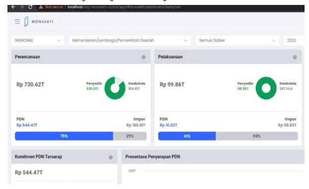

Data Perencanaan merupakan data Paket Perencanaan Pengadaan yang diambil dari SIRUP, dengan kategori Penyedia, maupun Swakelola dengan status terumumkan dan aktif.

Data Pelaksanaan bersumber dari:
SPSE (baik tender maupun non tender) yang sedang berjalan, dan non-kontraktual (swakelola, pencatatan, dan dana darurat). Toko Daring data pembelian yang tercatat pada platform Toko Daring. e-Katalog data pembelian yang tercatat pada platform eKatalog. PaDi UMKM data PO belanja BUMN yang dilakukan pada platform PADI
UMKM.

Data Pembayaran bersumber dari :
SAKTI data realisasi K/L pada tahap penerbitan SP2D
 SPSE data realisasi PD pada tahap penerbitan BAP PADi UMKM data realisasi BUMN yang status invoice telah dibayarkan.

## G. Hal Yang Perlu Diperhatikan :

- **Dalam hal satker melakukan perekaman informasi TKDN, agar memastikan seluruh informasi** 
mandatory terisi, yaitu Cluster TKDN serta Persentase TKDN yang dapat diperoleh dari sistus tkdn.kemenperin.go.id.

- **Transaksi Hapus BAST yang telah direkam nilai TKDNnya akan turut menghapus data TKDN yang telah** 
direkam 
- **Transaksi Batal Validasi SPP yang telah direkam nilai TKDNnya akan turut menghapus data TKDN** 
yang telah direkam
- **Transaksi Batal Validasi SPBy yang telah direkam nilai TKDNnya akan turut menghapus data TKDN** 
yang telah direkam
- **Teknis perekeman nilai informasi TKDN dapat mengacu pada Ketentuan/Peraturan yang berlaku yang** 
diterbitkan oleh Kementerian Perindustrian terkait dengan Program P3DN.

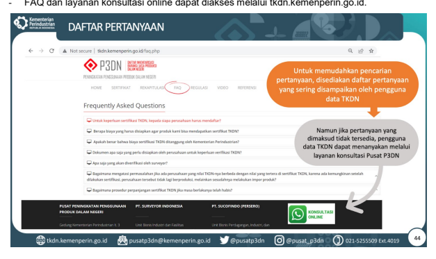

