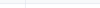
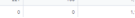
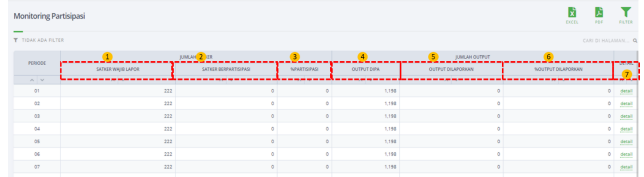

Petunjuk Teknis Aplikasi SAKTI)
PENGISIAN, PELAPORAN, DAN
�
MONITORING REALISASI KINERJA
(CAPAIAN OUTPUT) SATKER
Ver. 1.0 Tahun 2021
�
�

KEMENTERIAN KEUANGAN RI
DITJEN PERBENDAHARAAN
DESKRIPSI SINGKAT
Perekaman Data Realisasi Kinerja Satker 
 
Pentunjuk Teknis ini digunakan sebagai panduan untuk mengisi/merekam Data Realisasi Kinerja (Capaian Output) Satker 

| No.  1   | Modul                                         | KOM                                                   |
|----------|-----------------------------------------------|-------------------------------------------------------|
| 2        | Role User                                     | OPR                                                   |
| 3        | Modul Lain yang Terkait                       | KOM, PEM, ANG                                         |
| 4        | Transaksi yang Tekait                         | KOM - Perekaman Capaian Output                        |
|          | PEM - Realisasi                               |                                                       |
|          | SP2D ANG - Data Pagu,  Volume, dan Target  RO |                                                       |
| 5        | Dokumen Input                                 | Data Realisasi Kinerja Satker/Capaian RO              |
| 6        | Output                                        | Data Kumulatif  Realisasi Kinerja  Satker dan Cetakan |

| Daftar Isi DESKRIPSI SINGKAT i FREQUENTLY ASKED QUESTION (FAQ) i I. PENDAHULUAN 1 II. RUANG LINGKUP 2 III. KEWENANGAN PENCATATAN TRANSAKSI DAN PELAPORAN 2 IV. DAFTAR ISTILAH 2 V. PROSES BISNIS PENGISIAN, PELAPORAN , DAN KONFIRMASI DATA CAPAIAN OUTPUT 4 VI. PENGISIAN DATA CAPAIAN OUTPUT PADA APLIKASI SAKTI 5 1. Periode Pengisian Data Capaian Output 5 2. Rilis Sistem Dalam Rangka Pelaporan Data Capaian Output Tahun 2021 5 3. Tata Cara Pengisian Data Capaian Output Periode Januari, Februari, Maret 2021 6 4. Penyesuaian Pelaporan Data Capaian Output Dalam Rangka RSPP 6 5. Mekanisme Pengisian dan Koreksi/Penyesuaian Data 8 6. Penilaian IKPA Capaian Output 10 VII. PENGHITUNGAN DATA CAPAIAN OUTPUT 12 1. Bagaimana Menghitung Capaian Output 12 2. Mem-breakdown Tahapan/Aktivitas dalam Pencapaian Output Berdasarkan Komponen 14 3. Validasi dan Konfirmasi Capaian Output 15 4. Anomali Data Capaian Output 16 5. Referensi Keterangan 19 6. Komponen dan Ketentuan Pengisian Data Capaian Output 22 VIII. PETUNJUK PENGISIAN DATA CAPAIAN OUTPUT SATKER K/L– APLIKASI SAKTI 26 IX. MONITORING HASIL UPLOAD DAN STATUS DATA 29 X. MONITORING DATA CAPAIAN OUTPUT - ESELON I 31 XI. MONITORING DATA CAPAIAN OUTPUT - K/L 34 BOX: Contoh Perhitungan dan Perekaman Data Capaian Output 38 XII. CONTOH SURAT 43   |
|--------------------------------------------------------------------------------------------------------------------------------------------------------------------------------------------------------------------------------------------------------------------------------------------------------------------------------------------------------------------------------------------------------------------------------------------------------------------------------------------------------------------------------------------------------------------------------------------------------------------------------------------------------------------------------------------------------------------------------------------------------------------------------------------------------------------------------------------------------------------------------------------------------------------------------------------------------------------------------------------------------------------------------------------------------------------------------------------------------------------------------------------------------------------------------------------------------------------------------------------------------------------------------------------------------------------------------------------|

## Frequently Asked Question (Faq)

1. Apa yang berbeda dari pengisian data capaian output tahun 2021 di aplikasi SAKTI?

Beberapa perubahan dalam pengisian data antara lain:
a. Pengisian data di level Rincian Output (RO). mengikuti struktur anggaran dalam Redesain Sistem Perencanaan dan Penganggaran. 

b. Pemanfaatan data penyerapan anggaran level RO dari SAKTI. Data penyerapan anggaran level RO akan dikirim dari Aplikasi SAKTI dan digunakan sebagai basis penyerapan anggaran level RO pada Aplikasi OMSPAN. 

c. Pelaporan capaian output hanya melalui OMSPAN. Pelaporan data capaian output tidak lagi menjadi syarat untuk melakukan rekonsiliasi laporan keuangan.

2. Siapa yang punya kewajiban untuk mengisi data capaian output pada aplikasi SAKTI?

Pengisian data wajib dilakukan oleh Operator Komitmen Satker pengelola DIPA sesuai dengan pembagian kewenangan pada masing-masing Satker.

3. Saya pernah mengisi/merekam data capaian output tahun 2021 sebelum update SAKTI ini.

Apakah saya harus mengisi ulang data? Ya. Apabila pengisian datanya dilakukan sebelum update aplikasi SAKTI versi 21 April 2021, maka Operator Komitmen agar merekam kembali data pada Menu Realisasi Kinerja. Silahkan cek menu Realisasi Kinerja pada Modul Komitmen untuk memastikan apakah data telah diisi.

4. Saya sudah mengisi seluruh data capaian output pada menu Realisasi Kinerja. Bagaimana agar data dapat terkirim di OMSPAN? Sepanjang data capaian output telah direkam pada Aplikasi SAKTI, Aplikasi OMSPAN akan melakukan penarikan data secara terotomasi sesuai skedul penarikan data.

5.Untuk pengisian data pertama kali, apakah Saya cukup mengisi data di bulan Maret saja atau mulai dari bulan Januari? Kapan batas akhir perekamannya? Lalu untuk pelaporan data bulan April dan seterusnya, kapan batas akhir periode pengisiannya?

- Pengisian data pertama dilakukan untuk data bulan Januari hingga Maret 2021. Pengisian masing-masing RO dilakukan secara berurutan dari mulai Januari hingga Maret. Batas akhir pengisian data periode Januari - Maret 2021 adalah tanggal 7 Mei 2021.

- Pengisian data periode selanjutnya *(open period reguler)* adalah 10 hari kerja pertama setelah bulan berkenaan berakhir. Silahkan mengacu pada bagian VI.1: Periode Pengisian Data Capaian Output, dan bagian VI.2 : Rilis Sistem dalam Rangka Pelaporan Data Capaian Output Tahun 2021 pada halaman 5.

6. Saya hendak mengisi data periode bulan Januari-Maret 2021, namun periode pengisiannya sudah ditutup. Apa yang harus Saya lakukan? Satker agar melakukan perekaman data untuk bulan selanjutnya.

7. Terdapat kesalahan dalam merekam data bulan sebelumnya, sementara periode pelaporannya sudah ditutup. Apa yang harus Saya lakukan untuk memperbaiki data tersebut? Perbaikan data capaian output untuk periode pelaporan yang sudah ditutup agar dilakukan dengan menyesuaikan isian data di periode yang akan datang. Silahkan mengacu pada bagian VI.5 - Mekanisme Pengisian dan Koreksi/Penyesuaian Data pada halaman 8.

# Petunjuk Teknis (Juknis) Perekaman Data Realisasi Kinerja (Capaian Output) Satker K/L

## I. Pendahuluan

Dalam kerangka penganggaran berbasis kinerja, capaian output merupakan salah satu ukuran untuk menilai bagaimana setiap anggaran yang dikelola dipertanggungjawabkan. Oleh karena itu, sebagai bentuk dari transparansi dan akuntabilitas dalam pengelolaan keuangan negara, dibutuhkan data dan informasi yang reliabel untuk mengukur perkembangan output belanja yang dikelola oleh Satker K/L sehingga dapat diketahui sejauh mana program dan kegiatan pemerintah telah mencapai sasaran yang ditetapkan. Hal tersebut penting untuk menentukan langkah antisipatif apa yang perlu dilakukan agar setiap target output dapat tercapai pada akhir periode, serta sebagai langkah evaluasi untuk merumuskan kebijakan di masa mendatang. Namun sejauh ini, isu terkait validitas data masih menjadi permasalahan yang perlu ditindaklanjuti segera, mengingat penerapan penganggaran berbasis kinerja telah diinisiasi sejak berlakunya paket undang-undang keuangan negara. Pada tahun 2020, telah diimplementasikan proses pelaporan data capaian output melalui mekanisme rekonsiliasi Laporan Keuangan, yang diperkuat dengan memasukkan peran Kuasa BUN (KPPN) dalam melakukan konfirmasi data. Seiring dengan implementasi tersebut, dilakukan evaluasi terkait efektivitas proses pelaporan dan konfirmasi data capaian output melalui mekanisme rekonsiliasi LK, yang melibatkan pemrosesan pada aplikasi SAS/SAKTI, SAIBA, eRekon&LK, serta OMSPAN. Kemudian, pada periode Desember 2020, dilakukan simplifikasi proses pelaporan dan konfirmasi data capaian output dengan menggunakan aplikasi OMSPAN. 

Hasilnya cukup memuaskan dengan persentase pelaporan data capaian output sebesar 97,5% 
(156.690 output dari total 160.750 output). Untuk itu, di tahun 2021, mekanisme pelaporan data capaian output akan sepenuhnya dilaksanakan pada aplikasi OMSPAN dan tidak lagi melalui mekanisme rekonsiliasi LK. Tantangan berikutnya adalah bagaimana mengawal partisipasi dan kualitas pelaporan data capaian output seiring dengan implementasi Redesain Sistem Perencanaan dan Penganggaran (RSPP) yang mulai efektif dilaksanakan di tahun 2021. RSPP sejatinya dapat mendorong terwujudnya belanja yang berkualitas, lebih baik *(spending better)*, dan sesuai dengan tata kelola yang baik *(good governance)*, melalui 1) implementasi kebijakan *money follow program,* (2) penguatan penerapan anggaran berbasis kinerja, (3) penyelarasan rumusan Program dan Kegiatan antara dokumen perencanaan dan dokumen penganggaran, (4) dan penyelarasan rumusan nomenklatur Program, Kegiatan, Keluaran *(Output)* Kegiatan yang mencerminkan "real work" (konkret). Untuk mendukung implementasi RSPP, telah dilakukan penyesuaian aplikasi SAKTI sesuai core business RSPP. Hal utama dari penyesuaian aplikasi SAKTI dalam RSPP adalah pendetilan data transaksi sampai dengan 15/16 segmen COA, sehingga basis transaksi dapat ditampilkan sampai dengan level segmen 15 (subkomponen) atau level segmen 16 (item). Adapun modul yang disesuaikan dalam rangka RSPP meliputi modul Anggaran, modul Komitmen, modul Bendahara, dan modul Pembayaran. Pada Modul Komitmen, penyesuaian salah satunya dilakukan pada menu Realisasi Kinerja yang berfungsi untuk merekam data capaian output Satker. Sesuai struktur anggaran dalam RSPP, Pengisian dilakukan pada level Rincian Output (RO) yang merupakan keluaran (output) riil dari Satker yang sifatnya sangat spesifik. Pengisian pada level RO sifatnya lebih detil karena berada pada level segmen 13. Sementara proses bisnis sebelumnya, Pengisian data capaian output dilakukan pada level segmen 12. Berbagai perubahan dan penyesuaian aplikasi tersebut tentunya harus diikuti dengan peningkatan pemahaman dari Satker terkait proses bisnis serta teknis pengoperasian sistem aplikasinya. Untuk itu, Petunjuk Teknis Pengisian Data Capaian Output ini disusun agar dapat digunakan sebagai media peningkatan kapasitas pengelola keuangan dalam rangka pengisian data capaian output (RO) Satker pengguna aplikasi SAKTI.

## Ii. Ruang Lingkup

Petunjuk Teknis ini mengatur tentang tata cara pengisian capaian output oleh Operator Komitmen Satker pengguna aplikasi SAKTI, serta tata cara pelaporan dan monitoringnya pada aplikasi OMSPAN.

## Iii. Kewenangan Pencatatan Transaksi Dan Pelaporan

Pengisian data capaian output Satker pengguna aplikasi SAKTI dilakukan oleh Operator Komitmen sesuai dengan kewenangan masing-masing.

## Iv. Daftar Istilah

Beberapa istilah yang muncul dalam Juknis ini antara lain:

| 1.                                                                                          | Rincian Output                                                                                                                                                                                | :    | Keluaran (output) riil yang sangat spesifik yang dihasilkan oleh unit                                                                                                       |        |          |
|---------------------------------------------------------------------------------------------|-----------------------------------------------------------------------------------------------------------------------------------------------------------------------------------------------|------|-----------------------------------------------------------------------------------------------------------------------------------------------------------------------------|--------|----------|
| (RO)                                                                                        | kerja K/L yang berfokus pada isu dan/atau lokasi tertentu serta  berkaitan langsung dengan tugas dan fungsi unit kerja tersebut  dalam mendukung pencapaian sasaran kegiatan yang ditetapkan. |      |                                                                                                                                                                             |        |          |
| 2.                                                                                          | Klasifikasi Rincian                                                                                                                                                                           | :    | Kumpulan atas output (Rincian Output) K/L yang disusun dengan                                                                                                               |        |          |
| Output (KRO)                                                                                | mengelompokkan                                                                                                                                                                                | atau | mengklasifikasikan                                                                                                                                                          | muatan | keluaran |
| (output) yang sejenis/serumpun berdasarkan sektor/bidang/jenis  tertentu secara sistematis. |                                                                                                                                                                                               |      |                                                                                                                                                                             |        |          |
| 3.                                                                                          | Progres Capaian  Rincian Output  (PCRO)                                                                                                                                                       | :    | Persentase yang menunjukkan tingkat penyelesaian dari berbagai  tahapan atau aktivitas yang dilakukan Satker dalam mencapai  suatu output riil/spesifik berupa barang/jasa. |        |          |
| 4.                                                                                          | Realisasi Volume  Rincian Output  (RVRO)                                                                                                                                                      | :    | Capaian keluaran (output) riil berupa jumlah barang atau jasa yang  dihasilkan oleh Satker atas penggunaan anggarannya.                                                     |        |          |

| 5.                             | Persentase  Penyerapan  Anggaran (PPA)                                                                                                                                                                 | :   | Persentase                                                                                                                                                | yang   | menunjukkan   | perbandingan   | penyerapan   |
|--------------------------------|--------------------------------------------------------------------------------------------------------------------------------------------------------------------------------------------------------|-----|-----------------------------------------------------------------------------------------------------------------------------------------------------------|--------|---------------|----------------|--------------|
| terhadap pagu anggaran Satker. |                                                                                                                                                                                                        |     |                                                                                                                                                           |        |               |                |              |
| 6.                             | Gap                                                                                                                                                                                                    | :   | Angka yang menunjukkan selisih antara PCRO dengan PPA pada  suatu RO tertentu.                                                                            |        |               |                |              |
| 7.                             | Target Rincian                                                                                                                                                                                         | :   | Angka yang menunjukkan jumlah/kuantitas dari output di level RO                                                                                           |        |               |                |              |
| Output                         | yang direncanakan untuk dicapai dalam satu tahun anggaran pada  DIPA.                                                                                                                                  |     |                                                                                                                                                           |        |               |                |              |
| 8.                             | Rincian Output                                                                                                                                                                                         | :   | RO yang dikelola oleh Satker Kementerian Negara/Lembaga yang                                                                                              |        |               |                |              |
| Strategis                      | merupakan bagian dari pencapaian sasaran strategis pemerintah  sesuai Rencana Kerja Pemerintah dan dipantau perkembangannya  secara berkelanjutan oleh Menteri Keuangan selaku Bendahara  Umum Negara. |     |                                                                                                                                                           |        |               |                |              |
| 9.                             | Non Rincian Output                                                                                                                                                                                     | :   | RO yang dikelola oleh Satker Kementerian Negara/Lembaga yang                                                                                              |        |               |                |              |
| Strategis                      | tidak termasuk kategori RO strategis.                                                                                                                                                                  |     |                                                                                                                                                           |        |               |                |              |
| 10.                            | RO Terkonfirmasi                                                                                                                                                                                       | :   | Data RO yang dinilai wajar oleh sistem (by system) atau oleh  petugas berwenang sesuai dengan kriteria pengisian data yang  memadai.                      |        |               |                |              |
| 11.                            | RO Tidak                                                                                                                                                                                               | :   | Data RO yang dinilai tidak wajar karena tidak memenuhi sejumlah                                                                                           |        |               |                |              |
| Terkonfirmasi                  | kriteria pengisian data yang memadai.                                                                                                                                                                  |     |                                                                                                                                                           |        |               |                |              |
| 12.                            | Anomali kuantitatif                                                                                                                                                                                    | :   | Data RO yang terindikasi tidak selaras pengisiannya berdasarkan  perbandingan antar komponen data yang bersifat kuantitatif  seperti PCRO, RVRO, dan PPA. |        |               |                |              |
| 13.                            | Anomali                                                                                                                                                                                                | :   | Data RO yang termasuk dalam kategori anomali kuantitatif yang                                                                                             |        |               |                |              |
| keterangan                     | tidak disertai dengan penjelasan yang memadai. Data yang bersifat  anomali keterangan akan dikonfirmasi oleh KPPN ke Satker K/L  untuk diperbaiki.                                                     |     |                                                                                                                                                           |        |               |                |              |

## V. Proses Bisnis Pengisian, Pelaporan , Dan Konfirmasi Data Capaian Output

Proses Pelaporan Data Capaian Output oleh Satker dan Konfirmasi oleh KPPN dapat diuraikan sebagai berikut:
Gambar 1. Proses Bisnis Pengisian, Pelaporan, dan **Konfirmasi Data Capaian Output**

1. Operator Komitmen mengakses menu Realisasi Kinerja dan merekam data capaian output, antara lain: (a) RVRO, (b) PCRO, dan (c) Keterangan. Pengisian data dapat dilakukan sesuai jadwal *open period* pelaporan data.

2. Aplikasi OMSPAN akan melakukan penarikan data capaian output sesuai skedul penarikan data dan melakukan validasi untuk menentukan status konfirmasi.

3. User PDMS/MSKI memonitor data capaian output pada Modul Konfirmasi Capaian Output. 4. User PDMS/MSKI kemudian melakukan identifikasi kewajaran data, khususnya untuk data capaian output yang Tidak Terkonfirmasi, dengan membandingkan komponen data yang ada (Penyerapan Anggaran, RVRO, PCRO, dan Keterangan).

5. Berdasarkan hasil analisis tersebut, maka akan ada 2 kondisi:
5a. Seluruh data capaian output telah valid dengan status Terkonfirmasi. 5b. Terdapat satu atau lebih data yang belum valid dengan status Tidak Terkonfirmasi. Dalam hal masih terdapat output yang dinilai belum valid, maka user PDMS/MSKI mengisi catatan penolakan data dan menyampaikan pemberitahuan ke Satker untuk melakukan perbaikan data. Catatan: User PDMS/MSKI dapat mengubah status data capaian output yang sudah Terkonfirmasi by system menjadi Tidak Terkonfirmasi apabila data dinilai masih tidak wajar.

6. Data capaian output yang telah melalui proses validasi akan tersimpan pada database OMSPAN.

7. Isian dan status data capaian output pada OMSPAN akan menjadi basis perhitungan IKPA 
Indikator Capaian Output sesuai formula perhitungan yang ditetapkan.

## Vi. Pengisian Data Capaian Output Pada Aplikasi Sakti 1. Periode Pengisian Data Capaian Output

Pengisian capaian output dilakukan setiap bulan, setelah bulan berkenaan berakhir. Form Pengisian data pada Menu Realisasi Kinerja akan aktif apabila periode pelaporan data capaian output dibuka, yakni pada saat *open period* reguler dan *open period* tambahan, dengan ketentuan sebagai berikut:
- *Open period* reguler, yaitu periode buka sistem secara nasional yang ditetapkan secara terotomasi untuk 10 hari kerja bulan berikutnya atau sesuai kebijakan lain yang ditentukan.

- *Open period* tambahan, yaitu periode pelaporan tambahan yang ditetapkan oleh KPPN di luar open period reguler. *Open period* tambahan dapat diberikan oleh KPPN berdasarkan permohonan dispensasi dari Satker. 

## Penting!!! 

Kecuali diatur lain, *open period* tambahan hanya dapat diberikan s.d. akhir bulan berikutnya. Misalnya, untuk pelaporan data bulan Juni 2021 yang dilakukan pada bulan Juli 2021, maka *open period* tambahan dapat diberikan s.d. 31 Juli 2021. 

 

## 2. Rilis Sistem Dalam Rangka Pelaporan Data Capaian Output Tahun 2021

Pengisian dan pelaporan data capaian output tahun 2021 pada Satker pengguna Aplikasi SAKTI dilakukan pertama kali pada bulan April 2021 untuk data capaian output bulan Januari, Februari, dan Maret. Jadwal pelaporan tahun 2021 adalah sebagai berikut:

| No.   | Data Capaian Output Bulan   | Periode Pelaporan Buka Sistem  Nasional*)   |
|-------|-----------------------------|---------------------------------------------|
| 1.    | Januari 2021                | 21 April s.d. 7 Mei 2021                    |
| 2.    | Februari 2021               | 21 April s.d. 7 Mei 2021                    |
| 3.    | Maret 2021                  | 21 April s.d. 7 Mei 2021                    |
| 4.    | April 2021                  | 1 s.d. 19 Mei 2021                          |
| 5.    | Mei 2021                    | 1 s.d. 15 Juni 2021                         |
| 6.    | Juni 2021                   | 1 s.d. 14 Juli 2021                         |
| 7.    | Juli 2021                   | 1 s.d. 16 Agustus 2021                      |
| 8.    | Agustus 2021                | 1 s.d. 14 September 2021                    |
| 9.    | September 2021              | 1 s.d. 14 Oktober 2021                      |
| 10.   | Oktober 2021                | 1 s.d. 12 November 2021                     |
| 11.   | November 2021               | 1 s.d. 14 Desember 2021                     |
| 12.   | Desember 2021               | 1 s.d. 14 Januari 2022                      |

## 3. Tata Cara Pengisian Data Capaian Output Periode Januari, Februari, Maret 2021

Untuk periode pelaporan pertama bulan Januari, Februari, dan Maret 2021, Satker agar memperhatikan dan mengikuti ketentuan sebagaimana berikut:
a. Pengisian data capaian output dapat dilakukan apabila Satker telah menyelesaikan proses migrasi RSPP. Proses migrasi dilakukan dengan mengacu pada ke Juknis Migrasi Implementasi RSPP Modul Pelaksanaan; b. Pengisian data untuk setiap RO dilakukan secara sekuensial (berurutan) mulai dari Pengisian

data RO bulan Januari, Februari, dan Maret 2021; dan c. Periode pengisian data capaian output periode Januari, Februari dan Maret tahun 2021 dilakukan s.d. 7 Mei 2021 melalui buka sistem pelaporan secara nasional (open period reguler); dan

## Penting!!! 

Untuk pengisian data capaian output periode Januari, Februari, dan Maret tahun 2021 hanya dapat dilakukan s.d. 7 Mei 2021. Setelah tanggal tersebut, menu Realisasi Kinerja bulan Januari, Februari, dan Maret akan tidak aktif.

 

 

## 4. Penyesuaian Pelaporan Data Capaian Output Dalam Rangka Rspp

Penyusunan program, kegiatan, keluaran tahun 2021 mengikuti pedoman RSPP dalam Surat Bersama Kementerian Keuangan No. 122/MK.2/2020 dan Kementerian PPN/Bappenas No. B517/M.PPN/D.8/PPN.04.03/2020 tanggal 24 Juni 2020 dan Perdirjen Anggaran Nomor PER5/AG/2020 tentang Petunjuk Teknis Penyusunan dan Penelaahan Rencana Kerja dan Anggaran Kementerian/Lembaga dan Pengesahan DIPA. Dalam implementasi RSPP, program dan kegiatan dapat bersifat lintas, dan keluaran dinyatakan dalam output yang riil, berupa Klasifikasi Rincian Output (KRO) dan Rincian Output (RO). 

## A. Penyesuaian Pengisian Data Capaian Output Di Level Rincian Output (Ro)

Rumusan output dalam RSPP dibedakan menjadi KRO dan RO. KRO merupakan pengelompokkan atau klasifikasi RO sejenis. Sementara RO menunjukkan output riil yang menggambarkan pencapaian sasaran kegiatan unit kerja pelaksana secara langsung. RO bersifat sangat spesifik (unik) sehingga mencerminkan tugas dan fungsi unit kerja yang menghasilkannya. Oleh karena itu pengukuran kinerja riil Satker mulai tahun 2021 dilakukan di level RO. 

| 2020                      | RSPP                     | INFORMASI KINERJA                |
|---------------------------|--------------------------|----------------------------------|
| Program Lintas            | Program                  | Program                          |
| Sasaran Program           | Outcome                  | Stakeholders Perspective         |
| Indikator Kinerja Program | Indikator Outcome        |                                  |
| Output Program            | Output Program           | Customers Perspective            |
| Indikator Output Program  | Indikator Output Program |                                  |
| Kegiatan Lintas           | Kegiatan                 | Kegiatan                         |
| Sasaran Kegiatan          | Sasaran Kegiatan         |                                  |
| Standardisasi             | Output                   | Klasifikasi Rincian Output (KRO) |
| KRO                       | Internal Process         |                                  |
| Indikator Output          | Indikator KRO            | dan                              |
| Sub-Output                | Rincian Output (RO)      | Larning & Growth                 |
| Komponen                  | Komponen                 |                                  |
| Sub-Komponen              | Sub Komponen             |                                  |
| Akun                      |                          |                                  |
| Akun                      |                          |                                  |
| Detail Belanja            | Detail Belanja           |                                  |

## Sumber: Ditjen Anggaran.

Dari tabel di atas, RO menempati level suboutput, atau berada 1 level lebih detail dibandingkan dengan output di tahun 2020. Sehingga untuk memenuhi kebutuhan penilaian kinerja di level RO, dilakukan penyesuaian level penginputan data capaian output pada aplikasi SAKTI yakni dengan menyajikan form penginputan data untuk Operator Komitmen di level RO.

## B.   Pemanfaatan Data Penyerapan Anggaran Dari Aplikasi Sakti Untuk Level Ro

Pengisian data capaian output membutuhkan data/informasi mengenai penyerapan anggaran di level RO. Data penyerapan akan digunakan untuk proses validasi dan konfirmasi data sehingga dapat diidentifikasi kewajaran pengisian yang dilakukan oleh Operator Komitmen.

Saat ini data penyerapan di level RO belum tersedia secara langsung pada aplikasi SPAN. Data penyerapan anggaran di SPAN berada pada level KRO, sedangkan informasi di level RO terdapat pada SPP sesuai pendetilan 15/16 segmen yang direkam Satker di aplikasi SAKTI. 

Untuk pemenuhan data realisasi anggaran level RO di SPAN, maka akan digunakan data realisasi dari Satker berdasarkan data SPP/SPM yang telah terbit SP2D-nya pada saat data capaian output Satker ditarik oleh aplikasi OMSPAN. Pemenuhan data penyerapan anggaran di level RO untuk tahun 2021 adalah sebagaimana gambar di bawah ini:

1) Operator pembayaran merekam SPP dengan informasi pendetilan data pada 15/16 segmen (*chart of account*/COA). PPK mengajukan SPP ke PPSPM untuk kemudian diverifikasi dan diterbitkan SPM-nya.

2) SPM yang diajukan ke KPPN divalidasi oleh sistem (12 segmen COA) dan diterbitkan SP2D-nya.

3) SP2D yang terbit akan tercatat sebagai penyerapan anggaran di level KRO SPAN. 4) Berdasarkan data SP2D yang terbit, SAKTI akan mengidentifikasi dan menyajikan penyerapan anggaran akan di level 15/16 segmen COA.

5) Pada menu Realisasi Kinerja, penyerapan anggaran akan ditampilkan pada level RO 
sebagai basis perhitungan GAP Progres Capaian Rincian Output (PCRO) dengan Persentase Penyerapan Anggaran (PPA).

6) Operator Komitmen mengisi data capaian output pada menu Realisasi Kinerja. OMSPAN 
akan melakukan penarikan data capaian output dan data penyerapan anggaran di level RO.

7) OMSPAN akan menyandingkan data penyerapan anggaran di level KRO yang bersumber dari SPAN dengan *summary* data penyerapan anggaran di level KRO yang bersumber dari SAKTI pada menu Monitoring Inkonsistensi KRO.

## 5. Mekanisme Pengisian Dan Koreksi/Penyesuaian Data A. Pengisian Data Non Kumulatif

Pengisian data capaian output dilakukan dengan menginput penambahan capaian pada bulan tersebut saja (sifatnya non kumulatif). Ilustrasi pengisian datanya adalah sebagai berikut: Operator Komitmen *akan mengisi data capaian output bulan Juli pada aplikasi SAKTI.* Berdasarkan perhitungan, PCRO kumulatif sampai dengan bulan Juli adalah 60,00% dengan RVRO sebesar 3 dokumen. Adapun sampai dengan bulan Juni, PCRO kumulatif yang telah tercapai adalah 50,00% dengan RCVO kumulatif 2 dokumen. Maka, pengisian data di Menu Realisasi Kinerja SAKTI adalah sebagai berikut:

b. Mekanisme Penyesuaian Data atas Pengisian Data Bulan Sebelumnya Apabila pada saat periode berjalan Operator Komitmen menemukan kekeliruan dalam pengisian data bulan-bulan yang lalu, maka penyesuaiannya dilakukan cukup pada periode pelaporan berikutnya. Operator Komitmen tidak dapat mengubah data capaian output pada periode sebelumnya yang telah direkam dan dilaporkan ke aplikasi OMSPAN. Ilustrasinya adalah sebagai berikut:
- Satker telah merekam dan melaporkan data capaian output bulan Jan s.d. April sebagai berikut:

Periode PCRO Non 

Kumulatif 

PCRO Kumulatif 

Jan 5% 5%

Feb 15% 20% Mar 10% 30% Apr 8% 38%

- Pada saat Operator Komitmen hendak melakukan pengisian data periode bulan Mei, dihitung bahwa PCRO kumulatif bulan Mei sebesar 35%.

- Operator Komitmen menemukan bahwa terdapat kesalahan pada saat melaporkan capaian bulan Maret, yaitu PCRO non kumulatif yang seharusnya dilaporkan adalah 3% (bukan 10%) sehingga nilai yang seharusnya dilaporkan adalah sebagai berikut:

| Periode   | PCRO Non   | PCRO   |
|-----------|------------|--------|
| Kumulatif | Kumulatif  |        |
| Jan       | 5%         | 5%     |
| Feb       | 15%        | 20%    |

Mar 3% 23%

Apr 8% 31% Mei 4% 35%

- Atas hal tersebut, maka Operator Komitmen saat melakukan pengisian data capaian output bulan Mei tidak dapat mengubah data capaian output bulan Maret. Operator Komitmen cukup melakukan penyesuaian pada bulan Mei, dengan menginput PCRO non kumulatif sebesar -3% (minus tiga persen) agar capaian kumulatifnya sebesar 35%.

Jan 5% 5%

- Operator Komitmen menambahkan penjelasan pada kolom keterangan yang menjelaskan kondisi tersebut, misalnya "Penambahan PCRO bulan Mei senilai -3% adalah penyesuaian untuk kesalahan Pengisian data bulan Maret yang seharusnya sebesar 3% (sebelumnya diisi 10%)". 

## 6. Penilaian Ikpa Capaian Output

Terdapat perubahan formulasi penilaian IKPA indikator Capaian Output pada tahun 2021. 

Penilaian IKPA Capaian Output tidak lagi dinilai dari status Terkonfirmasi/Tidak Terkonfimasi, namun akan dinilai berdasarkan capaian RO-nya, yang tercermin dari PCRO maupun RVRO. Sebelum dilakukan penilaian, setiap data RO akan ditentukan terlebih dahulu status tahapannya untuk kemudian ditentukan formula perhitungan Nilai Kinerja masing-masing RO.

## A. Status Tahapan

OMSPAN akan memberikan status tahapan pada setiap RO yang dilaporkan berdasarkan isian data PCRO yang masuk ke database OMSPAN. Status tahapan capaian output dibagi menjadi 3, yakni: 1) Persiapan/Proses PBJ, 2) Proses Pelaksanaan, dan 3) Selesai. Penentuan status tahapannya adalah sebagai berikut:

| PCRO      |           |     |
|-----------|-----------|-----|
| Kumulatif | Kumulatif |     |
| Feb       | 15%       | 20% |
| Mar       | 10%       | 30% |
| Apr       | 8%        | 38% |
| Mei       | -3%       | 35% |

| No.   | Status Tahapan       | Kondisi         |
|-------|----------------------|-----------------|
| 1.    | Persiapan/Proses PBJ | PCRO=0,         |
| 2.    | Proses Pelaksanaan   | 0 %< PCRO <100% |
| 3.    | Selesai              | PCRO=100%       |

Misalnya, pada bulan Juni, Satker memiliki 3 output dengan capaian kumulatif yang dilaporkan adalah sebagai berikut:

| Status                                                                               |        |           |         |      |         |
|--------------------------------------------------------------------------------------|--------|-----------|---------|------|---------|
| No.                                                                                  | RO     | Target    | PCRO    | RVRO | Tahapan |
| 1.                                                                                   | RO 001 | 10 unit   | 100,00% | 10   | (3)     |
| komputer                                                                             |        |           |         |      |         |
| 2.                                                                                   | RO 002 | 1 gedung  | 0,00 %  | 0    | (1)     |
| 3.                                                                                   | RO 003 | 1 layanan | 58,33%  | 0    | (2)     |
| Status tahapan akan menjadi dasar dalam menentukan formula perhitungan nilai kinerja |        |           |         |      |         |

Status tahapan akan menjadi dasar dalam menentukan formula perhitungan nilai kinerja capaian RO.

## B. Formula Kinerja

Nilai IKPA Capaian Output akan dihitung berdasarkan rasio total Nilai Kinerja Rincian Output (RO) terhadap jumlah RO yang dikelola oleh Satker. Sementara itu, Nilai Kinerja RO merupakan nilai kinerja masing-masing RO yang dihitung berdasarkan perbandingan antara capaian atau realisasi RO terhadap target RO.

Nilai IKPA Capaian Output: 

| Nilai IKPA Capaian Output:                 | Nilai Kinerja RO:                    |                                          |
|--------------------------------------------|--------------------------------------|------------------------------------------|
| 𝐽𝑢𝑚𝑙𝑎ℎ 𝑁𝑖𝑙𝑎𝑖 𝐾𝑖𝑛𝑒𝑟𝑗𝑎 𝑅𝑂 |                                      |                                          |
| =                                          | 𝐽𝑢𝑚𝑙𝑎ℎ 𝑅𝑂                     | 𝐶𝑎𝑝𝑎𝑖𝑎𝑛 𝑅𝑂 (𝑘𝑢𝑚𝑢𝑙𝑎𝑡𝑖𝑓) |
| =                                          | 𝑇𝑎𝑔𝑒𝑡 𝑅𝑂 (𝑘𝑢𝑚𝑢𝑙𝑎𝑡𝑖𝑓) |                                          |

Adapun Nilai Kinerja RO akan dihitung berdasarkan formula sesuai dengan status tahapan dan/atau periode pelaporan yang berlangsung sebagaimana berikut:
Formula 1: Nilai Kinerja RO: 

| Formula 1: Nilai Kinerja RO:                     | Formula 2: Nilai Kinerja RO                                                                  |                                                  |           |       |    |        |        |
|--------------------------------------------------|----------------------------------------------------------------------------------------------|--------------------------------------------------|-----------|-------|----|--------|--------|
| 𝑅𝑒𝑎𝑙𝑖𝑠𝑎𝑠𝑖 𝑃𝐶𝑅𝑂 (𝑘𝑢𝑚𝑢𝑙𝑎𝑡𝑖𝑓) |                                                                                              |                                                  |           |       |    |        |        |
| =                                                | 𝑇𝑎𝑔𝑒𝑡 𝑃𝐶𝑅𝑂                                                                          | 𝑅𝑒𝑎𝑙𝑖𝑠𝑎𝑠𝑖 𝑅𝑉𝑅𝑂 (𝑘𝑢𝑚𝑢𝑙𝑎𝑡𝑖𝑓) |           |       |    |        |        |
| =                                                | 𝑇𝑎𝑟𝑔𝑒𝑡 𝑅𝑂                                                                            |                                                  |           |       |    |        |        |
| -                                                | digunakan untuk RO dengan status tahapan (1) dan (2)                                         | -                                                | digunakan | untuk | RO | dengan | status |
| tahapan (3)                                      |                                                                                              |                                                  |           |       |    |        |        |
| -                                                | Khusus periode bulan Desember, maka  seluruh RO akan dihitung dengan  menggunakan Formula 2. |                                                  |           |       |    |        |        |

## C. Penentuan Target Pcro Dan Target Ro

Target PCRO tiap triwulan I s.d. Triwulan III diproksikan sama dengan target penyerapan anggaran triwulanan (15%-40%-60%). Sementara itu, di Tw IV, target PCRO adalah 100% atau sebesar target RO dalam DIPA. Khusus untuk bulan Desember, penilaian hanya menggunakan Formula 2 di mana targetnya adalah sebesar target RO dalam DIPA.

## D. Status Konfirmasi

Status konfirmasi capaian output (Terkonfirmasi/Tidak Terkonfirmasi) akan menentukan apakah nilai kinerja RO pada suatu RO dihitung dengan menggunakan formula penilaian atau tidak. Apabila RO memiliki status Tidak Terkonfirmasi, maka Nilai Kinerja RO-nya akan menjadi 0 berapapun capaian PCRO maupun RVRO-nya. Sementara, apabila RO tersebut Terkonfirmasi, maka akan diberikan nilai sesuai formula perhitungan pada bagian b. Formula Kinerja.

## E. Kerangka Logika Penentuan Formula Untuk Nilai Kinerja Ro

Proses penentuan formula untuk Nilai Kinerja RO adalah sebagai berikut:
Gambar 3. Proses Penentuan **Formula dalam Menghitung Nilai Kinerja RO**

## Vii. Penghitungan Data Capaian Output 1. Bagaimana Menghitung Capaian Output

Perhitungan capaian output ditujukan untuk melihat sejauh mana progres dan capaian riil dari suatu RO setiap periodenya (setiap bulan). Perhitungan capaian output merupakan kewenangan masing-masing Satker berdasarkan metode perhitungan yang sudah ditentukan oleh instansi vertikal maupun oleh Satker sendiri. Untuk keselarasan data, Satker dapat berkoordinasi dan berkonsultasi terlebih dahulu dengan unit vertikalnya, misalnya dengan biro perencanaan terkait dengan metode perhitungan capaian RO-nya. Dalam hal Satker belum memiliki metode perhitungan/standardisasi tertentu, maka perhitungan capaian output dapat mengacu pada beberapa contoh di Juknis ini. Namun demikian, dimungkinan akan ada berbagai varian output yang belum terakomodasi perhitungannya dalam Juknis ini. Sekali lagi, perhitungan capaian RO pada prinsipnya merupakan kewenangan Satker dalam hal ini PPK, dengan tetap memperhatikan kewajaran data dan informasi yang memadai. Selanjutnya, ada beberapa prinsip yang digunakan agar berbagai data output yang akan digunakan sebagai bahan analisis nantinya dapat konsisten, yakni: a. RVRO baru diisi apabila output tersebut memang secara utuh telah tercapai. RVRO tidak diisi dengan angka pecahan yang dapat membuat data dan informasi menjadi tidak tepat. Misalnya, RVRO untuk output berupa bangunan, maka dapat diisi dengan 3 bangunan, bukan 3,5 bangunan. Atau output berupa dokumen diisi dengan angka 10 dokumen, bukan 9,5 dokumen. Contoh kasusnya adalah sebagaimana disajikan sebagai berikut. Misalnya untuk output berupa "pembangunan rumah susun" dengan target output berupa 20 unit bangunan. Pada bulan Juni 2021, sudah selesai dibangun sebanyak 3 unit, sementara unit lainnya masih dalam progres. Detil progresnya adalah sebagai berikut:

| Progress kinerja                    | Konversi                                                      |                         |      |       |                                 |
|-------------------------------------|---------------------------------------------------------------|-------------------------|------|-------|---------------------------------|
| -                                   | Rumah                                                         | susun                   | yang | telah | 3/20 * 100 persen = 15,0 persen |
| selesai 100 persen: 3 unit          |                                                               |                         |      |       |                                 |
| -                                   | Rumah                                                         | susun                   | yang | on    |                                 |
| progress 50 persen sebanyak  5 unit | 5/20 * 50 persen = 12,50 persen                               |                         |      |       |                                 |
| -                                   | Rumah                                                         | susun                   | yang | on    |                                 |
| progress 30 persen sebanyak  1 unit | 1/20 * 30 persen = 1,50 persen                                |                         |      |       |                                 |
| -                                   | Rumah susun yang belum  progres sama sekali sebanyak  11 unit | 11/20 * 0 persen = 0,00 |      |       |                                 |
| Total Progress                      | 29,00 persen (15+12,5+1,5+0)                                  |                         |      |       |                                 |
| Realisasi Volume RO                 | 3                                                             | (sejumlah               | unit | yang  | telah                           |
| selesai)                            |                                                               |                         |      |       |                                 |

Untuk output tersebut, maka RVRO kumulatifnyanya senilai 3 (unit), sementara PCRO 
kumulatifnya sebesar 29,00%. 

| Belanja (miliar)   | Keluaran   |        |         |             |        |
|--------------------|------------|--------|---------|-------------|--------|
| Uraian RO          | RVRO       | Gap    |         |             |        |
| Pagu               | Penyerapan | PPA    | Target  | PCRO  (kum) |        |
| (kum)              |            |        |         |             |        |
| Pembangunan        | -          |        |         |             |        |
| 18,2               | 10,2 M     | 56,67% | 20 unit | 3           | 29,00% |
| Rumah Susun        | 27,67%     |        |         |             |        |

b. Memperhatikan apakah PCRO dapat dihitung secara proposional atau tidak berdasarkan RVRO yang telah dicapai. Perhitungan PCRO untuk beberapa output dapat dihitung langsung dengan membagi RVRO dengan target RO, sementara beberapa lainnya tidak. Contoh perhitungan capaian output RO rumah susun yang disajikan sebelumnya menunjukkan bahwa PCRO tidak serta merta dihitung dengan membagi RVRO terhadap target RO. Hal tersebut mengingat masing-masing output (masing-masing bangunan) memungkinkan untuk dihitung secara lebih spesifik dengan mem-*breakdown* progres atau tahapan yang sudah dilalui sehingga menghasilkan penilaian yang lebih akurat. Namun, beberapa output mungkin sulit untuk di-*breakdown* satu per satu. Misalnya, untuk RO berupa "dokumen layanan keimigrasian" dengan target sebanyak 2.340 dokumen sebagaimana contoh di bawah: Contoh: RO dokumen keimigrasian. 

| Contoh: RO dokumen keimigrasian.  Belanja (dalam miliar)                             | Keluaran   |            |     |        |       |     |
|--------------------------------------------------------------------------------------|------------|------------|-----|--------|-------|-----|
| Uraian RO                                                                            | Pagu       | Penyerapan | PPA | Target | RVRO  | GAP |
| PCRO  (kum)                                                                          |            |            |     |        |       |     |
| (kum)                                                                                |            |            |     |        |       |     |
| Dokumen layanan                                                                      | 2.340      |            |     |        |       |     |
| 25,3                                                                                 | 10         | 39,52%     | 950 | 40,59% | 1,07% |     |
| keimigrasian                                                                         | dokumen    |            |     |        |       |     |
| Pada contoh di atas, PCRO dapat dihitung secara proporsional dengan langsung membagi |            |            |     |        |       |     |

Pada contoh di atas, PCRO dapat dihitung secara proporsional dengan langsung membagi jumlah dokumen keimigrasian yang telah diterbitkan (RVRO) dengan target yang tercantum dalam DIPA sehingga diperoleh PCRO sebesar 40,59% (950/2.340 dokumen). Untuk kasus di atas, PCRO dihitung secara proporsional sesuai dengan RVRO-nya karena akan sulit untuk menghitung dan mem-*breakdown* progres untuk masing-masing dokumen secara individu. Contoh perhitungan output lainnya dapat dilihat pada Box: Contoh Kasus Perhitungan Capaian Output.

## 2. Mem-Breakdown Tahapan/Aktivitas Dalam Pencapaian Output Berdasarkan Komponen

Progres Capaian Rincian Output yang tidak dihitung secara proporsional berdasarkan RVRO-nya dapat diidentifikasi dengan mem-*breakdown* tahapan atau aktivitas yang dilaksanakan dalam rangka mencapai output tersebut. Dalam dokumen RKA-K/L, tahapan tersebut dapat diidentifikasi di level komponen. Komponen dapat menjadi basis penilaian PCRO. Dalam menghitung PCRO berdasarkan komponen, Satker mengidentifikasi bobot untuk tiap-tiap komponen. Bobot tersebut ditetapkan berdasarkan beberapa pertimbangan misalnya signifikansi komponen tersebut terhadap pencapaian output, besaran alokasi anggaran untuk masing-masing komponen, atau pertimbangan lainnya. Dengan demikian, Satker dapat menghitung PCRO-nya berdasarkan komponen yang telah dicapai/dilalui sesuai bobotnya masing-masing. Sebagai ilustrasi, Satker A memiliki RO berupa Dokumen Program Legislasi Nasional, dengan target berupa 1 prolegnas. Komponen dan bobotnya adalah sebagai berikut:

| Bobot                          |           |             |               |          |            |
|--------------------------------|-----------|-------------|---------------|----------|------------|
| RO                             | Target    | Komponen    | Komponen  (%) |          |            |
| Dokumen                        | Program   | 1 Prolegnas | Penyerapan    | aspirasi | penyusunan |
| Legislasi Nasional             | Prolegnas | Tahun       | 2020-2024     | dan      | 10         |
| Prolegnas Prioritas Tahun 2020 |           |             |               |          |            |

| Penyiapan konsep Prolegnas oleh Tim   | 30   |
|---------------------------------------|------|
| Kerja Perencanaan dan Perumusan       | 20   |
| Penetapan Prolegnas Prioritas Tahun   | 10   |
| 2021 Sosialisasi Prolegnas            | 20   |
| Evaluasi Prolegnas                    | 10   |
| Total Komponen                        | 100  |

Misalnya, pada bulan Juni 2021 RO tersebut aktivitasnya sudah melewati tahapan Perencanaan dan Perumusan, maka PCRO-nya kumulatifnya senilai 60%. Selain mengacu ke komponen, K/L atau Satker dapat mem-*breakdown* tahapan pencapaian output sesuai dengan kebutuhan dan kondisi yang dinilai paling tepat dalam menghitung progres capaiannya.

## 3. Validasi Dan Konfirmasi Capaian Output

Proses validasi dilakukan dalam 2 tahapan, yakni: Pertama, validasi *by system*. Validasi *by system* ditujukan untuk (1) memberikan *warning* atas pengisian data yang dinilai tidak wajar, dan (2) memberikan status awal kepada setiap data RO yang masuk ke aplikasi OMSPAN. Pada saat user PPK melakukan pengisian data capaian output di aplikasi SAS, sistem akan memberikan peringatan apabila terdapat kondisi-kondisi pengisian data yang berpotensi tidak wajar. Peringatan tersebut dapat berupa penolakan isian data atau peringatan untuk melanjutkan *action* atau tidak (tabel 3).

| No                                      | Kondisi                                                                                                  | Waning box                                                           |    |
|-----------------------------------------|----------------------------------------------------------------------------------------------------------|----------------------------------------------------------------------|----|
| 1                                       | Jika PCRO kumulatif lebih besar                                                                          | Input Ditolak                                                        |    |
| dari 100                                | Isian data tidak valid                                                                                   |                                                                      |    |
| 2                                       | Jika RVRO kumulatif:                                                                                     | Input Diterima                                                       |    |
| 1x<RVRO≤3x target RO                    | RVRO telah melebihi target RO (lebih dari 1 kali target  dan <= 3 kali target)                           |                                                                      |    |
| 3                                       | Jika RVRO kumulatif lebih dari                                                                           | Input Ditolak                                                        |    |
| 3 kali target kinerja/volume            | Pengisian data tidak valid. Realisasi Volume Rincian  Output tidak boleh melebihi 3 kali Target Rincian  |                                                                      |    |
| Output                                  |                                                                                                          |                                                                      |    |
| 4                                       | Jika Keterangan tidak diisi                                                                              | Input Ditolak  Isian data tidak valid. Kolom Keterangan harus diisi. |    |
| 5                                       | Jika nilai Gap lebih besar dari                                                                          | Input Diterima                                                       |    |
| 20% (5% untuk RO Strategis)             | Gap Progres Kinerja dengan Persentase Realisasi  terlalu tinggi (Capaian Kinerja Terlalu Tinggi). Apakah |                                                                      |    |
| anda yakin dengan isian datanya?        |                                                                                                          |                                                                      |    |
| 6                                       | Jika nilai GAP lebih kecil dari -                                                                        | Input Diterima                                                       |    |
| 20% (-5% untuk RO strategis)            | Gap Persentase Realisasi dengan Progres Kinerja  terlalu tinggi (Capaian Kinerja Terlalu Rendah).        |                                                                      |    |
| Apakah anda yakin dengan isian datanya? |                                                                                                          |                                                                      |    |
| 7                                       | Jika RVRO atau PCRO tidak diisi                                                                          | Input Ditolak                                                        | 15 |

15 

Tabel 2. Validasi Pengisian Data pada Aplikasi SAS

| Data tidak valid. Input Ditolak  Progres Capaian Rincian Output=0, namun Realisasi  Volume Rincian Output >0                                                             |
|--------------------------------------------------------------------------------------------------------------------------------------------------------------------------|
| Selain itu, sistem akan memberikan status untuk setiap data capaian output yang dikirim ke  8 Jika RVRO kumulatif lebih dari  0 (nol), namun PCRO kumulatif  bernilai 0. |

Kedua, validasi manual. Validasi manual dilakukan oleh KPPN untuk data capaian output yang statusnya "Tidak Terkonfirmasi". KPPN akan mengecek isian keterangan dan menilai apakah isiannya memadai atau tidak. Apabila isian keterangannya sudah memadai, maka KPPN dapat melakukan approval atau mengubah status data dari Tidak Terkonfirmasi menjadi Terkonfirmasi. Namun, apabila isian keterangan belum memadai, maka KPPN akan melakukan konfirmasi ke Satker dan meminta Satker untuk melakukan perbaikan data.

## 4. Anomali Data Capaian Output

Anomali data capaian output (RO) dapat diidentifikasi dari ketidakwajaran data dengan membandingkan komponen data, yakni PCRO, persentase penyerapan anggaran (PPA), RVRO, target RO, dan keterangan. Anomali data dapat dikelompokkan menjadi dua bagian, yakni: a. Anomali kuantitatif, yakni ketidakselarasan data capaian output dilihat dari data yang bersifat kuantitaif, misalnya ketidakselarasan antara PCRO dengan PPA, PCRO dengan RVRO, RVRO dengan target RO. Beberapa contoh anomali kuantitatif adalah sebagai berikut: 
1) Anomali gap, yakni ketidakselarasan data capaian output yang ditunjukkan dengan adanya gap (selisih) yang terlalu tinggi antara PCRO dengan PPA. Adanya gap yang cukup tinggi menjadi salah satu indikasi ketidaktepatan dalam pengisian data capaian output. Hal ini didasari pemikiran bahwa pada prinsipnya tingkat penyerapan anggaran seharusnya selaras dengan tingkat penyelesaian output (RO). Semakin tinggi anggaran yang sudah terserap, semakin banyak tahapan aktivitas yang telah dilaksanakan untuk mencapai suatu output sehingga seharusnya berimplikasi pada progres pencapaian output yang semakin tinggi. Ada dua kondisi anomali gap yang umumnya terjadi dalam pengisian data capaian output, yakni (1) gap dengan capaian kinerja yang terlalu tinggi, dan (2) gap dengan capaian kinerja yang terlalu rendah. Batasan gap untuk output yang dinilai anomali adalah apabila gap antara PCRO dengan PPA lebih besar dari 20% (5% untuk RO strategis) atau kurang dari -20% (-5% untuk RO strategis). 

## - Capaian Kinerja Terlalu Tinggi

Kondisi ini dapat diidentifikasi apabila gap antara PCRO dengan PPA (PCRO - PPA > 20%) untuk non RO strategis. Khusus untuk RO strategis, anomali kuantitatif diidentifikasi apabila gap antara PCRO dengan PPA (PCRO - PPA >5%). Contoh:

| Belanja (dalam miliar)                                                         | Keluaran   |            |       |          |      |        |        |
|--------------------------------------------------------------------------------|------------|------------|-------|----------|------|--------|--------|
| Uraian RO                                                                      | Pagu       | Penyerapan | PPA   | Target   | RVRO | GAP    |        |
| PCRO  (kum)                                                                    |            |            |       |          |      |        |        |
| (kum)                                                                          |            |            |       |          |      |        |        |
| Layanan  pengembangan  hubungan kerja  sama LN                                 | 60,1       | 1,5        | 2,49% | 100 kali | 0    | 25,00% | 22,51% |
| Karena terdapat gap antara PCRO dengan PPA sebesar 22,51% (25,00%-2,49%), maka |            |            |       |          |      |        |        |

Karena terdapat gap antara PCRO dengan PPA sebesar 22,51% (25,00%-2,49%), maka output di atas diidentifikasi sebagai output anomali kuantitatif dengan capaian kinerja terlalu tinggi.

| Belanja (dalam miliar)                                                                             | Keluaran   |            |        |        |       |     |
|----------------------------------------------------------------------------------------------------|------------|------------|--------|--------|-------|-----|
| Uraian RO                                                                                          | Pagu       | Penyerapan | PPA    | Target | RVRO  | GAP |
| PCRO  (kum)                                                                                        |            |            |        |        |       |     |
| (kum)                                                                                              |            |            |        |        |       |     |
| Sarana                                                                                             | 500        | 120        |        |        |       |     |
| pascapanen                                                                                         | 139,4      | 21,3       | 15,27% | 25,00% | 9,73% |     |
| unit                                                                                               | unit       |            |        |        |       |     |
| tanaman pangan Karena output di atas merupakan RO strategis dan gap PCRO dengan PPA lebih dari 5%, |            |            |        |        |       |     |

Anomali pada RO Strategis Karena output di atas merupakan RO strategis dan gap PCRO dengan PPA lebih dari 5%, yakni sebesar 9,73% (25,00% - 15,27%), maka output tersebut diidentifikasi sebagai output anomali kuantitatif.

## - Capaian Kinerja Terlalu Rendah

Kondisi ini dapat diidentifikasi apabila gap antara PCRO dengan PPA kurang dari -20% (PCRO - PPA < -20%) untuk non RO strategis. Khusus untuk RO strategis, anomali kuantitatif diidentifikasi apabila gap antara PCRO dengan PPA kurang dari -5% (PCRO - PPA <-5%). Contoh: Anomali pada Non RO strategis

| Belanja (dalam miliar)                                                               | Keluaran   |            |     |        |      |     |
|--------------------------------------------------------------------------------------|------------|------------|-----|--------|------|-----|
| Uraian RO                                                                            | Pagu       | Penyerapan | PPA | Target | RVRO | GAP |
| PCRO  (kum)                                                                          |            |            |     |        |      |     |
| (kum)                                                                                |            |            |     |        |      |     |
| Dokumen tata                                                                         | 20         | -          |     |        |      |     |
| 10,3                                                                                 | 8,5        | 82,52%     | 5   | 50,00% |      |     |
| beracara                                                                             | dokumen    | 32,52%     |     |        |      |     |
| Pada output di atas, selisih antara PCRO dengan PPA adalah sebesar -32,52% (50,00% - |            |            |     |        |      |     |

Pada output di atas, selisih antara PCRO dengan PPA adalah sebesar -32,52% (50,00% - 82,52%) yang menunjukkan capaian kinerjanya jauh lebih rendah dari penyerapan anggarannya. Gap tersebut tersebut menjadi indikasi adanya anomali kuantitatif dengan capaian kinerja terlalu rendah.

| Belanja (dalam miliar)                                                                | Keluaran   |            |           |        |        |     |
|---------------------------------------------------------------------------------------|------------|------------|-----------|--------|--------|-----|
| Uraian RO                                                                             | Pagu       | Penyerapan | PPA       | Target | RVRO   | GAP |
| PCRO  (kum)                                                                           |            |            |           |        |        |     |
| (kum)                                                                                 |            |            |           |        |        |     |
| Laporan                                                                               | Hasil      | -          |           |        |        |     |
| 20,0                                                                                  | 10,0       | 50,00%     | 3 laporan | 1      | 42,00% |     |
| Pemeriksaan                                                                           | 8,00%      |            |           |        |        |     |
| Pada RO strategis di atas, selisih antara PCRO dengan PPA adalah sebesar -8% (42,0% - |            |            |           |        |        |     |

Anomali pada RO Strategis Pada RO strategis di atas, selisih antara PCRO dengan PPA adalah sebesar -8% (42,0% - 50,0%), atau lebih kecil dari -5%, sehingga diidentifikasi sebagai anomali kuantitatif dengan capaian kinerja terlalu rendah.

## 2) Anomali Kuantatif Lainnya

Selain anomali gap, anomali kuantitatif lainnya yang sering terjadi adalah adanya ketidakselarasan antara PCRO dengan RVRO. Misalnya PCRO telah diisi sebesar 100%, tapi RVRO-nya diisi 0 (nol) atau diisi lebih rendah dari target RO. Contoh:

| Belanja (dalam miliar)                                                                         | Keluaran   |            |        |        |         |       |
|------------------------------------------------------------------------------------------------|------------|------------|--------|--------|---------|-------|
| Uraian RO                                                                                      | Pagu       | Penyerapan | PPA    | Target | RVRO    | GAP   |
| PCRO  (kum)                                                                                    |            |            |        |        |         |       |
| (kum)                                                                                          |            |            |        |        |         |       |
| Dokumen                                                                                        | 100        |            |        |        |         |       |
| pembahasan                                                                                     | 13         | 12         | 92,31% | 90     | 100,00% | 7,69% |
| keputusan                                                                                      |            |            |        |        |         |       |
| anggaran Dari contoh di atas, anomali data diidentifikasi karena meskipun gap-nya masih dalam, |            |            |        |        |         |       |

Dari contoh di atas, anomali data diidentifikasi karena meskipun gap-nya masih dalam, namun isian RVRO tidak selaras dengan isian PCRO yang sudah diisi senilai 100%. Isian PCRO sebesar 100% seharusnya menunjukkan ketercapaian output sesuai targetnya sebesar 100 keputusan.

b. Anomali keterangan, yakni ketidakselarasan data capaian output yang bersifat anomali kuantitatif dengan isian keterangan atau penjelasannya. Anomali kuantitatif mungkin saja terjadi dan menggambarkan kondisi capaian output yang sebenarnya. Namun, output (RO) dengan anomali kuantitatif harus dapat dijelaskan secara memadai melalui pengisian informasi dalam kolom isian keterangan. Sehingga output tersebut bisa dinilai benar dalam pengisiannya (Terkonfirmasi). 

## Harap Diperhatikan 

Output anomali kuantitatif merupakan *early warning* adanya ketidakwajaran pengisian data capaian output. Namun, output anomali kuantitatif dapat diterima sebagai data yang wajar (Terkonfirmasi) sepanjang dapat dijelaskan secara memadai. Untuk data anomali kuantitatif yang tidak disertai referensi yang sesuai dan/atau keterangan yang memadai, maka data tersebut bersifat anomali keterangan. 

## 5. Referensi Keterangan

Apabila PPK mengisi data output yang bersifat anomali kuantitatif, maka dalam aplikasi akan muncul *field* Referensi Keterangan. Referensi merupakan kelompok keterangan yang sudah disediakan oleh aplikasi yang dapat berfungsi sebagai keterangan tambahan untuk menjelaskan output yang bersifat anomali kuantitatif. Referensi digunakan untuk membantu proses validasi data *by system*. 

| Terdapat 9 referensi yang saat ini tersedia dalam aplikasi, yakni: Kode  Referensi   | Kondisi anomali kuantitatif                                             |                                    |                                |                |           |           |
|--------------------------------------------------------------------------------------|-------------------------------------------------------------------------|------------------------------------|--------------------------------|----------------|-----------|-----------|
| Referensi 01                                                                         | Adanya efisiensi anggaran Kegiatan sudah dilaksanakan,                  | namun                              | Capaian Kinerja Terlalu Tinggi |                |           |           |
| 02                                                                                   | pertanggungjawaban                                                      | keuangan                           | belum                          |                |           |           |
| dilakukan/masih dalam proses                                                         |                                                                         |                                    |                                |                |           |           |
| 03                                                                                   | Alokasi                                                                 | Anggaran                           | terlalu                        | besar/melebihi |           |           |
| kebutuhan                                                                            |                                                                         |                                    |                                |                |           |           |
| 04                                                                                   | Tidak/belum dilakukan revisi penyesuaian target                         | Capaian Kinerja Terlalu Tinggi     |                                |                |           |           |
| output                                                                               | + Terlalu Rendah                                                        |                                    |                                |                |           |           |
| Penilaian                                                                            | Progress                                                                | Output                             | dilakukan                      | secara         |           |           |
| 05                                                                                   | periodik.                                                               | Saat                               | ini                            | belum          | dilakukan | penilaian |
| output.                                                                              | Capaian Kinerja Terlalu                                                 |                                    |                                |                |           |           |
| 06                                                                                   | Rendah                                                                  |                                    |                                |                |           |           |
| Adanya                                                                               | Pembayaran                                                              | Uang                               | Muka                           | Pekerjaan,     |           |           |
| sementara pekerjaan belum/baru dilakukan.                                            |                                                                         |                                    |                                |                |           |           |
| 08                                                                                   | Adanya pembayaran untuk tunggakan/tagihan  tahun lalu                   |                                    |                                |                |           |           |
| 07                                                                                   | Output telah tercapai, hanya menunggu finalisasi  laporan/serah terima. | Anomali kuantitatif Lainnya        |                                |                |           |           |
| 99                                                                                   | Lainnya                                                                 | Semua kondisi anomali  kuantitatif |                                |                |           |           |

## 01) Adanya Efisiensi Anggaran

Efisiensi anggaran menggambarkan tercapainya suatu output dengan jumlah input yang lebih sedikit. Misalnya, pada akhir tahun, efisiensi dapat ditunjukkan dengan tingkat penyerapan anggaran yang tidak mencapai 100% dari alokasi pagu DIPA-nya, namun outputnya tercapai sesuai target RO. Kondisi tersebut dapat menyebabkan data isian capaian output bersifat anomali kuantitatif, yang menunjukkan capaian kinerja terlalu tinggi. Apabila Satker memiliki RO dengan anomali kuantitatif karena adanya efisiensi anggaran, maka user PPK dapat memilih referensi 01 untuk menjelaskan anomali kuantitatif tersebut.

02) Kegiatan sudah dilaksanakan, namun pertanggungjawaban keuangan belum 

## Dilakukan/Masih Dalam Proses

Aktivitas/tahapan mungkin saja sudah dilaksanakan namun pembayaran atau pertanggungjawaban keuangannya belum dilakukan atau masih dalam proses pembayaran sampai dengan akhir periode pelaporan output. Hal tersebut memungkinkan terjadinya kondisi di mana PCRO melebihi PPA karena aktivitas sudah dilaksanakan dan diperhitungkan sebagai progres dalam mencapai output sementara penyerapan anggarannya belum tercatat dalam sistem. Apabila Satker memiliki output anomali kuantitatif serupa dengan kasus tersebut, maka user PPK dapat memilih referensi 02 untuk menjelaskan anomali tersebut.

## 03) Alokasi Anggaran Terlalu Besar/Melebihi Kebutuhan

Pada saat eksekusi anggaran belanja, alokasi anggaran yang ditetapkan dapat terlalu besar sehingga tidak sesuai dengan kebutuhan. Salah satu penyebabnya adalah perencanaan anggaran yang cenderung bersifat *top down*. Alokasi yang terlalu besar karena tidak sesuai kebutuhan ataupun tidak dikalkulasi secara matang memungkinkan terjadinya kondisi di mana PCRO-nya kemudian melebihi PPA karena anggaran yang diserap tidak sebesar yang dialokasikan. Contoh, untuk RO berupa "jumlah pameran wisata yang diselenggarakan" dengan target 10 kali (frekuensi), alokasi anggarannya adalah sebesar Rp10 miliar. Pada saat pelaksanaan, ternyata komponen biayanya tidak sebesar yang diestimasikan sebelumnya, sehingga dari alokasi sebesar 10 miliar hanya terserap Rp7 miliar, sementara di sisi lain pameran yang dilaksanakan bisa mencapai target 10 pameran. Untuk kasus yang serupa dengan contoh tersebut, user PPK dapat memilih referensi 03 untuk menjelaskan anomali data kuantitatif.

04) Penilaian progres output dilakukan secara periodik. Saat ini belum dilakukan penilaian 

## Output.

Penilaian capaian output membutuhkan pengumpulan data dan informasi yang memadai. Proses pengumpulan data dan informasi mungkin baru dapat dilakukan pada periode tertentu. Sehingga apabila sepanjang periode pengumpulan data tersebut telah terjadi penyerapan anggaran yang cukup signifikan, sementara output belum selesai dihitung, maka dapat berakibat pada munculnya gap antara PCRO dengan PPA. Dalam kasus ini, PCRO yang dilaporkan lebih rendah dari progres riilnya maupun PPA-nya karena penilaian output belum terupdate. User PPK dapat memilih referensi 04 untuk menjelaskan anomali data kuantitatif.

05) Adanya pembayaran uang muka pekerjaan, sementara pekerjaan belum/baru dilakukan. 

Pada beberapa Satker, pembayaran uang muka pekerjaan tidak dihitung sebagai progres pencapaian suatu output. Dalam hal demikian, maka pembayaran uang muka pekerjaan dapat mengakibatkan gap antara PPA dengan PCRO cukup besar karena telah terjadi pembayaran namun belum ada pengakuan atas progres outputnya. Untuk kasus tersebut, maka user PPK dapat memilih referensi 05 untuk menjelaskan anomali data kuantitatif.

## 08) Adanya Pembayaran Untuk Tunggakan/Tagihan Tahun Lalu.

Kegiatan yang belum selesai di tahun sebelumnya dapat dibayarkan di tahun berikutnya sesuai ketentuan yang berlaku. Pembayaran tunggakan tersebut mengakibatkan terjadinya kenaikan PPA namun tidak disertai dengan kenaikan progres capaian, karena tidak ada pengakuan output atas pembayaran tunggakan tahun lalu. Untuk kasus tersebut, maka PPK dapat memilih referensi 08 untuk menjelaskan anomali data kuantitatif.

## 07) Output Telah Tercapai, Hanya Menunggu Finalisasi Laporan/Serah Terima.

Beberapa Satker memiliki pandangan yang berbeda dalam menentukan batasan kapan suatu output dihitung sebagai output yang utuh atau selesai. Misalnya, output berupa "pembangunan sarana dan prasarana pasar" terdapat pada Satker A dan Satker B di mana masing-masing memiliki target output sebanyak 1 pasar. Pada akhir tahun, progres penyelesaian output tersebut pada Satker A dan B adalah sama, di mana proses pembangunannya sudah selesai namun belum diserahterimakan kepada pemda. Atas kasus tersebut, Satker A melaporkan PCRO dan RVRO masing-masing 100% dan 1 unit pasar, sementara Satker B melaporkan PCRO 100% namun RVRO masih 0. Satker A beranggapan bahwa secara prinsip, sarana pasar telah selesai dibangun sehingga diakui sebagai output sejumlah 1 unit pasar. Di sisi lain, Satker B beranggapan bahwa kewenangan pelaksanaannya adalah adalah sampai dengan pasar tersebut siap digunakan oleh masyarakat. Di sisi lain, proses serah terima lebih ditentukan oleh proses yang dilaksanakan di pemda, bukan di Satker itu sendiri. Kembali kepada prinsip bahwa metode perhitungan capaian output merupakan kewenangan masing-masing Satker, maka pengisian data output pada kedua Satker tersebut dapat diterima, namun khusus untuk Satker B, karena pengisiannya termasuk pada anomali data kuantitatif lainnya, maka Satker B dapat memilih referensi 07 untuk menjelaskan anomali kuantitatif tersebut.

## 99) Lainnya

Referensi yang dikembangkan saat ini masih terbatas dan mungkin saja belum dapat menangkap semua varian yang dapat menjelaskan anomali kuantitatif. Untuk itu, Satker dapat memilih untuk menambahkan penjelasan lainnya di luar referensi 01 - 08 yakni dengan memilih referensi "99) Lainnya". Setelah memilih referensi 99, maka Satker dapat menambahkan informasi pada kolom keterangan. Harap diperhatikan bahwa pengisian keterangan agar tetap memperhatikan ketentuan pengisian keterangan yang memadai. Contohnya penggunaan referensi 99 yang disertai dengan keterangan yang memadai adalah sebagai berikut: Pengisian data capaian output bulan April

| Pengisian data capaian output bulan April Belanja (dalam miliar)   | Keluaran   |            |      |        |      |     |
|--------------------------------------------------------------------|------------|------------|------|--------|------|-----|
| Uraian Output                                                      | Pagu       | Penyerapan | PPA  | Target | RVRO | GAP |
| PCRO  (kum)                                                        |            |            |      |        |      |     |
| (kum)                                                              |            |            |      |        |      |     |
| Layanan Sarana dan                                                 | 1          | -          |      |        |      |     |
| 0,75                                                               | 0,45       | 60,00%     | 0,00 | 33,33% |      |     |
| Prasarana Internal                                                 | layanan    | 26,67%     |      |        |      |     |
| Isian keterangan:                                                  |            |            |      |        |      |     |

s.d. April, progres layanan mencapai 33,33% (4/12 bulan*100%) dengan realisasi volume RO sebesar 0 layanan. gap yg cukup tinggi karena adanya realisasi yang besar untuk peralatan dan mesin, sementara PCRO diihitung progresif sesuai bulan yang dilalui.

## 6. Komponen Dan Ketentuan Pengisian Data Capaian Output A. Komponen Pengisian

Dalam mengisi data, terdapat 3 komponen (4 komponen untuk output anomali kuantitatif) data yang wajib diisi oleh Satker, yakni:

| No.       | Komponen                                | Sifat       | Ketentuan Umum                                                                                         |
|-----------|-----------------------------------------|-------------|--------------------------------------------------------------------------------------------------------|
| pengisian |                                         |             |                                                                                                        |
| 1.        | Realisasi Volume  Rincian Output (RVRO) | Mandatory   | Maksimal dapat diisi sebesar 3 kali target output.                                                     |
| 2.        | Progres Capaian  Rincian Output  (PCRO) | Mandatory   | Maksimal dapat diisi sebesar 100 (persen).                                                             |
| 3.        | Keterangan                              | Mandatory   | - Maksimal diisi 365 karakter. - Informasi yang diisi agar memenuhi kriteria  keterangan yang memadai. |
| 4.        | Referensi                               | Mandatory*) | Muncul apabila terdapat kondisi anomali  kuantitatif.                                                  |

## B. Kriteria Pengisian Keterangan Yang Memadai

Kolom keterangan dapat diisi informasi tambahan yang dapat menjelaskan capaian output periode tersebut. Data capaian output akan semakin berkualitas apabila dapat diisi dengan informasi terkait capaian, tahapan aktivitas yang sudah dilaksanakan, permasalahan, tindak lanjut, metode perhitungan, dan/atau penjelasan lainnya. Isian keterangan bersifat mandatory dan wajib diisi untuk seluruh data RO.

Terutama dalam proses validasi manual oleh KPPN, isian keterangan menjadi bagian penting proses validasi, yakni untuk validasi data yang bersifat anomali kuantitatif yang memilih referensi "99) Lainnya". Kriteria minimal agar suatu keterangan dapat dinilai memadai adalah:
1) Mencantumkan ulang progres (PCRO) kumulatif dan realisasi (RVRO) kumulatif sesuai isian data serta periode pengisian. 

2) Menyajikan tahapan atau aktivitas yang sudah dilalui.

Agar data anomali kuantitatif dengan referensi "99) Lainnya" dapat diterima kewajarannya sehingga berstatus "Terkonfirmasi", maka kedua elemen informasi tersebut harus disajikan dalam keterangan. Apabila isian data RO tersebut tidak menyajikan kedua elemen di atas, maka KPPN akan akan meminta Satker untuk melakukan perbaikan data. Satker dapat memantau status konfirmasi data capaian outputnya melalui aplikasi OMSPAN. Berikut beberapa contoh pengisian keterangan yang dinilai memadai maupun tidak memadai.

## Contoh 1. Keterangan Yang Memadai

Pada bulan April, Satker A melakukan pengisian data untuk RO berupa Layanan Sarana dan Prasarana Internal (non RO Strategis). Satker A mengisi data RO dan dikategorikan sebagai output anomali kuantitatif karena angka gap yang tinggi. Satker A memilih untuk menambahkan keterangan secara manual dengan memilih Referensi 99) karena alasan anomali tidak tersedia di referensi.

| Belanja (dalam miliar)   | Keluaran   |            |      |        |      |     |
|--------------------------|------------|------------|------|--------|------|-----|
| Uraian RO                | Pagu       | Penyerapan | PPA  | Target | RVRO | GAP |
| PCRO  (kum)              |            |            |      |        |      |     |
| (kum)                    |            |            |      |        |      |     |
| Layanan Sarana dan       | 1          | -          |      |        |      |     |
| 7,5                      | 4,5        | 60,00%     | 0,00 | 33,33% |      |     |
| Prasarana Internal.      | layanan    | 26,67%     |      |        |      |     |
| Isian keterangan:        |            |            |      |        |      |     |

| -   | s.d. April                                                                                        |
|-----|---------------------------------------------------------------------------------------------------|
| -   | PCRO mencapai 33,3%, RVRO sebesar 0  layanan.                                                     |
| -   | gap yg cukup tinggi karena adanya  realisasi yang besar untuk peralatan  dan mesin (Rp2,5 miliar) |

s.d. April, PCRO mencapai 33,33% (4/12 bulan*100%) dengan RVRO sebesar 0 layanan. gap yg cukup tinggi karena adanya realisasi yang besar untuk peralatan dan mesin (Rp2,5 miliar), sementara PCRO diihitung progresif sesuai bulan yang dilalui.

Identifikasi dalam uraian Komponen keterangan

Pengisian data capaian RO oleh Satker A telah memenuhi elemen keterangan yang memadai, bahkan menambahkan informasi tambahan yang mampu memperjelas mengapa terjadi anomali kuantitatif. Oleh karena itu, validasi manual oleh KPPN akan membuat status output tersebut menjadi Terkonfirmasi. 

## Contoh 2. Keterangan Yang Memadai

Pada bulan Oktober, Satker B melakukan pengisian data untuk RO strategis berupa Laporan Pemantauan Evaluasi dan Kinerja. Satker B mengisi data RO dan dikategorikan sebagai output anomali kuantitatif karena angka gap kurang dari 5%. Satker B memilih Referensi 99) karena merasa referensi yang tersedia tidak ada yang sesuai dengan kondisi riil capaian outputnya. Untuk itu, Satker B menambahkan keterangan sebagaimana berikut:

| -   | Sudah mencantumkan periode yang  sesuai dan menyajikan tahapan       |
|-----|----------------------------------------------------------------------|
| -   | Angka PCRO dan RVRO pada keterangan  sudah sesuai dengan isian data. |
| -   | Menambahkan penjelasan mengenai gap  yang tinggi                     |

| Belanja (dalam miliar)   | Keluaran   |            |     |        |      |     |
|--------------------------|------------|------------|-----|--------|------|-----|
| Uraian RO                | Pagu       | Penyerapan | PPA | Target | RVRO | GAP |
| PCRO  (kum)              |            |            |     |        |      |     |
| (kum)                    |            |            |     |        |      |     |

| Laporan Pemantauan   | 1       | -      |    |        |
|----------------------|---------|--------|----|--------|
| 20,5                 | 14,0    | 68,29% | 0  | 60,00% |
| Evaluasi dan Kinerja | laporan | 8,29%  |    |        |

Isian keterangan: s.d. Oktober, penyusunan laporan sedang dlm tahap pembahasan, dengan progres 60% dan belum ada laporan yang terbit. 

| Identifikasi dalam uraian                   | Komponen keterangan                              |    |                                                                    |
|---------------------------------------------|--------------------------------------------------|----|--------------------------------------------------------------------|
| -                                           | s.d. Oktober                                     | -  | Periode sudah sesuai dan menyajikan  tahapan                       |
| -                                           | penyusunan laporan sedang dlm tahap  pembahasan, | -  | Angka PCRO dan RVRO pada keterangan  sudah sesuai dengan isiannya. |
| -                                           | progres 60% dan belum ada laporan  yang terbit.  |    |                                                                    |
| Pengisian data capaian output oleh Satker B | telah memenuhi standar minimal elemen            |    |                                                                    |

Pengisian data capaian output oleh Satker B telah memenuhi standar minimal elemen keterangan yang memadai. Oleh karena itu, validasi manual oleh KPPN akan membuat status output tersebut menjadi Terkonfirmasi.

## Contoh 3. Keterangan Tidak Memadai - Angka Dalam Keterangan Berbeda

Pada bulan November, Satker C melakukan pengisian data untuk RO (non RO strategis) berupa Dokumen Pembahasan Anggaran. Satker C mengisi data RO dan dikategorikan sebagai output anomali kuantitatif. Satker C memilih Referensi 99) dan menambahkan keterangan sebagai berikut:

| Belanja (dalam miliar)     | Keluaran   |            |        |        |        |     |
|----------------------------|------------|------------|--------|--------|--------|-----|
| Uraian RO                  | Pagu       | Penyerapan | PPA    | Target | RVRO   | GAP |
| PCRO  (kum)                |            |            |        |        |        |     |
| (kum)                      |            |            |        |        |        |     |
| Dokumen                    | 115        | -          |        |        |        |     |
| Pembahasan                 | 13,0       | 12,0       | 92,30% | 70     | 60,86% |     |
| keputusan                  | 31,44%     |            |        |        |        |     |
| Anggaran Isian Keterangan: |            |            |        |        |        |     |

s.d. Oktober, telah diterbitkan 70 dokumen terkait keputusan dengan progres keseluruhan 68,60%. 

Identifikasi dalam uraian Komponen keterangan

Pengisian data capaian output oleh Satker C tidak memadai. Oleh karena itu, RO tersebut statusnya adalah Tidak Terkonfirmasi, dan KPPN akan melakukan konfirmasi ke Satker untuk perbaikan data.

## Contoh 4. Keterangan Tidak Memadai - Elemen Keterangan Tidak Sesuai Standar

Pada bulan November, Satker D melakukan pengisian data untuk RO strategis berupa Tenaga Kerja Industri Kompeten Lulusan Diklat. Satker D mengisi data output dan dikategorikan sebagai output anomali kuantitatif dan memilih Referensi 99. Tambahan keterangan yang diinput oleh Satker D sebagai berikut:

| -   | Uraian Periode penilaian dengan periode  dalam keterangan tidak sesuai.   |
|-----|---------------------------------------------------------------------------|
| -   | Angka PCRO berbeda antara isian dengan  keterangan.                       |

Diklat telah dilaksanakan untuk 1000 orang. Sisanya ditargetkan selesai bulan Desember.

| Satker D sebagai berikut:   | Belanja (dalam miliar)   | Keluaran   |      |        |      |        |
|-----------------------------|--------------------------|------------|------|--------|------|--------|
| Uraian RO                   | Pagu                     | Penyerapan | PPA  | Target | RVRO | GAP    |
| PCRO  (kum)                 |                          |            |      |        |      |        |
| (kum)                       |                          |            |      |        |      |        |
| Tenaga Kerja Industri       | 2.200                    | -          |      |        |      |        |
| Kompeten                    | Lulusan                  | 13,8       | 12,0 | 86,95% | 1000 | 80,00% |
| orang                       | 6,95%                    |            |      |        |      |        |
| Diklat  Isian Keterangan:   |                          |            |      |        |      |        |

Pengisian data capaian RO oleh Satker D tidak memadai karena tidak mencantumkan periode pengisian data untuk bulan November. Selain itu, dalam komponen keterangan tidak menyebutkan ulang progresnya. Oleh karena itu, RO tersebut statusnya adalah Tidak Terkonfirmasi, dan KPPN akan melakukan konfirmasi ke Satker untuk perbaikan data.

| Identifikasi dalam uraian                                                               | Komponen keterangan                              |    |                                                       |
|-----------------------------------------------------------------------------------------|--------------------------------------------------|----|-------------------------------------------------------|
| -                                                                                       | Diklat telah dilaksanakan untuk 1000  orang.     | -  | RVRO dicantumkan ulang dan sesuai,  namun PCRO tidak. |
| -                                                                                       | Sisanya ditargetkan selesai bulan  Desember.     | -  | Sudah mencantumkan tahapan yang  telah dilalui        |
| -                                                                                       | Tidak menyebutkan ulang periode  pengisian data. |    |                                                       |
| Pengisian data capaian RO oleh Satker D tidak memadai karena tidak mencantumkan periode |                                                  |    |                                                       |

| -   | s.d. Oktober,                 |
|-----|-------------------------------|
| -   | telah diterbitkan 70 dokumen  |
| -   | dengan progres output 68,60%. |

# Viii. Petunjuk Pengisian Data Capaian Output Satker K/L– Aplikasi Sakti

Masuk dengan user Operator Komitmen. 2. Menu Realisasi Kinerja Satker 

a. Pilih menu RUH → Realisasi Kinerja Satker b. Layar akan menampilkan tabel dengan penjelasan sebagai berikut:
1) Parameter data: menampilkan parameter Periode, Program, Kegiatan, KRO, dan RO. User dapat memilih parameter tertentu untuk menampilkan data RO pada Grid Data.

2) Informasi Data Kumulatif: menampilkan informasi mengenai target, satuan, RVRO, 
dan capaian PCRO dan RVRO kumulatif untuk RO yang dipilih.

3) Form Input Data: menampilkan *field* data yang digunakan untuk merekam penambahan RVRO, penambahan PCRO, bukti dokumen, Referensi, dan Keterangan.

4) Grid Data: Menampilkan data kumulatif terkait belanja (Pagu dan Realisasi), dan capaian output (target, Satuan, PCRO, RVRO, GAP, 
5) Tombol Action: menampilkan tombol untuk merekam, menyimpan, dan mengubah data capaian output, serta mencetak laporan kinerja.

## 3. Memilih Parameter

a. Klik Periode, lalu pilih bulan yang akan direkam datanya. Pengisian/perekaman data agar dilakukan secara berurutan mulai dari bulan pertama.

b. Klik tombol Program, lalu pilih program yang tersedia. c. Klik tombol Kegiatan, lalu pilih kegiatan yang tersedia. d. Klik tombol Klasifikasi Rincian Output, kemudian pilih KRO. e. Klik tombol Rincian Output, kemudian pilih RO yang akan direkam datanya. 

f. Untuk memilih Rincian Output yang hendak direkam datanya, operator dapat juga langsung memilih data RO yang terdapat pada grid data setelah memilih Periode.

4. Mengisi/merekam data capaian output 

b. Lakukan pengisian data pada *field*:
- Penambahan Realisasi Volume RO, diisi tambahan capaian riil yang diperoleh pada bulan berkenaan. 

- Penambahan Progres Capaian RO, diisi tambahan progres aktivitas (persentase) 
yang diperoleh pada bulan berkenaan.

- Bukti dokumen, diisi dengan nama atau uraian dokumen yang menjadi dasar penambahan Realisasi Volume RO dan Progres Capaian RO pada bulan berkenaan.

- Referensi Capaian, dipilih apabila terdapat kondisi anomali kuantitatif pada saat melakukan pengisian data. Tombol Referensi Capaian bersifat mandatory/atau harus dipilih apabila terdapat kondisi anomali kuantitatif.

c. Setelah melakukan pengisian data, tekan tombol Simpan. d. Apabila pengisian data berhasil, maka pada kolom Ref Capaian akan terisi dengan angka.

e. Untuk mengisi data RO lainnya, tekan tombol Refresh RO dan pilih data pada Grid Data, atau dengan memilih ulang parameter RO.

## 5. Mengubah Data Capaian Output Yang Telah Direkam Sebelumnya 

Operator Komitmen dapat mengubah data capaian output yang telah direkam dan disimpan sebelumnya dengan menggunakan fitu Ubah Realisasi.

a. Pilih RO yang hendak diubah datanya dengan cara memilih Periode yang diinginkan. 

Lalu pilih parameter Program, Kegiatan, Klasifikasi Rincian Output, dan Rincian Output. Cara lain untuk memilih RO adalah dengan memilih baris RO yang tersedia pada Grid Data (Data Kumulatif Realisasi Kinerja Satker). 

b. Pilih tombol Ubah Realisasi, maka form input (form C) akan aktif. c. Ubah komponen data capaian output yang diinginkan. d. Tekan tombol Simpan untuk menyimpan perubahan data. 

PENTING!!! 

 Perekaman data (Tombol Tambah Realisasi) hanya dapat dilakukan sepanjang periode pelaporan bulan berkenaan masih dibuka. Demikian juga untuk Ubah Data. Operator Komitmen agar memperhatikan jadwal open period reguler dan *open period* tambahan yang diberikan KPPN. 

28 

Untuk memonitor data yang sudah masuk ke  dan/atau KPPN, user dapat mengakses menu 
Tampilan menu apabila user telah masuk menu Rekap Kertas Kerja Capaian Output sebagaimana gambar di bawah:

Keterangan Kolom:
1) JUMLAH OUTPUT DIPA: menunjukkan jumlah RO pada DIPA Satker yang wajib dilaporkan di OMSPAN.

2) KONFIRMASI CAPAIAN OUTPUT: menunjukkan jumlah RO yang telah dilaporkan dan divalidasi pada OMSPAN, yang terbagi menjadi jumlah RO yang a) Terkonfirmasi, b) Tidak Terkonfirmasi, dan c) total yang sudah dilaporkan. 

3) % DATA MASUK/UPLOAD: menunjukkan persentase jumlah RO yang sudah dilaporkan dibandingkan dengan jumlah RO yang wajib dilaporkan.

4) JUMLAH FILE (PENGGUNA SAS): menunjukkan jumlah ADK output yang pernah diupload oleh Satker.

5) TERAKHIR UPLOAD (SAS)/PENARIKAN (SAKTI): menunjukkan tanggal dan jam (1) upload data terakhir yang masuk ke OMSPAN (Sakter SAS), atau (2) penarikan data terakhir yang dilakukan OMSPAN (Satker SAKTI).

6) ACTION: tombol untuk masuk ke Detil Kertas Kerja Konfirmasi. 7) PERIODE UPLOAD DATA: menunjukkan informasi mengenai apakah periode upload reguler sedang dibuka *(Open)* atau ditutup *(Closed).* 
 

## A. Detil Kertas Kerja Konfirmasi

Untuk mengakses detil data capaian output, user dapat mengklik tombol detail pada 

 kolom ACTION. Layar akan menampilkan tabel Detail Kertas Kerja Konfirmasi yang menyajikan data dan informasi hasil pengisian data capaian output oleh Satker dan hasil validasinya. 

 
Keterangan Kolom:
1) PAGU, REALISASI, %: menunjukkan angka a) pagu DIPA, b) Penyerapan Anggaran, dan c) 
Persentase Penyerapan Anggaran. 1a. Pagu DIPA level KRO, bersumber dari OMSPAN. 1b. Realisasi level KRO, besumber dari OMSPAN. 1c. Pagu level RO, bersumber dari OMSPAN. 1d. Realisasi level RO, bersumber dari SAS (Satker).

2) RENCANA, SATUAN, PCRO, RVRO, GAP, KODE KET: Rencana dan Satuan menunjukkan target output dan satuannya sesuai DIPA, RVRO menunjukkan capaian keluaran non kumulatif dan kumulatif, PCRO menunjukkan progres capaian non kumulatif dan kumulatif, GAP menunjukkan selisih antara PCRO dengan persentase penyerapan anggaran (PPA) di level RO, Kode Ket menunjukkan opsi keterangan yang dipilih di SAS dalam hal pengisiannya berupa output anomali kuantitatif. 2a. PCRO dan RVRO bulan ini, menunjukkan penambahan capaian PCRO dan RVRO bulan berkenaan saja 2b. PCRO dan RVRO s.d. bulan ini, menunjukkan capaian PCRO dan RVRO sampai dengan bulan berkenaan.

3) OS: menunjukkan identifikasi apakah output tersebut merupakan RO strategis (ROS) atau non ROS.

4) KETERANGAN: menunjukkan isian keterangan dari SAS atas RO tertentu. 5) STATUS TAHAPAN: menunjukkan status tahapan atas RO tertentu. 6) TERKONFIRMASI: menunjukkan status data RO hasil peninjauan *by system* dan/atau manual oleh KPPN. 

7) CATATAN: menyajikan catatan dari KPPN atas hasil verifikasi data capaian output. 8) TANGGAL REKAM DI SAS/SAKTI: menyajikan tanggal dan jam perekaman data capaian output dari aplikasi SAS/SAKTI. 

9) TANGGAL DATA MASUK/UPLOAD: menyajikan tanggal dan jam data capaian output berhasil diupload/ditarik oleh aplikasi OMSPAN.

10) ACTION: tombol untuk melihat history catatan dari KPPN atas isian data capaian output.

 

## X. Monitoring Data Capaian Output - Eselon I A. Rekapitulasi Data Capaian Output

User OMSPAN - Eselon I dapat memonitor pelaporan data capaian output dengan mengakses Modul Konfirmasi Capaian Output aplikasi Monev PA, OMSPAN. 

Tampilan menu apabila user telah masuk menu Rekap Kertas Kerja Capaian Output sebagaimana 

 gambar di bawah: 1) JUMLAH OUTPUT DIPA: menunjukkan jumlah RO pada DIPA Satker yang wajib dilaporkan di OMSPAN.

2) KONFIRMASI CAPAIAN OUTPUT: menunjukkan jumlah RO yang telah dilaporkan dan divalidasi pada OMSPAN, yang terbagi menjadi jumlah RO yang a) Terkonfirmasi, b) Tidak Terkonfirmasi, dan c) total yang sudah dilaporkan. 

3) % DATA MASUK/UPLOAD: menunjukkan persentase jumlah RO yang sudah dilaporkan dibandingkan dengan jumlah RO yang wajib dilaporkan.

4) JUMLAH FILE (PENGGUNA SAS): menunjukkan jumlah ADK output yang pernah diupload oleh Satker.

5) TERAKHIR UPLOAD (SAS)/PENARIKAN (SAKTI): menunjukkan tanggal dan jam (1) upload data terakhir yang masuk ke OMSPAN (Sakter SAS), atau (2) penarikan data terakhir yang dilakukan OMSPAN (Satker SAKTI).

6) ACTION: tombol untuk masuk ke Detil Kertas Kerja Konfirmasi. 7) PERIODE UPLOAD DATA: menunjukkan informasi mengenai apakah periode upload reguler sedang dibuka (Open) atau ditutup (Closed). 

## B. Menu Detail Kertas Kerja Konfirmasi

Untuk mengakses detil data capaian output, user dapat mengklik tombol detail pada kolom 

 ACTION pada menu Rekap Kertas Kerja Capaian Output. Layar akan menampilkan tabel Detail Kertas Kerja Konfirmasi yang menyajikan data dan informasi mengenai isian data capaian output oleh Satker dan hasil validasinya. Keterangan Kolom:
1) PAGU, REALISASI, %: menunjukkan angka a) pagu DIPA, b) Penyerapan Anggaran, dan c) 
Persentase Penyerapan Anggaran. 1a. Pagu DIPA level KRO, bersumber dari OMSPAN. 1b. Realisasi level KRO, besumber dari OMSPAN. 1c. Pagu level RO, bersumber dari OMSPAN. 1d. Realisasi level RO, bersumber dari SAS (Satker).

2) RENCANA, SATUAN, PCRO, RVRO, GAP, KODE KET: Rencana dan Satuan menunjukkan target output dan satuannya sesuai DIPA, RVRO menunjukkan capaian keluaran non kumulatif dan kumulatif, PCRO menunjukkan progres capaian non kumulatif dan kumulatif, GAP menunjukkan selisih antara PCRO dengan persentase penyerapan anggaran (PPA) di level RO, Kode Ket menunjukkan opsi keterangan yang dipilih di SAS dalam hal pengisiannya berupa output anomali kuantitatif. 2a. PCRO dan RVRO bulan ini, menunjukkan penambahan capaian PCRO dan RVRO bulan berkenaan saja 2b. PCRO dan RVRO s.d. bulan ini, menunjukkan capaian PCRO dan RVRO sampai dengan bulan berkenaan.

3) OS: menunjukkan identifikasi apakah output tersebut merupakan RO strategis (ROS) atau non ROS.

4) KETERANGAN: menunjukkan isian keterangan dari SAS atas RO tertentu. 5) STATUS TAHAPAN: menunjukkan status tahapan atas RO tertentu. 6) TERKONFIRMASI: menunjukkan status data RO hasil peninjauan *by system* dan/atau manual oleh KPPN. 

7) CATATAN: menyajikan catatan dari KPPN atas hasil verifikasi data capaian output. 8) TANGGAL REKAM DI SAS/SAKTI: menyajikan tanggal dan jam perekaman data capaian output dari aplikasi SAS/SAKTI. 

9) TANGGAL DATA MASUK/UPLOAD: menyajikan tanggal dan jam data capaian output berhasil diupload/ditarik oleh aplikasi OMSPAN.

10) ACTION: tombol untuk melihat history catatan dari KPPN atas isian data capaian output.

## C. Menu Monitoring Partisipasi Satker

Untuk memonitor tingkat partisipasi Satker yang menjadi kewenangannya, user eselon I dapat 

 mengakses menu Monitoring Partisipasi Satker. Perlu diperhatikan bahwa Satker terhitung berpartisipasi apabila sudah melaporkan seluruh data capaian outputnya pada OMSPAN. Keterangan Kolom:

1) SATKER WAJIB LAPOR: menunjukkan jumlah Satker aktif pengelola DIPA yang memiliki kewajiban melaporkan capaian outputnya.

2) SATKER BERPARTISIPASI: menunjukkan jumlah Satker yang telah melaporkan seluruh data capaian outputnya pada bulan berkenaan.

3) %PARTISIPASI: menunjukkan perbandingan antara jumlah Satker yang Berpartisipasi dengan jumlah Satker yang Wajib Lapor.

4) OUTPUT DIPA: menunjukkan jumlah output yang wajib dilaporkan oleh Satker yang berada di bawah kewenangan Eselon I.

5) OUTPUT DILAPORKAN: menunjukkan jumlah output yang telah dilaporkan Satker yang berada di bawah kewenangan Eselon I.

6) %OUTPUT DILAPORKAN: menunjukkan perbandingan antara jumlah output yang dilaporkan dengan jumlah output yang wajib dilaporkan.

7) DETAIL: Tombol untuk masuk ke menu Rekap Kertas Kerja Capaian Output.

## Xi. Monitoring Data Capaian Output - K/L

a. Rekapitulasi Data Capaian Output User OMSPAN - K/L dapat memonitor pelaporan data capaian output dengan mengakses Modul Konfirmasi Capaian Output aplikasi Monev PA, OMSPAN. 

Tampilan menu apabila user telah masuk menu Rekap Kertas Kerja Capaian Output sebagaimana gambar di bawah:

Keterangan Kolom:

1) JUMLAH OUTPUT DIPA: menunjukkan jumlah RO pada DIPA Satker yang wajib dilaporkan di OMSPAN.

2) KONFIRMASI CAPAIAN OUTPUT: menunjukkan jumlah RO yang telah dilaporkan dan divalidasi pada OMSPAN, yang terbagi menjadi jumlah RO yang a) Terkonfirmasi, b) Tidak Terkonfirmasi, dan c) total yang sudah dilaporkan. 

3) % DATA MASUK/UPLOAD: menunjukkan persentase jumlah RO yang sudah dilaporkan dibandingkan dengan jumlah RO yang wajib dilaporkan.

4) JUMLAH FILE (PENGGUNA SAS): menunjukkan jumlah ADK output yang pernah diupload oleh Satker.

5) TERAKHIR UPLOAD (SAS)/PENARIKAN (SAKTI): menunjukkan tanggal dan jam (1) upload data terakhir yang masuk ke OMSPAN (Sakter SAS), atau (2) penarikan data terakhir yang dilakukan OMSPAN (Satker SAKTI).

6) ACTION: tombol untuk masuk ke Detil Kertas Kerja Konfirmasi.

7) PERIODE UPLOAD DATA: menunjukkan informasi mengenai apakah periode upload reguler sedang dibuka (Open) atau ditutup (Closed). 

## B. Menu Detail Kertas Kerja Konfirmasi

Untuk mengakses detil data capaian output, user dapat mengklik tombol detail pada kolom ACTION pada menu Rekap Kertas Kerja Capaian Output. Layar akan menampilkan tabel Detail Kertas Kerja Konfirmasi yang menyajikan data dan informasi mengenai isian data capaian output oleh Satker dan hasil validasinya. Keterangan Kolom:

1) PAGU, REALISASI, %: menunjukkan angka a) pagu DIPA, b) Penyerapan Anggaran, dan c) 
Persentase Penyerapan Anggaran.

1a. Pagu DIPA level KRO, bersumber dari OMSPAN. 1b. Realisasi level KRO, besumber dari OMSPAN. 1c. Pagu level RO, bersumber dari OMSPAN. 1d. Realisasi level RO, bersumber dari SAS (Satker).

2) RENCANA, SATUAN, PCRO, RVRO, GAP, KODE KET: Rencana dan Satuan menunjukkan target output dan satuannya sesuai DIPA, RVRO menunjukkan capaian keluaran non kumulatif dan kumulatif, PCRO menunjukkan progres capaian non kumulatif dan kumulatif, GAP menunjukkan selisih antara PCRO dengan persentase penyerapan anggaran (PPA) di level RO, Kode Ket menunjukkan opsi keterangan yang dipilih di SAS dalam hal pengisiannya berupa output anomali kuantitatif. 2a. PCRO dan RVRO bulan ini, menunjukkan penambahan capaian PCRO dan RVRO bulan berkenaan saja 2b. PCRO dan RVRO s.d. bulan ini, menunjukkan capaian PCRO dan RVRO sampai dengan bulan berkenaan.

3) OS: menunjukkan identifikasi apakah output tersebut merupakan RO strategis (ROS) atau non ROS.

4) KETERANGAN: menunjukkan isian keterangan dari SAS atas RO tertentu. 5) STATUS TAHAPAN: menunjukkan status tahapan atas RO tertentu. 6) TERKONFIRMASI: menunjukkan status data RO hasil peninjauan *by system* dan/atau manual oleh KPPN. 

7) CATATAN: menyajikan catatan dari KPPN atas hasil verifikasi data capaian output. 8) TANGGAL REKAM DI SAS/SAKTI: menyajikan tanggal dan jam perekaman data capaian output dari aplikasi SAS/SAKTI. 

9) TANGGAL DATA MASUK/UPLOAD: menyajikan tanggal dan jam data capaian output berhasil diupload/ditarik oleh aplikasi OMSPAN.

10) ACTION: tombol untuk melihat history catatan dari KPPN atas isian data capaian output.

c. Menu Monitoring Partisipasi Satker Untuk memonitor tingkat partisipasi Satker yang menjadi kewenangannya, user eselon I dapat

 mengakses menu Monitoring Partisipasi Satker. Perlu diperhatikan bahwa Satker terhitung berpartisipasi apabila sudah melaporkan seluruh data capaian outputnya pada OMSPAN. Keterangan Kolom:

1) SATKER WAJIB LAPOR: menunjukkan jumlah Satker aktif pengelola DIPA yang memiliki kewajiban melaporkan capaian outputnya.

2) SATKER BERPARTISIPASI: menunjukkan jumlah Satker yang telah melaporkan seluruh data capaian outputnya pada bulan berkenaan.

3) %PARTISIPASI: menunjukkan perbandingan antara jumlah Satker yang Berpartisipasi dengan jumlah Satker yang Wajib Lapor.

4) OUTPUT DIPA: menunjukkan jumlah output yang wajib dilaporkan oleh Satker yang berada di bawah kewenangan Eselon I.

5) OUTPUT DILAPORKAN: menunjukkan jumlah output yang telah dilaporkan Satker yang berada di bawah kewenangan Eselon I.

6) %OUTPUT DILAPORKAN: menunjukkan perbandingan antara jumlah output yang dilaporkan dengan jumlah output yang wajib dilaporkan.

7) DETAIL: Tombol untuk masuk ke menu Rekap Kertas Kerja Capaian Output.

## Box: Contoh Perhitungan Dan Perekaman Capaian Output

Contoh perhitungan dan perekaman data capaian output yang disajikan di bawah hanya sebagai ilustrasi dan bukan merupakan standar pengisian yang harus digunakan oleh PPK/Operator PPK. Perhitungan capaian output sepenuhnya merupakan penilaian dari PPK berdasarkan metode perhitungan yang telah ditetapkan pada Satker K/L dengan memperhatikan prinsip-prinsip kewajaran pengisian data. 

## 1. Ro Gaji Dan Tunjangan Dengan Target 1 Layanan

Untuk output 1 layanan berupa gaji dan tunjangan, secara umum aktivitasnya dilaksanakan setiap bulan sehingga PCRO tiap bulannya dapat dihitung secara *pro rata* sebesar 8,33% (1/12). 

## Opsi 1:

| Uraian Kinerja      | Jan          | Feb          | Mar          | Apr          | May          | Jun          | Jul          | Aug          | Sep          | Oct          | Nov   | Dec    |
|---------------------|--------------|--------------|--------------|--------------|--------------|--------------|--------------|--------------|--------------|--------------|-------|--------|
| 8,33                | 8,33         | 8,33         | 8,33         | 8,33         | 8,33         | 8,33         | 8,33         | 8,33         | 8,33         | 8,33         | 8,33  |        |
| PCRO (%)  (Non Kum) | (1/12*  100) |              |              |              |              |              |              |              |              |              |       |        |
| (1/12*  100)        | (1/12*  100) | (1/12*  100) | (1/12*  100) | (1/12*  100) | (1/12*  100) | (1/12*  100) | (1/12*  100) | (1/12*  100) | (1/12*  100) | (1/12*  100) |       |        |
| RVRO                | 1,00         | -            | -            | -            | -            | -            | -            | -            | -            | -            | -     | -      |
| (Non Kum)  PCRO (%) | 8,33         | 16,67        | 25,00        | 33,33        | 41,67        | 50,00        | 58,33        | 66,67        | 75,00        | 83,33        | 91,67 | 100,00 |
| (Kum)  RVRO (Kum)   | 1,00         | 1,00         | 1,00         | 1,00         | 1,00         | 1,00         | 1,00         | 1,00         | 1,00         | 1,00         | 1,00  | 1,00   |

PCRO dihitung secara pro rata, RVRO diakui dari awal tahun.

| (1/12*  100)   |
|----------------|

| PCRO (%)  (Non Kum)  RVRO  (Non Kum)  PCRO (%)  (Kum)   |
|---------------------------------------------------------|

Opsi 2: PCRO dan RVRO dihitung secara pro rata.

## Opsi 3:

| (1/12*  100)   |
|----------------|

PCRO dihitung secara pro rata, RVRO diakui utuh pada akhir tahun.

| Uraian Kinerja   | Jan          | Feb          | Mar          | Apr          | May          | Jun          | Jul          | Aug          | Sep          | Oct   | Nov    | Dec   |
|------------------|--------------|--------------|--------------|--------------|--------------|--------------|--------------|--------------|--------------|-------|--------|-------|
| 8,33             | 8,33         | 8,33         | 8,33         | 8,33         | 8,33         | 8,33         | 8,33         | 8,33         | 8,33         | 8,33  | 8,33   |       |
| (1/12*  100)     | (1/12*  100) | (1/12*  100) | (1/12*  100) | (1/12*  100) | (1/12*  100) | (1/12*  100) | (1/12*  100) | (1/12*  100) | (1/12*  100) |       |        |       |
| 0,083            | 0,083        | 0,083        | 0,083        | 0,083        | 0,083        | 0,083        | 0,083        | 0,083        | 0,083        | 0,083 | 0,083  |       |
| 8,33             | 16,67        | 25,00        | 33,33        | 41,67        | 50,00        | 58,33        | 66,67        | 75,00        | 83,33        | 91,67 | 100,00 |       |
| RVRO (Kum)       | 0,083        | 0,167        | 0,250        | 0,333        | 0,417        | 0,500        | 0,583        | 0,667        | 0,750        | 0,833 | 0,917  | 1,000 |

| Uraian Kinerja      | Jan          | Feb          | Mar          | Apr          | May          | Jun          | Jul          | Aug          | Sep          | Oct          | Nov          | Dec          |
|---------------------|--------------|--------------|--------------|--------------|--------------|--------------|--------------|--------------|--------------|--------------|--------------|--------------|
| 8,33                | 8,33         | 8,33         | 8,33         | 8,33         | 8,33         | 8,33         | 8,33         | 8,33         | 8,33         | 8,33         | 8,33         |              |
| PCRO (%)  (Non Kum) | (1/12*  100) | (1/12*  100) | (1/12*  100) | (1/12*  100) | (1/12*  100) | (1/12*  100) | (1/12*  100) | (1/12*  100) | (1/12*  100) | (1/12*  100) | (1/12*  100) | (1/12*  100) |
| RVRO                | -            | -            | -            | -            | -            | -            | -            | -            | -            | -            | -            | 1,00         |
| (Non Kum)  PCRO (%) | 8,33         | 16,67        | 25,00        | 33,33        | 41,67        | 50,00        | 58,33        | 66,67        | 75,00        | 83,33        | 91,67        | 100,00       |
| (Kum)  RVRO (Kum)   | -            | -            | -            | -            | -            | -            | -            | -            | -            | -            | -            | 1,000        |

| Uraian Kinerja            | Jan                                                                                                                                 | Feb   | Mar   | Apr               | May   | Jun   | Jul               | Aug   | Sep   | Oct               | Nov   | Dec   |
|---------------------------|-------------------------------------------------------------------------------------------------------------------------------------|-------|-------|-------------------|-------|-------|-------------------|-------|-------|-------------------|-------|-------|
| 25,00                     | -                                                                                                                                   | -     | 25,00 | -                 | -     | 25,00 | -                 | -     | 25,00 | -                 | -     |       |
| PCRO (%)  (Non Kum)       | Tahap 1 (1/4*100)                                                                                                                   | -     | -     | Tahap 2 (1/4*100) | -     | -     | Tahap 3 (1/4*100) | -     | -     | Tahap 4 (1/4*100) | -     | -     |
| RVRO                      | 10.000.000                                                                                                                          | -     | -     | -                 | -     | -     | -                 | -     | -     | -                 | -     | -     |
| (Non Kum)  PCRO (%) (Kum) | 25,00                                                                                                                               | -     | -     | 50,00             | -     | -     | 75,00             | -     | -     | 100,00            | -     | -     |
| RVRO (Kum)                | 10.000.000 10.000.000 10.000.000 10.000.000 10.000.000 10.000.000 10.000.000 10.000.000 10.000.000 10.000.000 10.000.000 10.000.000 |       |       |                   |       |       |                   |       |       |                   |       |       |

Output di atas berupa penyaluran bantuan kepada 10 juta keluarga penerima manfaat yang disalurkan dalam 4 tahap di bulan Januari, April, Juli, dan Oktober. Skedul realisasi penyaluran bantuan dalam 4 tahap tersebut dapat diuraikan sebagai berikut:
1. Bulan Januari, disalurkan kepada 10 juta KPM sesuai target. Maka pengisian PCRO sebesar 25,00% dan RVRO dapat langsung diakui sebesar 10.000.000 atau sejumlah KPM yang secara riil telah menerima bantuan tahap 1. Kombinasi nilai PCRO dan RVRO tersebut menunjukkan bahwa barang/jasa telah tersampaikan sesuai dengan target dalam DIPA, namun penyalurannya masih belum selesai karena PCRO-nya baru 25,00%.

2. Bulan April, disalurkan kepada 10 juta KPM sesuai target. Pengisian PCRO sebesar 25,00% dan RVRO senilai 0 karena sebelumnya telah diisi sebesar 10.000.000.

3. Bulan Juli, disalurkan kepada 9,8 juta KPM karena adanya pemutakhiran data penerima di bulan Juli. Pengisian PCRO sebesar 25,00% dan RVRO tetap senilai 0 sehingga nilai RVRO kumulatif tetap bernilai 10.000.000. Angka 10.000.000 merupakan klaim tertinggi jumlah KPM sampai dengan penyaluran tahap ketiga.

4. Bulan Oktober, disalurkan kepada 9,8 juta KPM. Pengisian PCRO sebesar 25,00% dan RVRO tetap 0 sebagaimana prinsip pengisian yang sama. Pada periode Oktober, PCRO kumulatif sebesar 100,00% dengan RVRO sebesar 10.000.000 menunjukkan bahwa seluruh penyaluran dan tahapannya telah selesai dilakukan.

3. RO berupa Norma/Standar/Prosedur/Kriteria (NSPK) dengan target berupa 3 NSPK Dalam mengukur progres untuk RO tersebut, PPK telah membreakdown tahapan/aktivitas yang akan dilakukan serta sebagai dasar perhitungan PCRO yakni: 
- pembahasan dengan bobot aktivitas 20%; - penyusunan konsep dengan bobot aktivitas 30%; - finalisasi konsep dengan bobot aktivitas 30%; - penetapan dengan bobot aktivitas 20%.

| Uraian Kinerja        | Jan        | Feb            | Mar            | Apr            | May      | Jun        | Jul   | Aug   | Sep       | Oct   | Nov   | Dec   |
|-----------------------|------------|----------------|----------------|----------------|----------|------------|-------|-------|-----------|-------|-------|-------|
| NSPK 1                | -          | -              | -              | 20,00          | -        | 30,00      | -     | 30,00 | -         | 20,00 | -     | -     |
| penyusunan            | finalisasi | -              | penetapan      | -              | -        |            |       |       |           |       |       |       |
| Tahapan               | -          | -              | -              | pembahasan     | -        | -          |       |       |           |       |       |       |
| konsep                | konsep     |                |                |                |          |            |       |       |           |       |       |       |
| NSPK 2                | -          | -              | 20,00          | -              | 30,00    | -          | -     | -     | 30,00     | -     | 20,00 | -     |
| penyusunan            | finalisasi |                |                |                |          |            |       |       |           |       |       |       |
| Tahapan               | -          | -              | pembahasan     | -              | -        | -          | -     | -     | penetapan | -     |       |       |
| konsep                | konsep     |                |                |                |          |            |       |       |           |       |       |       |
| NSPK 3                | -          | -              | -              | -              | -        | 20,00      | -     | 30,00 | -         | -     | 30,00 | 20,00 |
| penyusunan            | finalisasi | penetapan      |                |                |          |            |       |       |           |       |       |       |
| Tahapan               | -          | -              | -              | -              | -        | pembahasan | -     | -     | -         |       |       |       |
| konsep                | konsep     | 20,00/3= 6,67  |                |                |          |            |       |       |           |       |       |       |
| PCRO Gabungan         | 20,00/3=   |                |                |                |          |            |       |       |           |       |       |       |
| -                     | -          |                |                |                |          |            |       |       |           |       |       |       |
| (%) (Non Kum)         | 6,67       | 20,00/3= 6,67  | 30,00/3= 10,00 | 50,00/3=       | 60,00/3= |            |       |       |           |       |       |       |
| -                     |            |                |                |                |          |            |       |       |           |       |       |       |
| 16,67                 | 20,00      | 30,00/3= 10,00 | 20,00/3= 6,67  | 50,00/3= 16,67 |          |            |       |       |           |       |       |       |
| RVRO (Non Kum)        | -          | -              | -              | -              | -        | -          | -     | -     | -         | 1     | 1     | 1     |
| PCRO Gabungan         | -          | -              | 6,67           | 13,34          | 23,34    | 40,00      | -     | 60,00 | 70,00     | 76,67 | 93,34 | 10,00 |
| (%) (Kum)  RVRO (Kum) | -          | -              | -              | -              | -        | -          | -     | -     | -         | 1     | 2     | 3     |

Sementara skedul pelaksanaan aktivitas dan pencapaiannya adalah sebagai berikut: Pada contoh di atas, setiap aktivitas yang dilaksanakan untuk masing-masing NSPK memiliki kontribusi terhadap PCRO. Sementara itu, RVRO pertama kali diakui pada bulan Oktober karena telah ada 1 NSPK yang telah ditetapkan. 

| Uraian Kinerja            | Jan                                                                                                                                 | Feb   | Mar   | Apr   | May   | Jun   | Jul   | Aug   | Sep   | Oct   | Nov   | Dec    |
|---------------------------|-------------------------------------------------------------------------------------------------------------------------------------|-------|-------|-------|-------|-------|-------|-------|-------|-------|-------|--------|
| 8,33                      | 8,33                                                                                                                                | 8,33  | 8,33  | 8,33  | 8,33  | 8,33  | 8,33  | 8,33  | 8,33  | 8,33  | 8,33  |        |
| PCRO (%)  (Non Kum)       | (1/12*100) (1/12*100) (1/12*100) (1/12*100) (1/12*100) (1/12*100) (1/12*100) (1/12*100) (1/12*100) (1/12*100) (1/12*100) (1/12*100) |       |       |       |       |       |       |       |       |       |       |        |
| RVRO                      | 250                                                                                                                                 | -     | -     | -     | -     | -     | -     | -     | -     | -     | -     | -      |
| (Non Kum)  PCRO (%) (Kum) | 8,33                                                                                                                                | 16,67 | 25,00 | 33,33 | 41,67 | 50,00 | 58,33 | 66,67 | 75,00 | 83,33 | 91,67 | 100,00 |
| RVRO (Kum)                | 250                                                                                                                                 | 250   | 250   | 250   | 250   | 250   | 250   | 250   | 250   | 250   | 250   | 250    |

RO Edukasi Satker Terkait dengan Pengelolaan Keuangan terbagi dalam aktivitas layanan bimbingan, supervisi, dan konsultasi, yang diberikan kepada Satker mitra kerja. Secara natural, layanan tersebut terlaksana/tersampaikan kepada seluruh Satker mitra kerja setiap bulan, sehingga PPK menghitung PCRO-nya dengan basis *pro rata*. Sementara itu, RVRO telah diakui sebesar 250 Satker sejak bulan Januari karena Satker telah menyampaikan layanan bimbingan/supervisi/dan konsultasi kepada seluruh Satker mitra kerjanya. 

## Xii. Contoh Surat

# 1. Permohonan Dispensasi Buka Periode Tambahan

KOP SURAT
Nomor: tanggal/bulan/tahun Sifat : Hal : Permohonan Buka Periode Tambahan Upload Data Capaian Output Yth. Kepala KPPN *(Nama KPPN)*
Sehubungan dengan kewajiban pelaporan data capaian output Satker ………….. periode bulan …….., tahun …….. dimohon bantuannya untuk dapat membuka periode pelaporan *(open* period) tambahan pada tanggal (tanggal/bulan/tahun) sampai dengan (tanggal/bulan/tahun).

Permohonan ini kami ajukan dalam rangka (perbaikan data capaian output/perbaikan data penyerapan anggaran/upload pertama data capaian output)* sehingga data yang kami laporkan ke aplikasi OMSPAN valid.

Demikian disampaikan, atas perhatian dan kerja samanya diucapkan terima kasih.

Kepala ………, NIP. ………………………………..

*) Bisa dipilih lebih dari satu opsi. Misal perbaikan data capaian output dan data penyerapan anggaran.

# 2. Persetujuan Buka Periode Tambahan Kop Surat

Nomor: tanggal/bulan/tahun Sifat : Hal : Pemberian Buka Periode Tambahan Upload Data Capaian Output Yth. Kepala *(Nama Satker)*
Sehubungan dengan surat Saudara Nomor: ………………………………….. tanggal 
(tanggal/bulan/tahun) hal ……………………., dengan ini diberikan tambahan waktu unggah data capaian output periode *(bulan pelaporan)* mulai tanggal *(tanggal/bulan/tahun)* sampai dengan tanggal *(tanggal/bulan/tahun)*. Satker agar segera melakukan perekaman/unggah data capaian output pada periode yang telah ditentukan.

Demikian disampaikan, atas perhatian dan kerja samanya diucapkan terima kasih.

Kepala ………, NIP. ………………………………
Tembusan:
1) Direktur Jenderal/Pejabat Setingkat *(unit eselon I yang membawahi Satker)*; 2) Inspektur/Inspektur Jenderal *(K/L yang membawahi Satker);* 3) Direktur Pelaksanaan Anggaran, Ditjen Perbendaharaan; 4) Kepala Kanwil DJPb Provinsi (Kanwil yang membawahi KPPN).