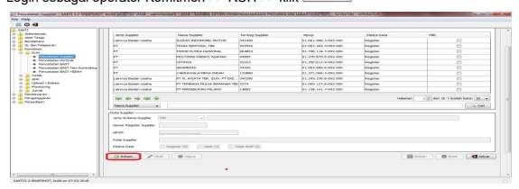

# Petunjuk Teknis Transaksi Mphl-Bjs Sakti

Petunjuk teknis ini ditujukan untuk memandu operator aplikasi SAKTI dalam penatausahaan 
(pengesahan dan pelaporan) transaksi Hibah Langsung Barang Jasa Surat Berharga pada Satker Non BLU**. Untuk Satker BLU, transaksi Hibah Langsung Barang hanya dicatat pada** Modul Aset Tetap dengan menggunakan menu Hibah Masuk (tanpa mekanisme pengesahan MPHLBJS). 

 
Langkah-langkah untuk pengajuan dan pencatatan Hibah Barang,Jasa, dan Surat Berharga dengan dokumen MPHL-BJS adalah sebagai berikut : 
I. Pencatatan Supplier **Tipe 8-Hibah** II. Pencatatan BAST Hibah III. Mencatat Pendetilan Hibah Masuk Bentuk Barang IV. Membuat SPP (MPHL-BJS) 
V. Kirim MPHL-BJS ke KPPN 
VI. Mencatat Nomor Persetujuan MPHL-BJS 
Detail dari langkah-langkah diatas adalah sebagai berikut : 

## I. Pencatatansupplier **Tipe 8-Hibah (Modul Komitmen)**

Pencatatan supplier tipe 8 ini bertujuan merekam informasi pihak-pihak pemberi HIBAH 
baik berupa jasa atau barang di aplikasi SAKTI. 

Langkah-langkah membuat supplier **tipe 8-Hibah:**
1. Login sebagai operator Komitmen >> RUH >> klik 

2. Pilih jenis supplierLainnya Badan Usaha, isi nama supplier**, dan isi nomor NPWP** 
kemudian klik ,setelah muncul data berhasil disimpan, klik 

3. Klik supplier yang ada di grid, pilih tab Supplier Addres **kemudian klik**

4. Rekam form alamat supplier pastikan memilih tipe supplier **8-Hibah kemudian klik** 

perlu di register ke SPAN untuk dimintakan Nomor Register Suplier (NRS)nya 

## Ii. Pencatatan Bast Hibah (Modul Komitmen)

Pencatatan BAST Hibah adalah proses perekaman serah terima HIBAH dari pemberi hibah dalam bentuk barang atau jasa di aplikasi SAKTI. Pencatatan BAST HIBAH 
berdasarkan dokumen sumber BAST yang telah dibuat oleh satker bersangkutan. Langkah-langkah melakukan pencatatan BAST Hibah: 
1. Login sebagai operator Komitmen >> RUH >> Pencatatan BAST Hibah>> Klik 2. Lengkapi isian Info Dokumen Hibah, pilih kategori Barang, Jasa, atau Surat Berharga 
(Untuk surat berharga menunggu ketentuan lebih lanjut) 

3. a. Jika Hibah berupa barang: 
1) Pilih barang 2) Pilih sumber dana dalam negeri atau luar negeri, isikan Nilai kemudian pilih rincian barang, akan muncul form Rincian Barang klik 

3) Akan muncul form seperti dibawah, pilih kode barang, jumlah, dan harga satuan kemudian klik kemudian klik 

4) Tampilan akan kembali ke form BAST, klik ,proses ini akan 
membentuk jurnal 

b. Jika Hibah berupa jasa Pilih Jasa , Kode Akun, Sumber Dana, isikan Nilai kemudian klik 

proses ini akan membentuk Jurnal 

## Iii. Mencatat Pendetilan Hibah Masuk Bentuk Barang (Modul Aset Tetap/ Modul Persediaan)

Pendetailan adalah proses meregister barang atau persediaan untuk mendapatkan nomor urut pendaftaran (NUP) di modul aset atau pendetailan jenis persediaan jika yang diterima adalah persediaan. 

1. Jika Hibah Barang berupa Persediaan, dicatat dimenu Persediaan>>Transaksi Masuk>>Hibah Masuk, Lakukan proses pendetilan seperti biasa 

2. Jika Hibah Barang berupa Aset Tetap/Aset Lainnya, dicatat dimenu Aset Tetap>> 
RUH >> Transaksi BMN >> Perolehan >> Hibah Masuk, Lakukan proses pendetilan seperti biasa 

## Iv. Membuat Spp/ Mphl-Bjs (Modul Pembayaran)

Memo Pengesahan Hibah Langsung Barang dan Jasa Satker (MPHL BJS) adalah dokumen untuk melakukan pengesahan atas penerimaan HIBAH berubah barang dan Jasa. Pastikan sebelum membuat MPHL BJS, satker sudah melakukan proses register HIBAH ke Ditjen Pengelolaan Pembiayaan dan Resiko (DJPPR) melalui Kanwil Ditjen Perbendahaan. 

Langkah-langkah membuat MPHL-BJS: 1. Login sebagai operator pembayaran 2. Pilih Pembayaran >> RUH SPP>>Pilih jenis SPP 513>> klik 

3. Muncul pilihan BAST Tahun Berjalan dan BAST TAYL, pilih sesuai tahun BAST 

4. Muncul form BAST , pilih BAST yang akan dilakukan pengesahan lalu klik 

5. Muncul form mencatat SPP Pengesahan MPHL-BJS isikan lalu klik proses ini akan menyimpan SPP dengan status (stage) "Baru". Isikan form MPHL BJS : 
- **Nomor Register HIBAH** 
- **Dasar Pembayaran** - **Informasi DIPA** - **Informasi SPP/MPHL BJS** - **Informasi Supplier otomatis terisi** - **Informasi SP3HL BJS Surat Pengantar satker** - Informasi BAST otomatis terisi 

6. Masuk ke menu Pembayaran>>Cetak>>Mencetak SPM>>pilih SPP (MPHL-BJS)
yang kita buat tadi kemudian Cetak, Proses ini akan menaikkan SPP ke status

KEMENTERIAN KEUANGAN
 KANWIL. DITJEN PERBENDAHARAAN PROVINSI DKI JAKARTA
MEMO PENCATATAN HIBAH LANGSUNG BENTUK BARANG(JASA/SURAT BERHARGA

| Nomor 00362A                                                                                        | Tanggal - 11 Jan 2018                              | Halaman   1   | dari 1.1   |
|-----------------------------------------------------------------------------------------------------|----------------------------------------------------|---------------|------------|
| Kuasa Bendahara Negara, KPPN  JAKARTAII (019)                                                       |                                                    |               |            |
| Agar melakukan pencatatan atas penerimaan hibah langsung sejumlah bentuk barang/jasa/surat berharga |                                                    |               |            |
| sejumlah 0,00                                                                                       |                                                    |               |            |
| Tahun Anggaran:     2018                                                                            | Sumber Dana                                        |               |            |
| DALAM NEGRI                                                                                         |                                                    |               |            |
| Dasar                                                                                               |                                                    |               |            |
| PP NO.10/2011                                                                                       | No. Register     : 74651901                        |               |            |
| Nomor SP3HL-BJS: 123456                                                                             |                                                    |               |            |
| Tanggal SP3HL BJS:    11-01-2018                                                                    |                                                    |               |            |
| U NOMOR 14 TAHUN 2015 TENTANG                                                                       |                                                    |               |            |
| APBN T AHUN ANGGARAN 2016                                                                           | BELANJA                                            | JUMLAH UANG   |            |
| 140.000.000,00                                                                                      |                                                    |               |            |
| 527027.019.132111.0150800.000000.L074651901.00000.2.0155.0.00000.000000                             |                                                    |               |            |
| Jumlah Belanja                                                                                      | 140.000.000.00                                     |               |            |
| PENDAPATAN                                                                                          | JUMLAH UANG                                        |               |            |
| 977263.140.431121.0150900.000000.L074651901.00000.1.0155.0.000000.000000                            | 140.000.000.00                                     |               |            |
| Jumlah Pendapatan                                                                                   | 140.000.000.00                                     |               |            |
| TOTAL PEMBAYARAN                                                                                    | *** NHL ****                                       |               |            |
| Kepada:                                                                                             | : BENDAHARA UMUM NEGARA UNTUK DIBUKUKAN SEPERLUNYA |               |            |
| Nama Supplier                                                                                       |                                                    |               |            |
| Yatu                                                                                                | ; hibah barang DN                                  |               |            |
| Semua bukti-bukti pengeluaran yang disahkan Pejabat Pembuat                                         | KOTA JAKARTA TIMUR, 11 Januari 2018                |               |            |
| Komitmen telah diuji dan dinyatakan memenuhi persyaratan                                            | Kuasa Pengguna Anggaran                            |               |            |
| untuk dilakukan pembayaran atas beban APBN, selanjutnya                                             |                                                    |               |            |
| bukti bukti pengeluaran dimaksud disimpan dan ditatausahakan                                        |                                                    |               |            |
| deh Pejabat Penandatangan SPM                                                                       |                                                    |               |            |
| Kebenaran perhitungan dan isi yang tertuang dalam SPM ini                                           | RINA ROBIATI                                       |               |            |
| menjadi tanggung jawab Pejabat Penandatangan SPM                                                    | NIP 196104051984112001                             |               |            |

Setelah SPM dicetak, lakukan upload dokumen pendukung pada menu Pembayaran>>Catat/Upload>>Upload Dokumen Pendukung (Format .PDF **max 5** 
Mb**), Pilih SPP, Pilih Direktori File, Pilih Jenis Dokumen pendukung, dan Klik upload.** 
Lakukan Upload Dokumen Pendukung lainnya sesuai ketentuan yang berlaku. 

Dokumen Pendukung pengajuan Pengesahan MPHL-BJS antara lain: 
- **SPNRH (Surat Penetapan Nomor Register Hibah)** 
- **SPTMHL (Surat Pernyataan Telah Menerima Hibah Langsung)** - **BAST Hibah** 
Jika Berhasil Status menjadi **Uploaded** . 

Untuk melakukan Monitoring Dokumen Pendukung dapt dilihat di menu Pembayaran>>Monitoring>>Monitoring Dokumen Pendukung, pilih SPP dan akan muncul Dokumen yang telah diupload 

## V. Kirim Mphl-Bjs Ke Kppn (Modul Pembayaran)

Proses pengiriman ADK transaksi MPHL BJS melalui aplikasi SAKTI dilakukan secara online dari data SAKTI ke SPAN di KPPN. Proses pengiriman data MPHL BJS 
dilakukan untuk data yang telah disetujui. Langkah-langkah mengirim MPHL-BJS ke KPPN:
1. Login sebagai KPA 
2. Pilih menu Pembayaran>>Validasi>>Validasi SPM, pilih SPM (MPHL-BJS) yang akan divalidasi kemudian klik , proses ini akan menaikkan status SPM 

3. Pilih menu Pembayaran>>ADK>>Kirim MPHLBJS ke KPPN, beri tanda centang dan klik proses ini akan menaikkan status SPP menjadi ADK SPM 

## Vi. Mencatat Nomor Persetujuan Mphl-Bjs 

Pencatatan nomor persetujuan MPHL-BJS dapat dilakukan setelah mendapat persetujuan KPPN dan Status Persetujuan Sudah Disetujui**. Langkah-langkah mencatat** 
Persetujuan MPHL-BJS: 
1. Login sebagai operator Pembayaran menu Pembayaran >> Catat/Upload >> 
Mencatat Nomor Persetujuan 2. Jika status persetujuan adalah Sudah Disetujui **, Pilih MPHL-BJS yang ingin dicatat** 
kemudian klik , proses ini akan menaikkan status SPP menjadi Upload SP2D dan terbentuk jurnal 

3.   Jika status persetujuan adalah Tidak Disetujui (ditolak oleh SPAN), pilih dan hapus, proses ini akan menghapus SPP, lakukan pembuatan SPP ulang.

