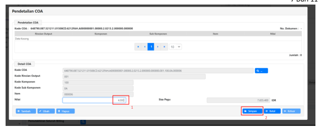
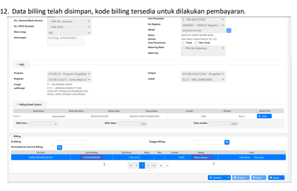
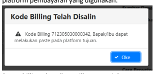

Petunjuk Teknis Aplikasi SAKTI)
�
PEMBUATAN BILLING
PENGEMBALIAN BELANJA
MELALUI INTERKONEKSI SAKTI - MPN
DITJEN PERBENDAHARAAN

2 

## I. Informasi Umum

A. **DESKRIPSI**
Telah dilakukan penambahan fitur yang memungkinkan pembuatan *billing* setoran pengembalian belanja langsung melalui aplikasi SAKTI.

| Modul                   | BEN                                            |
|-------------------------|------------------------------------------------|
| Role User               | Operator                                       |
| Modul Lain terkait      | -                                              |
| Transaksi yang Terkait  | BEN                                            |
|                         | Setoran Pengembalian belanja                   |
| Dokumen Input           | -                                              |
| Output                  | Billing setoran pengembalian belanja dari MPN  |
| Validasi                | Nilai Realisasi dari Laporan FA Aplikasi SAKTI |
| Petunjuk Teknis Terkait | -                                              |

## B. Pembuatan Billing Setoran Pengembalian Belanja

1. Login pada aplikasi SAKTI menggunakan user Bendahara Pengeluaran atau BPP.

2. Masuk ke menu Bendahara -> Setoran -> Membuat Billing Interkoneksi. Klik tambah untuk membuat billing baru.

## 3.    Pilih Jenis Setoran Pengembalian Belanja.

## 4.   Drop Down List No. Sp2D Bersaldo

4 a. *Dropdown list* No. SP2D Bersaldo akan memunculkan nomor SP2D LS Bendahara yang masih terdapat saldo di Bendahara Pengeluaran. Pilih salah satu nomor tersebut jika pengembalian belanja yang dilakukan sekaligus mengurangi jumlah dana LS di bendahara pengeluaran. 

b. Jika pengembalian belanja dilakukan atas SP2D non LS Bendahara, atau SP2D LS bendahara sudah dicatat seluruhnya (saldo habis), maka NO. SP2D tidak akan dimunculkan. Abaikan pilihan No. SP2D.

7. Jika memilih Nomor SP2D, pilihan cara penyetoran akan aktif. Pilih cara penyetoran tunai atau non tunai. 

Pilihan cara penyetoran akan nonaktif jika tidak memilih nomor SP2D bersaldo untuk mengurangi saldo LS Bendahara.

i Adnistras

in  Aset Telap lan terdarun

m Komitnes m Pencayanan m Persedian an KOMI
m Sinkon I KOPN
B Report

## 8.    Pilih Program, Kegiatan Dan Output (Pko) Dan Kode Lokasi

6 a. Klik tombol 'Tambah Akun',
b. Kode akun yang ditampilkan hanya akun-akun yang telah terdapat realisasi di SAKTI. Kode akun yang belum terdapat realisasi tidak akan ditampilkan.

c. Pilih kode akun yang akan dibuatkan billing.

d. Klik 'Pendetailan'.

a. Klik 'Tambah', kemudian klik tombol '…' untuk memunculkan kode item pengembalian belanja.

b. Pilih salah satu kode item yang tersedia. Hanya kode item, yang telah memiliki realisasi yang dapat dipilih. Jika belum terdapat realisasi, maka kode item tidak dapat dipilih c. Isikan nilai pengembalian belanja pada item yang dipilih kemudian klik 'Simpan'.

d. Kode item dapat ditambahkan lebih dari 1 item pada 1 akun.

a. Kode billing telah tersedia. Jika data dipilih, maka otomatis kode biling tersebut di copy ke 

clipboard. Selanjutnya, kode billing dapat digunakan untuk dilakukan pembayaran pada platform pembayaran yang digunakan.

13. Pembayaran billing dapat dilakukan juga menggunakan QRIS

9 a. Klik tombol 'Buat Qris' jika pembayaran kode billing pengembalian belanja akan dilakukan melalui QRIS.

10 

a. Setelah billing dibayar, pengembalian belanja di catat pada menu Bendahara - Setoran –
Pengembalian Belanja.

b.Pilih kode billing pada drop down list billing interkoneksi *(pencatatan setoran pengembalian belanja* yang tidak melalui fitur billing interkoneksi tetap dapat dicatat tanpa memilih no billing interkoneksi).

c.Data-data isian akan terisi secara otomatis.

d.Klik simpan untuk menyimpan pengembalian belanja. Data pengembalian akan terbentuk pada

