�

Petunjuk Teknis Aplikasi SAKTI)
�
♦
Perekaman Usulan Uang Persediaan (UP)
•
Tahun Anggaran 2022 Bagi Satker
�

# Daftar Isi

HALAMAN JUDUL 
1

DAFTAR ISI 2

I. INFORMASI UMUM 3 II. ALUR PROSES 3

## I. Informasi Umum

A. DESKRIPSI TRANSAKSI
- Uang Persediaan (UP) digunakan untuk membiayai kegiatan operasional satker sehari-hari. - Dana UP dikelola oleh bendahara dan dapat dibantu oleh Bendahara Pengeluaran Pembantu 
(BPP).

- Dana UP yang diajukan dapat berupa **UP Tunai** dan **UP Kartu Kredit Pemerintah (KKP)**. - UP Tunai merupakan dana UP yang diberikan dalam bentuk uang tunai kepada Bendahara Pengeluaran melalui rekening Bendahara Pengeluaran.

- UP KKP adalah batasan belanja (*limit)* kredit kepada Bendahara Pengeluaran yang penggunaannya dilakukan dengan kartu kredit pemerintah.

## B. Catatan Penting

- Petunjuk teknis ini akan menjelaskan tentang siklus perekamanUP Tahun Anggaran 2022 bagi seluruh satker pengguna aplikasi SAKTI.

- Khusus untuk perekaman usulan UP Tahun Anggaran 2022, terdapat beberapa pembaharuan alur dalam proses pengajuan sampai dengan penetapan UP Tahun Anggaran 2022 yang akan dijelaskan secara rinci pada bagian "Alur Proses" di petunjuk teknis ini.

- Petunjuk teknis ini hanya akan menjelaskan langkah-langkah perekaman usulan UP dari sisi satker sebagai pengguna aplikasi SAKTI. Sementara alur proses validasi usulan UP satker sampai dengan persetujuan UP tahun anggaran 2022 oleh KPPN akan dijelaskan pada petunjuk teknis yang berbeda.

## C. Penjelasan Detail Alur Proses 1. Login Aplikasi Sakti Web

Sebelum memulai perekaman UP tahun anggaran 2022, terlebih dahulu buka laman aplikasi SAKTI web pada tautan *sakti.kemenkeu.go.id* melalui *browser*. Pastikan PC/Laptop yang digunakan memiliki jaringan internet yang aktif. Jika halaman utama sudah terbuka, isikan kolom username dan *password* dengan *user* operator *role* modul bendahara pengeluaran. Pilih tahun anggaran 2022 kemudian tekan tombol **<<Masuk>>** seperti pada contoh gambar berikut:
II. ALUR PROSES 
A. POIN KUNCI PEREKAMAN USULAN UP BAGI SATKER
1. Merekam Referensi Kelompok Akun UP.

2. Merekam Usulan UP. Besaran total UP yang diisikan mengacu pada UU APBN, kemudian dilanjutkan dengan merubah proporsi UP Tunai/KKP.

3. Mengunduh Cetakan Usulan UP dalam format .rtf untuk selanjutnya dibubuhi kop surat masing-masing satker, dilakukan penomoran surat, dan ditandatangani oleh KPA satker.

4. Validasi usulan UP oleh KPA satker.

5. Upload surat pernyataan usulan UP yang telah ditandatangani KPA (poin 3) ke aplikasi SAKTI 
dengan terlebih dahulu merubah ke format PDF. Proses upload ini dilakukan pada user operator modul bendahara.

6. Satker menunggu KPPN selesai melakukan persetujuan atas usulan UP dan mengupload surat persetujuan UP KPPN pada aplikasi SAKTI modul bendahara. Selanjutnya, satker melakukan unduh surat persetujuan UP oleh KPPN pada menu "Menghitung Usul UP".

7. Satker melanjutkan pembuatan SPP UP tahun anggaran 2022 sampai dengan penerbitan SP2D oleh KPPN.

## 2. Merekam Referensi Kelompok Akun Up

Referensi Kelompok Akun UP adalah kelompok akun yang direncakan akan digunakan dalam pencatatan Surat Perintah Bayar (SPBy) dan Kuitansi. Perekaman kelompok akun UP cukup sekali dilakukan saat satker pertama menggunakan Aplikasi SAKTI dan tidak terikat dengan tahun anggaran. Referensi dapat ditambah jika di kemudian hari terdapat kelompok akun baru yang akan digunakan pada pencatatan Perintah Bayar dan Kuitansi. Langkah ini wajib dilakukan, karena kode akun yang tidak ditambahkan pada menu referensi kelompok akun UP nantinya tidak dapat muncul/dipilih pada saat perekaman SPBy. Berikut adalah langkah-langkah perekaman referensi kelompok akun UP:
1. Akses modul Bendahara 2. Klik menu <<Referensi>> → <<Referensi Kelompok AKun **UP>>**.

3. Klik tombol <<Tambah>>
1. Pada kolom Kelompok Akun, klik "Pilih Kelompok Akun" 

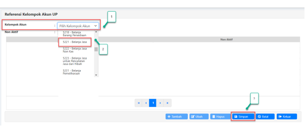 2. Akan muncul daftar kelompok akun, pilih salah satu (contoh: 5221 - Belanja Jasa) 3. Klik tombol **<<Simpan>>**
4. Ulangi kembali langkah diatas sampai dengan seluruh kelompok akun UP yang dimiliki satker berhasil tersimpan.

## 3. Merekam Usulan Up

Usulan UP direkam sebagai penetapan besaran UP yang akan diajukan satker pada tahun anggaran berjalan dan sebagai dasar penyusunan Surat Persetujuan UP yang nantinya dapat diunduh setelah melakukan proses simpan. Berikut langkah-langkah perekaman usulan UP:

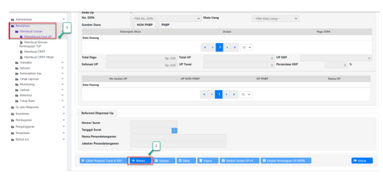

1. Akses modul Bendahara → klik menu <<Membuat Usulan>> → **<<Menghitung Usul UP>>**.

2. Klik tombol **<<Rekam>>** untuk menambah usulan UP.

Jika dalam satu tahun anggaran terdapat UP sebelumnya, maka usulan UP HANYA dapat direkam jika UP sebelumnya telah di nihilkan atau dilakukan pengembalian.

1. Pastikan nomor DIPA sudah terisi secara otomatis oleh sistem. Selanjutnya, pada kolom 

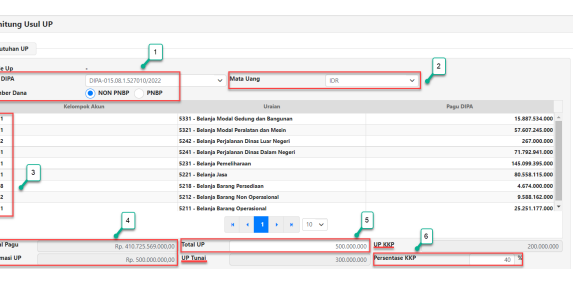

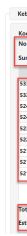

Sumber Dana klik opsi "Non PNBP".

2. Pilih Mata Uang "IDR". 3. Seluruh akun yang direkam pada langkah Referensi Kelompok Akun UP akan muncul di kolom Kelompok Akun seperti pada gambar diatas.

4. Selanjutnya, secara otomatis sistem akan memunculkan perhitungan Total Pagu dan Estimasi UP. Total pagu didapatkan dari jumlah pagu DIPA satker tahun berjalan, sementara untuk ketentuan besaran estimasi UP dapat dilihat dari dari ketentuan besaran UP pada PMK 178/PMK.05/2018 .

5. Isikan kolom total UP yaitu jumlah **total UP tunai + UP KKP**.

6. Pada kolom persentase KKP, isikan besaran persentase UP KKP. Setelah mengisikan besaran proporsi persentase UP KKP, kolom UP Tunai dan UP KKP akan menampilkan besaran nominal masing-masing UP Tunai dan UP KKP. Jika sudah, klik tombol **<<Simpan>>.**

## Usulan Up Dengan Dispensasi

Apabila satker memiliki dispensasi terhadap besaran UP yang akan diajukan, maka langkahlangkah perekamannya pada aplikasi SAKTI adalah sebagai berikut:
1. Masih pada modul Bendahara → menu <<Membuat Usulan>> → **<<Menghitung Usul** 

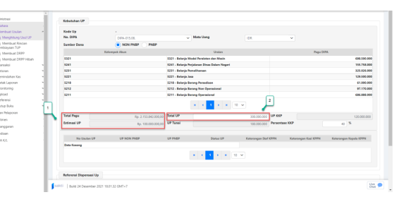

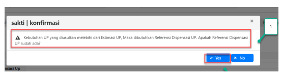

UP>>, klik tombol **<<Rekam>>** sama seperti pada langkah perekaman usulan UP tanpa dispensasi di poin sebelumnya. Pilih juga nomor DIPA dan sumber dana (Non PNBP). Aplikasi akan secara otomatis menghitung total pagu dan estimasi UP. Pada contoh gambar diatas, estimasi UP bagi satker adalah sebesar Rp100.000.000,-.

2. Pada kolom "Total UP", isikan jumlah UP total (UP Tunai + KKP) sesuai dengan besaran yang sudah disetujui pada surat penetapan dispensasi UP yang diterbitkan oleh Kanwil DJPb. Jika sudah, klik tombol **<<Simpan>>.**
1. Akan muncul pop up konfirmasi seperti pada gambar diatas. Lanjutkan dengan mengklik 

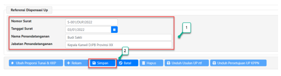

tombol **<<Yes>>.** Selanjutnya satker akan diarahkan untuk mengisi kolom "Referensi Dispensasi UP" seperti pada gambar dibawah ini:
1. Lengkapi kolom "Nomor Surat", "Tanggal Surat", "Nama Penandatangan", dan "Jabatan Penandatangan" sesuai dengan data riil Surat Dispensasi UP yang sudah disetujui oleh Kanwil DJPb.

2. Jika isian sudah lengkap, klik tombol **<<Simpan>>.** Besaran nominal usulan UP dengan dispensasi akan tersimpan seperti pada gambar dibawah ini:
Apabila satker juga memiliki dispensasi besaran UP KKP, lakukan langkah-langkah dibawah ini 

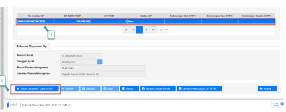

(lewati jika satker tidak memiliki dispensasi besaran UP KKP):
1. Klik pada nomor usulan UP yang sudah tersimpan pada langkah sebelumnya sampai 

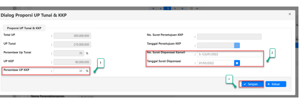

berubah menjadi warna biru.

2. Klik tombol **<<Ubah Proporsi Tunai & KKP>>.**
1. Pada kolom "Persentase UP KKP", ubah besaran persentase sesuai dengan yang telah disetujui pada surat dispensasi besaran UP KKP yang diterbitkan oleh Kanwil DJPb. Pada contoh gambar diatas, besaran persentase UP KKP adalah 30% (default besaran persentase UP KKP sesuai PMK 196/PMK.05/2018 adalah 40%).

2. Lengkapi kolom "Nomor Surat Dispensasi Kanwil" dan "Tanggal Surat Dispensasi" sesuai dengan yang tertulis pada surat fisik dispensasi besaran UP KKP.

3. Jika sudah, klik tombol <<Simpan>>.

## 4. Unduh Dokumen Cetakan Usulan Up

Setelah melakukan simpan Usulan UP pada langkah sebelumnya, selanjutnya satker dapat melakukan unduh dokumen usulan UP dengan langkah sebagai berikut:
 Usulan UP yang sebelumnya telah berhasil tersimpan akan muncul pada kolom "Nomor 

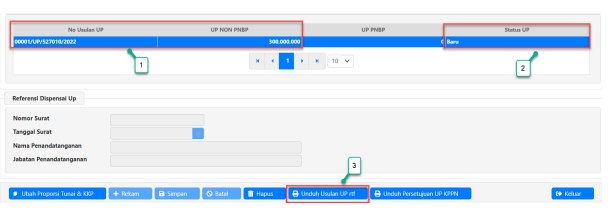

1.

Usulan UP" seperti pada gambar diatas. Klik pada nomor usulan UP (contoh:
0001/UP/<kodesatker>/2022) sampai dengan kolom berwarna biru.

Pada kolom tersebut juga terdapat tabel "Status UP". Fungsi dari tabel ini adalah untuk 2.

memberikan informasi progress usulan UP yang diajukan oleh satker. Saat ini usulan UP masih berstatus "Baru" yang berarti usulan UP telah berhasil direkam oleh operator modul bendahara, namun belum dilakukan validasi oleh KPA satker.

Klik tombol <<Unduh Usulan UP rtf>> kemudian secara otomatis browser akan mengunduh m.

file satu buah dokumen yang berisikan Permohonan Persetujuan UP KKP dan Surat Pernyataan Uang Persediaan dengan format .rtf seperti pada gambar berikut:

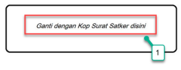

Nomor Lampiran
- 1(satu) Berkas Hal Permohonan Persetujuan UP Kartu Yth. Kepala KPPN JAKARTAII
I. Wahidin II No. 3, Jakarta KOTA JAKARTA PUSAT
Sehubungan dengan Peraturan Menteri Keuangan Nomor 196/MK.05/2018 tanggal 31 Desember 2018 tentang Tata Cara Pembayaran dan Penggunaan Kartu Kredit Pemerintah, bersama ini Kami mengajukan permohonan persetujuan UP Kartu Kredit

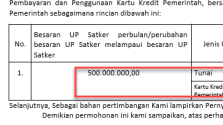

Demikian permohonan ini kami sampaikan, atas perhatian dan kerjasamanya, kami ucapkan terima kasih

| Proporsi UP Tunai dan Kartu Kredit Pemerintah                                                                       |            |               |
|---------------------------------------------------------------------------------------------------------------------|------------|---------------|
| Jenis UP                                                                                                            | %          | Nilai UP      |
| Tunai                                                                                                               | 60         | 300.000.00,00 |
| Kartu Kredit                                                                                                        | 200.000,00 |               |
| elanjutnya, Sebagai bahan pertimbangan Kami lampirkan Pernyataan Uang Persediaan KPA sebagaimana lampiran surat ini | 2          |               |

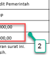

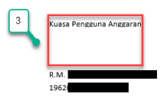

Buka dokumen yang telah terunduh pada folder di PC/Laptop (contoh nama dokumen:
1.

Permohonan Persetujuan Uang Persediaan 00001_UP_<kodesatker>_2022). Pada bagian atas surat yang bertuliskan "Ganti dengan Kop Surat Satker disini", silahkan dilakukan penggantian dengan format kop surat sesuai ketentuan pada masing-masing satker.

2. Pada kolom besaran UP, terdapat informasi proporsi persentase UP Tunai dan KKP yang datanya didapatkan dari pengisian kolom Usulan UP pada langkah sebelumnya.

3. Pada bagian bawah surat, terdapat kolom tanda tangan KPA. Lakukan cetak atas dokumen tersebut → tanda tangani oleh KPA → kemudian *scan* kembali dokumen yang sudah ditandatangani dan diberi nomor untuk selanjutnya disimpan dalam format pdf.

Selanjutnya, lakukan langkah yang sama pada dokumen Surat Pernyataan Uang Persediaan 

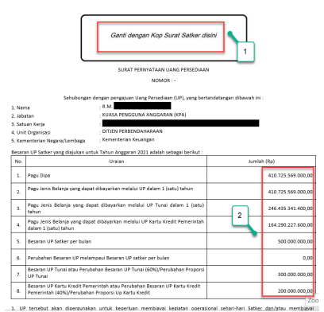

seperti pada contoh gambar berikut:
1. Ganti kop surat dengan format kop surat sesuai ketentuan pada masing-masing satker. 2. Pada contoh Surat Pernyataan Uang Persediaan diatas, terdapat informasi jumlah pada masing-masing uraian komponen UP yang datanya diambil berdasarkan perekaman UP dan pagu DIPA satker pada aplikasi SAKTI.

3. Pada bagian bawah surat ini juga terdapat kolom tanda tangan KPA. Lakukan cetak dokumen → tanda tangani surat oleh KPA → kemudian *scan* dokumen yang sudah ditandatangani dan diberi nomor untuk selanjutnya disimpan dalam format **pdf.**

## Catatan Penting Pada Langkah Ini:

- Format Surat Pernyataan Uang Persediaan dan Permohonan Persetujuan UP KKP yang terunduh berformat .rtf. Format ini memungkinkan satker untuk dapat melakukan edit atas dokumen tersebut.

- Lakukan print dokumen → penomoran surat/tanggal oleh satker → tanda tangan KPA →
kemudian scan dokumen. Dokumen hasil scan yang berformat pdf tersebut selanjutnya harus dilakukan *upload* pada aplikasi SAKTI menggunakan user operator bendahara masingmasing satker yang akan dijelaskan pada langkah selanjutnya.

- Dokumen Surat Pernyataan Uang Persediaan dan Permohonan Persetujuan UP KKP dalam format pdf tersebut berfungsi sebagai bukti/aspek legalitas bagi KPPN untuk melakukan validasi sampai dengan approval persetujuan UP bagi sater.

5. **Validasi Usulan UP oleh KPA**

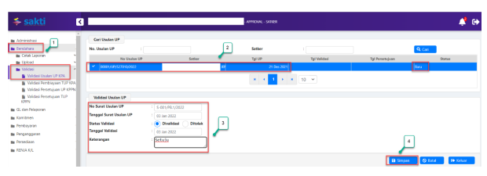

Langkah selanjutnya yang harus dilakukan adalah validasi usulan UP yang telah direkam oleh operator modul bendahara pada langkah sebelumnya. Validasi dilakukan dengan cara *login* menggunakan user dengan role KPA satker. Langkah-langkahnya adalah sebagai berikut:
1. Setelah berhasil login menggunakan user KPA, pilih modul Bendahara → klik menu 
<<Validasi>> → **<<Validasi Usulan UP KPA>>**.

2. Akan muncul nomor usulan UP yang sudah tersimpan pada langkah sebelumnya. Data usulan UP dapat dilihat pada kolom "Nomor Usulan UP" seperti pada gambar diatas. Kemudian pada bagian kanan, terdapat kolom status yang fungsinya sama seperti pada menu menghitung usul UP. Klik Nomor Usulan UP sampai berubah menjadi berwarna biru.

3. Pada kolom "Validasi Usulan UP" di bagian bawah, lengkapi data-data seperti Nomor Surat Usulan UP, Tanggal Surat Usulan UP, Status Validasi (klik/pilih **<<Divalidasi>>** untuk menyetujui atau **<<Ditolak>>** untuk batal validasi), Tanggal Validasi, dan Keterangan. Perlu diingat bahwa tanggal validasi tidak boleh kurang dari tanggal surat usulan UP.

4. Jika semua data telah dilengkapi, klik tombol **<<Simpan>>.** Setelah berhasil melakukan simpan, status usulan UP akan berubah menjadi "Divalidasi KPA" seperti berikut:

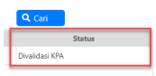

- Usulan UP yang ditolak oleh KPA akan kembali ke operator modul bendahara dengan status 

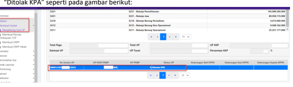

- Selanjutnya operator modul bendahara dapat melakukan perbaikan data usulan UP pada 

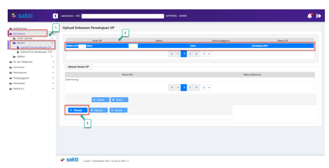

menu <<Membuat Usulan>> → **<<Menghitung Usul UP>>** sesuai dengan keterangan tolakan yang dituliskan oleh KPA satker.

- Jika perbaikan sudah selesai dilakukan, KPA dapat melakukan validasi ulang atas usulan UP 
perbaikan dengan langkah yang sama seperti pada poin 5 diatas.

1. Setelah melakukan validasi atas usulan UP, tahapan selanjutnya adalah upload dokumen persetujuan UP. Proses upload ini dilakukan oleh user operator modul bendahara. Pilih modul bendahara → klik menu <<Upload>> → **<<Upload Dok Persetujuan UP>>**.

2. Akan muncul data usulan UP yang sudah dilakukan validasi pada langkah sebelumnya. Data usulan UP tersebut dapat dilihat pada kolom "Kode UP" seperti pada gambar diatas. Klik pada data usulan UP tersebut sampai dengan tersorot menjadi warna biru.

3. Pada kolom "Upload Usulan UP", klik tombol **<<Choose>>.** Selanjutnya, pilih dokumen Surat Pernyataan Uang Persediaan dan Permohonan Persetujuan UP KKP hasil scan yang sudah ditandatangani KPA, diberi nomor, dan tanggal (dokumen harus berformat pdf).

1. Akan muncul tampilan Nama dan ukuran dokumen pdf yang diunggah pada kolom putih 

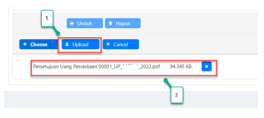

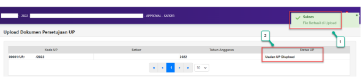

dibawah tombol **<<Choose>>.** Jika nama dokumen sudah sesuai, klik tombol **<<Upload>>.**
1. Jika dokumen sukses terunggah, akan muncul notifikasi berhasil seperti pada gambar diatas.

2. Selain itu, status UP akan berubah dari "Validasi KPA" menjadi "Usulan UP Diupload".

Tahapan pengajuan usulan UP bagi satker selesai sampai dengan langkah ini. Selanjutnya 

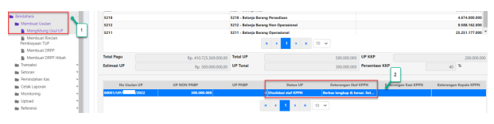

usulan UP yang telah diajukan satker akan dilakukan proses validasi sampai dengan approval/penerbitan surat persetujuan UP oleh Kepala KPPN. Satker dapat melakukan pengecekan berkala terkait status usulan UP dengan langkah-langkah sebagai berikut:
1. Untuk melihat status pengajuan usulan UP satker, silahkan login menggunakan operator modul bendahara. Selanjutnya, pilih modul Bendahara → **<<Membuat Usulan>>** → <<Menghitung Usul UP>>.

2. Status UP akan terlihat pada kotak yang berisi informasi nomor usulan UP. Pada gambar diatas, status UP adalah "Divalidasi Staf KPPN" yang berarti saat ini usulan UP satker sudah lolos validasi oleh staf MSKI KPPN. Proses selanjutnya adalah menunggu persetujuan dari kepala seksi pencairan dana KPPN.

1. Gambar diatas adalah contoh status UP satker yang sudah dilakukan validasi oleh kepala 

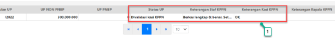

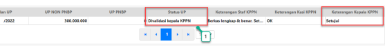

seksi pencairan dana/PDMS KPPN. Dapat dilihat bahwa status UP berubah menjadi "Divalidasi kasi KPPN". Proses selanjutnya adalah menunggu approval usulan UP serta penerbitan surat persetujuan UP oleh kepala KPPN.

1. Gambar diatas adalah contoh status UP satker yang sudah dilakukan approval/persetujuan 

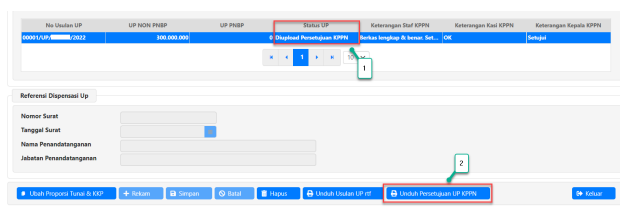

oleh kepala KPPN. Dapat dilihat bahwa status UP berubah menjadi "Divalidasi kepala KPPN". Proses selanjutnya adalah menunggu status UP terupdate menjadi "Upload Persetujuan UP oleh KPPN".

1. Apabila status UP sudah berubah menjadi "Diupload Persetujuan KPPN", maka artinya 

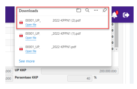

seluruh proses persetujuan atas usulan UP tahun anggaran 2022 yang diajukan satker telah selesai dilakukan.

2. Selanjutnya, satker dapat mengklik tombol **<<Unduh Persetujuan UP KPPN>>** untuk mendownload surat bukti persetujuan UP yang diterbitkan oleh KPPN (format .pdf). Cek pada menu "Download" di browser untuk menampilkan unduhan surat.

3. Atas dasar surat persetujuan tersebut, satker dapat melanjutkan proses perekaman SPP UP 
sampai dengan SP2D.

1. Sebagai informasi tambahan, apabila status UP sudah "Diupload Persetujuan KPPN", maka 

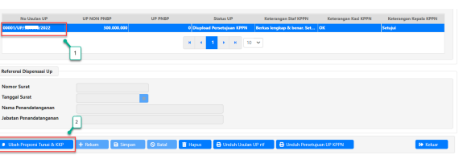

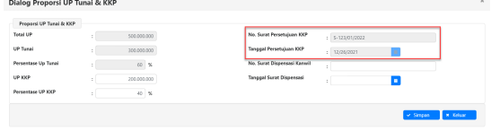

nomor dan tanggal surat persetujuan UP akan terisi secara otomatis oleh sistem sesuai dengan nomor dan tanggal surat persetujuan UP yang diterbitkan oleh KPPN. Untuk melakukan pengecekan, masih pada menu "Menghitung Usul UP" klik pada "Nomor Usulan UP" sampai layer tersorot menjadi biru.

2. Klik tombol **<<Ubah Proporsi Tunai & KKP>>.** Akan muncul *pop up box* yang menampilkan 
"Nomor Surat Persetujuan KKP" dan "Tanggal Surat Persetujuan KKP" seperti pada gambar dibawah ini:

## Catatan Penting Pada Langkah Ini:

- Usulan UP yang ditolak oleh KPPN akan kembali ke operator modul bendahara dengan status 
"Ditolak KPPN". Sama seperti ketika terjadi penolakan oleh KPA, yang perlu dilakukan oleh satker adalah login menggunakan user operator modul bendahara, kemudian akses modul bendahara → <<Membuat Usulan>> → **<<Menghitung Usul UP>>** untuk selanjutnya melakukan perbaikan data usulan UP. Perbaikan dilakukan sesuai dengan keterangan yang dituliskan oleh KPPN (dapat dilihat pada kolom keterangan di kolom nomor usulan UP).

- Data usulan UP yang sudah diperbaiki selanjutnya perlu dilakukan validasi dan upload dokumen pengajuan UP ulang oleh KPA satker seperti pada poin "Validasi Usulan UP oleh KPA".