→
�
Petunjuk Teknis Aplikasi SAKTI
�
→
Mencatat Perintah Bayar untuk Belanja Aset/Persediaan
→
→

# Daftar Isi

| HALAMAN JUDUL  .       |
|------------------------|
| ..                     |
| I.     INFORMASI UMUM. |
| I.   ALUR PROSES .     |

I. INFORMASI UMUM
A. DESKRIPSI TRANSAKSI

| Modul                   | BEN                                                                             |                                |
|-------------------------|---------------------------------------------------------------------------------|--------------------------------|
| Role User               | OPR                                                                             |                                |
| Modul Lain terkait      | PEM                                                                             |                                |
| Transaksi yang Tekait   | PEM - Mencatat Perintah Bayar                                                   |                                |
| Dokumen Input           | Kuitansi pembelian dari supplier dan data  belanja bendahara lainnya            |                                |
| Output                  | Cetakan SPBy dan memo Perintah Bayar                                            |                                |
| Validasi                | -                                                                               | Data Pagu DIPA sudah tersedia; |
| -                       | Data transaksi penerimaan belanja sesuai dengan akun/pagu yang  dimiliki satker |                                |
| Petunjuk Teknis Terkait | PEM - Petunjuk Teknis Siklus Transaksi GUP                                      |                                |

## B. Informasi Penting Lainnya

Form Mencatat Perintah Bayar digunakan untuk mencatat detail akun belanja, detail akun potongan, dan data lainnya yang nantinya akan digunakan menjadi dasar dalam perekaman kuitansi dan pungutan pajak oleh Bendahara Pengeluaran/Bendahara Pengeluaran Pembantu. Perekaman Perintah Bayar juga terkait dengan pencatatan data Supplier di form Referensi Wajib Pajak/Wajib Bayar dan mapping operator dengan PPK. 

Untuk perekaman belanja jasa (tidak membantuk asset/persediaan), maka operator dapat langsung melakukan perekaman Perintah Bayar. Akan tetapi apabila belanja UP yang dilakukan merupakan belanja yang menghasilkan asset/persediaan, maka harus didahului dengan melakukan pencatatan Penerimaan Barang/Jasa UP Tunai/Bank pada Modul Komitmen. Selanjutnya proses perekaman Perintah Bayar akan mengambil data dari transaksi Penerimaan Barang/Jasa UP Tunai/Bank tersebut. Operator dapat mencatat kode barang beserta nominalnya pada menu Pencatatan Penerimaan Barang/Jasa UP Tunai/Bank.

Perekaman Perintah Bayar memerlukan approval PPK untuk dapat dilanjutkan ke tahap membuat kuitansi. Titik realisasi FA dan jurnal terbentuk pada saat validasi Perintah Bayar **oleh PPK**. Apabila Perintah Bayar tidak jadi digunakan sementara statusnya sudah Validasi PPK, maka atas Perintah Bayar tersebut harus dilakukan batal validasi terlebih dahulu dan kemudian dihapus. Perintah Bayar yang tidak digunakan, dengan status sudah validasi dan tidak dihapus dari aplikasi akan mengurangi nilai FA satker.

Dokumen sumber dalam proses pendetilan Laporan FA detil 16 segmen adalah Perintah Bayar, dengan kategori PEM.

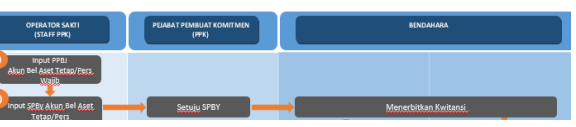

1. **Input Pencatatan Penerimaan Barang/Jasa UP Tunai/Bank**

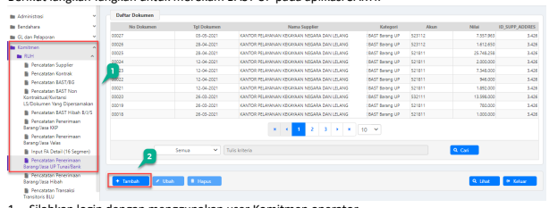

Langkah ini dilakukan untuk mencatat transaksi belanja yang menghasilkan asset/persediaan dengan mekanisme GUP. Apabila belanja tidak menggunakan akun yang menghasil asset/persediaan (5218xx/53xxxx) atau tidak menghasilkan aset/persediaan, maka langkah ini dapat dilewati.

Berikut langkah-langkah untuk merekam BAST UP pada aplikasi SAKTI:
1. Silahkan login dengan menggunakan user Komitmen operator

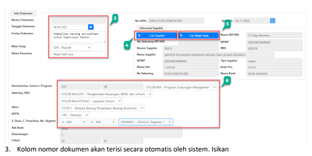

Akses menu Komitmen > RUH > RUH Penerimaan Barang/Jasa UP Tunai/Bank 2. Klik <Tambah>, maka akan muncul form info dokumen seperti tampilan di bawah ini. Jika muncul notifikasi belum ada mapping antara operator dengan PPK, maka silahkan lakukan mapping terlebih dahulu dari user Admin, kemudian ke menu Administrasi > Umum > 
Jabatan > Mapping opr. Pelaksanaan - PPK
Uraian dokumen : Isikan uraian transaksi belanja persediaan/asset tersebut

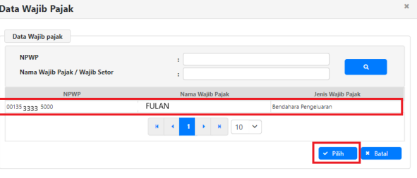

Mata Uang : Terisi otomatis apabila satker hanya mengelola dana UP RM Nama Penerima : Nama penerima pembayaran atas transaksi belanja asset/persediaan tersebut 4. Lengkapi kolom Informasi Supplier dengan mengklik tombol <Cari Supplier> (isikan dengan supplier tipe 1/satker). Apabila hanya terdapat 1 supplier tipe1/Satker pada menu RUH Supplier di Modul Komitmen, maka tombol pilih tidak aktif dan terisi otomatis.

5. Pada kolom informasi supplier klik tombol <Cari Wajib Pajak/Wajib setor>, dan akan muncul pop up box yang berisi daftar wajib pajak/wajib setor yang telah direkam oleh user sebelumnya pada referensi wajib pajak/wajib bayar. Klik NPWP Data wajib Pajak yang sesuai dan klik tombol <Pilih>
6. Selanjutnya pilih Program, Aktivitas, KRO, Akun, KPPN, Sumber Dana, Cara Penarikan, dan Nomor Register. Kolom COA akan terisi otomatis ketika kita sudah memilih pada akun 

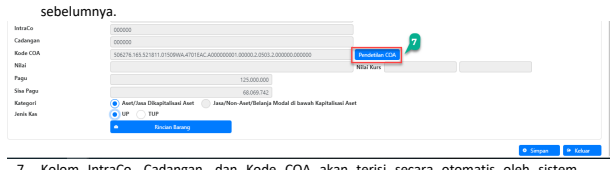

7. Kolom IntraCo, Cadangan, dan Kode COA akan terisi secara otomatis oleh sistem. 

Selanjutnya, lakukan pemilihan detail COA dengan mengklik tombol <Pendetilan COA>.

8. Klik tombol <Tambah>

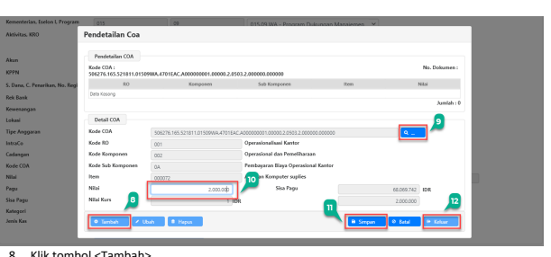

9. Klik tombol ikon kaca pembesar untuk merekam detil COA dan pilih detil COA yang diinginkan (pastikan detil COA sama dengan akun belanja persediaan/asset/jasa lainnya 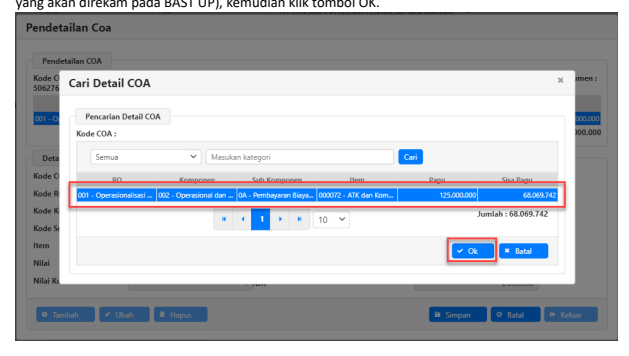

10. Isikan nilai belanja total.

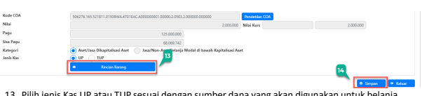

11. Klik tombol <Simpan> 12. Klik tombol <Keluar> 13. Pilih jenis Kas UP atau TUP sesuai dengan sumber dana yang akan digunakan untuk belanja, kemudian klik tombol Rincian Barang. Akan muncul *pop up box* Rincian Barang seperti gambar di bawah ini. 

a) Klik tombol <Rekam> untuk mengaktifkan menu-menu pada *pop up box* rincian barang.

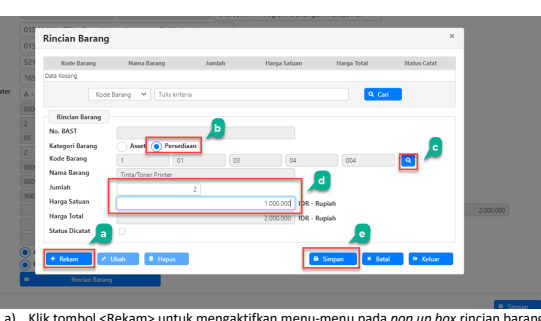

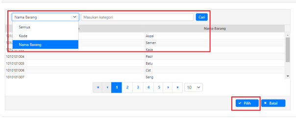

b) Pilih kategori barang, misal: Persediaan, karena akun yang digunakan merupakan akun belanja barang persediaan (521811)
c) Klik tombol ikon kaca pembesar untuk memilih kode barang yang akan dicatat.

Ketikkan filter berupa nama barang/kode barang untuk mempercepat dan mempermudah proses perekaman. Klik Cari dan kemudian pilih barangnya.

d) Lanjut pengisian Jumlah dan Harga satuan barang yang sudah dipilih pada langkah sebelumnya. Nominal pada kolom harga total akan terisi secara otomatis oleh sistem ketika sudah dilakukan pengisian jumlah dan harga satuan barang.

e) Klik tombol <Simpan> untuk menyimpan data brincian barang. Setelah klik <Simpan>, *pop* up box akan tertutup dan akan kembali ke form Pencatatan Penerimaan Barang/Jasa UP Tunai/Bank.

14. Klik tombol <Simpan>, maka akan muncul notifikasi data perekaman penerimaan barang/jasa UP tunai/bank (BAST UP) telah berhasil disimpan dan dapat dilanjutkan ke langkah selanjutnya, yaitu mencatat Perintah Bayar.

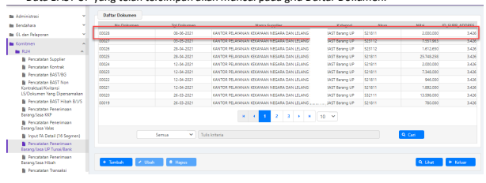

## 2. Mencatat Perintah Bayar

Setelah pencatatan penerimaan barang/jasa UP tunai/bank berhasil tersimpan, langkah selanjutnya yang harus dilakukan adalah mencatat perintah bayar. Apabila belanja tidak menghasilkan asset/persediaan, maka langkah pencatatan penerimaan barang/jasa UP tunai/bank dapat dilewati dan langsung melakukan perekaman Perintah Bayar.

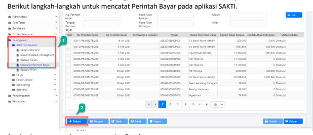

1. Login menggunakan user operator Pembayaran.

Akses modul Pembayaran > RUH Pembayaran > Mencatat Perintah Bayar 2. Klik tombol <Tambah> untuk mengaktifkan menu-menu pada form mencatat Perintah Bayar.

3. Isikan data detail Perintah Bayar, meliputi:

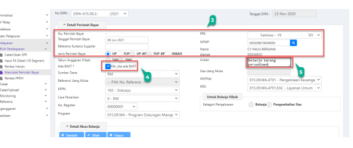

Tanggal Perintah Bayar : Pilih tanggal perintah bayar sesuai dengan tanggal transaksi riil.

Referensi Kuitansi Supplier : Isikan nomor referensi kuitansi/dokumen sumber, jika tidak ada dapat diisi tanda '-'.

Jenis Perintah Bayar : Pilih jenis perintah bayar sesuai dengan sumber dana yang digunakan (UP/TUP/Hibah).

Apabila jenis perintah bayar yang dipilih adalah Hibah, maka dapat dilanjutkan dengan memilih Tahun Anggaran Hibah (TAB/TAYL)
Pilih PPK sesuai dengan PPK yang sudah di mapping dengan operator PPK.

Klik tombol ikon kaca pembesar pada pilihan NPWP, maka akan muncul *pop up box* berisi 

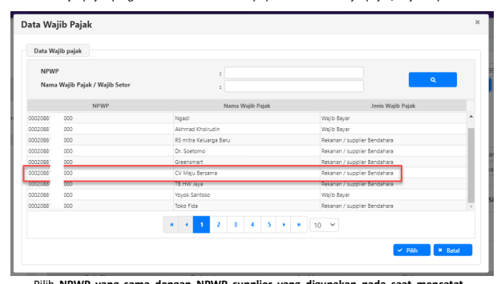 data wajib pajak yang telah direkam sebelumnya pada referensi wajib pajak/wajib bayar.

Pilih NPWP yang sama **dengan NPWP supplier yang digunakan pada saat mencatat** penerimaan barang/jasa UP tunai/bank. Karena jika NPWP yang dipilih berbeda, data penerimaan barang/jasa UP tunai/bank tidak akan muncul pada form SPBy.

Apabila belanja tersebut tidak menghasilkan asset/persediaan, maka NPWP dapat dipilih bebas sesuai dokumen sumber dan tidak terikat dengan data BAST UP.

4. Pada Kolom <Ada BAST?> klik pada kotak kecil yang bertuliskan "Klik, jika ada BAST".

Kolom sumber dana, program, kegiatan, dan output serta akun belanja akan terisi secara 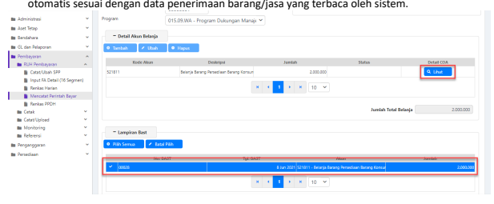 Apabila tidak terdapat data BAST, maka lakukan pemilihan program, kegiatan, dan output 

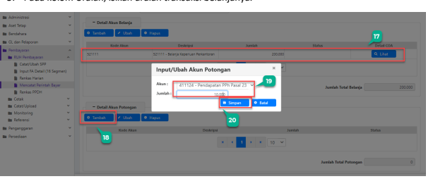

yang sesuai secara manual. Pada perekaman SPBy dengan BAST UP, pendetailan COA 
dilakukan pada saat merekam BAST UP sehingga hanya tersedia tombol Lihat pada form SPBy. Jika ada kesalahan pada detail COA, maka user harus melakukan hapus/batal perekaman SPBy terlebih dahulu kemudian melakukan perbaikan dengan mengklik tombol <Ubah> di menu BAST UP.

5. Pada kolom Uraian, isikan uraian transaksi belanjanya. 6. Perekaman kode akun dan jumlah pada langkah sebelumnya akan tertampil di kolom Detail Akun Belanja. User dapat mengklik tombol Lihat pada kolom Detail COA untuk melakukan cek ulang/memastikan bahwa data pendetilan COA yang direkam telah benar. 

7. Klik <Tambah> untuk menambah detail akun potongan pajak (jika ada). 8. Lanjutkan perekaman detail akun potongan dan jumlahnya. 9. Kemudian klik tombol Simpan. 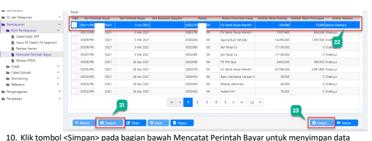

Perintah Bayar.

11. Perintah Bayar yang telah direkam akan muncul pada grid Cari Perintah Bayar.

12. Klik tombol <Unduh> untuk mengunduh dokumen Perintah Bayar.

## 3. Validasi Perintah Bayar Oleh Ppk

Menu validasi Perintah Bayar hanya bisa diakses oleh PPK. SPBy yang muncul pada grid validasi di user PPK, merupakan semua SPBy yang direkam oleh operator-operator pembayaran dengan mapping PPK yang sama. Berikut langkah-langkah untuk melakukan validasi perintah bayar pada aplikasi SAKTI: 1. Login menggunakan user PPK (Val/ SPM_Validator)
Akses modul Pembayaran > klik menu Validasi > Validasi Perintah Bayar 2. Klik tombol <Cari> untuk memfilter Perintah Bayar berdasarkan status validasinya, misal: 
Belum Divalidasi 3. Pilih dengan cara mencentang Perintah Bayar yang akan divalidasi, bisa pilih semua atau centang satu per satu.

4. Pilih status validasi, disetujui, ditolak, atau batal persetujuan.

<Disetujui> PPK menyetujui Perintah Bayar yang dicatat oleh Operator Pembayaran dan selanjutnya dapat dilakukan perekaman kuitansi oleh Bendahara.

<Ditolak> PPK menolak Perintah Bayar yang dicatat oleh Operator Pembayaran dengan mencantumkan alasan penolakan. 

Selanjutnya Perintah Bayar akan kembali ke Operator Pembayaran untuk dilakukan Ubah/ Hapus.

<Batal Persetujuan> PPK membatalkan persetujuan atas Perintah Bayar yang sebelumnya telah disetujuinya dengan menyertakan alasan pembatalan persetujuan pada kolom keterangan. Selanjutnya Perintah Bayar akan kembali ke Operator Pembayaran untuk kemudian dilakukan Ubah/Hapus.

Perlu diingat bahwa proses validasi Perintah Bayar oleh PPK merupakan salah satu titik realisasi dan pembentukan jurnal pada transaksi GUP. Apabila dalam praktiknya terdapat perintah bayar dengan status sudah divalidasi akan tetapi tidak dilanjutkan transaksinya (tidak dibuat kuitansi), silahkan untuk dihapus dari aplikasi agar tidak mengurangi nilai FA 
satker.

5. Isikan tanggal dan keterangan. Data tidak akan dapat disimpan apabila keterangan tidak diisi.

6. Klik tombol <Simpan> untuk menyimpan proses validasi perintah bayar. 7. Klik tombol <Unduh> untuk mengunduh Memo dan Surat Perintah Bayar. 

## 4. Membuat Kuitansi

Berikut langkah-langkah untuk membuat kuitansi pada aplikasi SAKTI:

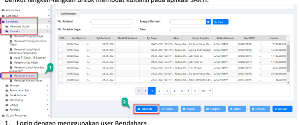

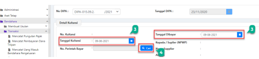

Akses menu Bendahara > Transaksi > Membuat Kuitansi 2. Klik <Tambah> untuk mengaktifkan form detail kuitansi. 3. Isikan tanggal kuitansi, yaitu tanggal sesuai yang tertera pada kuitansi. Dan tanggal dibayar, yaitu tanggal Bendahara membayar tagihan tersebut (tanggal saat aliran kas keluar dari Bendahara).

4. Klik tombol kaca pembesar pada kategori Nomor Perintah Bayar untuk menampilkan *pop* up box cari perintah bayar.

Pilih perintah bayar yang akan dibuat kuitansi dan klik <Simpan>.

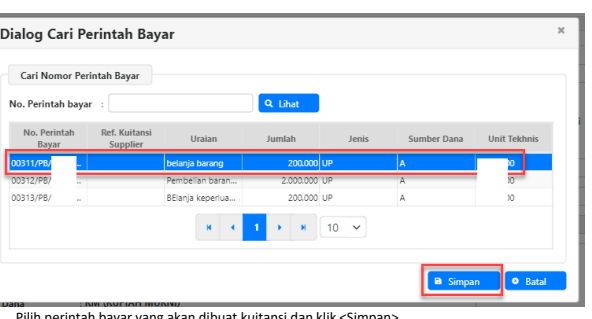

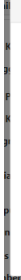

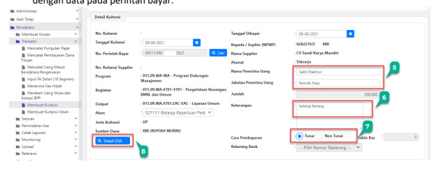 Isian informasi program, kegiatan, output, jenis kuitansi, sumber dana, dan supplier akan otomatis mengambil data dari perintah bayar. Setelah memilih perintah bayar, kolom jumlah dan keterangan otomatis akan terisi sesuai dengan data pada perintah bayar.

5. Isikan nama penerima uang dan jabatan sesuai dengan dokumen sumber yang diterima.

6. Isikan uraian keteragan kuitansi.

7. Terdapat 2 pilihan cara pembayaran: tunai dan non tunai. Apabila pembayaran secara tunai, maka kolom saldo kas di sebelah kanannya akan menampilkan seluruh sisa saldo kas tunai yang dikuasai oleh Bendahara. Apabila pembayaran secara non tunai, maka pilihan rekening bank akan aktif, dan akan otomatis terisi dengan mengambil data rekening BPG yang telah kita rekam pada referensi detail rekening. Di kolom saldo kas juga akan menampilkan informasi saldo pada rekening tersebut.

8. Berikut adalah tampilan Detail COA pada menu kuitansi. Perlu diingat bahwa perubahan atas detail COA tidak bisa dilakukan pada menu kuitansi, sehingga user harus melakukan batal validasi SPBy - ubah SPBy (untuk SPBy belanja jasa) atau batal validasi SPBy - hapus SPBy - ubah BAST UP (untuk SPBy belanja asset/persediaan) jika ingin melakukan ubah pendetilan COA.

9. Klik tombol <Simpan> untuk menyimpan data kuitansi.

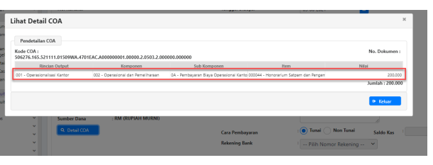

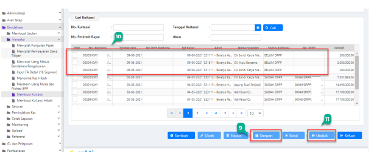 10. Kuitansi yang telah direkam dan disimpan, akan muncul pada grid daftar kuitansi. Periksa kembali kuitansi yang telah direkam tersebut.

11. Klik tombol <Unduh> untuk mengunduh cetakan kuitansi.

## 5. Mencatat Pungutan Pajak

Langkah mencatat pungutan pajak dan merekam setoran pajak dilakukan apabila pada langkah RUH Mencatat SPBy, terdapat akun potongan pajak yang direkam. Apabila tidak terdapat akun potongan pajak para RUH Mencatat Perintah Bayar, maka langkah ini dapat dilewati.

Berikut langkah-langkah untuk mencatat pungutan pajak pada aplikasi SAKTI:
1. Login menggunakan user Bendahara

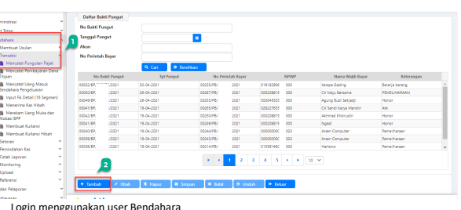

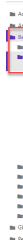

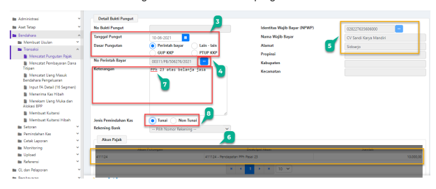

Akses menu Bendahara > Transaksi > Mencatat Pungutan Pajak 2. Klik <Tambah> untuk mengaktifkan form detail bukti pungut.

3. Isikan tanggal pungutan pajak dan dasar pungutan pajaknya.

Dasar pungutan pajak dapat bersumber dari:
1) Perintah Bayar, apabila atas potongan pajak tersebut dilakukan perekaman akun potongan pada Perintah Bayar atas perhitungan PPK.

2) Lain-lain, apabila data pungutan pajak tersebut tidak dicatatkan pada Perintah Bayar atau transaksi lainnya.

3) GUP KKP, apabila data pungutan pajak tersebut bersumber dari transaksi GUP KKP. 4) PTUP KKP, apabila data pungutan pakak tersebut bersumber dari transaksi PTUP KKP.

4. Cari perintah bayar dengan mengklik tombol titik (…) pada menu No. Perintah Bayar. Akan muncul *pop up box* pencarian Nomor Perintah Bayar. Pilih perintah bayar kemudian klik 
<OK>.

5. Setelah perintah bayar dipilih, isian NPWP akan terisi otomatis. Namun, apabila tidak 

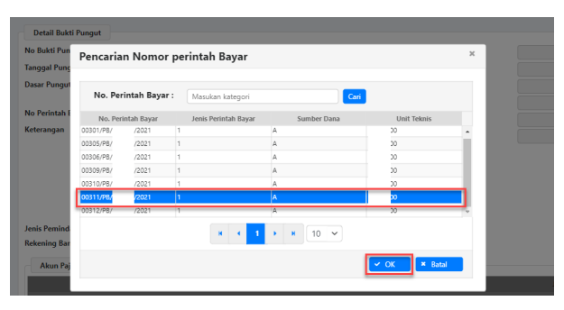

didahului dengan memilih Perintah Bayar, maka isian identitas wajib bayar harus diisi secara manual dengan mengklik tombol titik (…) di sebelah kanan atas.

6. Data akun potongan pajak juga akan terisi otomatis dengan mengambil data akun pajak dari perintah bayar. Akan tetapi apabila pada langkah sebelumnya tidak melakukan pemilihan nomor perintah bayar, maka silahkan lakukan pengisian akun potongan pajak secara manual dengan mengeklik tombol <Tambah> dan isikan data akun potongan pajaknya.

7. Isikan uraian keterangan pungutan pajak pada menu keterangan. Pilih jenis pemindahan kas/cara bayar secara tunai atau non tunai. **Saran kami** apabila kuitansi dibayarkan melalui mekanisme tunai, maka silahkan lakukan pencatatan pungutan pajak dengan jenis pemindahan kas secara tunai. Akan tetapi apabila kuitansi dibayarkan secara non tunai, silahkan melakukan pencatatan pungutan pajak dengan memilih jenis pemindahan kas secara non tunai.

Apabila jenis pemindahan kas secara non tunai, maka menu rekening bank akan aktif dan dapat dipilih rekening yang sesuai.

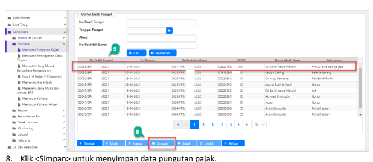

6. **Mencatat Setoran Pajak oleh Bendahara Pengeluaran**
Langkah ini dilakukan apabila terdapat pungutan pajak sebelumnya, jika tidak, maka dapat dilewati. 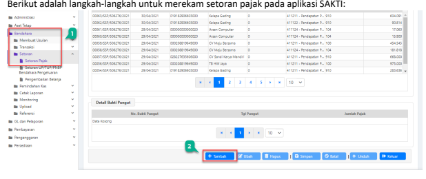 1. Login dengan menggunakan user Bendahara

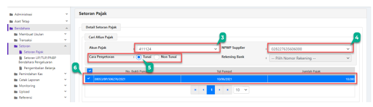

Klik menu Bendahara > Setoran > Setoran Pajak.

2. Klik <Tambah> untuk mengaktifkan form setoran pajak.

3. Pada menu Akun Pajak, klik tombol *dropdown,* akan muncul pilihan jenis akun yang telah dicatat pungutan pajak sebelumnya, klik akun pajak yang akan dicatat setorannya.

4. Pilih NPWP Supplier dengan cara mengklik tombol *dropdown* dan memilih NPWP supplier yang sesuai. 

5. Pilih cara penyetoran tunai atau non tunai, hal ini akan memunculkan data pungutan pajak yang telah direkam dengan dibatasi parameter NPWP dan akun pajak yang telah dipilih sebelumnya. Ketika user memilih cara penyetoran tunai, maka isian rekening bank akan in aktif dan berwarna abu abu. Apabila user memilih cara penyetoran non tunai, maka isian rekening bank akan aktif. 

6. Pilih dengan memberikan tanda centang pada pungutan pajak yang akan direkam setorannya. Isian jumlah setoran pajak akan terisi otomatis mengikuti data pungutan pajak yang dipilih oleh user. Pastikan agar pungutan pajak tercentang agar tidak error datanya.

7. Data isian NPWP, Nama Wajib Pajak, dan alamat wajib pajak akan terisi otomatis mengikuti 

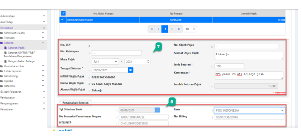

pilihan NPWP pada langkah 4. Selanjutnya isikan nomor ketetapan pajak : isikan nomor ketetapan pajaknya apabila tidak ada, isikan tanda pisah (--)
masa pajak : pilih masa pajak sesuai dengan masa pajaknya tanggal setoran pajak : Isikan tanggal setoran *sesuai dengan tanggal setoran yang* tertera pada cetakan Bukti Penerimaan Negara (BPN)
nomor objek pajak : silahkan isikan nomor objek pajaknya, apabila tidak ada isikan tanda pisah (--)
alamat objek pajak : isikan data alamat objek pajaknya jenis setoran : Isikan kode jenis setoran sesuai dengan data pada billing/BPN
keterangan : isikan keterangan penyetoran pajaknya 8. Isikan data-data pengesahan setoran berupa tanggal diterima bank : tanggal sesuai yang tertera pada cetakan Bukti Penerimaan Negara (BPN)
NTPN : isikan 16 digit kode NTPN yang bersumber dari BPN
NTB/NTP : isikan NTB/NTP berdasarkan cetakan BPN bank : pilih bank yang digunakan untuk melakukan penyetoran 

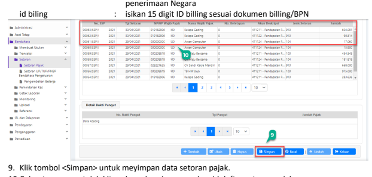

10.Cek setoran yang telah kita rekam dan simpan pada grid daftar setoran pajak.